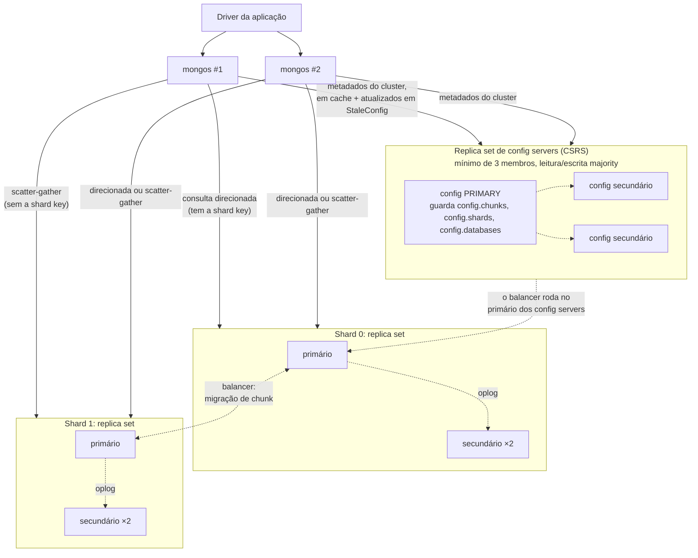
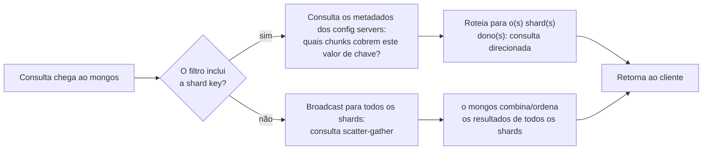

## Objective

Entender as três peças móveis de um cluster shardeado do MongoDB (a camada de roteamento de consultas `mongos`, o replica set de config servers que guarda os metadados do cluster e os próprios shards, cada um um replica set com uma fatia dos dados) e como uma única consulta de cliente atravessa essa topologia para cair na máquina certa, ou na quantidade errada de máquinas. O livro declara o objetivo de toda a arquitetura em uma linha: "Um dos objetivos do sharding é fazer um cluster de 2, 3, 10 ou até centenas de shards parecer uma única máquina para a sua aplicação." Este conceito trata da topologia que faz essa ilusão funcionar (o roteamento, o armazenamento de metadados, a maquinaria de divisão e balanceamento de chunks), e não de qual campo usar como shard key; essa decisão, e suas consequências, pertencem ao conceito irmão sobre escolher uma shard key.

## Use Cases

- Montar um cluster shardeado novo e precisar saber a ordem de inicialização (config servers primeiro, depois `mongos`, depois shards), porque "os config servers precisam ser iniciados antes de qualquer processo mongos, já que o mongos busca sua configuração neles."
- Depurar um log de `mongos` cheio de erros "unable to setShardVersion" durante a operação normal, e reconhecê-los como o efeito colateral esperado de uma migração de chunk em andamento, e não como uma falha.
- Explicar a um time por que uma consulta que omite a shard key é lenta em escala: ela vira uma consulta scatter-gather (broadcast) que todo shard precisa executar, contra uma consulta direcionada que o `mongos` roteia para um único shard.
- Dimensionar um replica set de config servers para produção e entender por que ele precisa ser um replica set real e dedicado, com journaling habilitado em armazenamento durável: "se todos os seus config servers forem perdidos, você vai precisar vasculhar os dados dos seus shards para descobrir quais dados estão onde."
- Decidir quantos roteadores `mongos` rodar: o suficiente para alta disponibilidade e para ficarem perto dos shards, mas não tantos a ponto de sobrecarregar os config servers com tráfego de atualização de metadados.
- Diagnosticar uma "split storm" (um shard martelando os config servers com tentativas repetidas e frustradas de dividir chunks) e rastreá-la até um replica set de config servers inalcançável ou doente.
- Converter um replica set isolado existente no primeiro shard de um cluster, e entender por que todo shard, desde o MongoDB 3.6, precisa ser ele mesmo um replica set, e não um único `mongod`.

## Deep Dive

### Os três componentes, e o que cada um faz (e não faz)

Um cluster shardeado tem exatamente três tipos de processo, e o livro é preciso ao traçar a linha entre replicação e sharding antes de descrever qualquer um dos dois: "Muitas pessoas confundem a diferença entre replicação e sharding. Lembre-se de que a replicação cria uma cópia exata dos seus dados em vários servidores, então todo servidor é uma imagem espelhada de todos os outros. Já cada shard contém um subconjunto diferente dos dados." Sharding e replicação não são alternativas: um shard de produção *é* um replica set, então o cluster é shardeado entre máquinas e replicado dentro de cada grupo de máquinas ao mesmo tempo.

**`mongos`: o roteador.** Ele "mantém um 'sumário' que diz qual shard contém quais dados. As aplicações podem se conectar a esse roteador e fazer requisições normalmente... O roteador, sabendo quais dados estão em qual shard, consegue encaminhar as requisições para o(s) shard(s) apropriado(s). Se houver respostas a uma requisição, o roteador as reúne e, se necessário, as combina, e as devolve à aplicação." Crucialmente, o `mongos` não tem estado em relação aos seus dados: "ele não precisa de um diretório de dados (o mongos não guarda dados; ele carrega a configuração do cluster a partir dos config servers na inicialização)." Essa ausência de estado é o que o torna descartável: reinicie um, adicione mais dez, e nada nos dados do cluster muda. A orientação operacional do livro é manter a camada de roteadores deliberadamente pequena: "você deveria iniciar um pequeno número de processos mongos e posicioná-los o mais perto possível de todos os shards... A configuração mínima é de pelo menos dois processos mongos para garantir alta disponibilidade. É possível rodar dezenas ou centenas de processos mongos, mas isso causa disputa de recursos nos config servers. A abordagem recomendada é oferecer um pequeno pool de roteadores."

**Config servers: o cérebro.** "Os config servers são o cérebro do seu cluster: eles guardam todos os metadados sobre quais servidores têm quais dados. Por isso, precisam ser configurados primeiro, e os dados que guardam são extremamente importantes: garanta que eles rodem com journaling habilitado e que seus dados fiquem em discos não efêmeros." Um config server iniciado com `--configsvr` é deliberadamente restrito ("os clientes (isto é, outros componentes do cluster) não podem escrever dados em nenhum banco além de config ou admin"), e tudo o que ele guarda são metadados, não dados da aplicação: quais replica sets hospedam quais shards, quais coleções estão shardeadas e por qual chave, e qual shard é dono de qual chunk. "O MongoDB escreve dados no banco config quando os metadados mudam, como depois de uma migração ou de uma divisão de chunk." Como os metadados são pequenos, o perfil de recursos é incomum para uma camada de banco: "Em termos de provisionamento, os config servers deveriam ter rede e CPU adequados. Eles só guardam um sumário dos dados do cluster, então os recursos de armazenamento necessários são mínimos." Toda leitura e escrita nos config servers usa os níveis de consistência mais fortes que o MongoDB oferece ("o MongoDB usa um nível de writeConcern `majority`... [e] um nível de readConcern `majority`"), especificamente "para garantir que os metadados do cluster shardeado não sejam confirmados no replica set de config servers até que não possam mais ser revertidos" e "para garantir que todos os roteadores mongos tenham uma visão consistente de como os dados estão organizados em um cluster shardeado." Todo `mongos` do cluster lê da mesma fonte da verdade, então eles nunca podem discordar sobre onde um documento vive.

**Shards: onde os dados realmente vivem.** Desde o MongoDB 3.4, todo shard precisa ser ele mesmo um replica set: "A partir do MongoDB 3.4, para clusters shardeados, as instâncias mongod dos shards precisam ser configuradas com a opção `--shardsvr`." E desde o 3.6, sem exceções: "Antes do MongoDB 3.6 era possível criar um mongod isolado como shard. Isso não é mais uma opção em versões do MongoDB posteriores à 3.6. Todos os shards precisam ser replica sets." Isso fecha a única topologia em que uma única falha de hardware poderia tirar do ar um shard inteiro de dados sem failover automático.

### Como uma consulta é realmente roteada

O cliente nunca fala diretamente com um shard: ele sempre passa pelo `mongos`, e "até onde a aplicação sabe, ela está conectada a um mongod isolado." O que o `mongos` faz em seguida depende inteiramente de a consulta incluir ou não a shard key. O livro roda os dois casos com `explain()` no mesmo cluster: uma consulta pela shard key produz um plano vencedor `"SINGLE_SHARD"` nomeando exatamente um shard, enquanto uma consulta sem ela produz `"SHARD_MERGE"` nomeando todos os shards do cluster. O livro nomeia as duas categorias diretamente: "Consultas que contêm a shard key e podem ser enviadas a um único shard ou a um subconjunto de shards são chamadas de **consultas direcionadas**. Consultas que precisam ser enviadas a todos os shards são chamadas de **consultas scatter-gather (broadcast)**: o mongos espalha a consulta para todos os shards e depois reúne os resultados." Uma consulta direcionada custa aproximadamente o que uma consulta contra um único replica set custaria. Uma consulta scatter-gather custa uma ida a cada shard mais um passo de combinação no `mongos`: quanto mais shards você adiciona, mais cara fica cada consulta não direcionada, mesmo que o throughput total das consultas direcionadas continue escalando.

### Chunks: como os metadados continuam pequenos

O `mongos` nunca acompanha documentos individuais; isso "fica inviável para coleções com milhões ou bilhões de documentos." Em vez disso, ele acompanha **chunks**, intervalos contíguos da shard key, cada um dos quais "sempre vive em um único shard, então o MongoDB consegue manter uma pequena tabela de chunks mapeados para shards." Uma coleção recém-shardeada é um chunk cobrindo de `$minKey` a `$maxKey`; à medida que cresce, o `mongod` primário de um shard percebe um chunk passando de um limite de tamanho e o divide em dois, atualizando os config servers com a nova fronteira. Quando o chunk do topo resultante continua crescendo em um shard, o balancer é acionado para migrá-lo para outro lugar, o mecanismo que o conceito irmão cobre em profundidade para o caso do hotspot de chave ascendente.

Se um config server estiver inalcançável quando um shard tentar registrar uma divisão, a divisão simplesmente falha e é tentada de novo na próxima escrita, o que o livro nomeia com precisão: "esse processo de o mongod tentar repetidamente dividir um chunk sem conseguir é chamado de **split storm**... A única forma de evitar split storms é garantir que seus config servers estejam no ar e saudáveis o máximo de tempo possível." Essa única frase é o motivo de a disponibilidade dos config servers ser essencial para o caminho de escrita do cluster inteiro, e não só para o roteamento de consultas.

### O balancer, e por que as migrações são invisíveis para a aplicação

"O balancer é responsável por migrar dados. Ele verifica regularmente desequilíbrios entre os shards e, se encontrar um, começa a migrar chunks." Desde o MongoDB 3.4, ele roda como "um processo em segundo plano no membro primário do replica set de config servers", em vez de ser assumido de improviso por qualquer `mongos` que por acaso notasse o desequilíbrio, como nas versões anteriores. A concorrência é limitada de propósito: "o número de migrações concorrentes aumentou para uma migração por shard, com um máximo de migrações concorrentes igual à metade do total de shards"; um cluster não tenta rebalancear tudo ao mesmo tempo e se deixar sem E/S.

A migração em si é projetada para que a aplicação nunca precise saber que ela aconteceu: "Uma aplicação que usa o cluster não precisa saber que os dados estão se movendo: todas as leituras e escritas são roteadas para o chunk antigo até a mudança terminar. Depois que os metadados são atualizados, qualquer processo mongos que tentar acessar os dados no local antigo vai receber um erro. Esses erros não deveriam ser visíveis para o cliente: o mongos trata o erro em silêncio e repete a operação no novo shard." Essa nova tentativa é a origem das mensagens "unable to setShardVersion" que os operadores veem nos logs do `mongos`: um `mongos` com uma visão desatualizada da tabela de chunks, corrigindo-se automaticamente. Se ele não conseguir se corrigir porque os config servers estão fora do ar, o erro chega ao cliente, mais um motivo para a saúde dos config servers ficar por baixo de toda garantia que esta arquitetura faz.

### Livro vs. hoje

> **Os requisitos do replica set de config servers não mudaram em essência, e a documentação atual declara restrições adicionais que o livro não explicita.** O "pelo menos três membros, journaling habilitado, armazenamento não efêmero" do livro ainda bate com a orientação atual. A documentação atual do MongoDB também exige que o replica set de config servers tenha **zero arbiters**, **nenhum membro atrasado** e **nenhum membro que não constrói índices**, restrições que o livro não aponta explicitamente para config servers (ele discute arbiters e membros atrasados como ferramentas gerais de replica set em outros pontos), mas que decorrem naturalmente da função dos config servers: todo membro precisa conseguir servir uma cópia dos metadados totalmente consistente e imediatamente consultável.

> **O tamanho padrão de chunk e a regra de decisão do balancer mudaram, a partir do MongoDB 6.0.** O tamanho padrão de chunk na época do livro era 64 MB (a própria demo de máquina única do livro o sobrescreve explicitamente para 1 MB para manter o exemplo rápido: "A opção chunksize é tratada no Capítulo 17. Por ora, simplesmente defina como 1"). O MongoDB atual tem padrão de **128 MB** de tamanho de intervalo/chunk. Mais importante, a *decisão* de balanceamento em si mudou: o livro descreve a migração como reação a "um número desigual de chunks", mas a documentação atual define o equilíbrio puramente em termos de **tamanho dos dados**: "Uma coleção é considerada balanceada se a diferença de dados entre os shards... for menor que três vezes o tamanho de intervalo configurado"; com o tamanho padrão, os shards precisam diferir em pelo menos 384 MB de dados daquela coleção antes que uma migração seja disparada. A *quantidade* de chunks não é mais o sinal do balancer.

> **A divisão automática no primário do shard, como o livro a descreve, não é mais como as divisões acontecem.** O mecanismo do livro ("cada mongod primário de shard acompanha seus chunks atuais e, quando eles atingem um certo limite, verifica se o chunk precisa ser dividido"), independente de qualquer migração, descrevia a arquitetura anterior ao 6.0. Desde o 6.0, a divisão automática de chunks guiada por uma verificação de limite em segundo plano foi removida; agora os chunks só são divididos como subproduto de uma migração, e as decisões de balanceamento são guiadas pela comparação de tamanho de dados acima, e não por contagens de chunks que passam de um limite de divisão. A consequência sobre a qual o livro alerta (uma shard key ascendente concentrando todas as escritas no chunk do topo de um shard) não é afetada por essa mudança; só o mecanismo de contabilidade que criava chunks novos de forma proativa mudou.

> **Agora existe um quarto formato de implantação: o config shard.** A partir do MongoDB 8.0, o replica set de config servers pode opcionalmente guardar também dados da aplicação como um shard de verdade (`sh.isConfigShardEnabled()`), fundindo o papel exclusivo de config server que o livro descreve em um número total menor de nós para clusters modestos. Isso não muda nada em como o `mongos` roteia consultas nem em como os chunks migram; muda só quantos replica sets físicos um cluster mínimo precisa montar.

> **O limite de migrações concorrentes, o "nada de shards com mongod isolado" e a descrição de que o mongos não guarda dados continuam corretos como o livro afirma.** O limite de migrações concorrentes de `n/2` shards que o livro atribui ao 3.4+ é o comportamento documentado atual, e a exigência de que todo shard seja um replica set (nada de shards com `mongod` puro desde o 3.6), já apresentada pelo livro como um corte rígido de versão, continua valendo hoje sem mais mudanças.

## Trade-offs

- **A ilusão de um único servidor custa um salto de rede extra e uma dependência de metadados em toda consulta.** Rotear pelo `mongos` é o que permite que "uma aplicação... ignore o fato de não estar falando com um servidor MongoDB isolado", mas toda consulta agora depende de o `mongos` ter metadados de shards atualizados, o que por sua vez depende de os config servers estarem alcançáveis. Um cluster saudável esconde isso por completo; uma camada de config servers doente transforma uma consulta comum em um loop de novas tentativas guiado por `StaleConfig` ou, no pior caso, em um erro visível ao cliente.
- **Direcionada vs. scatter-gather é a maior alavanca de escalabilidade, e ela é decidida inteiramente por a shard key estar ou não no filtro.** O custo de uma consulta direcionada é aproximadamente independente do tamanho do cluster: mais shards significam só mais capacidade. O custo de uma consulta scatter-gather cresce com o número de shards, porque o `mongos` precisa visitar e combinar os resultados de todos eles. É por isso que a decisão da shard key (coberta no conceito irmão) é inseparável da decisão de topologia coberta aqui: a arquitetura só entrega escalabilidade linear para os padrões de consulta que a shard key de fato direciona.
- **Config servers trocam uma pegada de recursos minúscula por um raio de impacto desproporcional.** Eles "só guardam um sumário", então as necessidades de armazenamento e processamento são mínimas, mas perdê-los significa perder o mapa para todo documento do cluster: "você vai precisar vasculhar os dados dos seus shards para descobrir quais dados estão onde. Isso é possível, mas lento e desagradável." A resposta correta a essa assimetria é operacional, não arquitetural: backups frequentes e tratar a saúde dos config servers como preocupação de alerta de primeira classe, mesmo que seu uso de recursos pareça trivial perto dos shards.
- **Um pool pequeno de `mongos` é uma troca deliberada contra a carga nos config servers, não um descuido.** Rodar mais roteadores parece escalabilidade horizontal grátis para a camada de roteamento, mas todo `mongos` consulta os config servers de forma independente em busca de metadados; passado um número modesto, mais roteadores causam "disputa de recursos nos config servers" em vez de mais throughput. A orientação do livro (um pool pequeno, posicionado perto dos shards) trata a quantidade de `mongos` como um ajuste limitado por cima, não um botão para girar à vontade.
- **Migrações invisíveis protegem a aplicação ao custo de latência transitória e ruído de log durante o rebalanceamento.** O objetivo do design (leituras e escritas continuam funcionando contra o local antigo do chunk até a mudança terminar, e o `mongos` repete em silêncio contra o novo) significa que a corretude é preservada automaticamente. Mas as mensagens "unable to setShardVersion" e a ida extra de nova tentativa são o custo visível dessa garantia, e um cluster no meio de uma migração está de fato fazendo mais trabalho por requisição que um estabilizado, mesmo que nada no resultado da requisição mude.
- **Exigir que todo shard seja um replica set elimina um modo de falha inteiro ao custo de rodar estritamente mais processos.** Antes do 3.6, um shard com um `mongod` sozinho era possível e era um ponto único de falha para sua fatia dos dados; hoje todo shard carrega a mesma maquinaria de replicação (e o comportamento de rollback/eleição) que o conceito irmão de replica sets descreve. Um cluster mínimo de produção é, portanto, pelo menos: 2 `mongos` + 3 config servers + (3 × número de shards) processos `mongod`, mais peças móveis do que a demo rápida de máquina única com `ShardingTest` do próprio livro sugere, e é exatamente por isso que o livro insiste que "você deveria estar confortável com servidores isolados e replica sets antes de tentar implantar ou usar um cluster shardeado."

## Documentation Links

- [Shannon Bradshaw, Eoin Brazil e Kristina Chodorow, "MongoDB: The Definitive Guide", 3ª edição (O'Reilly, 2020): Capítulos 14-15, "Introduction to Sharding" e "Configuring Sharding", p. 289-317](https://www.oreilly.com/library/view/mongodb-the-definitive/9781491954454/): doc
- [MongoDB Documentation: Sharded Cluster Components](https://www.mongodb.com/docs/manual/core/sharded-cluster-components/): doc
- [MongoDB Documentation: Config Servers](https://www.mongodb.com/docs/manual/core/sharded-cluster-config-servers/): doc
- [MongoDB Documentation: Sharded Cluster Query Routing (mongos)](https://www.mongodb.com/docs/manual/core/sharded-cluster-query-router/): doc
- [MongoDB Documentation: Sharded Cluster Balancer](https://www.mongodb.com/docs/manual/core/sharding-balancer-administration/): doc
- [MongoDB Documentation: Data Partitioning with Chunks](https://www.mongodb.com/docs/manual/core/sharding-data-partitioning/): doc
- [MongoDB Documentation: Modify Range Size in a Sharded Cluster](https://www.mongodb.com/docs/manual/tutorial/modify-chunk-size-in-sharded-cluster/): doc
- [MongoDB Documentation: Convert a Replica Set to a Sharded Cluster](https://www.mongodb.com/docs/manual/tutorial/convert-replica-set-to-replicated-shard-cluster/): doc
