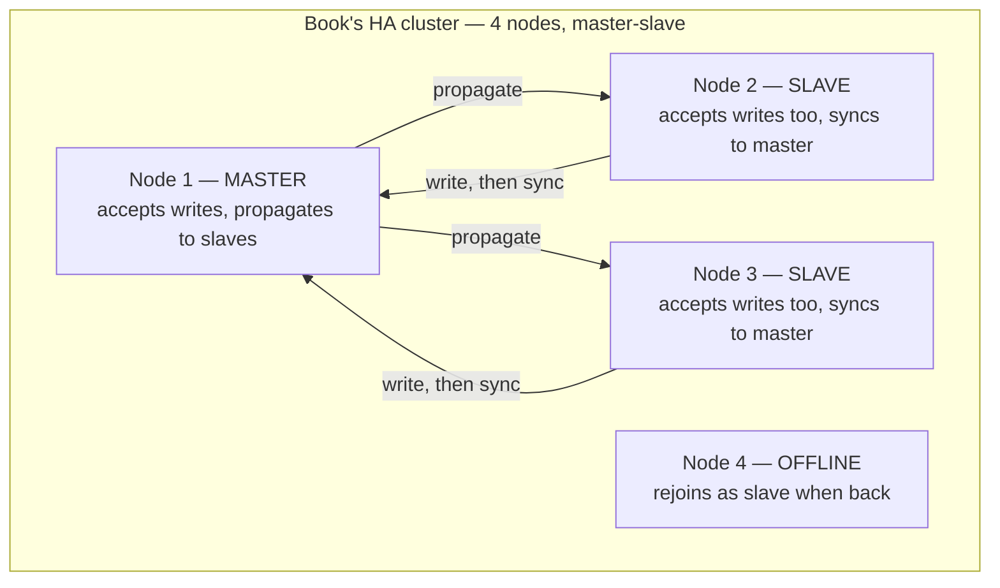

## Objective

Understand two different Neo4j clustering models, because the book and the current product describe two genuinely different architectures. "Seven Databases in Seven Weeks" (2nd ed., 2018) documents Neo4j's **master-slave High Availability (HA)** cluster — a design that was already being phased out as the book went to print and has been gone from the product for years. What Neo4j Enterprise actually runs today is **Causal Clustering**: a Raft-consensus architecture built around database roles (primary/secondary, formerly "core"/"read replica") rather than server roles, with majority-based commits, automatic leader election, and driver-side routing that the book's model never had. The goal here is to know both — the book's model as historical baseline for reading legacy Neo4j deployments and older tutorials, and the current model as the thing you'd actually configure, monitor, or debug in production today.

## Use Cases

- Reading legacy Neo4j 2.x/3.0-3.4 documentation, `neo4j.conf` files with `dbms.mode=HA` and `ha.server_id` settings, or older tutorials without assuming any of it applies to a Neo4j Enterprise deployment on version 4.0+.
- Sizing a production cluster today: knowing that Causal Clustering needs a minimum of three servers running the **primary** role for a database to tolerate one failure and keep accepting writes, versus the book's HA model where even a single online master kept the cluster writable.
- Diagnosing "why did my write hang" — under Causal Clustering a write only commits once a **majority of primaries** (not just the leader) have appended it to their Raft log, so a partition that isolates the leader from a majority of the other primaries stalls writes even though the leader is technically still running.
- Explaining a query result that looks slightly stale on one connection but not another — Causal Clustering's secondaries (the book's "slaves") are asynchronously replicated via transaction log shipping, and drivers use **bookmarks** for causal consistency (a client can require that its next read reflects a write it just made), a mechanism the book's HA model never offered.
- Deciding whether Neo4j Community Edition is sufficient for a project — clustering of any kind (HA or Causal Clustering) has always been, and remains, an Enterprise-only, commercially licensed feature; Community Edition runs single-instance only.

## Deep Dive

### The book's model: master-slave HA (historical baseline)

The book's Day 3 material describes a design built around a single elected master and multiple slaves. It states the model directly: "Just like Mongo, the servers in the cluster will elect a master that holds primary responsibility for managing data distribution in the cluster. Unlike in Mongo, however, slaves in Neo4j accept writes. Slave writes will synchronize with the master node, which will then propagate those changes to the other slaves."

That slave-accepts-writes detail is the model's defining — and most fragile — trait. Because a write can land on any slave before it's synchronized to the master and fanned out to the rest of the cluster, the book is upfront about the consistency cost: "A write to one slave is not immediately synchronized with all other slaves, so there is a danger of losing consistency (in the CAP sense) for a brief moment (making it eventually consistent). HA will lose pure ACID-compliant transactions. It's for this reason that Neo4j HA is touted as a solution largely for increasing capacity for reads."

Failover in this model is simple and coordinator-free: "If node 1, the current master node, went offline, the other nodes would automatically elect a leader (without the help of an external coordinating service)." The book notes this was itself an improvement — "Previously, Neo4j clusters relied on ZooKeeper as an external coordination mechanism... That has changed in more recent versions. Now, Neo4j clusters are self-managing and self-coordinating." The book's cluster config makes the server-centric nature of this model concrete — each node declares its own identity and network coordinates directly:

```
dbms.mode=HA
ha.server_id=1
ha.initial_hosts=127.0.0.1:5001,127.0.0.1:5002,127.0.0.1:5003
ha.host.coordination=127.0.0.1:5001
ha.host.data=127.0.0.1:6363
```

Recovering a failed master was simple too, if slightly informal by today's standards: "Starting the previous master server again will add it back to the cluster, but now the old master will remain a slave (until another server goes down)" — no distinction between "the server that happens to be leader" and "the role of leader" beyond who currently holds it.



### Book vs. today

> **The book's HA model is gone from the product, not just superseded.** Neo4j deprecated master-slave HA clustering starting with version 3.5 and removed it entirely in version 4.0 (released late 2019) — roughly the same window the book's 2nd edition (2018) was published in. There is no `dbms.mode=HA` in any currently supported Neo4j version; every Enterprise cluster today runs Causal Clustering.

> **Causal Clustering replaced HA with Raft consensus, core servers, and read replicas** (Neo4j 3.1 introduced it; it became the sole clustering option from 4.0 onward). Instead of a single master accepting writes and slaves accepting writes that sync back to it, a set of **core servers** run the Raft protocol among themselves: one is elected **Leader** for the current term, the rest are **Followers**, and a write only commits once a **majority of core servers** (N/2+1) have appended it to their Raft log — the leader alone accepting a write is not enough. **Read replicas** are a separate, non-voting server type that only scale out read traffic; they never accept writes and replicate asynchronously via transaction log shipping from the core servers, closer to what the book's slaves were promised to be than what they actually did.

> **Neo4j 5 renamed the roles again, and made them per-database rather than per-server.** Current Operations Manual documentation describes "Core" as replaced by the **primary** database-copy role and "Read Replica" by the **secondary** database-copy role. The distinction is not cosmetic: primary and secondary are now roles a *database copy* holds, not a fixed label on a *server*. A single server can be constrained to host only `PRIMARY`, only `SECONDARY`, or `NONE` copies via its `modeConstraint`, and because Neo4j 4.0+ supports multiple databases per DBMS, one server can simultaneously hold the primary copy of database A and a secondary copy of database B. Neo4j still documents up to 11 primaries as supported, while explicitly recommending against pushing toward that ceiling, since every additional primary means every write has to reach more members before it can commit.

> **Routing moved from an external load balancer to the driver.** The book's setup pointed a hand-rolled load balancer (Apache/Nginx) at the cluster's REST interface as homework; Causal Clustering ships `bolt+routing`/`neo4j://` URI schemes so drivers discover the current leader and secondaries themselves, route writes only to a server that can accept them, and load-balance reads — no external proxy layer required for basic operation.

> **Causal consistency replaced "assign a session to one server" as the staleness fix.** The book's only defense against reading stale data from a slave was informal ("assigning a session to one server"); Causal Clustering formalizes this with **bookmarks** — a client can request a bookmark after a write and pass it into a subsequent read to guarantee that read reflects at least that write, without pinning the whole session to one physical server.

> **Enterprise-only licensing is unchanged in substance, but the license itself changed.** Clustering — HA before, Causal Clustering now — has always been an Enterprise Edition feature; Community Edition has never supported clustering of any kind. What changed is the license text: the book describes Enterprise as "a dual license—GPL/AGPL," which was accurate for Enterprise source availability at the time of writing, but Neo4j moved Enterprise Edition off AGPL to a closed-source, proprietary Neo4j commercial license soon after (source no longer published), while Community Edition alone remains GPLv3. Anyone relying on the book's licensing description for Enterprise should treat it as out of date.

> **`neo4j-admin backup` targeting a running HA member still works conceptually, but the tooling has moved on.** The book's backup workflow — point `neo4j-admin backup --from <address>` at a live cluster member — describes the general shape still used for online backups today, but current Neo4j versions have reorganized this into `neo4j-admin database backup`/`restore`/`aggregate-backup` subcommands with per-database granularity, reflecting the same multi-database model that reshaped primary/secondary roles.

### Why the replacement happened

The book's own framing hints at why this model didn't last: slaves accepting writes is precisely the design that makes eventual consistency unavoidable, since two different slaves can each accept a conflicting write before either syncs to the master. Causal Clustering's core insight — route all writes through Raft-backed core servers and make read replicas strictly read-only — trades the book's model's write-anywhere flexibility for the same trade the MongoDB replica set model makes (see the related MongoDB HA concept): a single, majority-agreed-upon place writes land, so the cluster never has to reconcile two masters' conflicting histories after the fact.

## Trade-offs

- **The book's slave-accepts-writes model bought flexibility at the cost of the exact consistency guarantee production systems usually want.** Any slave could take a write immediately, which is convenient for clients, but it meant the cluster could never promise more than eventual consistency — the reason the book calls this "a solution largely for increasing capacity for reads," not a general-purpose write-scaling story.
- **Causal Clustering's majority-commit model trades some write latency for split-brain safety.** A write isn't durable until a majority of core/primary servers have it in their Raft log, which is strictly slower than "any slave accepts it," but it removes the possibility of two servers independently accepting conflicting writes — the same majority-quorum logic MongoDB replica sets use, and for the same reason.
- **Read replicas (secondaries) are pure read scale-out, not a redundancy pool for writes.** They never accept writes and never participate in Raft voting, so adding more of them scales read throughput without touching write latency or the write quorum size — but losing every core/primary server still takes the cluster's write capacity down regardless of how many read replicas remain online.
- **Per-database primary/secondary roles (Neo4j 5+) add flexibility at the cost of a less intuitive mental model.** Because roles now belong to a database copy rather than a server, capacity planning has to reason about which databases are assigned where, not just how many servers are "up" — more powerful for multi-tenant DBMS deployments, harder to reason about at a glance than the book's one-cluster-one-role-per-node picture.
- **Enterprise-only clustering (either model) means Community Edition users get zero built-in HA story.** That constraint predates and outlives the HA-to-Causal-Clustering transition; anyone choosing Community Edition for cost reasons is choosing single-instance risk regardless of which clustering architecture Enterprise happens to run.

## Documentation Links

- [Luc Perkins, Eric Redmond, and Jim R. Wilson, "Seven Databases in Seven Weeks", 2nd Edition (Pragmatic Bookshelf, 2018) — Chapter 6, "Neo4J", Day 3: "Distributed High Availability", p. 202-207](https://pragprog.com/titles/pwrdata2/seven-databases-in-seven-weeks-second-edition/) — doc
- [Neo4j Operations Manual — Introduction: Neo4j clustering architecture](https://neo4j.com/docs/operations-manual/current/clustering/introduction/) — doc
- [Neo4j Operations Manual — Leadership, routing, and load balancing](https://neo4j.com/docs/operations-manual/current/clustering/setup/routing/) — doc
- [Neo4j Knowledge Base — Comparing HA and Causal Clusters](https://neo4j.com/developer/kb/comparing-ha-vs-causal-clusters/) — doc
- [Neo4j — FAQ: Neo4j Enterprise Edition Is Moving to an Open Core Licensing Model](https://neo4j.com/open-core-and-neo4j/) — doc
