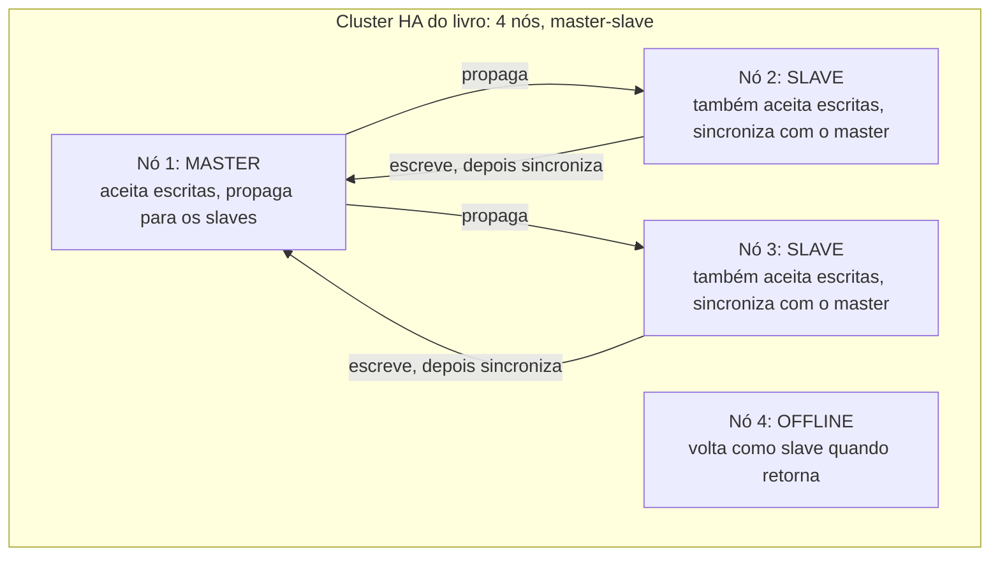

## Objective

Entender dois modelos diferentes de clustering do Neo4j, porque o livro e o produto atual descrevem duas arquiteturas genuinamente diferentes. "Seven Databases in Seven Weeks" (2ª ed., 2018) documenta o cluster **High Availability (HA) master-slave** do Neo4j, um design que já estava sendo descontinuado quando o livro foi para a gráfica e que saiu do produto há anos. O que o Neo4j Enterprise roda de fato hoje é o **Causal Clustering**: uma arquitetura de consenso Raft construída em torno de papéis de banco (primary/secondary, antes "core"/"read replica") em vez de papéis de servidor, com commits por maioria, eleição automática de líder e roteamento do lado do driver que o modelo do livro nunca teve. O objetivo aqui é conhecer os dois: o modelo do livro como base histórica para ler implantações legadas do Neo4j e tutoriais antigos, e o modelo atual como aquilo que você de fato configuraria, monitoraria ou depuraria em produção hoje.

## Use Cases

- Ler documentação legada do Neo4j 2.x/3.0-3.4, arquivos `neo4j.conf` com `dbms.mode=HA` e configurações `ha.server_id`, ou tutoriais antigos, sem presumir que nada disso se aplica a uma implantação do Neo4j Enterprise na versão 4.0+.
- Dimensionar um cluster de produção hoje: saber que o Causal Clustering precisa de no mínimo três servidores rodando o papel **primary** para que um banco tolere uma falha e continue aceitando escritas, contra o modelo HA do livro, em que até um único master online mantinha o cluster gravável.
- Diagnosticar "por que minha escrita travou": no Causal Clustering, uma escrita só faz commit depois que uma **maioria dos primaries** (não só o líder) a acrescentou ao seu log Raft, então uma partição que isola o líder da maioria dos outros primaries trava as escritas mesmo com o líder tecnicamente ainda rodando.
- Explicar um resultado de consulta que parece um pouco desatualizado em uma conexão e não em outra: os secondaries do Causal Clustering (os "slaves" do livro) são replicados de forma assíncrona via envio de log de transações, e os drivers usam **bookmarks** para consistência causal (um cliente pode exigir que sua próxima leitura reflita uma escrita que acabou de fazer), um mecanismo que o modelo HA do livro nunca ofereceu.
- Decidir se o Neo4j Community Edition é suficiente para um projeto: clustering de qualquer tipo (HA ou Causal Clustering) sempre foi, e continua sendo, um recurso exclusivo do Enterprise, com licença comercial; o Community Edition roda apenas como instância única.

## Deep Dive

### O modelo do livro: HA master-slave (base histórica)

O material do Dia 3 do livro descreve um design construído em torno de um único master eleito e vários slaves. Ele declara o modelo diretamente: "Assim como no Mongo, os servidores do cluster elegem um master que tem a responsabilidade principal de gerenciar a distribuição dos dados no cluster. Diferente do Mongo, porém, os slaves no Neo4j aceitam escritas. As escritas nos slaves são sincronizadas com o nó master, que então propaga essas mudanças para os outros slaves."

Esse detalhe de slaves aceitarem escritas é o traço que define o modelo, e o mais frágil. Como uma escrita pode cair em qualquer slave antes de ser sincronizada com o master e espalhada para o resto do cluster, o livro é franco sobre o custo de consistência: "Uma escrita em um slave não é sincronizada imediatamente com todos os outros slaves, então há o risco de perder consistência (no sentido do CAP) por um breve momento (tornando-o eventualmente consistente). O HA perde transações puramente compatíveis com ACID. É por isso que o Neo4j HA é apresentado como uma solução principalmente para aumentar a capacidade de leitura."

O failover nesse modelo é simples e sem coordenador: "Se o nó 1, o master atual, saísse do ar, os outros nós elegeriam automaticamente um líder (sem a ajuda de um serviço de coordenação externo)." O livro observa que isso já era uma melhoria: "Antes, os clusters do Neo4j dependiam do ZooKeeper como mecanismo de coordenação externo... Isso mudou nas versões mais recentes. Agora, os clusters do Neo4j se autogerenciam e se autocoordenam." A configuração de cluster do livro torna concreta a natureza centrada em servidores desse modelo: cada nó declara diretamente sua própria identidade e suas coordenadas de rede:

```
dbms.mode=HA
ha.server_id=1
ha.initial_hosts=127.0.0.1:5001,127.0.0.1:5002,127.0.0.1:5003
ha.host.coordination=127.0.0.1:5001
ha.host.data=127.0.0.1:6363
```

Recuperar um master que falhou também era simples, embora um pouco informal pelos padrões de hoje: "Iniciar de novo o servidor que era master o adiciona de volta ao cluster, mas agora o antigo master continua como slave (até outro servidor cair)", sem distinção entre "o servidor que por acaso é líder" e "o papel de líder" além de quem o ocupa no momento.



### Livro vs. hoje

> **O modelo HA do livro saiu do produto, não foi só superado.** O Neo4j descontinuou o clustering HA master-slave a partir da versão 3.5 e o removeu por completo na versão 4.0 (lançada no fim de 2019), aproximadamente a mesma janela em que a 2ª edição do livro (2018) foi publicada. Não existe `dbms.mode=HA` em nenhuma versão do Neo4j com suporte atual; todo cluster Enterprise hoje roda Causal Clustering.

> **O Causal Clustering substituiu o HA por consenso Raft, servidores core e read replicas** (o Neo4j 3.1 o introduziu; ele virou a única opção de clustering a partir da 4.0). Em vez de um único master aceitando escritas e slaves aceitando escritas que sincronizam de volta com ele, um conjunto de **servidores core** roda o protocolo Raft entre si: um é eleito **Leader** do mandato atual, os demais são **Followers**, e uma escrita só faz commit depois que uma **maioria dos servidores core** (N/2+1) a acrescentou ao seu log Raft; o líder aceitar uma escrita sozinho não basta. **Read replicas** são um tipo de servidor separado e sem voto que só escala o tráfego de leitura; elas nunca aceitam escritas e replicam de forma assíncrona via envio de log de transações a partir dos servidores core, mais próximas do que os slaves do livro prometiam ser do que do que eles de fato faziam.

> **O Neo4j 5 renomeou os papéis de novo e os tornou por banco em vez de por servidor.** A documentação atual do Operations Manual descreve "Core" como substituído pelo papel de cópia de banco **primary** e "Read Replica" pelo papel de cópia de banco **secondary**. A distinção não é cosmética: primary e secondary agora são papéis que uma *cópia de banco* ocupa, não um rótulo fixo de um *servidor*. Um único servidor pode ser restringido a hospedar apenas cópias `PRIMARY`, apenas `SECONDARY` ou `NONE` via seu `modeConstraint`, e como o Neo4j 4.0+ suporta vários bancos por DBMS, um servidor pode ao mesmo tempo ter a cópia primary do banco A e uma cópia secondary do banco B. O Neo4j ainda documenta até 11 primaries como suportados, recomendando explicitamente não se aproximar desse teto, já que cada primary adicional significa que toda escrita precisa alcançar mais membros antes de poder fazer commit.

> **O roteamento passou de um load balancer externo para o driver.** A configuração do livro apontava um load balancer montado à mão (Apache/Nginx) para a interface REST do cluster como lição de casa; o Causal Clustering traz os esquemas de URI `bolt+routing`/`neo4j://`, para que os drivers descubram sozinhos o líder atual e os secondaries, roteiem escritas apenas para um servidor que possa aceitá-las e balanceiem as leituras, sem camada de proxy externa necessária para a operação básica.

> **A consistência causal substituiu "atribuir uma sessão a um servidor" como correção para dados desatualizados.** A única defesa do livro contra ler dados desatualizados de um slave era informal ("atribuir uma sessão a um servidor"); o Causal Clustering formaliza isso com **bookmarks**: um cliente pode pedir um bookmark depois de uma escrita e passá-lo para uma leitura seguinte, garantindo que essa leitura reflita pelo menos aquela escrita, sem prender a sessão inteira a um servidor físico.

> **O licenciamento exclusivo do Enterprise não mudou em essência, mas a licença em si mudou.** Clustering (HA antes, Causal Clustering agora) sempre foi um recurso do Enterprise Edition; o Community Edition nunca suportou clustering de nenhum tipo. O que mudou foi o texto da licença: o livro descreve o Enterprise como "uma licença dupla, GPL/AGPL", o que era correto para a disponibilidade do código do Enterprise na época, mas o Neo4j tirou o Enterprise Edition da AGPL pouco depois, passando para uma licença comercial proprietária do Neo4j, de código fechado (o código não é mais publicado), enquanto só o Community Edition continua GPLv3. Quem se apoia na descrição de licenciamento do livro para o Enterprise deveria tratá-la como desatualizada.

> **`neo4j-admin backup` apontado para um membro HA em execução ainda funciona conceitualmente, mas as ferramentas mudaram.** O fluxo de backup do livro (apontar `neo4j-admin backup --from <address>` para um membro ativo do cluster) descreve a forma geral ainda usada para backups online hoje, mas as versões atuais do Neo4j reorganizaram isso nos subcomandos `neo4j-admin database backup`/`restore`/`aggregate-backup`, com granularidade por banco, refletindo o mesmo modelo de vários bancos que remodelou os papéis primary/secondary.

### Por que a substituição aconteceu

O próprio enquadramento do livro sugere por que esse modelo não durou: slaves aceitando escritas é exatamente o design que torna a consistência eventual inevitável, já que dois slaves diferentes podem cada um aceitar uma escrita conflitante antes que qualquer um deles sincronize com o master. A ideia central do Causal Clustering (rotear todas as escritas pelos servidores core apoiados em Raft e tornar as read replicas estritamente somente leitura) troca a flexibilidade de escrever em qualquer lugar do modelo do livro pela mesma troca que o modelo de replica set do MongoDB faz (veja o conceito relacionado de HA no MongoDB): um único lugar, acordado pela maioria, onde as escritas caem, para que o cluster nunca precise reconciliar depois o histórico conflitante de dois masters.

## Trade-offs

- **O modelo do livro, em que slaves aceitam escritas, comprou flexibilidade ao custo exato da garantia de consistência que sistemas de produção normalmente querem.** Qualquer slave podia receber uma escrita imediatamente, o que é conveniente para os clientes, mas significava que o cluster nunca podia prometer mais que consistência eventual, o motivo de o livro chamar isso de "uma solução principalmente para aumentar a capacidade de leitura", e não uma história de escalabilidade de escrita de propósito geral.
- **O modelo de commit por maioria do Causal Clustering troca um pouco de latência de escrita por segurança contra split-brain.** Uma escrita não é durável até que uma maioria dos servidores core/primary a tenha no log Raft, o que é estritamente mais lento que "qualquer slave aceita", mas elimina a possibilidade de dois servidores aceitarem independentemente escritas conflitantes: a mesma lógica de quórum por maioria que os replica sets do MongoDB usam, e pelo mesmo motivo.
- **Read replicas (secondaries) são escalabilidade pura de leitura, não um pool de redundância para escritas.** Elas nunca aceitam escritas e nunca participam da votação do Raft, então adicionar mais delas escala o throughput de leitura sem mexer na latência de escrita nem no tamanho do quórum de escrita, mas perder todos os servidores core/primary ainda derruba a capacidade de escrita do cluster, não importa quantas read replicas continuem online.
- **Papéis primary/secondary por banco (Neo4j 5+) acrescentam flexibilidade ao custo de um modelo mental menos intuitivo.** Como os papéis agora pertencem a uma cópia de banco e não a um servidor, o planejamento de capacidade precisa raciocinar sobre quais bancos estão atribuídos a onde, não só sobre quantos servidores estão "de pé": mais poderoso para implantações de DBMS multi-tenant, mais difícil de entender de relance do que a imagem do livro de um cluster com um papel por nó.
- **Clustering exclusivo do Enterprise (em qualquer modelo) significa que usuários do Community Edition não têm nenhuma história de HA embutida.** Essa restrição é anterior à transição de HA para Causal Clustering e sobreviveu a ela; quem escolhe o Community Edition por custo está escolhendo o risco de instância única, seja qual for a arquitetura de clustering que o Enterprise rode.

## Documentation Links

- [Luc Perkins, Eric Redmond e Jim R. Wilson, "Seven Databases in Seven Weeks", 2ª edição (Pragmatic Bookshelf, 2018): Capítulo 6, "Neo4J", Dia 3: "Distributed High Availability", p. 202-207](https://pragprog.com/titles/pwrdata2/seven-databases-in-seven-weeks-second-edition/): doc
- [Neo4j Operations Manual: Introduction: Neo4j clustering architecture](https://neo4j.com/docs/operations-manual/current/clustering/introduction/): doc
- [Neo4j Operations Manual: Leadership, routing, and load balancing](https://neo4j.com/docs/operations-manual/current/clustering/setup/routing/): doc
- [Neo4j Knowledge Base: Comparing HA and Causal Clusters](https://neo4j.com/developer/kb/comparing-ha-vs-causal-clusters/): doc
- [Neo4j: FAQ: Neo4j Enterprise Edition Is Moving to an Open Core Licensing Model](https://neo4j.com/open-core-and-neo4j/): doc
