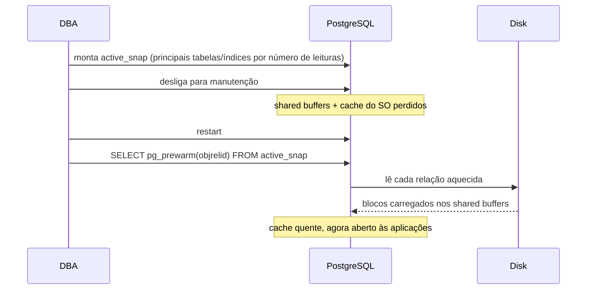

## Objective

Um servidor PostgreSQL que volta depois de um crash ou de um restart planejado está "disponível" no sentido de que aceita conexões, mas todo bloco de disco que o sistema operacional e os próprios shared buffers do PostgreSQL tinham em cache sumiu. Leituras aleatórias que antes vinham da memória agora vêm do disco, duas ou três ordens de grandeza mais lentas, e toda consulta seguinte paga por isso até o cache se reconstruir naturalmente sob carga. Aquecer o cache significa recarregar deliberadamente as tabelas e os índices mais importantes na memória *antes* de abrir as portas para as aplicações, para que "o banco está de pé" e "o banco está rápido" se tornem verdade ao mesmo tempo.

## Use Cases

- Trazer um banco de volta depois de uma manutenção planejada (um upgrade de versão, um `VACUUM FULL`, uma troca de disco) sem que os usuários sofram um pico de latência de cache frio no momento em que as conexões são reabilitadas.
- Recuperar-se de um crash não planejado em que nem o page cache do sistema operacional nem os shared buffers do PostgreSQL sobreviveram, e a banda de disco seria saturada por uma enxurrada de leituras aleatórias pelas próximas horas.
- Decidir qual subconjunto de tabelas e índices vale o esforço de aquecer: ler um cluster inteiro de vários terabytes para a memória não compensa, mas as 20 tabelas que recebem a maior parte das leituras por índice normalmente compensam.

## Deep Dive



### Montando um snapshot do que realmente importa

Antes que qualquer coisa possa ser aquecida, algo precisa dizer quais tabelas e índices valem o esforço. A receita do livro monta uma tabela estática ranqueando as 20 tabelas e os 20 índices mais usados em leituras, junto com o caminho do arquivo em disco de cada objeto:

```sql
DROP TABLE IF EXISTS active_snap;

CREATE TABLE active_snap AS
(SELECT t.relid AS objrelid,
        s.setting || '/' ||
        pg_relation_filepath(t.relid) AS file_path
   FROM pg_stat_user_tables t, pg_settings s
  WHERE s.name = 'data_directory'
  ORDER BY coalesce(idx_scan, 0) DESC
  LIMIT 20)
UNION
(SELECT t.indexrelid AS objrelid,
        s.setting || '/' ||
        pg_relation_filepath(t.indexrelid) AS file_path
   FROM pg_stat_user_indexes t, pg_settings s
  WHERE s.name = 'data_directory'
  ORDER BY coalesce(idx_scan, 0) DESC
  LIMIT 20);
```

Isto é só uma aproximação (`idx_scan` é um contador cumulativo do coletor de estatísticas, não uma garantia de que os mesmos objetos vão importar depois do restart), mas é melhor que deixar a escolha ao acaso, e é barato reconstruir a qualquer momento (a tabela é apagada e recriada do zero a cada execução).

### A correção de uma linha: `pg_prewarm` (9.4 em diante)

Com `active_snap` populada *antes* de desligar o servidor, restaurar o cache depois que um PostgreSQL 9.4+ volta é uma única instrução:

```sql
CREATE EXTENSION pg_prewarm;

SELECT pg_prewarm(objrelid)
   FROM active_snap;
```

`pg_prewarm(regclass)` lê todos os blocos da relação indicada, direto para os shared buffers do PostgreSQL ou via prefetch no nível do sistema operacional, dependendo do argumento `mode`. Executado uma vez por linha de `active_snap`, ele recarrega exatamente as tabelas e índices que o snapshot marcou como importantes.

### O recurso manual: pgFincore e `dd` (antes do 9.4)

Para servidores antigos o bastante para não ter `pg_prewarm`, o livro recorre a duas ferramentas de mais baixo nível. O caminho puramente via shell preserva os caminhos dos arquivos, desliga, faz a manutenção e então lê cada arquivo para o cache do sistema operacional duas vezes com `dd` (uma para carregá-lo, outra para marcá-lo como usado com frequência, para que o kernel tenha menos pressa em despejá-lo de novo):

```bash
COPY active_snap (file_path) TO '/tmp/frequent_tables.txt';
-- desliga, faz a manutenção e então, no shell:
for x in $(tac /tmp/frequent_tables.txt); do
     for y in $x*; do
          dd if=$y of=/dev/null bs=8192
          dd if=$y of=/dev/null bs=8192
     done
done
-- reinicia o PostgreSQL
```

A alternativa puramente em SQL usa a extensão contribuída `pgFincore` em vez de scripts de shell, bloqueando novas conexões ao banco crítico (a todos exceto `template1`) enquanto recarrega cada objeto de `active_snap`:

```sql
CREATE EXTENSION pgfincore;

UPDATE pg_database SET datallowconn = FALSE WHERE datname != 'template1';

DO $$
DECLARE
     obj_oid oid;
BEGIN
     FOR obj_oid IN SELECT objrelid FROM active_snap
     LOOP
          PERFORM pgfadvise_willneed(obj_oid::regclass);
     END LOOP;
END;
$$ LANGUAGE plpgsql;

UPDATE pg_database SET datallowconn = TRUE;
```

`pgfadvise_willneed` pede ao kernel (com a semântica de `mincore`/`posix_fadvise`) que pré-carregue as páginas de cada relação no page cache do sistema operacional: um nível mais baixo que o foco do `pg_prewarm` nos shared buffers, e ainda útil hoje justamente porque mira o cache do sistema operacional em vez da memória do próprio PostgreSQL.

## Trade-offs

- **`active_snap` ranqueia por contadores de leitura cumulativos, não pelo que vai de fato estar quente depois do restart.** Um reset dos contadores (`pg_stat_reset()`) ou um crash pouco depois de o snapshot ser tirado podem deixá-lo desatualizado; trate-o como um palpite inicial razoável, não uma garantia, e reconstrua-o o mais perto possível do momento do desligamento.
- **Aquecer o cache não faz a E/S subjacente desaparecer, só a move para antes, fora do caminho crítico.** `pg_prewarm` e `dd` ainda precisam ler fisicamente cada bloco aquecido pelo menos uma vez; em um sistema com discos realmente lentos, essa leitura leva o mesmo tempo, ela só acontece antes de as consultas dos usuários pagarem juros por ela, em vez de durante.
- **O pgFincore é uma extensão de terceiros, não um módulo contrib do PostgreSQL.** Ele precisa ser compilado e empacotado à parte (como mostra o `apt-get install postgresql-12-pgfincore` do livro) e depende de recursos do sistema operacional (`mincore()`/`fincore()`, `posix_fadvise()`), diferente do `pg_prewarm`, que vem no core e não precisa de nada além de `CREATE EXTENSION`.
- **O pgFincore continua vivo, só anda mais devagar que o `pg_prewarm` do core.** Ele de fato ficou para trás por um tempo (o PostgreSQL 18 foi marcado como falha de compilação na wiki de bugs de extensões da comunidade depois que a última versão regular do pgFincore, 1.3.1 de setembro de 2023, cobria só até o PostgreSQL 16), mas isso já foi corrigido: a versão 1.4.0 (junho de 2026) adicionou suporte ao PostgreSQL 18 e 19, e o repositório no GitHub continua recebendo commits. Não está abandonado, mas vale conferir antes de presumir que ele acompanha a versão principal mais nova do PostgreSQL desde o primeiro dia, como um módulo contrib do core acompanha.
- **Livro vs. hoje:** o livro apresenta o `pg_prewarm` apenas como o `SELECT pg_prewarm(objrelid) FROM active_snap` de uma linha mostrado acima, e nunca menciona que o `pg_prewarm` traz uma segunda peça, o background worker `autoprewarm`, que já existia bem antes do PostgreSQL 12. Habilitado uma vez no `postgresql.conf`:

  ```ini
  shared_preload_libraries = 'pg_prewarm'
  pg_prewarm.autoprewarm = true
  pg_prewarm.autoprewarm_interval = 300s
  ```

  ele grava periodicamente, por conta própria, o conteúdo atual dos shared buffers no disco e o recarrega automaticamente no próximo início do servidor: todo o fluxo de "capturar os objetos importantes e recarregá-los depois do restart" que a receita monta à mão com `active_snap`, rodando sem supervisão, sem tabela escrita pelo DBA nem passo manual de `SELECT pg_prewarm(...)`. Confirmado pela documentação oficial do `pg_prewarm`.

## Documentation Links

- Shaun Thomas, "PostgreSQL 12 High Availability Cookbook", 3ª edição (Packt, 2020): Capítulo 3, "Minimizing Downtime", receita "Defusing cache poisoning", p. 106-110: doc
- [PostgreSQL Documentation: pg_prewarm (including the autoprewarm background worker)](https://www.postgresql.org/docs/current/pgprewarm.html): doc
- [PostgreSQL Documentation: The Cumulative Statistics System (pg_stat_user_tables, pg_stat_user_indexes)](https://www.postgresql.org/docs/current/monitoring-stats.html): doc
- [pgFincore: GitHub repository and documentation](https://github.com/klando/pgfincore): doc
