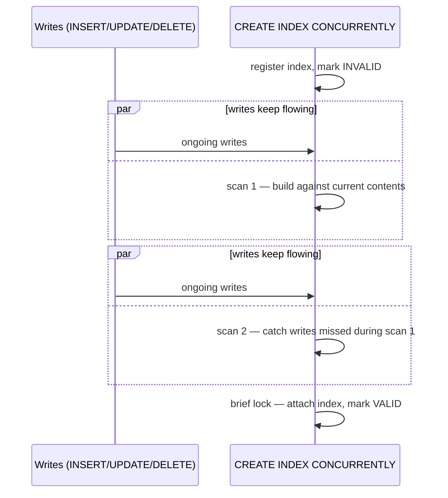

## Objective

Creating an index is routine DBA work — until the table is large or active enough
that a plain `CREATE INDEX` becomes an outage. A normal index build takes a shared
exclusive lock on the table for its entire duration, blocking every insert, update,
and delete until the build finishes. `CREATE INDEX CONCURRENTLY` trades that away:
PostgreSQL builds the index in the background, tracking incoming writes as it goes,
and only takes a brief lock at the very end to attach the finished index. The build
itself takes longer and does more work — but the table stays fully writable the
whole time.

## Use Cases

- Adding an index to a large or heavily written production table without a
  maintenance window, because a plain `CREATE INDEX` would block writes for as
  long as the build takes.
- Rebuilding a bloated or corrupted index on a live table without taking it (or
  the table it protects) offline for the duration.
- Recovering cleanly after a concurrent index build fails partway through and
  leaves behind an index that's present but unusable.

## Deep Dive

### The problem: a plain CREATE INDEX locks out every write

```sql
CREATE INDEX idx_account_bid ON pgbench_accounts (bid);
```

A standard index build takes a shared exclusive lock on `pgbench_accounts` for
the whole operation. Reads keep working, but every `INSERT`/`UPDATE`/`DELETE`
against the table queues up behind the lock until the index finishes — on a
large or busy table, that can mean minutes or hours of blocked writes, which is
fundamentally incompatible with staying highly available.

### The fix: CREATE INDEX CONCURRENTLY

```sql
CREATE INDEX CONCURRENTLY idx_account_bid
    ON pgbench_accounts (bid);
```

With `CONCURRENTLY`, PostgreSQL builds the index in the background while
continuing to track incoming inserts, updates, and deletes so they end up
reflected in the new index too. A write issued against the table *while the
index is being built* completes normally — the block only happens right at the
very end, for the brief moment PostgreSQL needs to attach the finished index to
the table's catalog entry. This capability isn't new or experimental — it's
been in PostgreSQL since version 8.2 (2006).



### Why it's slower: two scans instead of one

A plain `CREATE INDEX` does a single table scan under its exclusive lock. A
concurrent build needs **two separate scans**, run as two additional internal
transactions, precisely because it can't take the same all-at-once lock:

1. The index is first registered in the system catalog, marked `INVALID`.
2. A first scan builds the index against the table's current contents — but has
   to wait for any transaction that had already started (and could still modify
   the table) to finish first.
3. A second scan catches anything the first missed — writes that landed
   *during* the first scan — and has to wait out any transaction whose snapshot
   predates the second scan (including, for partial or expression indexes,
   concurrent index builds happening on other tables).
4. Only once both scans succeed is the index marked valid and made available to
   the query planner.

More total work, and a real chance of waiting on long-running transactions at
each step, is the price paid for never blocking writes.

### Restrictions that come with CONCURRENTLY

- **No transaction block.** `CREATE INDEX CONCURRENTLY` cannot run inside a
  transaction — the underlying reason is the same one the book gives: the
  process needs to observe the outcome of concurrently committing transactions
  as it goes, which a single enclosing transaction would prevent.
- **One concurrent build per table at a time.** PostgreSQL won't run two
  concurrent index builds against the same table simultaneously (a plain,
  non-concurrent build *can* still run alongside a concurrent one, just not
  another concurrent one). Some larger installations work around the
  one-at-a-time limit by queuing concurrent-index requests rather than firing
  them off in parallel.
- **OLTP lock-wait pileups.** The final attach step still needs a lock, and
  PostgreSQL can't take it while any earlier transaction is still running.
  While it waits, any *new* transaction that wants to touch the table also
  queues up behind it — on a busy OLTP system this can spiral into exhausting
  every available client connection. The practical mitigation is the same as
  for a plain index build: schedule the concurrent build during low-traffic
  windows and avoid long-running transactions that could block the final lock.

## Trade-offs

- **`CONCURRENTLY` doesn't make index creation cheap — it makes it non-blocking.**
  The two-scan process is strictly more total work than a plain build, and
  takes longer wall-clock time; the trade is "slower but the table stays
  writable" versus "faster but the table is locked," not "free."
- **A failed concurrent build doesn't clean up after itself.** If the process
  is interrupted (a deadlock, a uniqueness violation partway through, a
  cancelled session) it leaves behind an index marked `INVALID` — silently
  ignored by the query planner, but still paying full write-time maintenance
  overhead on every insert/update/delete, for no query benefit at all. This
  case isn't covered in the book's recipe at all; today's official
  documentation is explicit about it:
  ```sql
  -- \d shows the leftover index:
  -- Indexes:
  --     "idx_account_bid" btree (bid) INVALID

  -- recovery: drop and rebuild concurrently again
  DROP INDEX idx_account_bid;
  CREATE INDEX CONCURRENTLY idx_account_bid ON pgbench_accounts (bid);
  ```
- **A concurrent unique index can report constraint violations before it's even
  usable.** Uniqueness starts being enforced against other transactions during
  the second scan — meaning another session's query can hit a uniqueness error
  caused by the not-yet-valid index, and if the build itself later fails, the
  resulting `INVALID` index keeps enforcing that constraint anyway.
- **Book gap, not a book-vs-today change: `REINDEX CONCURRENTLY` already
  existed in PostgreSQL 12 — the book's own target version — but this recipe
  never mentions it.** It shipped as a new PostgreSQL 12 feature (the same
  release this book covers) and is the more direct tool for the "index needs
  rebuilding" case specifically, rather than the "index needs to exist for the
  first time" case this recipe demonstrates:
  ```sql
  REINDEX INDEX CONCURRENTLY idx_account_bid;
  ```
  It follows the same non-blocking philosophy as `CREATE INDEX CONCURRENTLY`
  (build a new index in the background, then swap it in) and is also the
  officially documented recovery path for an `INVALID` index left over from a
  failed concurrent build, as an alternative to dropping and recreating it —
  confirmed via the current PostgreSQL documentation.
- **Book vs. today: partitioned-table support is still absent, not something
  that changed.** `CREATE INDEX CONCURRENTLY` still cannot build an index
  directly on a partitioned table as of the current documentation — the
  workaround (build concurrently on each partition individually, then attach a
  non-concurrent, metadata-only index on the parent) is unchanged since the
  book's PostgreSQL 12. Worth flagging precisely because it's easy to assume
  a decade-old limitation like this has since been lifted; it hasn't.

## Documentation Links

- Shaun Thomas, "PostgreSQL 12 High Availability Cookbook", 3rd Edition (Packt, 2020) — Chapter 3, "Minimizing Downtime", recipe "Reducing contention with concurrent indexes", p. 114-117 — doc
- [PostgreSQL Documentation — CREATE INDEX (Building Indexes Concurrently)](https://www.postgresql.org/docs/current/sql-createindex.html) — doc
- [PostgreSQL Documentation — REINDEX (Rebuilding Indexes Concurrently)](https://www.postgresql.org/docs/current/sql-reindex.html) — doc
