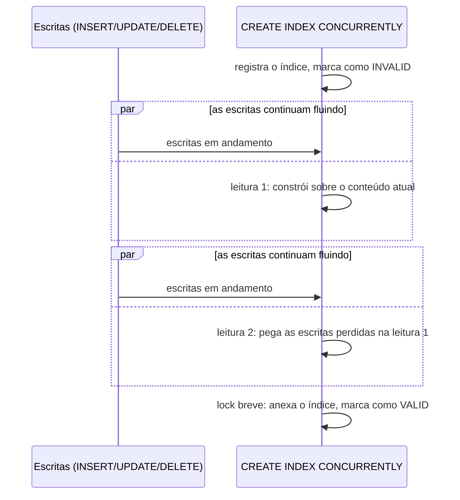

## Objective

Criar um índice é trabalho rotineiro de DBA, até que a tabela seja grande ou ativa o bastante para que um `CREATE INDEX` simples vire uma indisponibilidade. Uma construção de índice normal toma um lock exclusivo compartilhado na tabela por toda a sua duração, bloqueando todo insert, update e delete até a construção terminar. `CREATE INDEX CONCURRENTLY` abre mão disso: o PostgreSQL constrói o índice em segundo plano, acompanhando as escritas que chegam enquanto avança, e só toma um lock breve bem no fim para anexar o índice pronto. A construção em si demora mais e faz mais trabalho, mas a tabela continua totalmente gravável o tempo todo.

## Use Cases

- Adicionar um índice a uma tabela de produção grande ou com muita escrita sem janela de manutenção, porque um `CREATE INDEX` simples bloquearia as escritas por todo o tempo da construção.
- Reconstruir um índice inchado ou corrompido em uma tabela ativa sem tirá-lo do ar (nem a tabela que ele protege) durante a operação.
- Recuperar-se de forma limpa depois que uma construção concorrente de índice falha no meio e deixa para trás um índice presente, mas inutilizável.

## Deep Dive

### O problema: um CREATE INDEX simples bloqueia toda escrita

```sql
CREATE INDEX idx_account_bid ON pgbench_accounts (bid);
```

Uma construção de índice padrão toma um lock exclusivo compartilhado em `pgbench_accounts` durante toda a operação. As leituras continuam funcionando, mas todo `INSERT`/`UPDATE`/`DELETE` contra a tabela fica na fila atrás do lock até o índice terminar; em uma tabela grande ou movimentada, isso pode significar minutos ou horas de escritas bloqueadas, o que é fundamentalmente incompatível com permanecer altamente disponível.

### A correção: CREATE INDEX CONCURRENTLY

```sql
CREATE INDEX CONCURRENTLY idx_account_bid
    ON pgbench_accounts (bid);
```

Com `CONCURRENTLY`, o PostgreSQL constrói o índice em segundo plano enquanto continua acompanhando inserts, updates e deletes que chegam, para que eles também acabem refletidos no novo índice. Uma escrita emitida contra a tabela *enquanto o índice está sendo construído* termina normalmente; o bloqueio só acontece bem no fim, pelo breve momento de que o PostgreSQL precisa para anexar o índice pronto à entrada da tabela no catálogo. Essa capacidade não é nova nem experimental: ela existe no PostgreSQL desde a versão 8.2 (2006).



### Por que é mais lento: duas leituras em vez de uma

Um `CREATE INDEX` simples faz uma única leitura da tabela sob seu lock exclusivo. Uma construção concorrente precisa de **duas leituras separadas**, rodadas como duas transações internas adicionais, justamente porque não pode tomar o mesmo lock de uma vez:

1. O índice é primeiro registrado no catálogo do sistema, marcado como `INVALID`.
2. Uma primeira leitura constrói o índice sobre o conteúdo atual da tabela, mas precisa esperar antes que qualquer transação que já tivesse começado (e ainda pudesse modificar a tabela) termine.
3. Uma segunda leitura pega o que a primeira perdeu (escritas que caíram *durante* a primeira leitura) e precisa esperar qualquer transação cujo snapshot seja anterior à segunda leitura (incluindo, para índices parciais ou de expressão, construções concorrentes de índices acontecendo em outras tabelas).
4. Só depois que as duas leituras têm sucesso o índice é marcado como válido e disponibilizado para o planejador de consultas.

Mais trabalho total, e uma chance real de esperar por transações demoradas em cada passo, é o preço pago por nunca bloquear escritas.

### Restrições que vêm com CONCURRENTLY

- **Sem bloco de transação.** `CREATE INDEX CONCURRENTLY` não pode rodar dentro de uma transação; o motivo por baixo é o mesmo que o livro dá: o processo precisa observar o resultado de transações que fazem commit concorrentemente enquanto avança, o que uma única transação envolvente impediria.
- **Uma construção concorrente por tabela por vez.** O PostgreSQL não roda duas construções concorrentes de índice contra a mesma tabela ao mesmo tempo (uma construção simples, não concorrente, *pode* rodar junto com uma concorrente, só não outra concorrente). Algumas instalações maiores contornam o limite de uma por vez enfileirando os pedidos de índices concorrentes em vez de dispará-los em paralelo.
- **Acúmulo de espera por lock em OLTP.** O passo final de anexar ainda precisa de um lock, e o PostgreSQL não consegue tomá-lo enquanto qualquer transação anterior ainda estiver rodando. Enquanto ele espera, qualquer transação *nova* que queira tocar a tabela também entra na fila atrás dele; em um sistema OLTP movimentado, isso pode virar uma espiral até esgotar todas as conexões de cliente disponíveis. A mitigação prática é a mesma de uma construção simples: agende a construção concorrente em janelas de pouco tráfego e evite transações demoradas que possam bloquear o lock final.

## Trade-offs

- **`CONCURRENTLY` não torna a criação de índice barata; torna-a não bloqueante.** O processo de duas leituras é estritamente mais trabalho total que uma construção simples e leva mais tempo de relógio; a troca é "mais lento, mas a tabela continua gravável" contra "mais rápido, mas a tabela fica bloqueada", não "de graça."
- **Uma construção concorrente que falha não limpa a própria sujeira.** Se o processo é interrompido (um deadlock, uma violação de unicidade no meio, uma sessão cancelada), ele deixa para trás um índice marcado como `INVALID`, ignorado em silêncio pelo planejador de consultas, mas ainda pagando o custo completo de manutenção em toda escrita, em todo insert/update/delete, sem nenhum benefício para as consultas. Esse caso não é coberto na receita do livro; a documentação oficial de hoje é explícita sobre ele:
  ```sql
  -- \d mostra o índice que sobrou:
  -- Indexes:
  --     "idx_account_bid" btree (bid) INVALID

  -- recuperação: apague e reconstrua de forma concorrente de novo
  DROP INDEX idx_account_bid;
  CREATE INDEX CONCURRENTLY idx_account_bid ON pgbench_accounts (bid);
  ```
- **Um índice único concorrente pode reportar violações de constraint antes mesmo de ser utilizável.** A unicidade começa a ser imposta contra outras transações durante a segunda leitura, o que significa que a consulta de outra sessão pode bater em um erro de unicidade causado pelo índice ainda não válido, e se a construção em si falhar depois, o índice `INVALID` resultante continua impondo essa constraint mesmo assim.
- **Lacuna do livro, não uma mudança de livro vs. hoje: o `REINDEX CONCURRENTLY` já existia no PostgreSQL 12, a própria versão-alvo do livro, mas esta receita nunca o menciona.** Ele saiu como recurso novo do PostgreSQL 12 (a mesma versão que este livro cobre) e é a ferramenta mais direta especificamente para o caso de "o índice precisa ser reconstruído", em vez do caso de "o índice precisa existir pela primeira vez" que esta receita demonstra:
  ```sql
  REINDEX INDEX CONCURRENTLY idx_account_bid;
  ```
  Ele segue a mesma filosofia não bloqueante do `CREATE INDEX CONCURRENTLY` (construir um novo índice em segundo plano e depois trocá-lo) e também é o caminho de recuperação documentado oficialmente para um índice `INVALID` deixado por uma construção concorrente que falhou, como alternativa a apagá-lo e recriá-lo, conforme confirmado pela documentação atual do PostgreSQL.
- **Livro vs. hoje: o suporte a tabelas particionadas continua ausente, não é algo que mudou.** `CREATE INDEX CONCURRENTLY` ainda não consegue construir um índice diretamente em uma tabela particionada segundo a documentação atual; o contorno (construir de forma concorrente em cada partição individualmente e depois anexar um índice não concorrente, só de metadados, no pai) não mudou desde o PostgreSQL 12 do livro. Vale apontar justamente porque é fácil presumir que uma limitação antiga como essa já foi removida; não foi.

## Documentation Links

- Shaun Thomas, "PostgreSQL 12 High Availability Cookbook", 3ª edição (Packt, 2020): Capítulo 3, "Minimizing Downtime", receita "Reducing contention with concurrent indexes", p. 114-117: doc
- [PostgreSQL Documentation: CREATE INDEX (Building Indexes Concurrently)](https://www.postgresql.org/docs/current/sql-createindex.html): doc
- [PostgreSQL Documentation: REINDEX (Rebuilding Indexes Concurrently)](https://www.postgresql.org/docs/current/sql-reindex.html): doc
