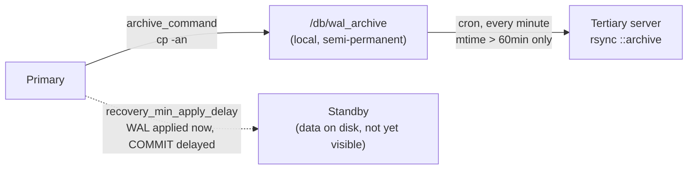

## Objective

Not every failure crashes the server. A CPU or RAM fault can inject a bad byte
while a page is in transit between disk and memory — PostgreSQL trusts that
the data it reads is correct, so a flipped bit becomes a silently corrupted
row or index entry, sometimes for weeks before anything notices. On a
dual-node cluster with synchronous replication, that corruption can reach the
standby almost as fast as it reaches the primary, because synchronous
replication's entire job is to keep the two copies identical as quickly as
possible. That defeats the point of having a second copy at all: there's
nothing left to fail over to. This recipe's answer is to keep a tertiary WAL
archive that's physically outside the replication path, and — the important
part — to deliberately withhold WAL files from that archive for an hour so a
monitor has time to notice corruption before it ever reaches the copy meant
to survive it.

## Use Cases

- Hardening a synchronous primary/standby pair against a slow-onset CPU or
  RAM fault that corrupts data on both nodes nearly simultaneously, which
  plain streaming replication cannot protect against by design.
- Building a tertiary, replication-independent WAL archive that PITR/restore
  can still fall back on even if both live nodes turn out to be compromised.
- Deciding between two different PostgreSQL-native ways to buy a detection
  window — manually delaying when raw WAL bytes reach a tertiary copy versus
  the built-in `recovery_min_apply_delay` — based on how much operational
  complexity a given team can carry.

## Deep Dive



### Step 1: keep WAL locally instead of deleting it

```ini
# postgresql.conf, on the primary:
archive_command = 'cp -an %p /db/wal_archive/%f'
```

```bash
sudo mkdir -p -m 0700 /db/wal_archive
sudo chown -R postgres /db/wal_archive
pg_ctl -D /path/to/database reload
```

`cp`'s `-n` flag refuses to overwrite a file that's already there, so a
retried or duplicated archive attempt can't clobber an existing WAL segment
and quietly corrupt the archive itself.

### Step 2: prune the local archive on a schedule

```bash
# /etc/cron.daily/del_archives
find /db/wal_archive -name '0000*' \
    -type f -mtime +2 -delete
```

```bash
chmod a+x /etc/cron.daily/del_archives
```

Two or three days of local WAL is enough to cover PITR/restore needs without
letting the archive grow unbounded; older segments have already been synced
onward to the tertiary server by the time this deletes them.

### Step 3: expose a tertiary rsync target

```ini
# /etc/rsyncd.conf, on the tertiary server (192.168.1.100):
[archive]
    path = /db/wal_archive
    comment = Archived Transaction Logs
    uid = postgres
    gid = postgres
    read only = true
```

```bash
sudo mkdir -p -m 0700 /db/wal_archive
sudo chown -R postgres /db/wal_archive
```

### Step 4: the deliberate delay — sync only what's already an hour old

```bash
# /etc/cron.d/sync_archives, on the primary (192.168.1.10):
* * * * * postgres find /db/wal_archive -name '0000*' \
    -type f -mmin +60 | \
    xargs -I{} rsync {} 192.168.1.100::archive
```

This is the actual mitigation, not the archiving itself. The cron job runs
every minute but `-mmin +60` only hands it files whose local mtime is already
past an hour old, so a WAL segment written the instant a hardware fault
strikes sits on the primary's own `/db/wal_archive` — untouched by the
tertiary sync — for up to an hour. That's the window monitoring, logs, or a
human have to catch the problem before the corrupted segment ever leaves the
primary's disk and pollutes the one copy meant to survive it.

### Alternative: PostgreSQL's own `recovery_min_apply_delay`

The book's own "There's more..." section immediately walks back its earlier
claim that "current versions of PostgreSQL don't have the ability to delay
the replay stream" — a native delay has existed since PostgreSQL 9.4:

```ini
# recovery.conf on the standby, PostgreSQL 9.4–11:
recovery_min_apply_delay = 3600
```

```ini
# postgresql.conf on the standby, PostgreSQL 12+ (the book's own target version):
recovery_min_apply_delay = 3600
```

Unlike the rsync approach, this delays inside PostgreSQL's own replay logic
on a live streaming standby — no cron job, no second `rsyncd.conf`, no
tertiary server to provision. The catch, which the book states plainly: WAL
records are still applied to the standby's data pages as fast as they
arrive, only the `COMMIT` record itself is held back, so corrupt data is
already sitting in the standby's files during the delay window — just not
yet visible to a query. The rsync approach withholds the raw bytes entirely;
`recovery_min_apply_delay` withholds only visibility.

## Trade-offs

- **Book error, not book-vs-today: the book's own `recovery_min_apply_delay`
  example doesn't actually delay by an hour.** Both of the book's config
  snippets set the parameter to bare `3600` — but per the PostgreSQL 12
  documentation (the book's own target version, worded identically to
  today's docs), *"if this value is specified without units, it is taken as
  milliseconds."* `3600` with no unit is 3.6 seconds, not an hour. Confirmed
  against the current PostgreSQL documentation, which still states the same
  rule verbatim:
  ```ini
  # what the book wrote (3.6 seconds, not an hour):
  recovery_min_apply_delay = 3600

  # what actually delays by an hour:
  recovery_min_apply_delay = 3600000   # milliseconds
  recovery_min_apply_delay = '1h'      # or, with an explicit unit
  ```
- **Book gap, not a book-vs-today change: the recipe never names the
  mechanism that actually lets PostgreSQL detect this corruption in the
  first place.** "How it works" only says the hour "gives monitors,
  maintenance, and logs" time to notice — vague about what would actually
  trip an alarm. Current PostgreSQL documentation is explicit that **data
  checksums** are the built-in feature purpose-built for exactly this: a
  checksum computed when a page is written and verified on every read,
  catching precisely the kind of silent storage/page corruption this recipe
  is defending against. Data checksums predate this book's PostgreSQL 12
  target (available as an `initdb` option since PostgreSQL 9.3) but had to be
  deliberately opted into — as of PostgreSQL 18 they're on by default,
  closing that gap for any newly initialized cluster (the same PostgreSQL 18
  default-checksums change already covered in this workflow's concept on
  node-switching upgrades, which this recipe's detection story depends on
  just as much):
  ```sql
  SHOW data_checksums;
  ```
- **The hour is a detection window, not a guarantee.** A fault that goes
  unnoticed for longer than an hour — no monitoring alert, no failed
  checksum read, nobody looking at logs — still reaches the tertiary copy.
  The delay buys time; it doesn't replace having something actively watching
  during that time.
- **The whole mitigation lives outside PostgreSQL, in cron and file mtimes —
  which makes it easy to accidentally disable.** The book's own "Secondary
  delay" section says as much: during maintenance or a primary crash, the
  right move is to comment out or delete `sync_archives` entirely so
  corrupted-by-maintenance data doesn't propagate either, and remembering to
  re-enable it afterward is a manual step nothing enforces.
- **`recovery_min_apply_delay` is honored in nearly every situation except
  crash recovery** — if the standby itself crashes and restarts, WAL already
  received before the crash replays immediately on recovery, skipping the
  configured delay for that batch. A caveat the book doesn't mention,
  confirmed via the current documentation.
- **`pg_receivewal` (the book's "See also" pick) is still the current tool
  for streaming WAL to an archive location, unchanged in spirit** — it isn't
  superseded here. Current documentation does add one operational note not
  in the book: when `pg_receivewal` is the primary WAL backup method rather
  than `archive_command`, using a replication slot (`--slot`) is now
  explicitly recommended, since without one the primary is free to recycle
  WAL segments before `pg_receivewal` has copied them.

## Documentation Links

- Shaun Thomas, "PostgreSQL 12 High Availability Cookbook", 3rd Edition (Packt, 2020) — Chapter 3, "Minimizing Downtime", recipe "Mitigating the impact of hardware failure", p. 126-131 — doc
- [PostgreSQL Documentation — pg_receivewal](https://www.postgresql.org/docs/current/app-pgreceivewal.html) — doc
- [PostgreSQL Documentation — Replication Settings (recovery_min_apply_delay)](https://www.postgresql.org/docs/current/runtime-config-replication.html) — doc
- [PostgreSQL Documentation — Reliability and the Write-Ahead Log: Data Checksums](https://www.postgresql.org/docs/current/checksums.html) — doc
- [PostgreSQL 18 Release Notes — initdb defaults to enabling data checksums](https://www.postgresql.org/docs/release/18.0/) — doc
