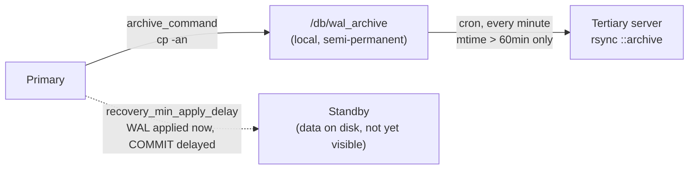

## Objective

Nem toda falha derruba o servidor. Uma falha de CPU ou RAM pode injetar um byte ruim enquanto uma página está em trânsito entre o disco e a memória; o PostgreSQL confia que os dados que lê estão corretos, então um bit invertido vira uma linha ou entrada de índice silenciosamente corrompida, às vezes por semanas antes que alguém perceba. Em um cluster de dois nós com replicação síncrona, essa corrupção pode chegar ao standby quase tão rápido quanto chega ao primário, porque o trabalho inteiro da replicação síncrona é manter as duas cópias idênticas o mais rápido possível. Isso anula completamente o propósito de ter uma segunda cópia: não sobra nada para onde fazer failover. A resposta desta receita é manter um arquivo de WAL terciário fisicamente fora do caminho de replicação e, a parte importante, reter deliberadamente os arquivos de WAL desse arquivo por uma hora para que um monitor tenha tempo de perceber a corrupção antes que ela chegue à cópia destinada a sobreviver a ela.

## Use Cases

- Blindar um par primário/standby síncrono contra uma falha de CPU ou RAM de início lento que corrompe dados em ambos os nós quase simultaneamente, algo contra o qual a replicação por streaming pura não protege por design.
- Construir um arquivo de WAL terciário, independente da replicação, no qual o PITR/restore ainda pode se apoiar mesmo se os dois nós ativos acabarem comprometidos.
- Decidir entre duas formas nativas do PostgreSQL de comprar uma janela de detecção: atrasar manualmente quando os bytes brutos de WAL chegam a uma cópia terciária versus o `recovery_min_apply_delay` embutido, com base em quanta complexidade operacional uma determinada equipe consegue carregar.

## Deep Dive



### Passo 1: manter o WAL localmente em vez de apagá-lo

```ini
# postgresql.conf, on the primary:
archive_command = 'cp -an %p /db/wal_archive/%f'
```

```bash
sudo mkdir -p -m 0700 /db/wal_archive
sudo chown -R postgres /db/wal_archive
pg_ctl -D /path/to/database reload
```

A flag `-n` do `cp` se recusa a sobrescrever um arquivo que já existe, então uma tentativa de arquivamento repetida ou duplicada não consegue destruir um segmento de WAL existente e corromper silenciosamente o próprio arquivo.

### Passo 2: podar o arquivo local em uma programação

```bash
# /etc/cron.daily/del_archives
find /db/wal_archive -name '0000*' \
    -type f -mtime +2 -delete
```

```bash
chmod a+x /etc/cron.daily/del_archives
```

Dois ou três dias de WAL local são suficientes para cobrir as necessidades de PITR/restore sem deixar o arquivo crescer sem limite; segmentos mais antigos já foram sincronizados para o servidor terciário no momento em que isso os apaga.

### Passo 3: expor um destino rsync terciário

```ini
# /etc/rsyncd.conf, on the tertiary server (192.168.1.100):
[archive]
    path = /db/wal_archive
    comment = Archived Transaction Logs
    uid = postgres
    gid = postgres
    read only = true
```

```bash
sudo mkdir -p -m 0700 /db/wal_archive
sudo chown -R postgres /db/wal_archive
```

### Passo 4: o atraso deliberado, sincronizar só o que já tem uma hora

```bash
# /etc/cron.d/sync_archives, on the primary (192.168.1.10):
* * * * * postgres find /db/wal_archive -name '0000*' \
    -type f -mmin +60 | \
    xargs -I{} rsync {} 192.168.1.100::archive
```

Essa é a mitigação de fato, não o arquivamento em si. O job de cron roda a cada minuto, mas `-mmin +60` só entrega arquivos cujo mtime local já passou de uma hora, então um segmento de WAL escrito no instante em que uma falha de hardware acontece fica no próprio `/db/wal_archive` do primário, intocado pela sincronização terciária, por até uma hora. Essa é a janela que o monitoramento, os logs ou um humano têm para pegar o problema antes que o segmento corrompido saia do disco do primário e polua a única cópia destinada a sobreviver a ele.

### Alternativa: o próprio `recovery_min_apply_delay` do PostgreSQL

A própria seção "There's more..." do livro volta atrás quase imediatamente da afirmação anterior de que "as versões atuais do PostgreSQL não têm a capacidade de atrasar o replay stream": um atraso nativo existe desde o PostgreSQL 9.4:

```ini
# recovery.conf on the standby, PostgreSQL 9.4–11:
recovery_min_apply_delay = 3600
```

```ini
# postgresql.conf on the standby, PostgreSQL 12+ (the book's own target version):
recovery_min_apply_delay = 3600
```

Diferente da abordagem com rsync, isso atrasa dentro da própria lógica de replay do PostgreSQL em um standby de streaming ativo: sem job de cron, sem um segundo `rsyncd.conf`, sem servidor terciário para provisionar. A pegadinha, que o livro afirma claramente: os registros de WAL ainda são aplicados às páginas de dados do standby assim que chegam, só o próprio registro de `COMMIT` é retido, então dados corrompidos já estão sentados nos arquivos do standby durante a janela de atraso, só que ainda não visíveis para uma consulta. A abordagem com rsync retém os bytes brutos por completo; `recovery_min_apply_delay` retém apenas a visibilidade.

## Trade-offs

- **Erro do livro, não uma mudança livro-vs-hoje: o próprio exemplo de `recovery_min_apply_delay` do livro não atrasa de fato uma hora.** Os dois trechos de configuração do livro definem o parâmetro como um `3600` puro, mas segundo a documentação do PostgreSQL 12 (a própria versão-alvo do livro, com redação idêntica à documentação de hoje), *"se esse valor for especificado sem unidades, é tratado como milissegundos"*. `3600` sem unidade são 3,6 segundos, não uma hora. Confirmado com a documentação atual do PostgreSQL, que ainda declara a mesma regra ao pé da letra:
  ```ini
  # what the book wrote (3.6 seconds, not an hour):
  recovery_min_apply_delay = 3600

  # what actually delays by an hour:
  recovery_min_apply_delay = 3600000   # milliseconds
  recovery_min_apply_delay = '1h'      # or, with an explicit unit
  ```
- **Lacuna do livro, não uma mudança livro-vs-hoje: a receita nunca nomeia o mecanismo que de fato permite ao PostgreSQL detectar essa corrupção em primeiro lugar.** A seção "How it works" só diz que a hora "dá tempo a monitores, manutenção e logs" de perceber, vago quanto ao que realmente dispararia um alarme. A documentação atual do PostgreSQL é explícita de que os **data checksums** são o recurso embutido feito exatamente para isso: um checksum calculado quando uma página é escrita e verificado a cada leitura, capturando precisamente o tipo de corrupção silenciosa de armazenamento/página contra a qual esta receita se defende. Data checksums são anteriores à versão-alvo PostgreSQL 12 deste livro (disponíveis como opção do `initdb` desde o PostgreSQL 9.3), mas precisavam ser ativados deliberadamente; a partir do PostgreSQL 18 eles vêm ligados por padrão, fechando essa lacuna para qualquer cluster recém-inicializado (a mesma mudança de checksums padrão do PostgreSQL 18 já coberta no conceito deste fluxo de trabalho sobre upgrades via troca de nó, do qual a história de detecção desta receita depende igualmente):
  ```sql
  SHOW data_checksums;
  ```
- **A hora é uma janela de detecção, não uma garantia.** Uma falha que passa despercebida por mais de uma hora (sem alerta de monitoramento, sem falha de leitura de checksum, ninguém olhando os logs) ainda chega à cópia terciária. O atraso compra tempo; ele não substitui ter algo observando ativamente durante esse tempo.
- **A mitigação inteira vive fora do PostgreSQL, em cron e mtimes de arquivo, o que torna fácil desativá-la por acidente.** A própria seção "Secondary delay" do livro diz exatamente isso: durante manutenção ou uma queda do primário, o certo é comentar ou apagar `sync_archives` por completo, para que dados corrompidos pela própria manutenção também não se propaguem, e lembrar de reativar depois é um passo manual que nada garante.
- **`recovery_min_apply_delay` é respeitado em quase toda situação, exceto na recuperação de crash**: se o próprio standby cai e reinicia, o WAL já recebido antes do crash é reproduzido imediatamente na recuperação, pulando o atraso configurado para esse lote. Uma ressalva que o livro não menciona, confirmada pela documentação atual.
- **`pg_receivewal` (a recomendação de "See also" do livro) ainda é a ferramenta atual para fazer streaming de WAL para um local de arquivo, inalterada em essência**: não foi substituída aqui. A documentação atual acrescenta uma observação operacional ausente do livro: quando `pg_receivewal` é o método principal de backup de WAL em vez de `archive_command`, usar um replication slot (`--slot`) agora é explicitamente recomendado, já que sem um o primário fica livre para reciclar segmentos de WAL antes que o `pg_receivewal` os tenha copiado.

## Documentation Links

- [Shaun Thomas, "PostgreSQL 12 High Availability Cookbook", 3rd Edition (Packt, 2020), Chapter 3, "Minimizing Downtime", recipe "Mitigating the impact of hardware failure", p. 126-131] - doc
- [PostgreSQL Documentation: pg_receivewal](https://www.postgresql.org/docs/current/app-pgreceivewal.html) - doc
- [PostgreSQL Documentation: Replication Settings (recovery_min_apply_delay)](https://www.postgresql.org/docs/current/runtime-config-replication.html) - doc
- [PostgreSQL Documentation: Reliability and the Write-Ahead Log: Data Checksums](https://www.postgresql.org/docs/current/checksums.html) - doc
- [PostgreSQL 18 Release Notes: initdb defaults to enabling data checksums](https://www.postgresql.org/docs/release/18.0/) - doc
