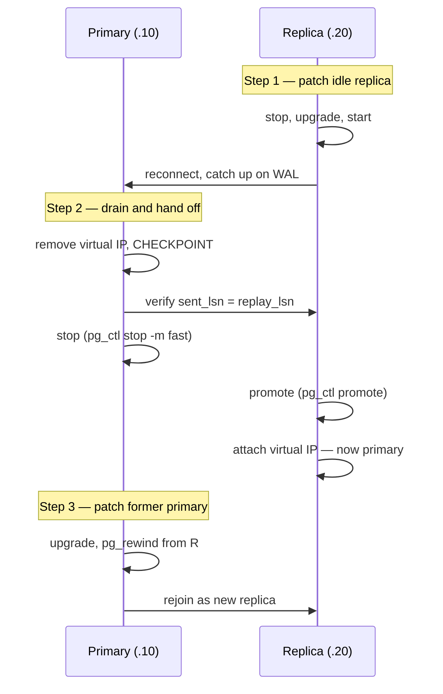

## Objective

Um servidor de alta disponibilidade não pode simplesmente ficar fora do ar para aplicar patches de rotina, mas correções de segurança e de bugs ainda precisam ser aplicadas, em uma programação que o banco de dados não tem como recusar. A resposta não é uma janela de manutenção; é ter uma cópia sobressalente do banco para a qual trocar. Atualize a réplica ociosa primeiro, promova-a para receber tráfego ao vivo enquanto o antigo primário (agora rebaixado) recebe o patch por sua vez, e o banco de dados em si nunca fica realmente indisponível: só o papel que cada nó desempenha muda.

## Use Cases

- Aplicar um release de rotina de segurança ou correção de bugs de versão menor do PostgreSQL (por exemplo, 12.3 → 12.4) em um par primário/réplica de produção sem nenhuma indisponibilidade visível para a aplicação.
- Ensaiar um procedimento de troca de papéis (qual nó é primário versus réplica) como efeito colateral da aplicação de patches de rotina, para que a mecânica já seja familiar antes de um failover não planejado acontecer de verdade.
- Decidir como ressincronizar o nó recém-rebaixado como uma réplica nova depois da troca, e escolher uma ferramenta mais rápida do que um base backup completo para isso.

## Deep Dive



### Passo 1: aplicar o patch na réplica ociosa primeiro

Com um primário em `192.168.1.10` e uma réplica em `192.168.1.20` atrás de um IP virtual (`192.168.1.30`), a réplica, que no momento não está servindo nenhum tráfego, é a segura para mexer primeiro:

```bash
# on 192.168.1.20, as postgres:
pg_ctl -D /path/to/database stop -m fast

# as a root-capable user:
sudo apt-get install postgresql-12

# as postgres again:
pg_ctl -D /path/to/database start
```

A réplica se reconecta ao primário e recupera o WAL que perdeu enquanto estava fora do ar, a mesma autocura por streaming replication na qual já se apoia qualquer indisponibilidade breve.

### Passo 2: isolar e drenar o primário, depois fazer o handoff

Antes que o primário possa ser parado com segurança, o IP virtual é removido para que nenhuma conexão nova pouse nele, e um `CHECKPOINT` final descarrega qualquer coisa ainda em buffer para que a réplica tenha uma chance real de se atualizar por completo:

```bash
# root-capable user, on 192.168.1.10:
sudo ip addr del 192.168.1.30/32 dev eth0
```

```sql
-- superuser, on 192.168.1.10:
CHECKPOINT;

-- repeat until the two values match:
SELECT sent_location, replay_location
   FROM pg_stat_replication
  WHERE usename = 'rep_user';
```

Assim que as posições coincidem, o antigo primário é parado e a réplica é promovida: o momento real do handoff:

```bash
# on 192.168.1.10, as postgres:
pg_ctl -D /path/to/database stop -m fast

# on 192.168.1.20, as postgres:
pg_ctl -D /path/to/database promote
```

```bash
# root-capable user, on 192.168.1.20:
sudo ip addr add 192.168.1.30 dev eth0
```

O IP virtual se mover para `192.168.1.20` é o que torna o handoff transparente para as aplicações: elas continuam falando com `192.168.1.30`, sem saber que um servidor físico diferente agora está respondendo. Pools de conexão podem ainda precisar de um sinal explícito de reinício/reconexão se guardarem conexões TCP em cache em vez de re-resolver o endereço a cada requisição.

### Passo 3: aplicar o patch no ex-primário (agora rebaixado) e reconstruí-lo como réplica

`192.168.1.10` recebe exatamente o mesmo patch enquanto não está mais recebendo tráfego ao vivo, e então a abordagem padrão da receita para ressincronizá-lo é apagar tudo e reclonar por completo:

```bash
# on 192.168.1.10, as postgres:
rm -Rf /path/to/database
pg_basebackup -U rep_user -h 192.168.1.20 -D /path/to/database
```

```ini
# postgresql.conf on 192.168.1.10 (PostgreSQL 12+):
primary_conninfo = 'host=192.168.1.20 port=5432 user=rep_user'
```

```bash
# an empty file named standby.signal in /path/to/database, then:
pg_ctl -D /path/to/database start
```

Os dois nós terminam o procedimento com os papéis totalmente invertidos em relação a como começaram: `192.168.1.20` agora é primário, `192.168.1.10` agora é a réplica, pronto para exatamente o mesmo procedimento na próxima vez que um patch precisar ser aplicado.

## Trade-offs

- **O procedimento inteiro depende de a réplica estar genuinamente atualizada antes de o primário ser parado.** O `CHECKPOINT` mais a checagem repetida de `sent_location`/`replay_location` é o que transforma "provavelmente em sincronia" em "confirmadamente em sincronia": pular isso arrisca promover uma réplica que ainda está sem as últimas transações confirmadas.
- **Um pool de conexão em cache pode continuar falando com o IP do antigo primário mesmo depois de o IP virtual ter se movido**, se ele mantiver conexões TCP de longa duração em vez de re-resolver a cada requisição; o próprio passo 11 do livro (avisar desenvolvedores/suporte para reiniciar pools de conexão) existe especificamente para cobrir essa lacuna, já que a troca de infraestrutura sozinha não garante que todo cliente perceba.
- **Livro vs. hoje: a própria consulta de verificação do livro já usa nomes de coluna que foram renomeados antes mesmo da versão-alvo do PostgreSQL do livro ser lançada.** `sent_location`/`replay_location` em `pg_stat_replication` foram renomeadas para `sent_lsn`/`replay_lsn` no PostgreSQL 10 (2017): a mesma lacuna já apontada no conceito deste fluxo de trabalho sobre a receita de "Gerenciando migrações de sistema", da qual esta se baseia explicitamente e repete ao pé da letra. Confirmado pela documentação atual do PostgreSQL.
- **Lacuna do livro, não uma mudança livro-vs-hoje: a própria seção "There's more..." da receita admite que a recópia completa via `pg_basebackup` é desperdiçadora, e remete a uma "receita posterior", mas o `pg_rewind` já estava disponível na própria versão-alvo PostgreSQL 12 do livro (introduzido no PostgreSQL 9.5) e resolve isso diretamente.** Em vez de apagar e recopiar o primário rebaixado inteiro, o `pg_rewind` só copia os blocos que de fato divergiram desde que as linhas do tempo dos dois nós se separaram:
  ```bash
  # instead of rm -Rf + pg_basebackup:
  pg_ctl -D /path/to/database stop -m fast   # ensure the old primary is down
  pg_rewind --target-pgdata=/path/to/database \
            --source-server="host=192.168.1.20 port=5432 user=rep_user dbname=postgres"
  ```
  O `pg_rewind` precisa de `wal_log_hints = on` em `postgresql.conf` ou de data checksums habilitados no momento do `initdb` no cluster alvo: um requisito inalterado desde sua introdução, confirmado pela documentação atual. Em um cluster inicializado sem nenhum dos dois, uma reclonagem completa via `pg_basebackup` (ou ligar `wal_log_hints` e reiniciar primeiro) ainda é o plano B.
- **Livro vs. hoje: o PostgreSQL 18 mudou o próprio padrão do `initdb`, fechando parte dessa lacuna de pré-requisito para qualquer cluster recém-criado.** A partir do PostgreSQL 18, data checksums vêm habilitados por padrão no momento do `initdb` (desativável via a nova flag `--no-data-checksums`): um cluster criado no PostgreSQL 18+ satisfaz automaticamente o requisito do `pg_rewind`, enquanto os clusters da era PostgreSQL 12 do livro precisavam de uma ativação deliberada e fácil de esquecer. Confirmado pelas notas de release oficiais do PostgreSQL 18.

## Documentation Links

- [Shaun Thomas, "PostgreSQL 12 High Availability Cookbook", 3rd Edition (Packt, 2020), Chapter 3, "Minimizing Downtime", recipe "Managing software upgrades", p. 122-126] - doc
- [PostgreSQL Documentation: pg_rewind](https://www.postgresql.org/docs/current/app-pgrewind.html) - doc
- [PostgreSQL Documentation: pg_basebackup](https://www.postgresql.org/docs/current/app-pgbasebackup.html) - doc
- [PostgreSQL 18 Release Notes: initdb defaults to enabling data checksums](https://www.postgresql.org/docs/release/18.0/) - doc
