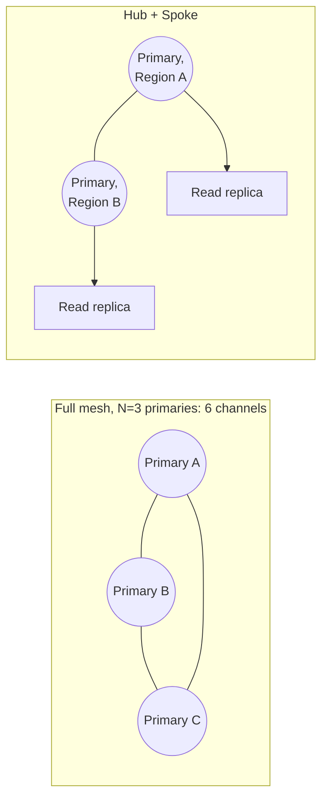

## Objective

O PostgreSQL multi-master (vários nós primários graváveis simultaneamente) troca o problema de failover/quorum por um diferente: em vez de perguntar "como detectamos uma falha e promovemos um substituto", um cluster multi-master pergunta "como deixamos vários nós aceitarem escritas ao mesmo tempo sem que essas escritas entrem em conflito ou disputem uma com a outra". O ganho é uma manutenção e um failover com RTO próximo de zero; o custo é uma complexidade arquitetural que só se paga sob condições específicas.

## Use Cases

- Uma aplicação com latência de escrita real entre continentes (por exemplo, usuários em três continentes todos escrevendo no mesmo banco de dados lógico) em que uma arquitetura de primário único faz cada escrita pagar uma viagem de ida e volta completa até uma região.
- Uma carga de trabalho em que uma única operação lógica emite várias escritas sequenciais, de modo que a latência de rede até um único primário se acumula em vez de ser paga uma única vez.
- Precisar que upgrades de versão principal do PostgreSQL ou manutenção de nó custem próximo de zero downtime, já que um cluster multi-master consegue tirar tráfego de um nó sem nenhuma etapa de promoção.

## Deep Dive

### Três perguntas antes de considerar multi-master

O livro enquadra a adoção como responder a três perguntas, em vez de partir do princípio de que "mais disponibilidade é sempre melhor":

1. Existe distância geográfica significativa entre os nós?
2. A aplicação emite múltiplas transações ou consultas por operação lógica?
3. Usuários/contas são naturalmente regionalizados, de modo que a maioria das escritas para uma dada conta já se origina perto de um nó específico?

Um "não" para as duas primeiras faz do multi-master majoritariamente custo sem o benefício correspondente; o problema de latência que ele resolve ainda não existe.

### Por que a latência de escrita se acumula

Uma escrita para um primário distante paga o tempo de ida e volta completo da rede antes mesmo de a réplica local poder começar a reproduzi-la. Uma única página web pode emitir uma dúzia de consultas; um pedido de crédito pode envolver várias escritas mais polling por resultados. Cada uma dessas paga a ida e volta separadamente, então a *amplificação de tempo* (não só a latência bruta por escrita) é o que torna a arquitetura de primário único dolorosa em escala global. O multi-master elimina isso deixando cada região escrever no seu próprio primário local.

### Overhead de malha: C = N × (N − 1)

A topologia ingênua do multi-master (cada primário conectado diretamente a todo outro primário) tem uma contagem de canais de comunicação que cresce quadraticamente:

```
C = N * (N - 1)
```

Três nós precisam de 6 canais; dez nós precisam de 90. Toda transação no cluster eventualmente precisa ser confirmada por todo outro primário, então isso não é só uma curiosidade de contagem de conexões: é overhead de replicação real que escala pior do que a própria contagem de nós.

### Hub + Spoke como mitigação

Em vez de tornar todo nó novo um peer de malha completo, um modelo Hub + Spoke mantém um pequeno número de primários regionais e adiciona réplicas de leitura comuns localmente para absorver tráfego de leitura. Isso satisfaz demanda regional de leitura crescente sem adicionar à malha primário-a-primário, já que os nós adicionados nunca precisam aceitar escritas eles mesmos.



### RTO quase zero através de switchover mediado por proxy

Como nenhum nó precisa de promoção (todo primário já é gravável), uma camada de proxy consegue redirecionar tráfego de um primário para outro em milissegundos, em vez de passar por uma sequência de detecção-de-falha-depois-promoção. Com dois primários por data center, o proxy também consegue autodetectar um nó fora do ar e rotear apenas para o que está online no mesmo local, de modo que manutenção em um único nó não força um failover entre regiões.

Clusters multi-master também não precisam de um número ímpar de nós nem de um witness, já que nenhum nó é jamais promovido, não há eleição para arbitrar nem o modo de falha comum de split-brain para se proteger com um votante de desempate.

### A corrida de dupla escrita e por que a localidade de dados importa

Vários primários graváveis introduzem uma corrida específica que uma arquitetura de primário único nunca tem: o Nó A aceita uma escrita para uma conta, a mudança ainda não replicou para o Nó B, uma aplicação sem estado reconecta ao Nó B, não vê sua própria escrita, e a resubmete, reproduzindo a mudança uma segunda vez quando B eventualmente se atualiza. Acoplar uma sessão de aplicação a um primário (via sessões sticky, ou particionando geograficamente quais contas escrevem em qual nó) previne isso garantindo que as escritas de um cliente e suas leituras subsequentes atinjam o mesmo nó.

### Livro vs. hoje: o cenário de fornecedores mudou, o formato da resposta não

O livro (2020) deliberadamente não nomeia um produto multi-master específico, chamando-o de "funcionalidade estendida proprietária" genérica. O fornecedor mais provavelmente referido na época era o BDR da 2ndQuadrant; a 2ndQuadrant foi adquirida pela EDB em 2020, e o BDR agora é vendido como **EDB Postgres Distributed (PGD)**, ainda comercial/por assinatura. O que é novo desde o livro é uma alternativa genuinamente open source: o motor multi-master do **pgEdge** (a extensão `Spock`) foi relicenciado sob a licença PostgreSQL comum em setembro de 2025, tornando disponível pela primeira vez uma opção multi-master totalmente open source onde o livro só via opções pagas.

A própria replicação lógica nativa do PostgreSQL também avançou: o PostgreSQL 18 adicionou *detecção* e *log* de conflitos embutidos (`insert_exists`, `update_origin_differs` e tipos de conflito semelhantes, expostos via `pg_stat_subscription_stats`). Isso não muda o enquadramento central do livro, no entanto: detecção não é resolução. Um conflito ainda interrompe a replicação até ser resolvido manualmente (`ALTER SUBSCRIPTION ... SKIP` ou `pg_replication_origin_advance()`); multi-master bidirecional de verdade com resolução automática de conflito ainda exige uma extensão como o PGD ou o Spock, não o PostgreSQL padrão. E a mitigação de dupla escrita do livro (manter as escritas e leituras de uma sessão em um único nó via roteamento sticky/regional) permanece o conselho padrão dos fornecedores de multi-master de hoje, não algo que um truque mais novo de camada de proxy substituiu.

## Trade-offs

- **Multi-master é uma resposta específica a um problema específico de latência, não um upgrade geral sobre a replicação de primário único.** Adotá-lo sem latência entre regiões ou cargas de trabalho com múltiplas escritas por operação (as duas primeiras perguntas guia do livro) adiciona complexidade de proxy, overhead de malha e design de prevenção de conflito sem o benefício correspondente.
- **Hub + Spoke troca localidade de escrita por simplicidade arquitetural.** Réplicas de leitura regionais absorvem tráfego de leitura sem entrar na malha, mas ainda roteiam todas as escritas de volta para o único primário de sua região; o modelo ajuda o overhead de malha, não o problema original de latência de escrita entre regiões para regiões sem seu próprio primário.
- **Sessões sticky/localidade de dados resolvem a corrida de dupla escrita abrindo mão de algo: distribuição equilibrada de carga.** Acoplar uma sessão (ou uma conta) a um primário significa que a capacidade daquele primário, não a capacidade agregada do cluster, limita a velocidade das escritas daquela sessão; o modo de falha oposto de um cluster uniformemente balanceado mas propenso a conflitos.

## Documentation Links

- [Shaun Thomas, "PostgreSQL 12 High Availability Cookbook", 3rd Edition (Packt, 2020), Chapter 1, "Architectural Considerations", recipes "Incorporating multi-master" and "Leveraging multi-master", p. 34-41] - doc
- [PostgreSQL Documentation: Logical Replication](https://www.postgresql.org/docs/current/logical-replication.html) - doc
- [PostgreSQL Documentation: Conflict Detection and Logging in Logical Replication](https://www.postgresql.org/docs/current/logical-replication-conflicts.html) - doc
- [EDB Postgres Distributed (PGD) Documentation](https://www.enterprisedb.com/docs/pgd/latest/) - doc
- [pgEdge: Spock multi-master engine re-licensed to the PostgreSQL License](https://www.pgedge.com/blog/pgedge-goes-open-source) - doc
