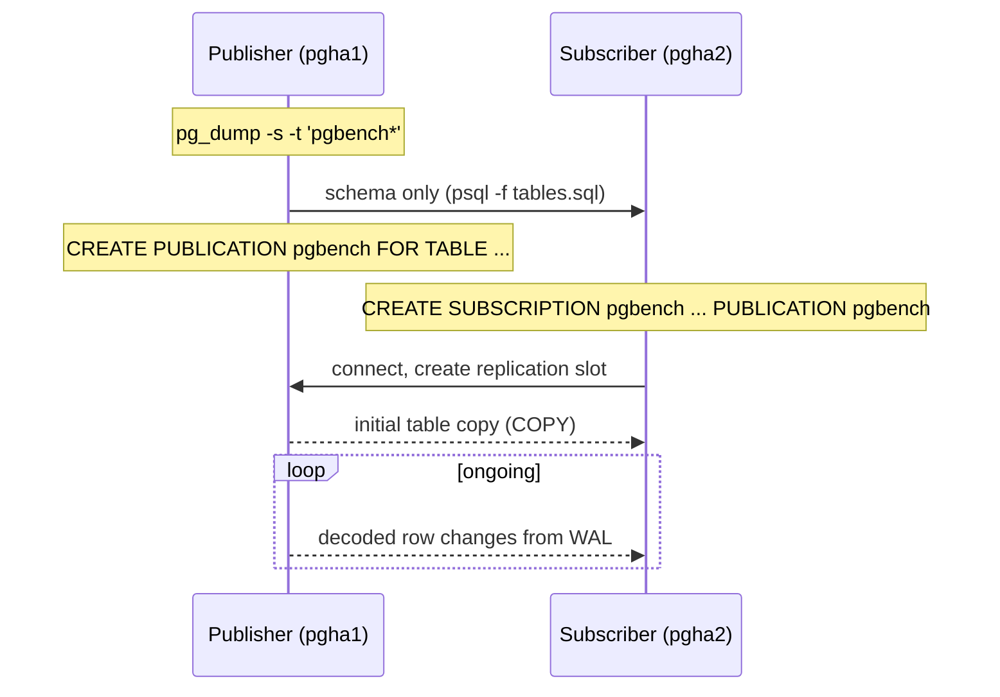

## Objective

Streaming replication copies an entire cluster at the block level: every database,
every table, byte-for-byte, with the replica read-only and pinned to the primary's
exact major version. Native logical replication, added in PostgreSQL 10, works at
the row level instead — the publisher decodes WAL into logical row changes and
ships them to a subscriber that applies them as ordinary INSERT/UPDATE/DELETE
statements. That difference is what lets you replicate four tables instead of a
whole cluster, across major versions, into a database that also holds its own
local tables. And unlike Slony, Bucardo, or pglogical — the third-party tools that
filled this gap before PostgreSQL 10 — there is nothing to install and no node
registry to bootstrap. Publications and subscriptions are native SQL objects in
the system catalog, parsed by PostgreSQL itself and visible to standard tooling.

## Use Cases

- Copying a handful of tables to another server instead of the entire cluster —
  a reporting replica that only needs the fact tables, not the whole database.
- Major-version upgrades with near-zero downtime: replicate from a PostgreSQL 15
  publisher into a PostgreSQL 18 subscriber, let it catch up, then cut traffic
  over. Physical replication cannot cross major versions at all.
- Feeding a data warehouse or analytics database with a curated subset of tables,
  where the target also holds its own derived tables that must not be overwritten.
- Consolidating tables from several source databases into one destination, since
  a subscriber can hold many subscriptions from different publishers.
- Replicating into a writable database — a logical subscriber is a normal,
  read-write server, not a read-only standby.

## Deep Dive



### Bootstrapping the schema by hand

PostgreSQL will not create the destination tables for you. The subscriber must
already have tables with matching names and compatible columns before the
subscription starts, so the first step is a schema-only dump from the publisher:

```bash
pg_dump -s -t 'pgbench*' postgres > /tmp/tables.sql
```

```bash
psql -U rep_user -h pgha2 -f /tmp/tables.sql postgres
```

`-s` (`--schema-only`) is doing the real work here: it emits `CREATE TABLE` and
index definitions with no rows at all. The data arrives later, over the
replication connection, not through this dump. This manual step is not an
oversight in the recipe — it is a permanent property of logical replication,
which replicates row changes and never DDL.

### CREATE PUBLICATION and CREATE SUBSCRIPTION

With empty shells in place, the publisher declares what it offers:

```sql
CREATE PUBLICATION pgbench
   FOR TABLE pgbench_accounts, pgbench_branches,
             pgbench_tellers, pgbench_history;
```

`FOR ALL TABLES` is also valid and would sweep in every current and future table
in the database, but naming tables explicitly keeps the replication set an
intentional decision rather than a side effect of someone running `CREATE TABLE`.

The subscriber then names the publisher and the set it wants:

```sql
CREATE SUBSCRIPTION pgbench
  CONNECTION 'host=pgha1 dbname=postgres user=rep_user'
  PUBLICATION pgbench;
```

There is no node-registration step. With Slony, Bucardo, or pglogical you first
create node records so the tool knows the topology; here PostgreSQL *is* the
node and already keeps those records internally. This single statement creates
the replication slot on the publisher, performs the initial `COPY` of existing
rows, and then switches to streaming decoded changes — all implicitly.

### Verifying the subscription is actually live

The health check runs on the publisher, joining the slot the subscription created
to the walsender feeding it:

```sql
SELECT slot.slot_name, slot.slot_type, slot.active,
       stat.application_name, stat.state, stat.client_addr
  FROM pg_replication_slots slot
  JOIN pg_stat_replication stat ON (stat.pid = slot.active_pid);
```

The join key is `slot.active_pid` — the backend currently holding the slot — matched
against `pg_stat_replication.pid`. A row appearing at all means a walsender is
attached and streaming. PostgreSQL names the slot after the subscription and the
subscriber advertises the same string as `application_name`, so a subscription
called `pgbench` shows up as `pgbench` in both columns. That naming convention is
what makes the query readable when a publisher is feeding several subscribers at
once. An inactive slot (`active = false`, no matching `pg_stat_replication` row) is
the dangerous state: the slot keeps pinning WAL on the publisher while nothing
consumes it, and the publisher's disk fills.

The integration goes further than catalog views. `psql`'s `\d` on a published
table reports the publications it belongs to, directly in the table description —
something an extension-based tool cannot make `psql` do.

### What is not replicated

Three limitations matter in practice, and the last one bites silently:

**DDL never replicates.** Add a column on the publisher and the subscriber does
not learn about it. The documented workaround is ordering: apply additive schema
changes on the subscriber *first*, then on the publisher, so there is no window
where incoming rows reference a column that does not exist yet.

**Sequences do not replicate.** The values stored in `serial` or identity columns
travel as ordinary column data, but the sequence object on the subscriber keeps
its own counter. For a read-only subscriber this is harmless; for a subscriber
that will be promoted — the major-version-upgrade case — the sequences must be
dumped from the origin and applied manually, or the first local insert collides
with a replicated row.

**UPDATE and DELETE require a replica identity.** The book deliberately publishes
`pgbench_history`, which has no primary key, and the failure surfaces only when a
delete is attempted:

```sql
DELETE FROM pgbench_history WHERE aid = 1;
-- ERROR:  cannot delete from table "pgbench_history" because it does not have
-- a replica identity and publishes deletes
```

Inserts work fine, so a keyless table can sit in a publication looking healthy
until the first update or delete arrives. The subscriber has no way to identify
*which* row to change without a unique identifier, so the publisher refuses to
generate the change at all. Either add a primary key or set
`REPLICA IDENTITY FULL` (which ships the entire old row as the identifier — correct
but expensive, and it fails on column types like `point` or `box` that lack a
default B-tree or hash operator class).

## Trade-offs

- **Row-level replication is more flexible than block-level, and strictly more
  expensive.** Physical streaming replication ships WAL bytes and replays them
  without interpretation; logical replication decodes WAL into row changes on the
  publisher and re-executes them as statements on the subscriber, paying CPU on
  both ends and forfeiting the guarantee that the two servers are byte-identical.
  Use it when you need *selectivity* — some tables, across versions, into a
  writable target. When you want a full standby for failover, physical
  replication is the cheaper and safer answer.
- **The manual schema bootstrap is a recurring maintenance cost, not a one-time
  setup step.** Every future `ALTER TABLE` on a published table is a coordinated
  two-server operation. Teams that treat the subscriber as "set up once" discover
  the drift when replication stops with a column-mismatch error.
- **A subscriber being writable is both the feature and the hazard.** Nothing
  prevents an application from writing to a replicated table on the subscriber,
  and the resulting unique-constraint collision stops the apply worker until
  someone intervenes. `ALTER SUBSCRIPTION ... SKIP (lsn = '...')` (PostgreSQL 15+)
  and `disable_on_error = true` exist precisely because this happens.
- **Publishing a keyless table is a deferred failure, not an immediate one.**
  The recipe's `pgbench_history` example is worth internalizing: `CREATE PUBLICATION`
  accepts the table without complaint, the initial copy succeeds, inserts flow —
  and the error only appears the first time someone runs an `UPDATE` or `DELETE`.
  Adding a key to every table before it is ever replicated is cheaper than
  discovering this under load.
- **Book vs. today — sequences: still unreplicated in PostgreSQL 18, finally
  addressed in 19.** The book's "No sequences" warning held for six more years.
  The current (PostgreSQL 18) restrictions page still states that sequence data
  is not replicated. The development branch for PostgreSQL 19 adds
  `CREATE PUBLICATION all_sequences FOR ALL SEQUENCES;` plus
  `ALTER SUBSCRIPTION ... REFRESH SEQUENCES`, and even there the semantics are
  synchronization rather than continuous streaming — the devel docs say
  "incremental sequence changes are not replicated" and the subscriber "retains
  the last value it synchronized from the publisher." So the manual dump-and-import
  the book prescribes for major-version upgrades remains the correct advice on
  every released version today.
- **Book vs. today — conflicts are now detected and logged, but still never
  resolved automatically.** PostgreSQL 18 added structured conflict logging during
  apply, with named conflict types (`insert_exists`, `update_exists`,
  `multiple_unique_conflicts`, `update_origin_differs`, `delete_origin_differs`,
  `update_missing`, `delete_missing`) and counters exposed in new
  `pg_stat_subscription_stats` columns. `track_commit_timestamp` must be enabled
  for the origin-based types. This makes bidirectional and multi-writer setups
  *diagnosable* in a way they were not in 2020 — but the documentation is explicit
  that conflicts producing errors stop replication and require manual intervention.
  There is no last-write-wins resolver in core PostgreSQL.
- **Book vs. today — the publication side gained real filtering.** In 2020 a
  publication was a list of whole tables. PostgreSQL 15 added row filters
  (`FOR TABLE t WHERE (region = 'EU')`), column lists (`FOR TABLE t (id, name)`),
  and `FOR TABLES IN SCHEMA`, which turns the book's explicit-list-versus-`FOR ALL
  TABLES` choice into a middle option that auto-includes future tables in one
  schema only.
- **Book vs. today — the initial copy no longer has to be a copy.**
  `pg_createsubscriber` (PostgreSQL 17) converts an existing *physical* standby
  into a logical subscriber, creating the publication and subscription and
  skipping the initial `COPY` entirely. For a large database that is the
  difference between hours of initial sync and minutes, and it is now the
  preferred path for the major-version-upgrade use case.
- **Book vs. today — the recipe's health-check query is still correct.**
  `pg_replication_slots` joined to `pg_stat_replication` on `active_pid = pid`
  works unchanged on PostgreSQL 18. Worth pairing it with `pg_stat_subscription`
  on the subscriber side, which reports apply lag directly rather than requiring
  it to be inferred from the publisher.

## Documentation Links

- [Shaun Thomas, "PostgreSQL 12 High Availability Cookbook", 3rd Edition (Packt, 2020) — Chapter 7, "PostgreSQL Replication", recipe "Copying a few tables with native logical replication", p. 332-336](https://www.packtpub.com/en-us/product/postgresql-12-high-availability-cookbook-9781838984854) — doc
- [PostgreSQL Documentation — Logical Replication](https://www.postgresql.org/docs/current/logical-replication.html) — doc
- [PostgreSQL Documentation — Logical Replication Restrictions](https://www.postgresql.org/docs/current/logical-replication-restrictions.html) — doc
- [PostgreSQL Documentation — Conflicts in Logical Replication](https://www.postgresql.org/docs/current/logical-replication-conflicts.html) — doc
- [PostgreSQL Documentation — CREATE PUBLICATION](https://www.postgresql.org/docs/current/sql-createpublication.html) — doc
- [PostgreSQL Documentation — CREATE SUBSCRIPTION](https://www.postgresql.org/docs/current/sql-createsubscription.html) — doc
- [PostgreSQL Documentation — pg_createsubscriber](https://www.postgresql.org/docs/current/app-pgcreatesubscriber.html) — doc
