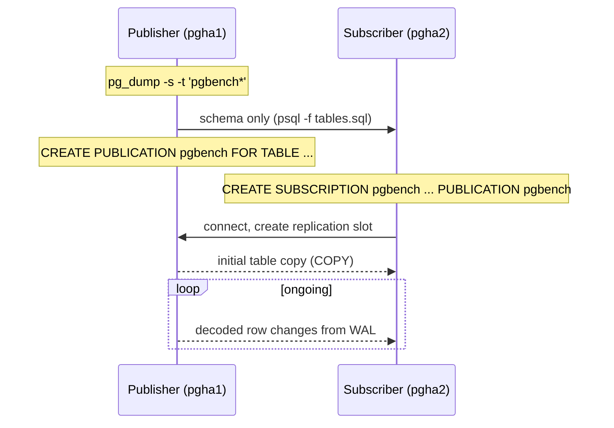

## Objective

A replicação por streaming copia um cluster inteiro em nível de bloco: todo banco de dados, toda tabela, byte a byte, com a réplica somente leitura e presa à versão principal exata do primário. A replicação lógica nativa, adicionada no PostgreSQL 10, funciona em nível de linha em vez disso: o publicador decodifica o WAL em mudanças de linha lógicas e as envia para um subscriber que as aplica como instruções INSERT/UPDATE/DELETE comuns. Essa diferença é o que permite replicar quatro tabelas em vez de um cluster inteiro, entre versões principais, para dentro de um banco de dados que também guarda suas próprias tabelas locais. E, diferente de Slony, Bucardo ou pglogical (as ferramentas de terceiros que preenchiam essa lacuna antes do PostgreSQL 10), não há nada para instalar nem registro de nós para inicializar. Publications e subscriptions são objetos SQL nativos no catálogo do sistema, interpretados pelo próprio PostgreSQL e visíveis a ferramentas padrão.

## Use Cases

- Copiar um punhado de tabelas para outro servidor em vez do cluster inteiro: uma réplica de relatórios que só precisa das tabelas de fato, não do banco de dados inteiro.
- Upgrades de versão principal com downtime quase zero: replicar de um publicador PostgreSQL 15 para um subscriber PostgreSQL 18, deixá-lo se atualizar, depois virar o tráfego. A replicação física não consegue atravessar versões principais de jeito nenhum.
- Alimentar um data warehouse ou banco de dados de análise com um subconjunto curado de tabelas, onde o destino também guarda suas próprias tabelas derivadas que não podem ser sobrescritas.
- Consolidar tabelas de vários bancos de dados de origem em um único destino, já que um subscriber pode ter várias subscriptions de publicadores diferentes.
- Replicar para um banco de dados gravável: um subscriber lógico é um servidor normal, leitura e escrita, não um standby somente leitura.

## Deep Dive



### Inicializando o schema na mão

O PostgreSQL não vai criar as tabelas de destino para você. O subscriber precisa já ter tabelas com nomes correspondentes e colunas compatíveis antes de a subscription começar, então o primeiro passo é um dump somente de schema a partir do publicador:

```bash
pg_dump -s -t 'pgbench*' postgres > /tmp/tables.sql
```

```bash
psql -U rep_user -h pgha2 -f /tmp/tables.sql postgres
```

`-s` (`--schema-only`) é quem faz o trabalho de verdade aqui: ele emite definições de `CREATE TABLE` e índice sem nenhuma linha de dado. Os dados chegam depois, pela conexão de replicação, não por esse dump. Esse passo manual não é uma falha da receita; é uma propriedade permanente da replicação lógica, que replica mudanças de linha e nunca DDL.

### CREATE PUBLICATION e CREATE SUBSCRIPTION

Com as tabelas vazias no lugar, o publicador declara o que oferece:

```sql
CREATE PUBLICATION pgbench
   FOR TABLE pgbench_accounts, pgbench_branches,
             pgbench_tellers, pgbench_history;
```

`FOR ALL TABLES` também é válido e varreria toda tabela atual e futura no banco de dados, mas nomear tabelas explicitamente mantém o conjunto de replicação como uma decisão intencional em vez de um efeito colateral de alguém rodar `CREATE TABLE`.

O subscriber então nomeia o publicador e o conjunto que quer:

```sql
CREATE SUBSCRIPTION pgbench
  CONNECTION 'host=pgha1 dbname=postgres user=rep_user'
  PUBLICATION pgbench;
```

Não há passo de registro de nó. Com Slony, Bucardo ou pglogical você primeiro cria registros de nó para que a ferramenta saiba a topologia; aqui o PostgreSQL *é* o nó e já guarda esses registros internamente. Essa única instrução cria o replication slot no publicador, realiza o `COPY` inicial das linhas existentes e depois muda para fazer streaming das mudanças decodificadas, tudo implicitamente.

### Verificando se a subscription está de fato ativa

A checagem de saúde roda no publicador, unindo o slot que a subscription criou ao walsender que o alimenta:

```sql
SELECT slot.slot_name, slot.slot_type, slot.active,
       stat.application_name, stat.state, stat.client_addr
  FROM pg_replication_slots slot
  JOIN pg_stat_replication stat ON (stat.pid = slot.active_pid);
```

A chave de junção é `slot.active_pid` (o backend atualmente segurando o slot), casado contra `pg_stat_replication.pid`. Alguma linha aparecendo já significa que um walsender está conectado e fazendo streaming. O PostgreSQL nomeia o slot a partir da subscription e o subscriber anuncia a mesma string como `application_name`, então uma subscription chamada `pgbench` aparece como `pgbench` nas duas colunas. Essa convenção de nomes é o que torna a consulta legível quando um publicador está alimentando vários subscribers ao mesmo tempo. Um slot inativo (`active = false`, nenhuma linha correspondente em `pg_stat_replication`) é o estado perigoso: o slot continua prendendo WAL no publicador enquanto nada o consome, e o disco do publicador enche.

A integração vai além das views de catálogo. O `\d` do `psql` em uma tabela publicada reporta as publications às quais ela pertence, diretamente na descrição da tabela; algo que uma ferramenta baseada em extensão não consegue fazer o `psql` fazer.

### O que não é replicado

Três limitações importam na prática, e a última morde silenciosamente:

**DDL nunca replica.** Adicione uma coluna no publicador e o subscriber não fica sabendo. O workaround documentado é ordem: aplicar mudanças aditivas de schema no subscriber *primeiro*, depois no publicador, para que não exista uma janela em que linhas chegando referenciem uma coluna que ainda não existe.

**Sequences não replicam.** Os valores guardados em colunas `serial` ou de identidade viajam como dado de coluna comum, mas o objeto sequence no subscriber mantém seu próprio contador. Para um subscriber somente leitura isso é inofensivo; para um subscriber que será promovido (o caso de upgrade de versão principal), as sequences precisam ser extraídas da origem e aplicadas manualmente, ou o primeiro insert local colide com uma linha replicada.

**UPDATE e DELETE exigem uma replica identity.** O livro deliberadamente publica `pgbench_history`, que não tem chave primária, e a falha só aparece quando um delete é tentado:

```sql
DELETE FROM pgbench_history WHERE aid = 1;
-- ERROR:  cannot delete from table "pgbench_history" because it does not have
-- a replica identity and publishes deletes
```

Inserts funcionam bem, então uma tabela sem chave pode ficar em uma publication parecendo saudável até que a primeira atualização ou exclusão chegue. O subscriber não tem como identificar *qual* linha mudar sem um identificador único, então o publicador simplesmente se recusa a gerar a mudança. Ou adicione uma chave primária, ou defina `REPLICA IDENTITY FULL` (que envia a linha antiga inteira como identificador; correto, mas caro, e falha em tipos de coluna como `point` ou `box` que não têm uma classe de operador B-tree ou hash padrão).

## Trade-offs

- **Replicação em nível de linha é mais flexível do que em nível de bloco, e estritamente mais cara.** A replicação por streaming física envia bytes de WAL e os reproduz sem interpretação; a replicação lógica decodifica o WAL em mudanças de linha no publicador e as reexecuta como instruções no subscriber, pagando CPU nos dois lados e abrindo mão da garantia de que os dois servidores são idênticos byte a byte. Use-a quando precisar de *seletividade*: algumas tabelas, entre versões, para dentro de um destino gravável. Quando você quer um standby completo para failover, a replicação física é a resposta mais barata e mais segura.
- **A inicialização manual do schema é um custo de manutenção recorrente, não um passo único de configuração.** Todo `ALTER TABLE` futuro em uma tabela publicada é uma operação coordenada em dois servidores. Equipes que tratam o subscriber como "configurado uma vez" descobrem o desvio quando a replicação para com um erro de coluna incompatível.
- **Um subscriber ser gravável é ao mesmo tempo o recurso e o risco.** Nada impede que uma aplicação escreva em uma tabela replicada no subscriber, e a colisão de constraint única resultante para o worker de apply até que alguém intervenha. `ALTER SUBSCRIPTION ... SKIP (lsn = '...')` (PostgreSQL 15+) e `disable_on_error = true` existem exatamente porque isso acontece.
- **Publicar uma tabela sem chave é uma falha adiada, não imediata.** O exemplo `pgbench_history` da receita vale a pena internalizar: `CREATE PUBLICATION` aceita a tabela sem reclamar, a cópia inicial é bem-sucedida, inserts fluem, e o erro só aparece na primeira vez que alguém rodar um `UPDATE` ou `DELETE`. Adicionar uma chave a toda tabela antes de ela ser replicada é mais barato do que descobrir isso sob carga.
- **Livro vs. hoje, sequences: ainda não replicadas no PostgreSQL 18, finalmente endereçadas na 19.** O aviso de "sem sequences" do livro se sustentou por mais seis anos. A página atual de restrições (PostgreSQL 18) ainda afirma que dados de sequence não são replicados. O branch de desenvolvimento para o PostgreSQL 19 adiciona `CREATE PUBLICATION all_sequences FOR ALL SEQUENCES;` mais `ALTER SUBSCRIPTION ... REFRESH SEQUENCES`, e mesmo lá a semântica é de sincronização, não streaming contínuo: a documentação de desenvolvimento diz que "mudanças incrementais de sequence não são replicadas" e o subscriber "retém o último valor que sincronizou do publicador". Então o dump-e-import manual que o livro prescreve para upgrades de versão principal continua sendo o conselho correto em toda versão lançada hoje.
- **Livro vs. hoje, conflitos: agora são detectados e logados, mas ainda nunca resolvidos automaticamente.** O PostgreSQL 18 adicionou log estruturado de conflitos durante o apply, com tipos de conflito nomeados (`insert_exists`, `update_exists`, `multiple_unique_conflicts`, `update_origin_differs`, `delete_origin_differs`, `update_missing`, `delete_missing`) e contadores expostos em novas colunas de `pg_stat_subscription_stats`. `track_commit_timestamp` precisa estar habilitado para os tipos baseados em origem. Isso torna configurações bidirecionais e multi-writer *diagnosticáveis* de um jeito que não eram em 2020, mas a documentação é explícita que conflitos que produzem erros interrompem a replicação e exigem intervenção manual. Não existe um resolvedor last-write-wins no núcleo do PostgreSQL.
- **Livro vs. hoje, o lado da publication ganhou filtragem de verdade.** Em 2020 uma publication era uma lista de tabelas inteiras. O PostgreSQL 15 adicionou filtros de linha (`FOR TABLE t WHERE (region = 'EU')`), listas de coluna (`FOR TABLE t (id, name)`) e `FOR TABLES IN SCHEMA`, o que transforma a escolha do livro entre lista explícita versus `FOR ALL TABLES` em uma opção intermediária que inclui automaticamente tabelas futuras de apenas um schema.
- **Livro vs. hoje, a cópia inicial não precisa mais ser uma cópia.** O `pg_createsubscriber` (PostgreSQL 17) converte um standby *físico* já existente em um subscriber lógico, criando a publication e a subscription e pulando o `COPY` inicial por completo. Para um banco de dados grande, essa é a diferença entre horas de sincronização inicial e minutos, e agora é o caminho preferido para o caso de uso de upgrade de versão principal.
- **Livro vs. hoje, a consulta de verificação de saúde da receita ainda está correta.** `pg_replication_slots` unida a `pg_stat_replication` por `active_pid = pid` funciona sem mudanças no PostgreSQL 18. Vale a pena combiná-la com `pg_stat_subscription` no lado do subscriber, que reporta o lag de apply diretamente em vez de exigir que seja inferido a partir do publicador.

## Documentation Links

- [Shaun Thomas, "PostgreSQL 12 High Availability Cookbook", 3rd Edition (Packt, 2020), Chapter 7, "PostgreSQL Replication", recipe "Copying a few tables with native logical replication", p. 332-336](https://www.packtpub.com/en-us/product/postgresql-12-high-availability-cookbook-9781838984854) - doc
- [PostgreSQL Documentation: Logical Replication](https://www.postgresql.org/docs/current/logical-replication.html) - doc
- [PostgreSQL Documentation: Logical Replication Restrictions](https://www.postgresql.org/docs/current/logical-replication-restrictions.html) - doc
- [PostgreSQL Documentation: Conflicts in Logical Replication](https://www.postgresql.org/docs/current/logical-replication-conflicts.html) - doc
- [PostgreSQL Documentation: CREATE PUBLICATION](https://www.postgresql.org/docs/current/sql-createpublication.html) - doc
- [PostgreSQL Documentation: CREATE SUBSCRIPTION](https://www.postgresql.org/docs/current/sql-createsubscription.html) - doc
- [PostgreSQL Documentation: pg_createsubscriber](https://www.postgresql.org/docs/current/app-pgcreatesubscriber.html) - doc
