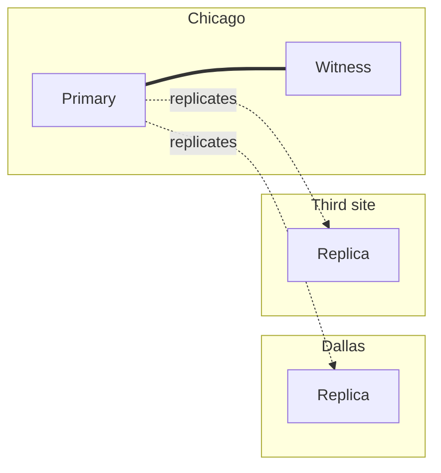

## Objective

Understand how to derive how many PostgreSQL nodes a highly available cluster needs — backup, replica(s), and an optional witness for automated failover — and where to place them across data centers, following directly from the RPO/RTO targets covered in `postgresql-rpo-rto-planning`.

## Use Cases

- Justifying node count to stakeholders as a direct consequence of already-agreed requirements (automated failover, multi-datacenter latency) rather than an arbitrary infrastructure line item.
- Sizing a cluster for a company with two data centers and no automated-failover requirement differently from a financial institution running three active data centers at all times — the same guidelines produce very different node counts.
- Explaining why automated failover needs an *odd* number of voting nodes, and why a witness (a lightweight voter, not a full replica) is often enough to make that count odd without paying for another full database node.
- Choosing where to place a backup server, and why "same location as the primary" defeats the purpose of having a backup at all.

## Deep Dive

### Deriving node count from a checklist, not a guess

Given a primary node, the book's guidelines add nodes for specific, named reasons rather than picking a round number:

1. Always add one separate server for backups.
2. Always allocate one server for a logical or physical replica.
3. For automated failover, add either a small witness node (a voter only) *or* a fully qualified replica.
4. For every active data center beyond the first two, allocate one replica.
5. If non-local access latency matters, add a replica in the primary location (or in each location, for symmetric clusters with no single primary site).

Backups and replicas answer different failure modes and aren't interchangeable: a replica is generally writable in under a minute, while restoring from backup takes materially longer — so "we have backups" is not the same guarantee as "we have a replica."

### Why automated failover needs an odd node count

A single replica only covers *manual* failover — a human decides to switch. Fully automated failure detection needs a way to avoid two nodes each independently deciding they're the new primary (split brain), and the mechanism for that is voting: an odd number of nodes avoids ties. The third node in a minimal automated-failover setup doesn't have to be a full PostgreSQL replica — it can be a lightweight witness whose only job is to vote, which gets the cluster to an odd count without doubling the cost of a full database node.

### Two worked examples: minimal vs. always-on multi-region

**Company A** — two data centers, no automated failover requirement, no multi-datacenter latency concern: two PostgreSQL servers plus a backup system, three nodes total.

**Company B** — a financial institution requiring all three data centers active at all times: one primary, two replicas per data center, a witness node, and a backup server — eight PostgreSQL-related nodes total. The same five guidelines produce very different answers because the *inputs* (RPO/RTO, number of active data centers, latency tolerance) differ; the guidelines themselves don't change.

### Placing nodes across locations

Node count answers "how many"; a separate set of guidelines answers "where":

1. If data must survive a full site outage, use at least one additional location.
2. Always place the backup in a location separate from the primary — a backup living next to the primary it protects defeats the purpose the moment that location fails.
3. If two locations are in the same general geographical area, add one at least 100 miles (160 km) away — regional outages (power, connectivity) can take out nearby sites together.
4. If automated failover is desirable, use at least three data centers.
5. Place one PostgreSQL server (or witness) in each location, then continue distributing evenly until the node count is exhausted.
6. Place the witness where it's least likely to lose contact with more than one location simultaneously — a witness that shares a failure domain with one of the two "real" sites can't reliably break ties between them.

### Working through a placement example

Starting from a naive design — six PostgreSQL nodes, one witness, and a backup, all in a single Chicago data center — every guideline above is violated at once: a single site failure takes out the entire cluster, backup included. Applying the guidelines incrementally: move the backup to a second location (Dallas) first, since it's the cheapest fix and protects the most important asset; then move at least one PostgreSQL replica there too, so the cluster survives losing Chicago entirely; then, because three data centers are now in play, automated failover becomes viable. The witness stays in the *second* Chicago location rather than moving to Dallas — if Chicago becomes isolated from Dallas, the witness needs to remain reachable from whichever side keeps the most infrastructure, and colocating it with the majority of nodes (Chicago) rather than the minority (Dallas) keeps its vote meaningful for the more common case. The end state, for a large institution with several data centers available, evenly distributes nodes across three geographically diverse sites rather than leaving the imbalance from the first two moves in place.

### Book vs. today: the manual witness has a modern, off-the-shelf equivalent

The book (2020) treats the witness node as something the architecture deliberately designs in — a specific extra server, placed by hand following the guidelines above. PostgreSQL itself still ships no built-in automated failover or witness concept today; `synchronous_standby_names` (quorum commit via `ANY n (...)`, covered in `postgresql-rpo-rto-planning`) remains a replication primitive, not a failover system. What has changed is the tooling layered on top: **Patroni**, now the de facto standard for automated PostgreSQL failover, delegates leader election and split-brain prevention to a Distributed Configuration Store (etcd, Consul, or ZooKeeper) rather than a single hand-placed witness node. The DCS cluster brings its own quorum requirement — typically three DCS members using Raft consensus — which fulfills the same "odd number of voters" role the book's witness node played, but as a managed, off-the-shelf component instead of a bespoke one. The underlying reasoning (odd voter count, geographic placement that avoids correlated failure) is identical; what moved is *where* that logic lives.

## Trade-offs

- **A witness node isn't free, even though it's cheap** — it adds a location and a moving part purely for voting; a two-data-center setup that never needs automated failover has no reason to add one, per guideline 3.
- **More replicas for latency isn't the same investment as more replicas for durability** — guideline 5 (extra replica to avoid maintenance-induced latency) and guideline 3 (extra node for failover voting) both add nodes, but solve different problems; conflating them leads to either under-provisioning latency headroom or over-provisioning voters.
- **Even node distribution is a tie-breaker, not the primary goal** — the book's worked example explicitly revises an already-functional three-datacenter layout to be more evenly distributed as a final refinement step, after the load-bearing decisions (backup location, replica count, witness placement) were already made correctly.
- **A witness sharing a failure domain with one "real" site silently weakens the whole quorum** — if the witness loses contact with the same site an actual failure would isolate, its vote stops being independent exactly when it's needed most; witness placement has to be reasoned about in terms of *correlated* failures, not just physical distance.

## Documentation Links

- [PostgreSQL 12 High Availability Cookbook, 3rd Edition (Packt, 2020) — Chapter 1: "Architectural Considerations", recipes "Picking redundant copies" and "Selecting locations", p. 15-21](https://www.packtpub.com/en-us/product/postgresql-12-high-availability-cookbook-9781838984854) — doc
- [PostgreSQL Documentation — Synchronous Replication](https://www.postgresql.org/docs/current/runtime-config-replication.html) — doc
- [PostgreSQL Documentation — High Availability, Load Balancing, and Replication](https://www.postgresql.org/docs/current/warm-standby.html) — doc
- [Patroni Documentation — Architecture and DCS-based quorum](https://patroni.readthedocs.io/en/latest/) — doc
