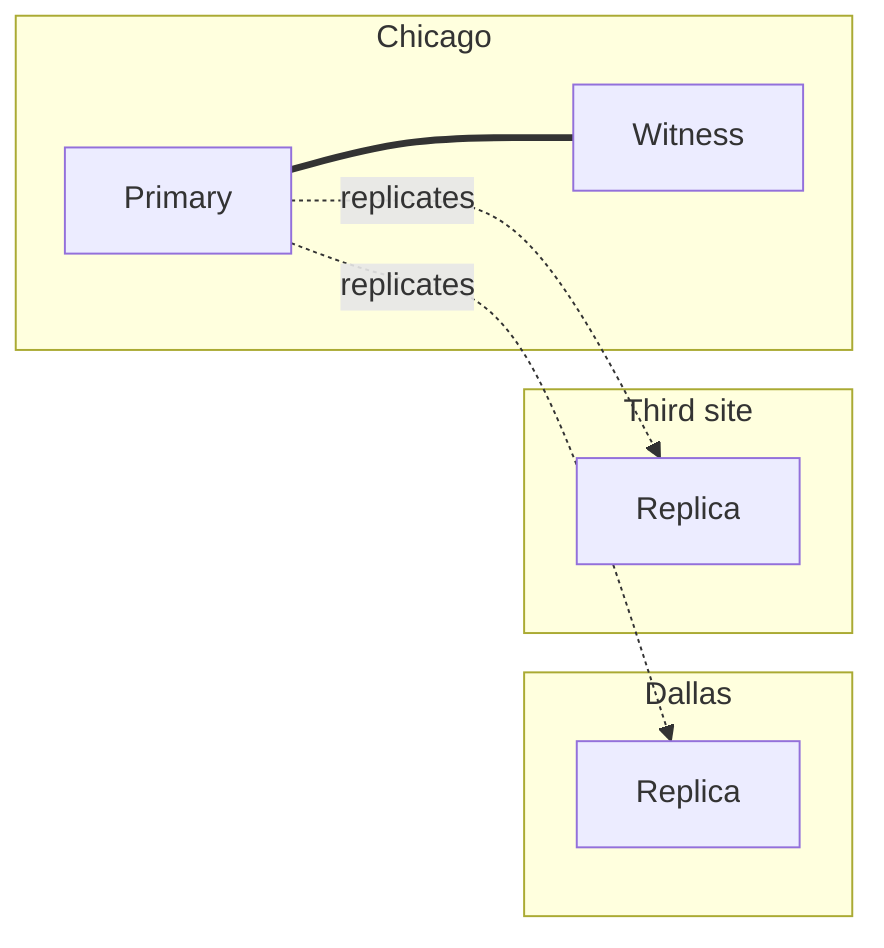

## Objective

Entender como derivar quantos nós PostgreSQL um cluster de alta disponibilidade precisa (backup, réplica(s) e um witness opcional para failover automatizado) e onde posicioná-los entre data centers, decorrendo diretamente das metas de RPO/RTO cobertas em `postgresql-rpo-rto-planning`.

## Use Cases

- Justificar a contagem de nós para stakeholders como uma consequência direta de requisitos já acordados (failover automatizado, latência entre múltiplos data centers) em vez de um item arbitrário de infraestrutura.
- Dimensionar um cluster para uma empresa com dois data centers e nenhum requisito de failover automatizado de forma diferente de uma instituição financeira rodando três data centers ativos o tempo todo: as mesmas diretrizes produzem contagens de nós bem diferentes.
- Explicar por que failover automatizado precisa de um número *ímpar* de nós votantes, e por que um witness (um votante leve, não uma réplica completa) costuma bastar para tornar essa contagem ímpar sem pagar por outro nó de banco de dados completo.
- Escolher onde posicionar um servidor de backup, e por que "o mesmo local do primário" anula o propósito de ter um backup.

## Deep Dive

### Derivando a contagem de nós de uma checklist, não de um chute

Dado um nó primário, as diretrizes do livro adicionam nós por razões específicas e nomeadas, em vez de escolher um número redondo:

1. Sempre adicione um servidor separado para backups.
2. Sempre destine um servidor para uma réplica lógica ou física.
3. Para failover automatizado, adicione um nó witness pequeno (só um votante) *ou* uma réplica plenamente qualificada.
4. Para cada data center ativo além dos dois primeiros, destine uma réplica.
5. Se a latência de acesso não local importa, adicione uma réplica no local do primário (ou em cada local, para clusters simétricos sem um único site primário).

Backups e réplicas respondem a modos de falha diferentes e não são intercambiáveis: uma réplica geralmente é gravável em menos de um minuto, enquanto restaurar de backup leva materialmente mais tempo, então "temos backups" não é a mesma garantia que "temos uma réplica".

### Por que failover automatizado precisa de uma contagem ímpar de nós

Uma única réplica só cobre failover *manual*: um humano decide fazer a troca. Detecção de falha totalmente automatizada precisa de uma forma de evitar que dois nós decidam independentemente que são o novo primário (split brain), e o mecanismo para isso é votação: um número ímpar de nós evita empates. O terceiro nó em uma configuração mínima de failover automatizado não precisa ser uma réplica completa do PostgreSQL; pode ser um witness leve cujo único trabalho é votar, o que leva o cluster a uma contagem ímpar sem dobrar o custo de um nó de banco de dados completo.

### Dois exemplos resolvidos: mínimo vs. multirregião sempre ativo

**Empresa A**: dois data centers, sem requisito de failover automatizado, sem preocupação de latência entre múltiplos data centers: dois servidores PostgreSQL mais um sistema de backup, três nós no total.

**Empresa B**: uma instituição financeira exigindo que os três data centers fiquem ativos o tempo todo: um primário, duas réplicas por data center, um nó witness e um servidor de backup, oito nós relacionados a PostgreSQL no total. As mesmas cinco diretrizes produzem respostas bem diferentes porque as *entradas* (RPO/RTO, número de data centers ativos, tolerância à latência) diferem; as próprias diretrizes não mudam.

### Posicionando nós entre localizações

A contagem de nós responde "quantos"; um conjunto separado de diretrizes responde "onde":

1. Se os dados precisam sobreviver a uma queda completa de site, use pelo menos uma localização adicional.
2. Sempre posicione o backup em uma localização separada do primário: um backup morando ao lado do primário que ele protege anula o propósito no instante em que aquele local falha.
3. Se duas localizações estão na mesma área geográfica geral, adicione uma a pelo menos 160 km (100 milhas) de distância: quedas regionais (energia, conectividade) podem derrubar sites próximos juntos.
4. Se failover automatizado é desejável, use pelo menos três data centers.
5. Posicione um servidor PostgreSQL (ou witness) em cada localização, depois continue distribuindo igualmente até esgotar a contagem de nós.
6. Posicione o witness onde é menos provável que perca contato com mais de uma localização simultaneamente: um witness que compartilha um domínio de falha com um dos dois sites "reais" não consegue desempatar de forma confiável entre eles.

### Trabalhando um exemplo de posicionamento

Partindo de um design ingênuo (seis nós PostgreSQL, um witness e um backup, todos em um único data center em Chicago), toda diretriz acima é violada de uma vez: uma falha de site único derruba o cluster inteiro, backup incluso. Aplicando as diretrizes incrementalmente: mova o backup para uma segunda localização (Dallas) primeiro, já que é o conserto mais barato e protege o ativo mais importante; depois mova pelo menos uma réplica PostgreSQL para lá também, para que o cluster sobreviva a perder Chicago por completo; então, porque agora três data centers estão em jogo, o failover automatizado se torna viável. O witness fica na *segunda* localização de Chicago em vez de se mudar para Dallas: se Chicago ficar isolado de Dallas, o witness precisa continuar acessível a partir de qualquer lado que retenha a maior parte da infraestrutura, e colocá-lo junto à maioria dos nós (Chicago) em vez da minoria (Dallas) mantém seu voto significativo para o caso mais comum. O estado final, para uma instituição grande com vários data centers disponíveis, distribui os nós igualmente entre três sites geograficamente diversos em vez de deixar o desequilíbrio dos dois primeiros movimentos como está.

### Livro vs. hoje: o witness manual tem um equivalente moderno de prateleira

O livro (2020) trata o nó witness como algo que a arquitetura deliberadamente projeta: um servidor extra específico, posicionado à mão seguindo as diretrizes acima. O próprio PostgreSQL ainda não vem com failover automatizado ou conceito de witness embutido hoje; `synchronous_standby_names` (quorum commit via `ANY n (...)`, coberto em `postgresql-rpo-rto-planning`) continua sendo uma primitiva de replicação, não um sistema de failover. O que mudou é o ferramental por cima: o **Patroni**, agora o padrão de fato para failover automatizado do PostgreSQL, delega a eleição de líder e a prevenção de split-brain a um Distributed Configuration Store (etcd, Consul ou ZooKeeper) em vez de um único nó witness posicionado à mão. O cluster de DCS traz seu próprio requisito de quorum (tipicamente três membros de DCS usando consenso Raft), que cumpre o mesmo papel de "número ímpar de votantes" que o nó witness do livro desempenhava, mas como um componente gerenciado e de prateleira em vez de um sob medida. O raciocínio de base (contagem ímpar de votantes, posicionamento geográfico que evita falha correlacionada) é idêntico; o que mudou foi *onde* essa lógica mora.

## Trade-offs

- **Um nó witness não é de graça, mesmo sendo barato**: ele adiciona uma localização e uma peça móvel puramente para votação; uma configuração de dois data centers que nunca precisa de failover automatizado não tem motivo para adicionar um, conforme a diretriz 3.
- **Mais réplicas para latência não é o mesmo investimento que mais réplicas para durabilidade**: a diretriz 5 (réplica extra para evitar latência induzida por manutenção) e a diretriz 3 (nó extra para votação de failover) ambas adicionam nós, mas resolvem problemas diferentes; confundi-las leva a subprovisionar margem de latência ou a superprovisionar votantes.
- **Distribuição uniforme de nós é um critério de desempate, não o objetivo principal**: o exemplo resolvido do livro explicitamente revisa um layout de três data centers já funcional para ficar mais uniformemente distribuído como um passo final de refinamento, depois que as decisões estruturais (localização do backup, contagem de réplicas, posicionamento do witness) já haviam sido tomadas corretamente.
- **Um witness compartilhando um domínio de falha com um site "real" enfraquece silenciosamente o quorum inteiro**: se o witness perde contato com o mesmo site que uma falha real isolaria, seu voto para de ser independente exatamente quando mais é necessário; o posicionamento do witness precisa ser raciocinado em termos de falhas *correlacionadas*, não só distância física.

## Documentation Links

- [PostgreSQL 12 High Availability Cookbook, 3rd Edition (Packt, 2020), Chapter 1: "Architectural Considerations", recipes "Picking redundant copies" and "Selecting locations", p. 15-21](https://www.packtpub.com/en-us/product/postgresql-12-high-availability-cookbook-9781838984854) - doc
- [PostgreSQL Documentation: Synchronous Replication](https://www.postgresql.org/docs/current/runtime-config-replication.html) - doc
- [PostgreSQL Documentation: High Availability, Load Balancing, and Replication](https://www.postgresql.org/docs/current/warm-standby.html) - doc
- [Patroni Documentation: Architecture and DCS-based quorum](https://patroni.readthedocs.io/en/latest/) - doc
