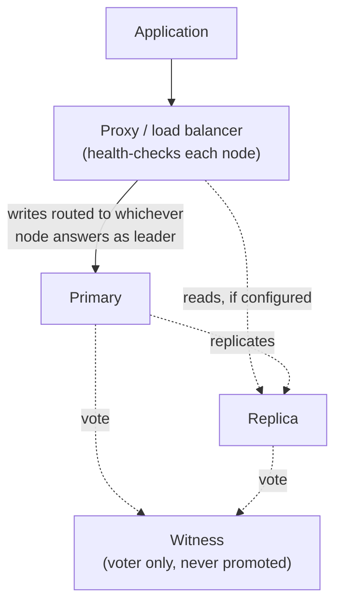

## Objective

Dois mecanismos trabalham juntos para tornar o failover do PostgreSQL seguro e invisível para as aplicações: a votação por quorum decide, sem ambiguidade, qual nó se torna o novo primário depois de uma falha; a indireção de conexão garante que o tráfego da aplicação encontre esse novo primário sem nenhuma reconfiguração do lado do cliente. Nenhum dos dois sozinho é suficiente: um cluster que consegue eleger um novo primário mas ainda tem toda aplicação com o hostname do nó antigo fixado no código não alcançou alta disponibilidade.

## Use Cases

- Dimensionar e converter nós para que um cluster de failover automatizado sempre tenha um número ímpar de votantes, sem pagar por uma réplica de banco de dados completa extra só para desempatar.
- Decidir onde um nó witness deve morar para que uma partição de rede entre dois data centers não possa causar uma promoção indesejada no lado errado.
- Escolher um mecanismo de indireção (DNS, IP virtual, multiplexador de conexão ou load balancer) para que trocar o primário ativo não exija mexer na configuração de toda aplicação.
- Explicar a uma equipe por que conexões diretas de aplicação para o hostname do banco de dados são um risco operacional no instante em que a automação de failover é introduzida.

## Deep Dive

### Alcançando uma contagem ímpar de votantes

Failover automatizado precisa de uma forma de evitar um voto empatado quando o primário desaparece. A diretriz é simples de aplicar em cima de qualquer contagem de nós que um cluster já tenha:

1. Se a contagem inicial de nós é par, adicione um nó witness dedicado: um votante apenas, nunca um candidato a promoção.
2. Se a contagem inicial de nós é ímpar, converta uma réplica existente em witness em vez de adicionar um nó novo.
3. Em um layout de dois data centers, mantenha o witness no mesmo data center do primário: isso é o que impede que uma partição de rede deixe o site secundário isolado promover incorretamente uma de suas próprias réplicas, já que o lado do primário mantém a maioria dos votos.
4. Com três ou mais localizações disponíveis, posicione o witness em uma terceira localização independente, para que não fique atrelado a nenhum dos dois sites "reais".

### Por que o witness não pode votar em si mesmo

Um witness nunca vota em si mesmo, então ele sempre desempata a favor de qualquer réplica que de fato seja elegível para promoção. Em um cluster de 3 nós (primário, réplica, witness), se o primário falha, o witness tem exatamente um nó para votar (a réplica), garantindo uma maioria. Se o witness fosse uma réplica comum, ele poderia votar em si mesmo e produzir uma eleição empatada, exatamente o cenário que o failover automatizado existe para evitar.

### Desempatando com o log sequence number

Se um design acaba com múltiplos witnesses e um voto ainda assim se divide, sistemas de quorum do PostgreSQL recorrem ao Log Sequence Number (LSN) de cada candidato: o nó que replicou mais dados, mesmo que por uma única transação, vence, porque representa a menor perda de dados possível.

### Indireção de conexão: quatro formas de esconder a identidade do primário

Nenhuma da mecânica de quorum importa para uma aplicação se ela ainda está se conectando ao hostname de um nó específico. Quatro técnicas alcançam o mesmo objetivo: um endereço estável que as aplicações usam, desacoplado de qual nó físico é o primário agora:

1. Reatribuição de nome de domínio
2. Endereço IP virtual
3. Software de multiplexação de sessão (por exemplo, PgBouncer)
4. Load balancer de software ou hardware (por exemplo, HAProxy)

A regra de design é a mesma independentemente da técnica: sempre roteie o tráfego de aplicação por pelo menos um proxy, nunca diretamente para um nó, e provisione dois proxies para que a própria camada de indireção não vire um novo ponto único de falha.

### Livro vs. hoje: indireção construída sobre a própria ferramenta de quorum

O livro (2020) apresenta as quatro técnicas de indireção como opções genéricas, agnósticas a ferramenta. Hoje, quando o Patroni já está gerenciando quorum e eleição de líder (veja `postgresql-node-count-and-placement`), ele também resolve a indireção: o Patroni expõe uma API REST com endpoints de health-check feitos sob medida: `GET /primary` (ou `/`) retorna HTTP 200 só a partir do líder atual, `GET /replica` só a partir dos standbys. O HAProxy (ou qualquer load balancer) faz polling nesses endpoints com `option httpchk` e roteia tráfego só para o nó que responde 200; o Patroni já vem com um exemplo funcional de `haproxy.cfg` fazendo exatamente isso. O PgBouncer comumente fica na frente dessa camada para pooling de conexão. Isso reduz a decisão do livro de "escolha uma entre quatro técnicas genéricas" para "aponte um load balancer ciente de health-check para a própria API da ferramenta de orquestração": reatribuição de DNS e IPs virtuais (via ferramentas como `vip-manager`) continuam suportados para ambientes que não conseguem rodar uma camada de proxy, mas o padrão HAProxy-contra-a-API-REST-do-Patroni é o que o ferramental entrega e documenta como sua própria configuração de referência.

## Trade-offs

- **Um layout de dois data centers permanece simétrico só até o primeiro failover.** O próprio exemplo resolvido do livro mostra um cluster Chicago/Dallas fazendo failover para Dallas, que não tem witness próprio, o que significa que todo failover subsequente precisa ser seguido por uma troca manual de volta para Chicago, dobrando a indisponibilidade efetiva. Essa é exatamente a assimetria que uma terceira localização de witness independente (regra 4 acima) existe para eliminar.
- **As quatro técnicas de indireção não são intercambiáveis na prática.** A reatribuição de DNS é simples, mas sujeita a cache do lado do cliente e do resolver (um TTL baixo ajuda mas não elimina o atraso); um IP virtual precisa que o proxy e os nós estejam no mesmo segmento de rede de camada 2 para funcionar de jeito nenhum; um load balancer ou multiplexador de conexão adiciona uma peça de software que ela mesma precisa de health checks e de seu próprio plano de redundância. Escolher um é uma troca entre simplicidade operacional e quão rápido os clientes de fato percebem que um failover aconteceu.
- **Dois proxies resolvem o problema do ponto único de falha, mas reintroduzem uma versão menor da mesma pergunta**: como os clientes sabem qual dos dois proxies usar? Na prática isso é resolvido uma camada acima (cada servidor de aplicação mira em um proxy específico, ou uma camada leve de DNS/VIP fica na frente do par de proxies) em vez de resolvido por completo.

## Documentation Links

- [Shaun Thomas, "PostgreSQL 12 High Availability Cookbook", 3rd Edition (Packt, 2020), Chapter 1, "Architectural Considerations", recipes "Considering quorum" and "Introducing indirection", p. 25-30] - doc
- [PostgreSQL Documentation: High Availability, Load Balancing, and Replication](https://www.postgresql.org/docs/current/warm-standby.html) - doc
- [Patroni Documentation: REST API (health-check endpoints for load balancers)](https://patroni.readthedocs.io/en/latest/rest_api.html) - doc
- [Patroni: example haproxy.cfg using the REST API health checks](https://github.com/patroni/patroni/blob/master/haproxy.cfg) - doc
