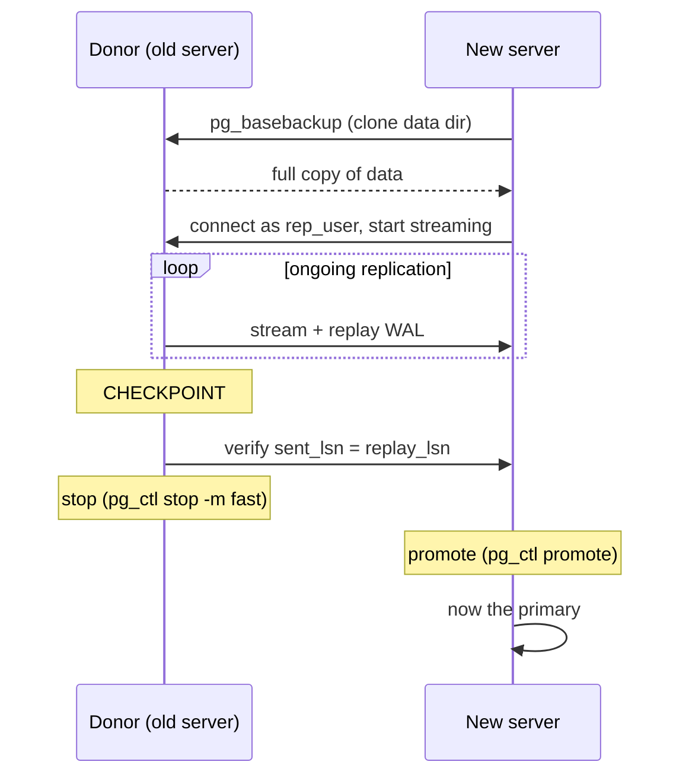

## Objective

Moving a PostgreSQL database to new hardware — a failing disk, an OS upgrade, a
provider migration — used to mean a full backup/restore cycle with the database
offline for however long that took. Streaming replication, added in PostgreSQL
9.1, changes the shape of the problem entirely: build a live replica on the new
server ahead of time, let it catch up while the old server keeps serving traffic,
and only take a brief outage at the very end to switch roles.

## Use Cases

- Replacing failing or aging hardware without a multi-hour backup/restore window,
  by building the new server as a replica first and promoting it once it's caught up.
- Migrating to a new cloud region, instance type, or storage tier when shared
  storage (a SAN that can just be reattached) isn't an option.
- Building a throwaway replica purely to rehearse a migration or upgrade procedure
  against production-like data before doing it for real.

## Deep Dive



### Preparing the donor server to accept a replication connection

Before anything can copy data, the source ("donor") server needs a role dedicated
to replication and a `pg_hba.conf` rule allowing it to connect:

```sql
CREATE USER rep_user WITH PASSWORD 'rep_test' REPLICATION;
```

```
# pg_hba.conf
host      replication       rep_user       0/0      md5
```

The `REPLICATION` role attribute is what actually authorizes streaming (not table
privileges); `0/0` in the example is a stand-in for "any address" and should be
narrowed to the new server's real IP before this is ever run against production.
Reloading the server (not a restart) is enough to pick up the `pg_hba.conf` change.

### Cloning the donor with pg_basebackup

On the new server, `pg_basebackup` copies every file from the donor over the same
protocol a regular streaming replica would use — no separate backup tool, no
filesystem-level snapshot required:

```bash
pg_basebackup -U rep_user -h 192.168.1.10 -D /path/to/database
```

`-h` points at the donor, `-U` picks the replication role created above, `-D` is
where the copy lands. This produces a complete, consistent copy of the donor's
data directory as it existed at the moment the backup started — not yet a running
replica, just its raw materials.

### Turning the copy into a live replica

The copy becomes an actual streaming replica by telling it where to find the
donor and marking it as a standby. PostgreSQL 12 changed *how* that's done
compared to every version before it:

```ini
# postgresql.conf
primary_conninfo = 'host=192.168.1.10 port=5432 user=rep_user'
```

```
# an empty file named standby.signal, in the data directory
```

A `.pgpass` file supplies the replication password automatically, the same way
any PostgreSQL client resolves credentials without a prompt:

```
# ~postgres/.pgpass — mode 0600
*:5432:replication:rep_user:rep_test
```

```bash
chmod 0600 ~postgres/.pgpass
pg_ctl -D /path/to/database start
```

Once started, the new server connects to the donor as `rep_user` and begins
streaming and replaying WAL — from this point on it's a genuine, continuously
updating replica, not a static copy.

### Cutting over: checkpoint, verify, stop, promote

The actual migration moment is a short, ordered sequence once the replica exists
and is caught up:

```sql
-- on the donor, right before the outage window:
CHECKPOINT;

-- then repeatedly, until the two positions match:
SELECT sent_location, replay_location
  FROM pg_stat_replication
 WHERE usename = 'rep_user';
```

```bash
# once sent/replay match, stop the donor:
pg_ctl -D /path/to/database stop -m fast

# then promote the replica to a normal, writable primary:
pg_ctl -D /path/to/database promote
```

`CHECKPOINT` forces any buffered writes on the donor out to WAL immediately,
so there's nothing left to replicate beyond what the query above is already
watching. `-m fast` disconnects clients and shuts down without waiting for a
graceful client-initiated disconnect — appropriate here because the whole
point is a short, deliberate outage window, not an open-ended wait.
`pg_ctl promote` is the one-way switch: after it runs, the former replica
accepts writes and there's no going back to "replica" without rebuilding it
from the new primary.

## Trade-offs

- **The whole procedure only works because replication already caught the
  replica up before the outage window opens.** The actual downtime is bounded
  by "one checkpoint, one final sync check, one stop, one promote" — minutes,
  not the hours a cold backup/restore would take — but only because the
  replica had already been streaming for however long it took to close the
  initial gap. Starting the clone the same day as the cutover defeats the
  whole point.
- **A virtual IP (covered in the book's own next chapter on proxying) removes
  the need for every client to reconnect to a new address after the switch** —
  without one, this recipe's promotion step is only half the migration; every
  application and connection string still needs to be repointed at the new
  server's real address.
- **Book vs. today: `pg_stat_replication`'s `sent_location`/`replay_location`
  columns were already renamed by the time this book's target version
  shipped.** The recipe's own verification query —
  `SELECT sent_location, replay_location FROM pg_stat_replication` — uses
  column names that stopped existing in PostgreSQL 10 (2017), three years
  before this 2020 3rd edition published and two major versions before its
  own PostgreSQL 12 target. The current names are `sent_lsn`/`replay_lsn`:
  ```sql
  SELECT sent_lsn, replay_lsn
    FROM pg_stat_replication
   WHERE usename = 'rep_user';
  ```
  Confirmed via the current PostgreSQL documentation. Today's `pg_stat_replication`
  also exposes a `replay_lag` interval column directly — a more direct way to
  watch replication catch up than manually comparing two LSN values in a loop.
- **Book vs. today: `pg_basebackup -R` already automated the manual
  `standby.signal`/`primary_conninfo` setup, even at the book's own target
  version.** This isn't a case of something changing after 2020 — the `-R`
  (`--write-recovery-conf`) flag already existed and already wrote both the
  signal file and the connection info automatically:
  ```bash
  pg_basebackup -U rep_user -h 192.168.1.10 -D /path/to/database -R
  ```
  replacing the recipe's separate manual steps of creating `standby.signal`
  and hand-editing `postgresql.conf`. Confirmed via the current
  `pg_basebackup` reference.
- **The `recovery.conf`-based standby method the book also shows (for
  "PostgreSQL 11 or earlier") is not a fallback that still works on modern
  PostgreSQL — it actively prevents startup.** The book itself warns about
  this for PostgreSQL 12, and that remains true on every version since: a
  present `recovery.conf` file makes the server refuse to start.

## Documentation Links

- Shaun Thomas, "PostgreSQL 12 High Availability Cookbook", 3rd Edition (Packt, 2020) — Chapter 3, "Minimizing Downtime", recipe "Managing system migrations", p. 118-121 — doc
- [PostgreSQL Documentation — pg_basebackup](https://www.postgresql.org/docs/current/app-pgbasebackup.html) — doc
- [PostgreSQL Documentation — The Cumulative Statistics System (pg_stat_replication)](https://www.postgresql.org/docs/current/monitoring-stats.html) — doc
- [PostgreSQL Documentation — Log-Shipping Standby Servers](https://www.postgresql.org/docs/current/warm-standby.html) — doc
