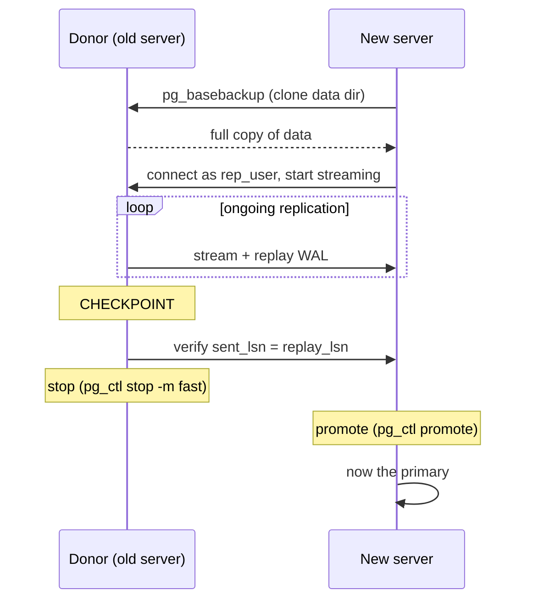

## Objective

Mover um banco de dados PostgreSQL para um hardware novo (um disco falhando, um upgrade de SO, uma migração de provedor) costumava significar um ciclo completo de backup/restore com o banco de dados fora do ar pelo tempo que isso levasse. A streaming replication, adicionada no PostgreSQL 9.1, muda completamente o formato do problema: construa uma réplica ao vivo no servidor novo com antecedência, deixe-a se atualizar enquanto o servidor antigo continua servindo tráfego, e só tenha uma breve indisponibilidade no finalzinho para trocar os papéis.

## Use Cases

- Substituir hardware falhando ou envelhecido sem uma janela de backup/restore de várias horas, construindo o servidor novo como uma réplica primeiro e promovendo-o assim que estiver atualizado.
- Migrar para uma nova região de nuvem, tipo de instância ou camada de armazenamento quando armazenamento compartilhado (um SAN que pode simplesmente ser reconectado) não é uma opção.
- Construir uma réplica descartável puramente para ensaiar um procedimento de migração ou upgrade contra dados parecidos com os de produção antes de fazer isso de verdade.

## Deep Dive



### Preparando o servidor doador para aceitar uma conexão de replicação

Antes de qualquer coisa poder copiar dados, o servidor de origem (o "doador") precisa de um papel dedicado à replicação e de uma regra em `pg_hba.conf` permitindo que ele se conecte:

```sql
CREATE USER rep_user WITH PASSWORD 'rep_test' REPLICATION;
```

```
# pg_hba.conf
host      replication       rep_user       0/0      md5
```

O atributo de papel `REPLICATION` é o que de fato autoriza o streaming (não privilégios de tabela); `0/0` no exemplo é um placeholder para "qualquer endereço" e deveria ser restringido ao IP real do servidor novo antes de isso ser rodado contra produção. Recarregar o servidor (não um restart) já é suficiente para pegar a mudança no `pg_hba.conf`.

### Clonando o doador com pg_basebackup

No servidor novo, o `pg_basebackup` copia todo arquivo do doador pelo mesmo protocolo que uma réplica de streaming comum usaria: nenhuma ferramenta de backup separada, nenhum snapshot em nível de sistema de arquivos necessário:

```bash
pg_basebackup -U rep_user -h 192.168.1.10 -D /path/to/database
```

`-h` aponta para o doador, `-U` escolhe o papel de replicação criado acima, `-D` é onde a cópia pousa. Isso produz uma cópia completa e consistente do diretório de dados do doador como ele existia no momento em que o backup começou, ainda não uma réplica rodando, só sua matéria-prima.

### Transformando a cópia em uma réplica ao vivo

A cópia se torna uma réplica de streaming de verdade dizendo a ela onde encontrar o doador e marcando-a como standby. O PostgreSQL 12 mudou *como* isso é feito em comparação com toda versão anterior:

```ini
# postgresql.conf
primary_conninfo = 'host=192.168.1.10 port=5432 user=rep_user'
```

```
# an empty file named standby.signal, in the data directory
```

Um arquivo `.pgpass` fornece a senha de replicação automaticamente, do mesmo jeito que qualquer cliente PostgreSQL resolve credenciais sem um prompt:

```
# ~postgres/.pgpass — mode 0600
*:5432:replication:rep_user:rep_test
```

```bash
chmod 0600 ~postgres/.pgpass
pg_ctl -D /path/to/database start
```

Uma vez iniciado, o servidor novo se conecta ao doador como `rep_user` e começa a fazer streaming e replay do WAL; a partir desse ponto é uma réplica genuína e continuamente atualizada, não uma cópia estática.

### Fazendo o cutover: checkpoint, verificar, parar, promover

O momento real da migração é uma sequência curta e ordenada, uma vez que a réplica existe e está atualizada:

```sql
-- on the donor, right before the outage window:
CHECKPOINT;

-- then repeatedly, until the two positions match:
SELECT sent_location, replay_location
  FROM pg_stat_replication
 WHERE usename = 'rep_user';
```

```bash
# once sent/replay match, stop the donor:
pg_ctl -D /path/to/database stop -m fast

# then promote the replica to a normal, writable primary:
pg_ctl -D /path/to/database promote
```

`CHECKPOINT` força qualquer escrita em buffer no doador a sair para o WAL imediatamente, então não sobra nada para replicar além do que a consulta acima já está observando. `-m fast` desconecta clientes e desliga sem esperar por uma desconexão iniciada graciosamente pelo cliente, apropriado aqui porque o ponto inteiro é uma janela de indisponibilidade curta e deliberada, não uma espera em aberto. `pg_ctl promote` é a chave sem volta: depois que roda, a antiga réplica aceita escritas e não há como voltar a ser "réplica" sem reconstruí-la a partir do novo primário.

## Trade-offs

- **O procedimento inteiro só funciona porque a replicação já atualizou a réplica antes de a janela de indisponibilidade abrir.** A indisponibilidade real é limitada a "um checkpoint, uma checagem final de sincronia, uma parada, uma promoção": minutos, não as horas que um backup/restore a frio levaria, mas só porque a réplica já vinha fazendo streaming pelo tempo que levou para fechar a lacuna inicial. Começar a clonagem no mesmo dia do cutover anula o ponto inteiro.
- **Um IP virtual (coberto no próprio capítulo seguinte do livro sobre proxying) remove a necessidade de todo cliente reconectar a um novo endereço depois da troca**: sem um, o passo de promoção desta receita é só metade da migração; toda aplicação e string de conexão ainda precisa ser reapontada para o endereço real do servidor novo.
- **Livro vs. hoje: as colunas `sent_location`/`replay_location` do `pg_stat_replication` já haviam sido renomeadas quando a versão-alvo deste livro foi lançada.** A própria consulta de verificação da receita, `SELECT sent_location, replay_location FROM pg_stat_replication`, usa nomes de coluna que deixaram de existir no PostgreSQL 10 (2017), três anos antes de esta 3ª edição de 2020 ser publicada e duas versões principais antes da própria versão-alvo PostgreSQL 12 dela. Os nomes atuais são `sent_lsn`/`replay_lsn`:
  ```sql
  SELECT sent_lsn, replay_lsn
    FROM pg_stat_replication
   WHERE usename = 'rep_user';
  ```
  Confirmado pela documentação atual do PostgreSQL. O `pg_stat_replication` de hoje também expõe uma coluna de intervalo `replay_lag` diretamente: uma forma mais direta de observar a replicação se atualizando do que comparar manualmente dois valores de LSN em um loop.
- **Livro vs. hoje: o `pg_basebackup -R` já automatizava a configuração manual de `standby.signal`/`primary_conninfo`, mesmo na própria versão-alvo do livro.** Isso não é um caso de algo que mudou depois de 2020; a flag `-R` (`--write-recovery-conf`) já existia e já escrevia tanto o arquivo de sinal quanto as informações de conexão automaticamente:
  ```bash
  pg_basebackup -U rep_user -h 192.168.1.10 -D /path/to/database -R
  ```
  substituindo os passos manuais separados da receita de criar `standby.signal` e editar `postgresql.conf` à mão. Confirmado pela referência atual do `pg_basebackup`.
- **O método de standby baseado em `recovery.conf` que o livro também mostra (para "PostgreSQL 11 ou anterior") não é um fallback que ainda funciona no PostgreSQL moderno; ele ativamente impede a inicialização.** O próprio livro avisa sobre isso para o PostgreSQL 12, e isso continua verdadeiro em toda versão desde então: um arquivo `recovery.conf` presente faz o servidor se recusar a iniciar.

## Documentation Links

- [Shaun Thomas, "PostgreSQL 12 High Availability Cookbook", 3rd Edition (Packt, 2020), Chapter 3, "Minimizing Downtime", recipe "Managing system migrations", p. 118-121] - doc
- [PostgreSQL Documentation: pg_basebackup](https://www.postgresql.org/docs/current/app-pgbasebackup.html) - doc
- [PostgreSQL Documentation: The Cumulative Statistics System (pg_stat_replication)](https://www.postgresql.org/docs/current/monitoring-stats.html) - doc
- [PostgreSQL Documentation: Log-Shipping Standby Servers](https://www.postgresql.org/docs/current/warm-standby.html) - doc
