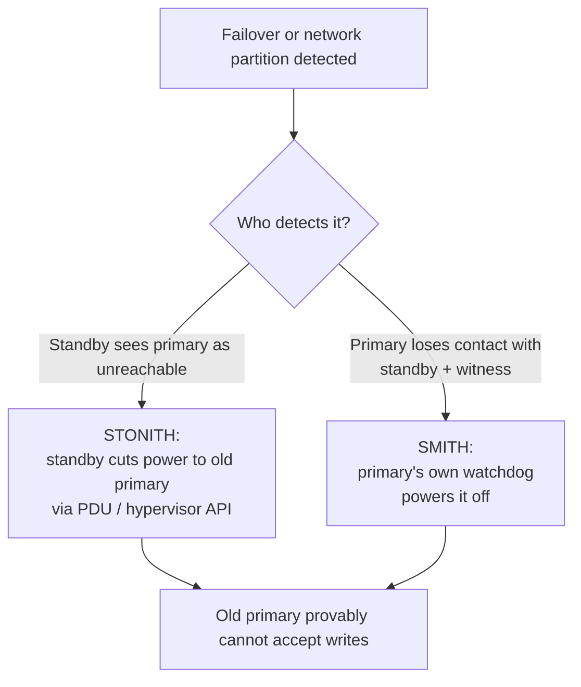

## Objective

Split brain happens when more than one PostgreSQL primary is active at once —
once an application writes to both, reconciling the data is often impossible, which
makes a cluster with split-brain corruption disqualified from calling itself highly
available at all. Fencing is the practice of forcibly guaranteeing a demoted or
isolated node genuinely cannot accept writes anymore, rather than merely hoping it
respects its new role.

## Use Cases

- Designing automated failover so that promoting a new primary comes with a hard
  guarantee the old one is unreachable, not just an assumption it will step down
  gracefully.
- Handling a network partition where the old primary is still technically running
  and reachable by clients on its side of the partition, even though the rest of the
  cluster has already promoted a replacement.
- Provisioning new nodes from a base image or template without accidentally
  leaving PostgreSQL's own service-manager autostart enabled, which would let a
  rebooted former primary silently rejoin as a second writer.

## Deep Dive

### Fencing: guaranteeing isolation, not assuming it

Fencing means physically or forcibly ensuring a node can't act as primary anymore,
as opposed to trusting that a failed or demoted node will cooperate. The book frames
this with two named techniques:

### STONITH — Shoot The Other Node In The Head

When a standby promotes itself, it uses remote power-management hardware (a
Power Distribution Unit for physical servers, or a hypervisor's remote-power API for
VMs) to forcibly cut power to the old primary. This removes any ambiguity: a
powered-off node cannot accept writes, full stop, regardless of what state its
PostgreSQL process thought it was in.

### SMITH — Shoot Myself In The Head

STONITH assumes the standby can reach the PDU controlling the primary — not true
during a network partition between data centers. SMITH is the inverse: the primary
itself monitors whether it can still reach the standby and witness, and if both stay
unreachable for long enough, it assumes it has been isolated and powers itself down
proactively, rather than continuing to accept writes that the rest of the cluster will
never see.

### Disabling automatic PostgreSQL startup

Every fencing strategy is undermined the same way: a server reboots (planned
maintenance, a power event) and PostgreSQL's own init system or service manager
starts it back up automatically, unaware that HA orchestration software elsewhere has
already promoted a different primary. The book's baseline recommendation applies
regardless of which fencing strategy is used: any node managed by HA orchestration
software should have PostgreSQL's own automatic-startup mechanism disabled, so
starting and stopping the database is entirely the orchestration software's
responsibility.

### Book vs today: SMITH became a built-in watchdog, not a hand-rolled check

The book presents STONITH and SMITH as design patterns to implement yourself,
crediting Pacemaker, repmgr, and Patroni only in passing as software that
implements "something like this." Today, Patroni ships SMITH-style self-fencing as
a built-in feature: before promoting a node to primary, Patroni arms a Linux
watchdog device (the `softdog` kernel module, or real hardware watchdog hardware)
timed to expire just before its leadership lease in the Distributed Configuration
Store would. If the node can't renew that lease — the same "lost contact with the
rest of the cluster" condition the book describes — the watchdog forces a hard
system reset, with no PDU, hypervisor API, or custom isolation-detection script
required. This is self-fencing only, the SMITH half of the book's pair, not remote
fencing of another node; and the "disable PostgreSQL's own autostart" guideline
hasn't loosened at all — Patroni's own docs state it as a hard requirement, not a
recommendation, because a systemd-restarted `postgresql.service` during a Patroni
promotion elsewhere is exactly the failure the book warns about. Manual,
PDU-based STONITH hasn't disappeared — Pacemaker-managed stacks still document
and support it — but for Patroni-first deployments, the software watchdog is what
ships and is recommended by default.

## Trade-offs

- **STONITH requires infrastructure that not every environment has.** Bare-metal
  servers with PDU access or VMs with a hypervisor-level power API can support it
  directly; a cloud instance without an equivalent remote-power integration can't
  fence this way at all, and the fencing strategy has to be built on something else
  (a cloud provider's own instance-stop API, or a software-level mechanism instead
  of a hardware one).
- **SMITH trades false positives against split-brain window size.** A short
  isolation-detection timeout self-fences quickly but risks a healthy primary
  shutting itself down over a brief, harmless network blip; a long timeout avoids
  that false positive but leaves a longer window where an actually-isolated primary
  keeps accepting writes nobody else in the cluster will ever see.
- **"Disable autostart" is a one-line guideline that's easy to violate accidentally**
  — a node reprovisioned from a base image or configuration-management template
  that enables the PostgreSQL service by default silently reintroduces the exact
  failure mode the guideline exists to prevent, and nothing about a normal reboot
  surfaces that mistake until the next failover actually happens.

## Documentation Links

- Shaun Thomas, "PostgreSQL 12 High Availability Cookbook", 3rd Edition (Packt, 2020) — Chapter 1, "Architectural Considerations", recipe "Preventing split brain", p. 31-33 — doc
- [PostgreSQL Documentation — High Availability, Load Balancing, and Replication](https://www.postgresql.org/docs/current/warm-standby.html) — doc
- [Patroni Documentation — Watchdog (automated self-fencing)](https://patroni.readthedocs.io/en/latest/watchdog.html) — doc
- [Patroni Documentation — FAQ (Postgres must be managed exclusively by Patroni)](https://patroni.readthedocs.io/en/latest/faq.html) — doc
- [ClusterLabs PAF — Fencing (PDU/STONITH vs. watchdog fencing in Pacemaker)](https://clusterlabs.github.io/PAF/fencing.html) — doc
