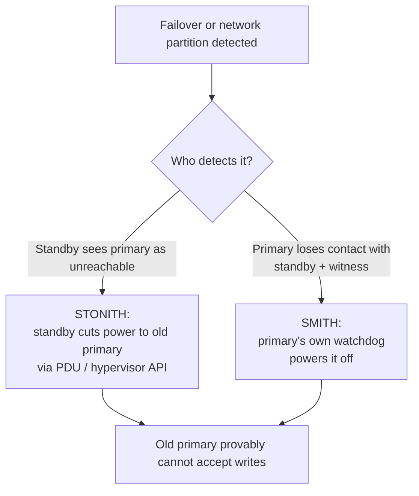

## Objective

Split brain acontece quando mais de um primário do PostgreSQL está ativo ao mesmo tempo; uma vez que uma aplicação escreve nos dois, reconciliar os dados costuma ser impossível, o que desqualifica por completo um cluster com corrupção por split-brain de se chamar de altamente disponível. Fencing é a prática de garantir à força que um nó rebaixado ou isolado genuinamente não consegue mais aceitar escritas, em vez de meramente torcer para que ele respeite seu novo papel.

## Use Cases

- Projetar failover automatizado para que promover um novo primário venha com uma garantia rígida de que o antigo está inacessível, não só a suposição de que ele vai se rebaixar graciosamente.
- Lidar com uma partição de rede em que o antigo primário ainda está tecnicamente rodando e acessível para clientes do seu lado da partição, mesmo que o resto do cluster já tenha promovido um substituto.
- Provisionar nós novos a partir de uma imagem base ou template sem deixar acidentalmente habilitada a auto-inicialização do próprio gerenciador de serviço do PostgreSQL, o que deixaria um antigo primário reiniciado silenciosamente se reincorporar como um segundo escritor.

## Deep Dive

### Fencing: garantindo isolamento, não presumindo-o

Fencing significa assegurar física ou forçadamente que um nó não pode mais agir como primário, em oposição a confiar que um nó falho ou rebaixado vai cooperar. O livro enquadra isso com duas técnicas nomeadas:

### STONITH — Shoot The Other Node In The Head

Quando um standby se promove, ele usa hardware remoto de gerenciamento de energia (uma Power Distribution Unit para servidores físicos, ou a API de energia remota de um hypervisor para VMs) para forçadamente cortar a energia do antigo primário. Isso remove qualquer ambiguidade: um nó sem energia não consegue aceitar escritas, ponto final, independentemente de em que estado seu processo PostgreSQL achava que estava.

### SMITH — Shoot Myself In The Head

O STONITH presume que o standby consegue alcançar o PDU que controla o primário; não verdade durante uma partição de rede entre data centers. O SMITH é o inverso: o próprio primário monitora se ainda consegue alcançar o standby e o witness, e se ambos ficam inacessíveis por tempo suficiente, ele assume que foi isolado e se desliga proativamente, em vez de continuar aceitando escritas que o resto do cluster nunca vai ver.

### Desativando a inicialização automática do PostgreSQL

Toda estratégia de fencing é minada da mesma forma: um servidor reinicia (manutenção planejada, um evento de energia) e o próprio sistema de init ou gerenciador de serviço do PostgreSQL o inicia de volta automaticamente, sem saber que o software de orquestração de HA em outro lugar já promoveu um primário diferente. A recomendação básica do livro se aplica independentemente de qual estratégia de fencing é usada: qualquer nó gerenciado por software de orquestração de HA deveria ter o próprio mecanismo de auto-inicialização do PostgreSQL desativado, para que iniciar e parar o banco de dados seja inteiramente responsabilidade do software de orquestração.

### Livro vs. hoje: o SMITH virou um watchdog embutido, não uma checagem feita à mão

O livro apresenta STONITH e SMITH como padrões de design para implementar você mesmo, creditando Pacemaker, repmgr e Patroni só de passagem como software que implementa "algo parecido com isso". Hoje, o Patroni vem com autofencing estilo SMITH como um recurso embutido: antes de promover um nó a primário, o Patroni arma um dispositivo watchdog do Linux (o módulo de kernel `softdog`, ou hardware watchdog de verdade) cronometrado para expirar pouco antes de seu lease de liderança no Distributed Configuration Store expirar. Se o nó não conseguir renovar esse lease (a mesma condição de "perdeu contato com o resto do cluster" que o livro descreve), o watchdog força um reset de sistema rígido, sem PDU, API de hypervisor, ou script customizado de detecção de isolamento necessário. Isso é só autofencing, a metade SMITH do par do livro, não fencing remoto de outro nó; e a diretriz de "desative a auto-inicialização do próprio PostgreSQL" não afrouxou nada: a própria documentação do Patroni a declara como um requisito rígido, não uma recomendação, porque um `postgresql.service` reiniciado pelo systemd durante uma promoção do Patroni em outro lugar é exatamente a falha contra a qual o livro alerta. O STONITH manual, baseado em PDU, não desapareceu (stacks gerenciadas pelo Pacemaker ainda o documentam e suportam), mas para deployments Patroni-first, o watchdog de software é o que vem por padrão e é recomendado.

## Trade-offs

- **O STONITH exige infraestrutura que nem todo ambiente tem.** Servidores bare-metal com acesso a PDU ou VMs com uma API de energia em nível de hypervisor conseguem suportá-lo diretamente; uma instância de nuvem sem uma integração equivalente de energia remota não consegue fazer fencing desse jeito de jeito nenhum, e a estratégia de fencing precisa ser construída sobre outra coisa (a própria API de parada de instância de um provedor de nuvem, ou um mecanismo em nível de software em vez de hardware).
- **O SMITH troca falsos positivos por tamanho da janela de split-brain.** Um timeout curto de detecção de isolamento se autofenceia rapidamente, mas arrisca um primário saudável se desligando por causa de um soluço de rede breve e inofensivo; um timeout longo evita esse falso positivo mas deixa uma janela maior em que um primário de fato isolado continua aceitando escritas que mais ninguém no cluster vai ver.
- **"Desativar auto-inicialização" é uma diretriz de uma linha fácil de violar por acidente**: um nó reprovisionado a partir de uma imagem base ou template de gerenciamento de configuração que habilita o serviço PostgreSQL por padrão reintroduz silenciosamente exatamente o modo de falha que a diretriz existe para prevenir, e nada em um reboot normal expõe esse erro até que o próximo failover de fato aconteça.

## Documentation Links

- [Shaun Thomas, "PostgreSQL 12 High Availability Cookbook", 3rd Edition (Packt, 2020), Chapter 1, "Architectural Considerations", recipe "Preventing split brain", p. 31-33] - doc
- [PostgreSQL Documentation: High Availability, Load Balancing, and Replication](https://www.postgresql.org/docs/current/warm-standby.html) - doc
- [Patroni Documentation: Watchdog (automated self-fencing)](https://patroni.readthedocs.io/en/latest/watchdog.html) - doc
- [Patroni Documentation: FAQ (Postgres must be managed exclusively by Patroni)](https://patroni.readthedocs.io/en/latest/faq.html) - doc
- [ClusterLabs PAF: Fencing (PDU/STONITH vs. watchdog fencing in Pacemaker)](https://clusterlabs.github.io/PAF/fencing.html) - doc
