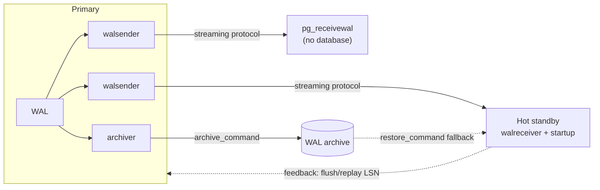

## Objective

Every high-availability PostgreSQL setup needs at least one online copy of the
database — not a backup on a shelf, but a server that is continuously applying
the primary's changes and can take over. PostgreSQL builds all of this on one
mechanism: the Write-Ahead Log. Ship WAL files to another machine and you get a
log-shipping standby; let that machine open a replication connection and pull
WAL as it is generated and you get streaming replication; let it answer queries
while it replays and you get a hot standby; pin the primary's WAL retention to
the standby's progress and you get a replication slot; make the primary refuse
to commit until the standby acknowledges and you get synchronous replication.
The same protocol drives `pg_basebackup` (which clones the primary) and
`pg_receivewal` (which streams WAL to a machine that isn't a database at all).

## Use Cases

- Keeping a live disaster-recovery copy of a production database so a failure
  costs minutes of promotion instead of hours of backup restore.
- Offloading reporting, analytics, and ad hoc queries onto read-only replicas so
  they never compete with the OLTP primary for buffers and CPU.
- Guaranteeing that a committed transaction physically exists on more than one
  machine before the client is told it succeeded (financial ledgers, regulatory
  durability requirements).
- Maintaining a WAL archive on a cheap storage host — no PostgreSQL instance
  required — as the raw material for point-in-time recovery.
- Building a topology of cascading replicas so a single primary isn't feeding
  ten WAL senders directly.

## Deep Dive



### The primary side: who is allowed to stream, and what gets logged

Streaming is a real client connection to a pseudo-database named `replication`,
authenticated through `pg_hba.conf` like any other, but authorized by a role
attribute rather than table grants:

```sql
CREATE USER rep_user WITH REPLICATION PASSWORD 'newpass';
```

```
# pg_hba.conf on the primary — scram-sha-256 is the modern default
host    replication    rep_user    10.0.30.2/32    scram-sha-256
```

```ini
# postgresql.conf on the primary
wal_level = replica       # 'replica' is the default and is enough for physical replication
max_wal_senders = 10      # one sender per connected standby / pg_receivewal / pg_basebackup
```

`wal_level` and `max_wal_senders` require a restart; `pg_hba.conf` only needs a
reload (`pg_ctl -D /db/pgdata reload`). `wal_level = logical` is only needed for
logical decoding — a physical standby does not require it, and it makes the WAL
larger.

### Cloning the primary with pg_basebackup

`pg_basebackup` speaks the same replication protocol and produces a data
directory that is ready to run:

```bash
pg_basebackup -D /db/pgdata -h 10.0.30.1 -U rep_user -R -P
```

`-D` is the destination data directory, `-h`/`-U` the primary and replication
role, `-P` shows progress. `-R` (`--write-recovery-conf`) is what turns the copy
into a standby without editing anything by hand: it creates the `standby.signal`
file and appends `primary_conninfo` to `postgresql.conf`. The password itself
belongs in `~postgres/.pgpass`, never in the connection string, so that
configuration management can distribute `postgresql.conf` freely:

```
# ~postgres/.pgpass, mode 0600 — note the literal database name 'replication'
10.0.30.1:*:replication:rep_user:newpass
```

```bash
chmod 0600 ~postgres/.pgpass
```

### Standby mode: standby.signal, primary_conninfo, and the WAL archive fallback

A server enters standby mode because an empty file named `standby.signal` exists
in its data directory at startup. Everything else is ordinary configuration:

```ini
# postgresql.conf on the standby
primary_conninfo = 'host=10.0.30.1 user=rep_user application_name=pgha2'
restore_command  = 'test -f /db/pg_archived/%f && cp -n /db/pg_archived/%f %p'
hot_standby = on          # default is already 'on'
```

```bash
touch /db/pgdata/standby.signal
pg_ctl -D /db/pgdata start
```

The two WAL sources are complementary, not alternatives. `primary_conninfo`
streams live WAL; `restore_command` reads from a WAL archive and is the fallback
when the stream has been down long enough that the primary has already recycled
the segments the standby still needs. `application_name` in the connection
string is how the primary identifies this particular standby — it is the name
`synchronous_standby_names` matches against later.

From the primary, the connection shows up in `pg_stat_replication`:

```sql
SELECT application_name, client_addr, state, sync_state,
       sent_lsn, replay_lsn, replay_lag
  FROM pg_stat_replication;
```

`state` moves from `catchup` to `streaming` once the gap closes. `replay_lag` is
a real `interval` — the time between the primary flushing WAL locally and the
standby confirming it applied it — which beats subtracting two LSNs by hand.
From the standby's own side:

```sql
SELECT status, sender_host, slot_name, latest_end_lsn, latest_end_time
  FROM pg_stat_wal_receiver;

SELECT pg_is_in_recovery();     -- true while this server is a standby
```

### Hot standby: a replica that answers queries

`hot_standby = on` lets the replica serve `SELECT`, `COPY TO`, cursors, and
`LOCK TABLE` in the weaker modes. Anything that writes is rejected, including
`SELECT ... FOR UPDATE`, `LISTEN`/`NOTIFY`, and any explicitly `READ WRITE`
transaction. The interesting failure mode is the conflict between replay and
queries: the standby must apply WAL that may drop a row version a running query
still needs.

```ini
# on the standby
max_standby_streaming_delay = 30s   # how long replay may stall for a conflicting query
max_standby_archive_delay = 30s     # same, while replaying from the archive
hot_standby_feedback = on           # tell the primary which rows are still in use
```

Past `max_standby_streaming_delay`, the conflicting query is cancelled — the
familiar `canceling statement due to conflict with recovery`. `hot_standby_feedback`
attacks the cause instead: the standby reports its oldest snapshot upstream and
the primary's `VACUUM` holds back on those row versions. The cost is bloat on
the primary, paid to keep long reporting queries alive on the replica.

### Replication slots: making WAL retention the primary's problem

Without a slot, a standby that disconnects for too long can come back to find
the WAL it needs already recycled — at which point it must be rebuilt. A
physical replication slot makes the primary track that standby's position and
refuse to recycle WAL past it:

```sql
-- on the primary
SELECT * FROM pg_create_physical_replication_slot('pg2_slot');
SELECT slot_name, slot_type, active, wal_status FROM pg_replication_slots;
```

```ini
# on the standby
primary_slot_name = 'pg2_slot'
```

The guarantee cuts both ways: a slot for a standby that never comes back will
grow `pg_wal` until the primary runs out of disk. Either drop it, or cap it:

```sql
SELECT pg_drop_replication_slot('pg2_slot');
```

```ini
# on the primary — the safety valve
max_slot_wal_keep_size = 64GB
```

With `max_slot_wal_keep_size` set, a slot that falls further behind than the cap
is invalidated (`wal_status` becomes `lost`) instead of taking the primary down
with it. The blunter, slot-free alternative is `wal_keep_size`, which just keeps
a fixed amount of extra WAL for everybody with no per-standby tracking:

```ini
wal_keep_size = 16GB
```

### Synchronous replication: FIRST vs ANY

Synchronous replication means the primary will not report a commit until a
standby has acknowledged the WAL. It is enabled by naming standbys — by their
`application_name` — on the primary:

```ini
# postgresql.conf on the primary; a reload is enough
synchronous_commit = on
synchronous_standby_names = 'FIRST 1 (pgha2, pgha3)'
```

The grammar has three forms:

```ini
synchronous_standby_names = 'pgha2, pgha3'          # legacy; equivalent to FIRST 1
synchronous_standby_names = 'FIRST 2 (s1, s2, s3)'  # priority: the first 2 available, in list order
synchronous_standby_names = 'ANY 2 (s1, s2, s3)'    # quorum: any 2 of the 3
```

`FIRST` is priority-based — list order matters, and a failed standby is replaced
by the next one down. `ANY` is quorum-based — order is irrelevant, any `N`
replies satisfy the commit. `pg_stat_replication.sync_state` reports which
regime a standby is under: `sync`, `potential`, `quorum`, or `async`.

`synchronous_commit` decides *how far* the standby must get:

```ini
synchronous_commit = remote_write   # standby's OS has it (survives a postgres crash)
synchronous_commit = on             # standby flushed it to disk (survives an OS crash)
synchronous_commit = remote_apply   # standby replayed it; the read is visible there
```

`remote_apply` is the one that makes read-your-writes work against a replica: it
is the only setting under which a client that just committed on the primary is
guaranteed to see its own row on the standby.

The failure behavior is the part that bites. With one synchronous standby and no
replacement available, stopping it stops writes on the primary:

```bash
sudo systemctl stop postgresql@18-main    # on the standby
```

```sql
-- on the primary, this now blocks indefinitely:
CREATE TABLE foo (bar INT);
```

Two escape hatches exist. Per-session, `synchronous_commit` is a normal GUC:

```sql
SET synchronous_commit TO off;   -- this session commits asynchronously
```

Cluster-wide, blank the list and reload — the standard move before doing
maintenance on the synchronous standby:

```ini
synchronous_standby_names = ''
```

```bash
pg_ctl -D /db/pgdata reload
```

### pg_receivewal: streaming WAL to something that isn't a database

`pg_receivewal` opens the same replication connection a standby would, but just
writes WAL segments to a directory. The archive host needs no PostgreSQL
instance, and the primary never has to fork an `archive_command` per segment:

```
# pg_hba.conf on the primary
host    replication    rep_user    10.0.30.20/32    scram-sha-256
```

```bash
# on the archive host, as postgres — create the slot first
pg_receivewal -h 10.0.30.1 -U rep_user --slot=archive_slot --create-slot

pg_receivewal -h 10.0.30.1 -U rep_user \
              -D /db/pg_archived --slot=archive_slot -v \
              --compress=lz4 \
              &> /db/pg_archived/wal_archive.log &
```

The slot is what makes this safe: without one, the primary is free to recycle
segments before the archive host has fetched them, which is exactly the hole a
WAL archive must not have. The in-flight segment appears with a `.partial`
suffix until it is complete. `--synchronous` flushes each segment on receipt and
acknowledges immediately, which is what allows `pg_receivewal` to act as a
synchronous standby — but never under `synchronous_commit = remote_apply`, since
it never applies anything and would therefore block every commit forever.

## Trade-offs

- **Log shipping and streaming are not competing designs; the archive is the
  streaming replica's safety net.** A standby configured with both
  `primary_conninfo` and `restore_command` streams normally and silently falls
  back to the archive when the stream has been down long enough. Removing
  `restore_command` once streaming works — which the book suggests — is only
  safe if a replication slot is holding WAL on the primary instead. Pick one of
  the two retention mechanisms deliberately; running with neither means a long
  standby outage costs a full rebuild.
- **Replication slots convert "the replica might need a rebuild" into "the
  primary might run out of disk".** That is usually the better trade, but only
  because `max_slot_wal_keep_size` exists to bound it. An unbounded slot behind
  a decommissioned standby is one of the classic ways to take a healthy primary
  offline.
  ```sql
  SELECT slot_name, active, wal_status,
         pg_size_pretty(pg_wal_lsn_diff(pg_current_wal_lsn(), restart_lsn)) AS retained
    FROM pg_replication_slots;
  ```
- **Synchronous replication is a durability guarantee, not a redundancy
  feature.** The comparison to RAID-1 is actively misleading: a mirrored disk
  keeps working in degraded mode when half the pair dies, whereas a synchronous
  primary with no acknowledging standby stops committing. Availability and
  durability pull in opposite directions here, and `synchronous_standby_names`
  is where you choose. `ANY 1 (s1, s2)` buys back most of the availability — two
  candidates, either one satisfies the commit — at the cost of a second replica.
- **`remote_apply` is the only synchronous mode that makes replica reads
  consistent with primary writes.** Plain `on` guarantees the bytes are on the
  standby's disk, not that they are visible to a query there; a load balancer
  routing a read to the standby immediately after a commit can still miss the
  row. `remote_apply` closes that window and pays for it with the standby's full
  replay latency on every commit.
- **`hot_standby_feedback` moves a problem rather than solving it.** It stops
  long-running standby queries from being cancelled by replay conflicts, at the
  price of dead-row accumulation on the primary that `VACUUM` is no longer
  allowed to reclaim. On a replica used for hour-long reporting queries, the
  alternative — a generous `max_standby_streaming_delay` — trades replication
  lag for the same result.
- **Book vs. today: `wal_keep_segments` no longer exists.** The
  `pg_receivewal` recipe sets `wal_keep_segments = 1000` on the primary to avoid
  losing WAL if the archiver falls behind. That parameter was removed in
  PostgreSQL 13 and replaced by `wal_keep_size`, expressed as a size rather than
  a segment count, so the book's setting has no modern equivalent as written:
  ```ini
  # book (PostgreSQL 12): 1000 segments of 16 MB
  wal_keep_segments = 1000
  # today: the same retention, expressed as a size
  wal_keep_size = 16GB
  ```
  More importantly, the current `pg_receivewal` documentation says outright that
  when it is used as the main WAL backup method a replication slot is *strongly
  recommended*, because otherwise the server may recycle segments before they
  are backed up — which is precisely the gap the book's `wal_keep_segments`
  setting was trying to paper over. The modern form of that recipe uses
  `--slot`/`--create-slot` and leaves `wal_keep_size` alone.
- **Book vs. today: quorum-based synchronous replication (`ANY`) is missing from
  the book, even though it predates the book's own baseline.** The chapter's
  "extreme durability" section presents `synchronous_standby_names = '2 (rep1,
  rep2)'` as "committing writes to several replicas simultaneously", framed as a
  NoSQL-style quorum. That bare-number syntax is the PostgreSQL 9.6 *priority*
  form — it is exactly equivalent to `FIRST 2 (rep1, rep2)` and demands those two
  specific standbys in that order. True quorum arrived in PostgreSQL 10 with the
  `ANY` keyword, two major versions before this 2020 edition's PostgreSQL 12
  target, and the book never mentions it:
  ```ini
  synchronous_standby_names = 'ANY 2 (rep1, rep2, rep3)'
  ```
  The distinction is visible at runtime: `pg_stat_replication.sync_state` reports
  `quorum` under `ANY` and `sync`/`potential` under `FIRST`.
- **Book vs. today: the recipe's `wal_level` guidance is wrong in both
  directions.** The hot standby recipe sets `wal_level = logical` in
  `postgresql.conf`, while its own explanation says the value must be
  `hot_standby`. `hot_standby` stopped being a valid `wal_level` in PostgreSQL
  9.6, when it was renamed `replica` — so that sentence was already
  three versions stale when the book shipped. And `logical` is more than a
  physical standby needs: `replica` (the default since PostgreSQL 10) is
  sufficient, and `logical` writes extra information into every WAL record for
  no benefit unless logical decoding is actually in use.
- **Book vs. today: `archive_command` is no longer the only archiving
  mechanism.** The WAL-archiving recipe shells out to `rsync` via
  `archive_command`, which still works exactly as described. PostgreSQL 15 added
  `archive_library`, which loads an archiving module in-process instead of
  forking a shell command per segment. The two are mutually exclusive — setting
  both raises an error — so a migration is a swap, not an addition.

## Documentation Links

- [Shaun Thomas, "PostgreSQL 12 High Availability Cookbook", 3rd Edition (Packt, 2020) — Chapter 7, "PostgreSQL Replication", recipes "Deciding what to copy", "Securing the WAL stream", "Setting up a hot standby", "Upgrading to asynchronous replication", "Bulletproofing with synchronous replication", "Faking replication with pg_receivewal", p. 282-307](https://www.packtpub.com/en-us/product/postgresql-12-high-availability-cookbook-9781838984854) — doc
- [PostgreSQL Documentation — Log-Shipping Standby Servers](https://www.postgresql.org/docs/current/warm-standby.html) — doc
- [PostgreSQL Documentation — Hot Standby](https://www.postgresql.org/docs/current/hot-standby.html) — doc
- [PostgreSQL Documentation — Replication (runtime configuration)](https://www.postgresql.org/docs/current/runtime-config-replication.html) — doc
- [PostgreSQL Documentation — Write Ahead Log (runtime configuration)](https://www.postgresql.org/docs/current/runtime-config-wal.html) — doc
- [PostgreSQL Documentation — pg_basebackup](https://www.postgresql.org/docs/current/app-pgbasebackup.html) — doc
- [PostgreSQL Documentation — pg_receivewal](https://www.postgresql.org/docs/current/app-pgreceivewal.html) — doc
- [PostgreSQL Documentation — The Cumulative Statistics System (pg_stat_replication, pg_stat_wal_receiver)](https://www.postgresql.org/docs/current/monitoring-stats.html) — doc
