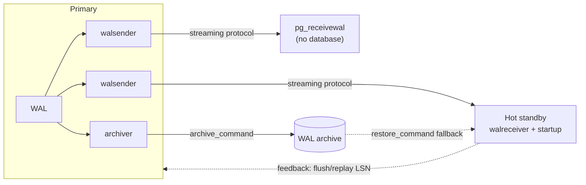

## Objective

Toda configuração de PostgreSQL de alta disponibilidade precisa de pelo menos uma cópia online do banco de dados, não um backup em uma estante, mas um servidor que está continuamente aplicando as mudanças do primário e pode assumir o controle. O PostgreSQL constrói tudo isso sobre um único mecanismo: o Write-Ahead Log. Envie arquivos de WAL para outra máquina e você tem um standby por log shipping; deixe essa máquina abrir uma conexão de replicação e puxar o WAL conforme é gerado e você tem streaming replication; deixe-a responder consultas enquanto faz replay e você tem um hot standby; prenda a retenção de WAL do primário ao progresso do standby e você tem um replication slot; faça o primário se recusar a fazer commit até o standby confirmar e você tem replicação síncrona. O mesmo protocolo conduz o `pg_basebackup` (que clona o primário) e o `pg_receivewal` (que faz streaming de WAL para uma máquina que não é banco de dados de jeito nenhum).

## Use Cases

- Manter uma cópia de disaster-recovery ao vivo de um banco de dados de produção para que uma falha custe minutos de promoção em vez de horas de restore de backup.
- Descarregar relatórios, análises e consultas ad hoc em réplicas somente leitura para que elas nunca disputem buffers e CPU com o primário OLTP.
- Garantir que uma transação confirmada exista fisicamente em mais de uma máquina antes de o cliente ser informado de que teve sucesso (livros contábeis financeiros, requisitos regulatórios de durabilidade).
- Manter um arquivo de WAL em um host de armazenamento barato, sem instância PostgreSQL necessária, como matéria-prima para point-in-time recovery.
- Construir uma topologia de réplicas em cascata para que um único primário não alimente dez walsenders diretamente.

## Deep Dive



### O lado do primário: quem tem permissão para fazer streaming, e o que é logado

Streaming é uma conexão de cliente de verdade a um pseudo-banco de dados chamado `replication`, autenticada via `pg_hba.conf` como qualquer outra, mas autorizada por um atributo de papel em vez de grants de tabela:

```sql
CREATE USER rep_user WITH REPLICATION PASSWORD 'newpass';
```

```
# pg_hba.conf on the primary — scram-sha-256 is the modern default
host    replication    rep_user    10.0.30.2/32    scram-sha-256
```

```ini
# postgresql.conf on the primary
wal_level = replica       # 'replica' is the default and is enough for physical replication
max_wal_senders = 10      # one sender per connected standby / pg_receivewal / pg_basebackup
```

`wal_level` e `max_wal_senders` exigem um restart; `pg_hba.conf` só precisa de um reload (`pg_ctl -D /db/pgdata reload`). `wal_level = logical` só é necessário para decodificação lógica; um standby físico não exige isso, e isso deixa o WAL maior.

### Clonando o primário com pg_basebackup

O `pg_basebackup` fala o mesmo protocolo de replicação e produz um diretório de dados pronto para rodar:

```bash
pg_basebackup -D /db/pgdata -h 10.0.30.1 -U rep_user -R -P
```

`-D` é o diretório de dados de destino, `-h`/`-U` o primário e o papel de replicação, `-P` mostra progresso. `-R` (`--write-recovery-conf`) é o que transforma a cópia em standby sem editar nada à mão: ele cria o arquivo `standby.signal` e adiciona `primary_conninfo` a `postgresql.conf`. A própria senha pertence a `~postgres/.pgpass`, nunca na string de conexão, para que o gerenciamento de configuração possa distribuir `postgresql.conf` livremente:

```
# ~postgres/.pgpass, mode 0600 — note the literal database name 'replication'
10.0.30.1:*:replication:rep_user:newpass
```

```bash
chmod 0600 ~postgres/.pgpass
```

### Modo standby: standby.signal, primary_conninfo, e o fallback do arquivo de WAL

Um servidor entra em modo standby porque um arquivo vazio chamado `standby.signal` existe em seu diretório de dados na inicialização. Todo o resto é configuração comum:

```ini
# postgresql.conf on the standby
primary_conninfo = 'host=10.0.30.1 user=rep_user application_name=pgha2'
restore_command  = 'test -f /db/pg_archived/%f && cp -n /db/pg_archived/%f %p'
hot_standby = on          # default is already 'on'
```

```bash
touch /db/pgdata/standby.signal
pg_ctl -D /db/pgdata start
```

As duas fontes de WAL são complementares, não alternativas. `primary_conninfo` faz streaming de WAL ao vivo; `restore_command` lê de um arquivo de WAL e é o fallback quando o streaming ficou fora do ar por tempo suficiente para o primário já ter reciclado os segmentos que o standby ainda precisa. `application_name` na string de conexão é como o primário identifica esse standby em particular; é o nome que `synchronous_standby_names` casa depois.

Do lado do primário, a conexão aparece em `pg_stat_replication`:

```sql
SELECT application_name, client_addr, state, sync_state,
       sent_lsn, replay_lsn, replay_lag
  FROM pg_stat_replication;
```

`state` muda de `catchup` para `streaming` assim que a lacuna se fecha. `replay_lag` é um `interval` de verdade (o tempo entre o primário descarregar WAL localmente e o standby confirmar que o aplicou), que ganha de subtrair dois LSNs na mão. Do próprio lado do standby:

```sql
SELECT status, sender_host, slot_name, latest_end_lsn, latest_end_time
  FROM pg_stat_wal_receiver;

SELECT pg_is_in_recovery();     -- true while this server is a standby
```

### Hot standby: uma réplica que responde consultas

`hot_standby = on` deixa a réplica servir `SELECT`, `COPY TO`, cursores e `LOCK TABLE` nos modos mais fracos. Qualquer coisa que escreve é rejeitada, incluindo `SELECT ... FOR UPDATE`, `LISTEN`/`NOTIFY`, e qualquer transação explicitamente `READ WRITE`. O modo de falha interessante é o conflito entre replay e consultas: o standby precisa aplicar WAL que pode descartar uma versão de linha que uma consulta rodando ainda precisa.

```ini
# on the standby
max_standby_streaming_delay = 30s   # how long replay may stall for a conflicting query
max_standby_archive_delay = 30s     # same, while replaying from the archive
hot_standby_feedback = on           # tell the primary which rows are still in use
```

Passado o `max_standby_streaming_delay`, a consulta conflitante é cancelada: o familiar `canceling statement due to conflict with recovery`. `hot_standby_feedback` ataca a causa em vez disso: o standby reporta seu snapshot mais antigo para o primário e o `VACUUM` do primário retém aquelas versões de linha. O custo é bloat no primário, pago para manter consultas de relatório longas vivas na réplica.

### Replication slots: tornando a retenção de WAL problema do primário

Sem um slot, um standby que desconecta por muito tempo pode voltar e descobrir que o WAL de que precisa já foi reciclado, momento em que precisa ser reconstruído. Um physical replication slot faz o primário rastrear a posição daquele standby e se recusar a reciclar WAL passado dela:

```sql
-- on the primary
SELECT * FROM pg_create_physical_replication_slot('pg2_slot');
SELECT slot_name, slot_type, active, wal_status FROM pg_replication_slots;
```

```ini
# on the standby
primary_slot_name = 'pg2_slot'
```

A garantia corta dos dois lados: um slot para um standby que nunca volta vai crescer `pg_wal` até o primário ficar sem disco. Ou apague-o, ou limite-o:

```sql
SELECT pg_drop_replication_slot('pg2_slot');
```

```ini
# on the primary — the safety valve
max_slot_wal_keep_size = 64GB
```

Com `max_slot_wal_keep_size` definido, um slot que fica mais atrasado do que o limite é invalidado (`wal_status` se torna `lost`) em vez de derrubar o primário junto. A alternativa mais bruta, sem slot, é `wal_keep_size`, que simplesmente mantém uma quantidade fixa de WAL extra para todo mundo, sem rastreamento por standby:

```ini
wal_keep_size = 16GB
```

### Replicação síncrona: FIRST vs. ANY

Replicação síncrona significa que o primário não vai reportar um commit até que um standby tenha confirmado o WAL. É habilitada nomeando standbys, pelo seu `application_name`, no primário:

```ini
# postgresql.conf on the primary; a reload is enough
synchronous_commit = on
synchronous_standby_names = 'FIRST 1 (pgha2, pgha3)'
```

A gramática tem três formas:

```ini
synchronous_standby_names = 'pgha2, pgha3'          # legacy; equivalent to FIRST 1
synchronous_standby_names = 'FIRST 2 (s1, s2, s3)'  # priority: the first 2 available, in list order
synchronous_standby_names = 'ANY 2 (s1, s2, s3)'    # quorum: any 2 of the 3
```

`FIRST` é baseado em prioridade: a ordem da lista importa, e um standby falho é substituído pelo próximo abaixo. `ANY` é baseado em quorum: a ordem é irrelevante, quaisquer `N` respostas satisfazem o commit. `pg_stat_replication.sync_state` reporta em qual regime um standby está: `sync`, `potential`, `quorum`, ou `async`.

`synchronous_commit` decide *até onde* o standby precisa chegar:

```ini
synchronous_commit = remote_write   # standby's OS has it (survives a postgres crash)
synchronous_commit = on             # standby flushed it to disk (survives an OS crash)
synchronous_commit = remote_apply   # standby replayed it; the read is visible there
```

`remote_apply` é o único que faz read-your-writes funcionar contra uma réplica: é a única configuração sob a qual um cliente que acabou de fazer commit no primário tem a garantia de ver sua própria linha no standby.

O comportamento de falha é a parte que morde. Com um único standby síncrono e nenhum substituto disponível, parar esse standby para as escritas no primário:

```bash
sudo systemctl stop postgresql@18-main    # on the standby
```

```sql
-- on the primary, this now blocks indefinitely:
CREATE TABLE foo (bar INT);
```

Existem duas válvulas de escape. Por sessão, `synchronous_commit` é um GUC normal:

```sql
SET synchronous_commit TO off;   -- this session commits asynchronously
```

Em todo o cluster, esvazie a lista e recarregue: o movimento padrão antes de fazer manutenção no standby síncrono:

```ini
synchronous_standby_names = ''
```

```bash
pg_ctl -D /db/pgdata reload
```

### pg_receivewal: fazendo streaming de WAL para algo que não é um banco de dados

`pg_receivewal` abre a mesma conexão de replicação que um standby abriria, mas só escreve segmentos de WAL em um diretório. O host de arquivo não precisa de nenhuma instância PostgreSQL, e o primário nunca precisa disparar um `archive_command` por segmento:

```
# pg_hba.conf on the primary
host    replication    rep_user    10.0.30.20/32    scram-sha-256
```

```bash
# on the archive host, as postgres — create the slot first
pg_receivewal -h 10.0.30.1 -U rep_user --slot=archive_slot --create-slot

pg_receivewal -h 10.0.30.1 -U rep_user \
              -D /db/pg_archived --slot=archive_slot -v \
              --compress=lz4 \
              &> /db/pg_archived/wal_archive.log &
```

O slot é o que torna isso seguro: sem um, o primário fica livre para reciclar segmentos antes de o host de arquivo os ter buscado, exatamente o buraco que um arquivo de WAL não pode ter. O segmento em trânsito aparece com um sufixo `.partial` até estar completo. `--synchronous` descarrega cada segmento ao receber e confirma imediatamente, o que é o que permite ao `pg_receivewal` agir como um standby síncrono, mas nunca sob `synchronous_commit = remote_apply`, já que ele nunca aplica nada e por isso bloquearia todo commit para sempre.

## Trade-offs

- **Log shipping e streaming não são designs concorrentes; o arquivo é a rede de segurança da réplica de streaming.** Um standby configurado com `primary_conninfo` e `restore_command` faz streaming normalmente e recorre silenciosamente ao arquivo quando o streaming ficou fora do ar por tempo suficiente. Remover `restore_command` uma vez que o streaming funciona, o que o livro sugere, só é seguro se um replication slot estiver retendo WAL no primário em vez disso. Escolha um dos dois mecanismos de retenção deliberadamente; rodar sem nenhum dos dois significa que uma indisponibilidade longa do standby custa uma reconstrução completa.
- **Replication slots convertem "a réplica pode precisar de uma reconstrução" em "o primário pode ficar sem disco".** Isso geralmente é a troca melhor, mas só porque `max_slot_wal_keep_size` existe para limitar isso. Um slot sem limite atrás de um standby desativado é uma das formas clássicas de derrubar um primário saudável.
  ```sql
  SELECT slot_name, active, wal_status,
         pg_size_pretty(pg_wal_lsn_diff(pg_current_wal_lsn(), restart_lsn)) AS retained
    FROM pg_replication_slots;
  ```
- **Replicação síncrona é uma garantia de durabilidade, não um recurso de redundância.** A comparação com RAID-1 é ativamente enganosa: um disco espelhado continua funcionando em modo degradado quando a metade do par morre, enquanto um primário síncrono sem um standby confirmando para de fazer commit. Disponibilidade e durabilidade puxam em direções opostas aqui, e `synchronous_standby_names` é onde você escolhe. `ANY 1 (s1, s2)` recompra a maior parte da disponibilidade (dois candidatos, qualquer um satisfaz o commit) ao custo de uma segunda réplica.
- **`remote_apply` é o único modo síncrono que torna leituras de réplica consistentes com escritas do primário.** O `on` simples garante que os bytes estão no disco do standby, não que estão visíveis a uma consulta ali; um load balancer roteando uma leitura para o standby imediatamente depois de um commit ainda pode perder a linha. `remote_apply` fecha essa janela e paga por isso com a latência completa de replay do standby em todo commit.
- **`hot_standby_feedback` move um problema em vez de resolvê-lo.** Ele impede que consultas longas no standby sejam canceladas por conflitos de replay, ao preço de acúmulo de linhas mortas no primário que o `VACUUM` não tem mais permissão para recuperar. Em uma réplica usada para consultas de relatório que duram horas, a alternativa (um `max_standby_streaming_delay` generoso) troca lag de replicação pelo mesmo resultado.
- **Livro vs. hoje: `wal_keep_segments` não existe mais.** A receita do `pg_receivewal` define `wal_keep_segments = 1000` no primário para evitar perder WAL se o archiver ficar atrasado. Esse parâmetro foi removido no PostgreSQL 13 e substituído por `wal_keep_size`, expresso como um tamanho em vez de uma contagem de segmentos, então a configuração do livro não tem equivalente moderno como escrita:
  ```ini
  # book (PostgreSQL 12): 1000 segments of 16 MB
  wal_keep_segments = 1000
  # today: the same retention, expressed as a size
  wal_keep_size = 16GB
  ```
  Mais importante, a documentação atual do `pg_receivewal` diz diretamente que, quando usado como o método principal de backup de WAL, um replication slot é *fortemente recomendado*, porque de outra forma o servidor pode reciclar segmentos antes de eles serem copiados, exatamente a lacuna que a configuração `wal_keep_segments` do livro tentava disfarçar. A forma moderna dessa receita usa `--slot`/`--create-slot` e deixa `wal_keep_size` de lado.
- **Livro vs. hoje: replicação síncrona baseada em quorum (`ANY`) está ausente do livro, mesmo antecedendo a própria versão-base do livro.** A seção "extreme durability" do capítulo apresenta `synchronous_standby_names = '2 (rep1, rep2)'` como "confirmando escritas em várias réplicas simultaneamente", enquadrado como um quorum estilo NoSQL. Essa sintaxe de número puro é a forma de *prioridade* do PostgreSQL 9.6: é exatamente equivalente a `FIRST 2 (rep1, rep2)` e exige aqueles dois standbys específicos naquela ordem. O quorum verdadeiro chegou no PostgreSQL 10 com a palavra-chave `ANY`, duas versões principais antes da própria versão-alvo PostgreSQL 12 desta edição de 2020, e o livro nunca a menciona:
  ```ini
  synchronous_standby_names = 'ANY 2 (rep1, rep2, rep3)'
  ```
  A distinção é visível em runtime: `pg_stat_replication.sync_state` reporta `quorum` sob `ANY` e `sync`/`potential` sob `FIRST`.
- **Livro vs. hoje: a orientação de `wal_level` da receita está errada nas duas direções.** A receita de hot standby define `wal_level = logical` em `postgresql.conf`, enquanto sua própria explicação diz que o valor precisa ser `hot_standby`. `hot_standby` parou de ser um `wal_level` válido no PostgreSQL 9.6, quando foi renomeado para `replica`, então essa frase já estava três versões desatualizada quando o livro foi lançado. E `logical` é mais do que um standby físico precisa: `replica` (o padrão desde o PostgreSQL 10) é suficiente, e `logical` escreve informação extra em todo registro de WAL sem nenhum benefício, a menos que decodificação lógica de fato esteja em uso.
- **Livro vs. hoje: `archive_command` não é mais o único mecanismo de arquivamento.** A receita de arquivamento de WAL invoca o `rsync` via `archive_command`, o que ainda funciona exatamente como descrito. O PostgreSQL 15 adicionou `archive_library`, que carrega um módulo de arquivamento no próprio processo em vez de disparar um comando de shell por segmento. Os dois são mutuamente exclusivos (definir os dois gera um erro), então uma migração é uma troca, não uma adição.

## Documentation Links

- [Shaun Thomas, "PostgreSQL 12 High Availability Cookbook", 3rd Edition (Packt, 2020), Chapter 7, "PostgreSQL Replication", recipes "Deciding what to copy", "Securing the WAL stream", "Setting up a hot standby", "Upgrading to asynchronous replication", "Bulletproofing with synchronous replication", "Faking replication with pg_receivewal", p. 282-307](https://www.packtpub.com/en-us/product/postgresql-12-high-availability-cookbook-9781838984854) - doc
- [PostgreSQL Documentation: Log-Shipping Standby Servers](https://www.postgresql.org/docs/current/warm-standby.html) - doc
- [PostgreSQL Documentation: Hot Standby](https://www.postgresql.org/docs/current/hot-standby.html) - doc
- [PostgreSQL Documentation: Replication (runtime configuration)](https://www.postgresql.org/docs/current/runtime-config-replication.html) - doc
- [PostgreSQL Documentation: Write Ahead Log (runtime configuration)](https://www.postgresql.org/docs/current/runtime-config-wal.html) - doc
- [PostgreSQL Documentation: pg_basebackup](https://www.postgresql.org/docs/current/app-pgbasebackup.html) - doc
- [PostgreSQL Documentation: pg_receivewal](https://www.postgresql.org/docs/current/app-pgreceivewal.html) - doc
- [PostgreSQL Documentation: The Cumulative Statistics System (pg_stat_replication, pg_stat_wal_receiver)](https://www.postgresql.org/docs/current/monitoring-stats.html) - doc
