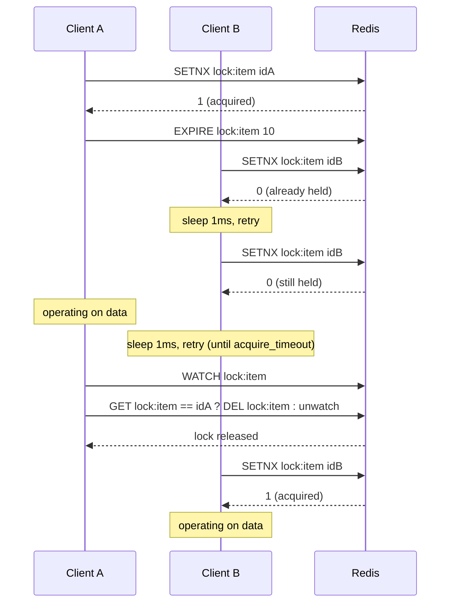

## Objective

Understand why an application spread across multiple machines needs an explicit lock even when every one of its operations against Redis is individually atomic — the classic "check-then-act" race, where two clients each read a value, decide it's safe to act, and then both act — and walk through the book's own build sequence for solving it: a naive `SETNX` lock, a lock that survives a crashed holder by adding a timeout, and a counting semaphore that generalizes "exactly one holder" into "up to N holders," plus the two specific correctness bugs each stage introduces and fixes.

## Use Cases

- Wrapping a multi-step read-modify-write against shared Redis structures (a marketplace ZSET, an inventory SET, a buyer's funds HASH) so that concurrent buyers and sellers don't need to retry a `WATCH`/`MULTI`/`EXEC` transaction under contention — the book's own benchmark shows retries collapsing from 80,000 to 0 and latency from ~150ms to ~5ms once a lock replaces `WATCH` on a loaded marketplace.
- Locking at the granularity of a single item rather than the whole market, when the data being protected is small relative to the structure that contains it — the book's "fine-grained locking" experiment pushes throughput to 220,000+ operations under the same load once the lock scope shrinks from "the whole market" to "the one item being bought or sold."
- Capping how many processes may concurrently call an external or rate-limited API on behalf of one account — the book's Fake Game Company scenario limits each account to five concurrent out-of-game marketplace processes using a counting semaphore instead of a lock.
- Building a long-lived semaphore for a streaming connection that needs to hold its slot far longer than a normal lock timeout, using a refresh operation instead of re-acquiring from scratch.
- Recognizing, when reviewing someone else's hand-rolled Redis lock, whether it has a timeout at all — the book is explicit that a lock without one is a lock that never comes back once its holder crashes mid-operation.

## Deep Dive

### Why locks are important: the check-then-act race

Redis already gives you atomic single commands and, via `WATCH`/`MULTI`/`EXEC`, "optimistic locking" — you're not preventing others from touching the data, you're "notified if someone else changes the data before we do it ourselves." That's enough for low contention. It stops being enough once load rises, because every conflicting write forces a retry of the whole transaction.

The book demonstrates this concretely with a simulated marketplace: one ZSET of listings, per-user HASHes of funds, per-user SETs of inventory. Listing an item watches the seller's inventory; buying watches the market and the buyer's account. Under light load (1 lister, 1 buyer) that's fine — about 3 retries per completed sale, 14ms average wait. Push it to 5 listers and 5 buyers and it falls apart: **161,000 retries, 498ms average latency**, because every listing and buying process is racing to modify the same watched keys and losing constantly. "This is a perfect example of why WATCH/MULTI/EXEC transactions sometimes don't scale at load."

The fix is the same one every shared-memory system eventually reaches for: "when you 'lock' data, you first acquire the lock, giving you exclusive access to the data. You then perform your operations. Finally, you release the lock to others." The only twist in Redis's case is scope — the lock has to be visible to every client on every machine, so it can't be an OS-level or language-level lock. It has to live in Redis itself, which is why the book builds one from Redis's primitives rather than reaching for `flock` or `synchronized`.

### Simple locks: SETNX, and the failure modes it doesn't cover

The natural building block is `SETNX` — "only set a value if the key doesn't already exist." Acquire the lock by trying to `SETNX lock:name` to a randomly generated 128-bit UUID identifier (not a constant — the identifier has to be unique per acquirer so release can verify ownership); retry with a short sleep until either it succeeds or an acquire timeout passes:

```python
def acquire_lock(conn, lockname, acquire_timeout=10):
    identifier = str(uuid.uuid4())
    end = time.time() + acquire_timeout
    while time.time() < end:
        if conn.setnx('lock:' + lockname, identifier):
            return identifier
        time.sleep(.001)
    return False
```

Releasing has to be just as careful as acquiring: `WATCH` the lock key, confirm the stored value still matches the identifier you were given (never blind-`DEL` — that can release a lock someone else has since acquired), then delete it inside a transaction. Wrapping the marketplace's buy/sell logic with exactly this acquire/release pair is what turns the earlier numbers around: at 5 listers and 5 buyers, retries go to **0** and latency drops to **14ms** — and shrinking the lock's scope from the whole market down to the single item being traded ("fine-grained locking") pushes throughput past 220,000 operations with **sub-3ms** latency, because contention now only exists between clients touching the *same* item.

But this first lock is explicitly incomplete. The book calls out, deliberately before fixing them, the exact ways a "mostly correct" lock breaks: a process holds the lock too long and doesn't know it lost it; a process crashes while holding the lock and everyone else waits forever; a lock times out and two processes both grab it; or a combination of the two, where several processes all believe they're the sole holder. At Redis's throughput — "100,000 operations per second on recent hardware" — even a one-in-a-million failure mode surfaces routinely under load. **The specific gap in this first version: there is no timeout, so a client that acquires the lock and crashes before releasing it leaves that lock held forever.** Every other client blocks on it indefinitely.

### Locks with timeouts: closing the crash gap, opening a narrower one

The fix is `EXPIRE`, set immediately after the lock is acquired, so Redis reclaims it automatically if the holder never comes back. But that introduces its own crash window: "the worst place for [the client] to crash for us is between `SETNX` and `EXPIRE`" — a lock could exist with no expiry at all. The book's workaround is defensive rather than atomic: any client that fails to acquire the lock checks whether the existing lock has a TTL set, and if not, sets one itself.

```python
def acquire_lock_with_timeout(conn, lockname, acquire_timeout=10, lock_timeout=10):
    identifier = str(uuid.uuid4())
    lock_timeout = int(math.ceil(lock_timeout))
    end = time.time() + acquire_timeout
    while time.time() < end:
        if conn.setnx(lockname, identifier):
            conn.expire(lockname, lock_timeout)
            return identifier
        elif not conn.ttl(lockname):
            conn.expire(lockname, lock_timeout)
        time.sleep(.001)
    return False
```

The book flags its own workaround as exactly that — a workaround, not the ideal fix — in a note right at the point it becomes relevant: "As of Redis 2.6.12, the SET command added options to support a combination of SETNX and SETEX functionality, which makes our lock acquire function trivial. We still need the complicated release lock to be correct." See "Book vs today" below for what that single-command version looks like and why it matters more than the book's own aside suggests.

The sequence below shows two clients racing for the same lock — one wins the `SETNX`, the other spins and retries, and the winner's timeout is what guarantees the loser (or a third client) eventually gets a turn even if the winner never calls release:



If A had crashed instead of releasing cleanly, B's retries would keep failing only until the `EXPIRE lock:item 10` from A's acquire ran out — after that, B's next `SETNX` would succeed on its own, with no manual intervention. That's the entire point of the timeout: it converts "wait forever for a lock that will never be released" into "wait at most `lock_timeout` seconds."

### Counting semaphores: the same lock, generalized to N holders

"A counting semaphore is a type of lock that allows you to limit the number of processes that can concurrently access a resource to some fixed number. You can think of the lock that we just created as being a counting semaphore with a limit of 1." Where a lock either has zero or one holder, a semaphore tracks up to N — and where a client would typically *wait* for a lock, it's normal for a semaphore acquire to fail immediately, telling the caller the resource is busy right now rather than making it queue.

The book builds this with a ZSET rather than `EXPIRE`, specifically because a ZSET can hold information about *multiple* holders in one structure. Each attempt generates a UUID identifier, adds it to the ZSET scored by the current timestamp, then checks its own rank: rank below the limit (Redis ranks are 0-indexed) means the semaphore was acquired; otherwise the caller removes its own entry and reports failure. Timeouts are handled by pruning ZSET entries older than the timeout window before each attempt.

```python
def acquire_semaphore(conn, semname, limit, timeout=10):
    identifier = str(uuid.uuid4())
    now = time.time()
    pipeline = conn.pipeline(True)
    pipeline.zremrangebyscore(semname, '-inf', now - timeout)
    pipeline.zadd(semname, identifier, now)
    pipeline.zrank(semname, identifier)
    if pipeline.execute()[-1] < limit:
        return identifier
    conn.zrem(semname, identifier)
    return None
```

This basic version has one honest flaw, and the book states it plainly: it trusts every client's system clock to agree. "If we had two systems A and B, where A ran even 10 milliseconds faster than B, then if A got the last semaphore, and B tried to get a semaphore within 10 milliseconds, B would actually 'steal' A's semaphore without A knowing it." **That's the fairness gap: a semaphore where a small clock skew can determine who gets the last slot is, by the book's own definition, unfair** — not incorrect in the sense of exceeding the limit, but capable of starving a client that should rightfully have gotten in.

### Fair semaphores and the race condition even they don't close

The fix replaces reliance on wall-clock time with a monotonically increasing counter: an `INCR`-based counter plus a second "owner" ZSET scored by that counter value, so whoever incremented the counter first wins ties regardless of whose system clock is faster or slower — correct as long as clocks agree to within a second or two, which is a far weaker assumption than "agree exactly." Timeouts still prune the original time-based ZSET; `ZINTERSTORE` with weights propagates those removals into the owner ZSET so a timed-out holder can't keep occupying a counter-assigned slot.

Even the fair version has one race left, and the book names it directly rather than hand-waving past it: with one slot remaining, if client A increments the counter first but client B finishes adding its identifier and checking its rank first, B gets the semaphore — then A's own add-and-check "steals" it back from B a moment later, and B has no way to know until it tries to release or refresh. **The fix for this last race is to reuse the earlier lock with timeout**: acquire that lock (with a very short acquire timeout, since it's only held for the few operations of the semaphore acquire itself), perform the semaphore acquire while holding it, then release the lock. "I know, it can be disappointing to come so far only to end up needing to use a lock at the end. But that's the thing with Redis: there are usually a few ways to solve the same or a similar problem, each with different trade-offs." The book's own summary of when to use which version: the basic, clock-trusting semaphore if occasional over-limit is tolerable and clocks are reliable; the fair, counter-based one if clocks are only roughly synchronized and occasional over-limit is still tolerable; the lock-wrapped fair semaphore if the limit must be correct every single time.

### Book vs today

> **The book's own aside about `SETNX` + `EXPIRE` undersells how much this has changed.** The note in section 6.2.5 says Redis 2.6.12 made the *acquire* trivial via a combined `SET`/`SETEX`; current Redis documentation confirms and generalizes this: the recommended acquire today is a single atomic command, `SET resource_name random_value NX PX 30000` (`NX` = only if absent, `PX` = expire in milliseconds; `EX` for whole seconds works the same way). That single command removes the book's entire "worst place to crash is between `SETNX` and `EXPIRE`" problem outright — there is no longer a window between setting the key and setting its expiry, because it's one command. The book's defensive "if I fail to acquire, check whether the lock has a TTL and set one if not" logic is a manual patch over a two-command gap that a modern client simply doesn't have.

> **Redlock — the multi-instance evolution of exactly what this chapter builds by hand.** The single-Redis-instance lock this concept covers is explicitly, per Redis's own current documentation, "the foundation we'll use for the distributed algorithm" — Redlock, which runs the identical acquire-with-random-value pattern against N independent Redis masters (5 is the reference count) in parallel, and only considers the lock acquired if a majority respond within the lock's validity window. It exists to remove the single point of failure a lone Redis instance represents: if that one instance's master crashes before replicating the lock key to a replica that gets promoted, two clients can end up believing they hold the same lock — "SAFETY VIOLATION!" in Redis's own words. Redlock trades that away by requiring a quorum across independent nodes instead of trusting any one of them. It also formalizes something the book's version glosses over: release uses a check-and-delete script (or, as of Redis 8.4, the atomic `DELEX key IFEQ value` command) rather than a blind `DEL`, for exactly the reason the book gives — a client shouldn't be able to delete a lock it no longer owns.
>
> Redlock's safety guarantees are genuinely disputed, and it's worth knowing that going in rather than treating Redlock as a solved problem. Martin Kleppmann published a detailed critique arguing Redlock's correctness depends on timing assumptions distributed systems can't actually guarantee — bounded network delay, bounded process pauses, and clocks that don't jump — and that without fencing tokens, a paused or delayed client can still act after its lock has expired. Redis's creator (antirez) published a counter-argument defending the algorithm's practical safety. Redis's own current documentation doesn't pretend this is settled: it links both pieces directly and adds its own disclaimer recommending fencing tokens and calling out that "Redis is not using monotonic clock for TTL expiration," so a wall-clock shift can still cause more than one process to believe it holds the lock. The honest read: Redlock is a real improvement over a single point of failure, not a proof of correctness under every failure mode.

> **You mostly don't have to hand-roll any of this anymore.** Official and widely used Redis client libraries now ship a lock primitive out of the box — `redis-py`'s `Redis.lock()` returns a context-manager-compatible `Lock` object that implements exactly the acquire/timeout/owner-checked-release pattern this chapter builds by hand, and dedicated Redlock implementations exist for most major languages (linked from Redis's own distributed-locks page). The book's step-by-step build is still the right way to *understand* what a distributed lock has to get right; it's no longer the right way to *ship* one.

## Trade-offs

- **A lock without a timeout is a liability, not a simplification.** Skipping `EXPIRE` removes the crash-window complexity the book spends a whole section on, but it means a single crashed holder — a process kill, an OOM, a deploy that never reaches the `finally` block — takes the lock out of circulation permanently. Every subsequent version in this chapter exists specifically to close that gap; there is no version of "simple lock, no timeout" that's safe to run in production.
- **A timeout picked too short turns a correctness fix into a new correctness bug.** If the protected operation can occasionally run longer than `lock_timeout`, the lock expires while its rightful holder is still working, a second client acquires it, and now two clients are operating on the same data believing each is exclusive — one of the exact failure modes the book lists before it starts fixing anything. Size the timeout to the slow tail of the operation, not the median.
- **Fine-grained locking buys throughput at the cost of deadlock risk.** The book's own numbers make a strong case for locking the smallest piece of data that needs protecting rather than a whole structure — but it says directly that "the use of multiple small locks can lead to deadlocks, which can prevent any work from being performed at all" once an operation needs more than one lock at a time. Locking one item is safe; locking several items per transaction needs a consistent acquisition order or a wait-for-graph, or it needs to not exist.
- **Semaphores trade lock semantics ("wait until available") for fail-fast semantics ("busy, try later") by convention, not by force.** Nothing stops you from writing a semaphore acquire that retries in a loop the way the lock does — but the whole reason to reach for a semaphore instead of N separate locks is usually to reject the (N+1)th caller immediately rather than queue it, and losing that property loses most of the reason to use a semaphore at all.
- **The clock-trusting basic semaphore is genuinely fine for some workloads and genuinely wrong for others.** If going one or two over the concurrency limit for a few milliseconds is harmless — a soft cap on background workers, say — the simplest, fastest version is the right choice. If the limit is a hard external constraint (a third-party API's actual concurrent-connection cap, a licensed seat count), the clock-skew "steal" the book describes is a real limit violation, not a rounding error, and only the counter-based fair semaphore (or the lock-wrapped version) is defensible.
- **Redlock buys quorum safety at 5x the operational cost, and it's still not a formal correctness proof.** Running five independent Redis masters instead of one is a real infrastructure and latency cost, paid to remove a real single-point-of-failure risk — but per the Kleppmann/antirez debate linked directly from Redis's own docs, Redlock without fencing tokens still permits a paused-then-resumed client to act after its lock should have expired. Treat "we use Redlock" as "we've addressed the single-instance failover risk," not as "our locking is now provably correct."
- **Hand-rolling this from scratch is a comprehension exercise more than a shipping recommendation today.** The book's incremental build — naive lock, timed lock, basic semaphore, fair semaphore, lock-guarded semaphore — is the right way to internalize what each failure mode looks like and why each fix exists. Reproducing all five stages in a real codebase, instead of reaching for `SET ... NX PX`, a maintained Redlock library, or a client's built-in `Lock()`, mostly reproduces bugs those tools have already found and fixed.

## Documentation Links

- Josiah Carlson, "Redis in Action" (Manning, 2013) — Chapter 6, "Application components in Redis," sections 6.2 "Distributed locking" and 6.3 "Counting semaphores," p. 116-133 — doc
- [Redis Documentation — Distributed Locks with Redis (Redlock algorithm, safety and liveness guarantees, analysis)](https://redis.io/docs/latest/develop/clients/patterns/distributed-locks/) — doc
- [Redis Documentation — SET command (NX, EX/PX options)](https://redis.io/docs/latest/commands/set/) — doc
- [Redis Documentation — EXPIRE command](https://redis.io/docs/latest/commands/expire/) — doc
- [Martin Kleppmann — "How to do distributed locking" (Redlock safety critique)](https://martin.kleppmann.com/2016/02/08/how-to-do-distributed-locking.html) — doc
- [antirez — "Is Redlock safe?" (response to the Kleppmann critique)](https://antirez.com/news/101) — doc
- [redis-py Documentation — Lock (built-in distributed lock context manager)](https://redis.readthedocs.io/en/stable/lock.html) — doc
