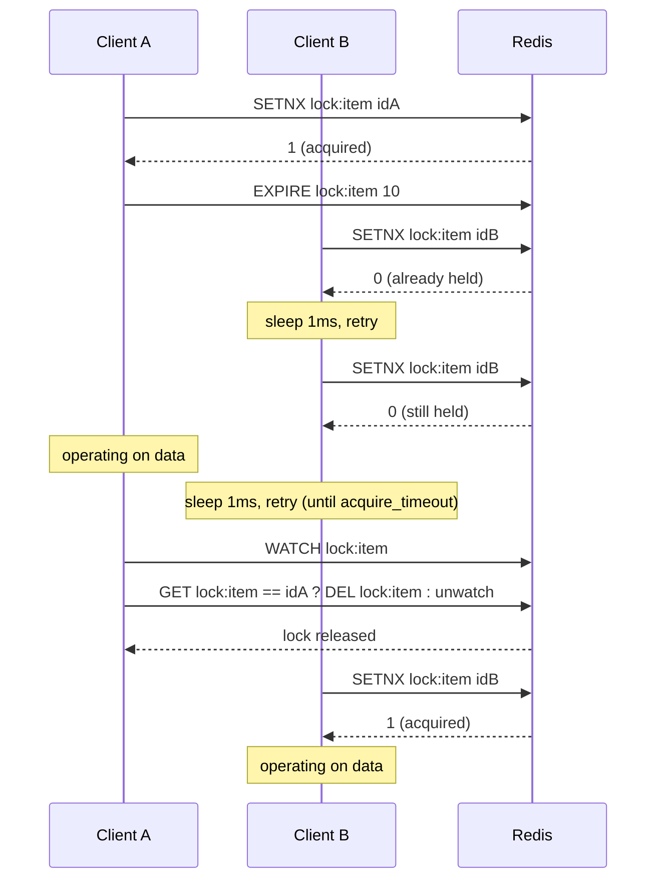

## Objective

Entender por que uma aplicação espalhada por várias máquinas precisa de um lock explícito mesmo quando toda operação dela contra o Redis é individualmente atômica: a clássica corrida de "checar-então-agir", onde dois clientes cada um lê um valor, decide que é seguro agir, e então os dois agem. E percorrer a própria sequência de construção do livro para resolver isso: um lock ingênuo com `SETNX`, um lock que sobrevive a um titular que travou adicionando um timeout, e um semáforo de contagem que generaliza "exatamente um titular" para "até N titulares", mais os dois bugs específicos de correção que cada estágio introduz e conserta.

## Use Cases

- Envolver uma leitura-modificação-escrita de vários passos contra estruturas Redis compartilhadas (um ZSET de marketplace, um SET de estoque, um HASH de fundos de um comprador) para que compradores e vendedores concorrentes não precisem retentar uma transação `WATCH`/`MULTI`/`EXEC` sob contenção: o próprio benchmark do livro mostra retentativas caindo de 80.000 para 0 e latência de ~150ms para ~5ms uma vez que um lock substitui `WATCH` em um marketplace sob carga.
- Fazer locking na granularidade de um único item em vez do mercado inteiro, quando o dado sendo protegido é pequeno em relação à estrutura que o contém: o experimento de "locking granular fino" do livro empurra o throughput para mais de 220.000 operações sob a mesma carga uma vez que o escopo do lock encolhe de "o mercado inteiro" para "o único item sendo comprado ou vendido."
- Limitar quantos processos podem chamar concorrentemente uma API externa ou com limite de taxa em nome de uma conta: o cenário da Fake Game Company do livro limita cada conta a cinco processos de marketplace fora do jogo concorrentes usando um semáforo de contagem em vez de um lock.
- Construir um semáforo de longa vida para uma conexão de streaming que precisa manter seu slot por muito mais tempo do que um timeout de lock normal, usando uma operação de refresh em vez de readquirir do zero.
- Reconhecer, ao revisar o lock Redis feito à mão de outra pessoa, se ele tem algum timeout: o livro é explícito que um lock sem um é um lock que nunca volta uma vez que seu titular trava no meio de uma operação.

## Deep Dive

### Por que locks são importantes: a corrida de checar-então-agir

O Redis já te dá comandos únicos atômicos e, via `WATCH`/`MULTI`/`EXEC`, "locking otimista": você não está impedindo outros de tocar o dado, você é "notificado se alguém mais mudar o dado antes de você mesmo fazer isso." Isso é suficiente para baixa contenção. Deixa de ser suficiente assim que a carga sobe, porque toda escrita conflitante força uma retentativa da transação inteira.

O livro demonstra isso concretamente com um marketplace simulado: um ZSET de anúncios, HASHes de fundos por usuário, SETs de estoque por usuário. Anunciar um item observa o estoque do vendedor; comprar observa o mercado e a conta do comprador. Sob carga leve (1 anunciante, 1 comprador) isso está bem, cerca de 3 retentativas por venda concluída, 14ms de espera média. Aumente para 5 anunciantes e 5 compradores e desmorona: **161.000 retentativas, 498ms de latência média**, porque todo processo de anúncio e compra está correndo para modificar as mesmas chaves observadas e perdendo constantemente. "Este é um exemplo perfeito de por que transações WATCH/MULTI/EXEC às vezes não escalam sob carga."

O conserto é o mesmo que todo sistema de memória compartilhada eventualmente recorre: "quando você 'trava' um dado, primeiro você adquire o lock, dando a você acesso exclusivo ao dado. Então você realiza suas operações. Por fim, você libera o lock para outros." O único detalhe diferente no caso do Redis é escopo: o lock precisa ser visível para todo cliente em toda máquina, então não pode ser um lock em nível de SO ou de linguagem. Ele precisa viver no próprio Redis, que é por que o livro constrói um a partir das primitivas do Redis em vez de recorrer a `flock` ou `synchronized`.

### Locks simples: SETNX, e os modos de falha que ele não cobre

O bloco de construção natural é `SETNX`: "só define um valor se a chave ainda não existir." Adquira o lock tentando um `SETNX lock:name` para um identificador UUID de 128 bits gerado aleatoriamente (não uma constante: o identificador precisa ser único por adquirente para que a liberação possa verificar propriedade); retente com uma pequena pausa até ou ter sucesso ou um timeout de aquisição passar:

```python
def acquire_lock(conn, lockname, acquire_timeout=10):
    identifier = str(uuid.uuid4())
    end = time.time() + acquire_timeout
    while time.time() < end:
        if conn.setnx('lock:' + lockname, identifier):
            return identifier
        time.sleep(.001)
    return False
```

Liberar precisa ser tão cuidadoso quanto adquirir: dê `WATCH` na chave do lock, confirme que o valor armazenado ainda corresponde ao identificador que foi dado a você (nunca um `DEL` cego: isso pode liberar um lock que outra pessoa já adquiriu desde então), então o apague dentro de uma transação. Envolver a lógica de compra/venda do marketplace com exatamente esse par de adquirir/liberar é o que inverte os números anteriores: com 5 anunciantes e 5 compradores, retentativas vão para **0** e a latência cai para **14ms**; e encolher o escopo do lock do mercado inteiro para o único item sendo negociado ("locking granular fino") empurra o throughput para além de 220.000 operações com latência de **menos de 3ms**, porque agora só existe contenção entre clientes tocando o *mesmo* item.

Mas esse primeiro lock é explicitamente incompleto. O livro aponta, deliberadamente antes de consertá-los, as formas exatas com que um lock "majoritariamente correto" quebra: um processo segura o lock por tempo demais e não sabe que o perdeu; um processo trava enquanto segura o lock e todo mundo mais espera para sempre; um lock expira e dois processos o pegam ao mesmo tempo; ou uma combinação dos dois, onde vários processos acreditam que são o único titular. No throughput do Redis ("100.000 operações por segundo em hardware recente"), até um modo de falha de um-em-um-milhão aparece rotineiramente sob carga. **A lacuna específica nesta primeira versão: não há timeout, então um cliente que adquire o lock e trava antes de liberá-lo deixa esse lock retido para sempre.** Todo outro cliente bloqueia nele indefinidamente.

### Locks com timeout: fechando a lacuna de crash, abrindo uma mais estreita

O conserto é `EXPIRE`, definido imediatamente depois de o lock ser adquirido, para que o Redis o recupere automaticamente se o titular nunca voltar. Mas isso introduz sua própria janela de crash: "o pior lugar para [o cliente] travar para nós é entre `SETNX` e `EXPIRE`": um lock poderia existir sem nenhuma expiração de jeito nenhum. O workaround do livro é defensivo em vez de atômico: qualquer cliente que falha em adquirir o lock checa se o lock existente tem um TTL definido, e se não, define um ele mesmo.

```python
def acquire_lock_with_timeout(conn, lockname, acquire_timeout=10, lock_timeout=10):
    identifier = str(uuid.uuid4())
    lock_timeout = int(math.ceil(lock_timeout))
    end = time.time() + acquire_timeout
    while time.time() < end:
        if conn.setnx(lockname, identifier):
            conn.expire(lockname, lock_timeout)
            return identifier
        elif not conn.ttl(lockname):
            conn.expire(lockname, lock_timeout)
        time.sleep(.001)
    return False
```

O livro sinaliza seu próprio workaround como exatamente isso, um workaround, não o conserto ideal, em uma nota bem no ponto em que se torna relevante: "a partir do Redis 2.6.12, o comando SET adicionou opções para suportar uma combinação de funcionalidade SETNX e SETEX, o que torna nossa função de aquisição de lock trivial. Ainda precisamos que a complicada liberação de lock esteja correta." Veja "Livro vs. hoje" abaixo para como é essa versão de comando único e por que ela importa mais do que o próprio comentário do livro sugere.

A sequência abaixo mostra dois clientes disputando o mesmo lock: um vence o `SETNX`, o outro fica girando e retentando, e o timeout do vencedor é o que garante que o perdedor (ou um terceiro cliente) eventualmente ganha sua vez mesmo se o vencedor nunca chamar a liberação:



Se A tivesse travado em vez de liberar de forma limpa, as retentativas de B continuariam falhando só até o `EXPIRE lock:item 10` da aquisição de A se esgotar; depois disso, o próximo `SETNX` de B teria sucesso sozinho, sem intervenção manual. Esse é o ponto inteiro do timeout: ele converte "espere para sempre por um lock que nunca será liberado" em "espere no máximo `lock_timeout` segundos."

### Semáforos de contagem: o mesmo lock, generalizado para N titulares

"Um semáforo de contagem é um tipo de lock que permite limitar o número de processos que podem acessar concorrentemente um recurso a algum número fixo. Você pode pensar no lock que acabamos de criar como sendo um semáforo de contagem com um limite de 1." Onde um lock tem zero ou um titular, um semáforo rastreia até N; e onde um cliente tipicamente *esperaria* por um lock, é normal uma aquisição de semáforo falhar imediatamente, dizendo a quem chamou que o recurso está ocupado agora em vez de fazê-lo entrar em fila.

O livro constrói isso com um ZSET em vez de `EXPIRE`, especificamente porque um ZSET consegue guardar informação sobre *vários* titulares em uma estrutura. Toda tentativa gera um identificador UUID, o adiciona ao ZSET com score do timestamp atual, então checa seu próprio rank: rank abaixo do limite (ranks do Redis são indexados a partir de 0) significa que o semáforo foi adquirido; caso contrário, quem chama remove sua própria entrada e reporta falha. Timeouts são tratados podando entradas de ZSET mais antigas do que a janela de timeout antes de cada tentativa.

```python
def acquire_semaphore(conn, semname, limit, timeout=10):
    identifier = str(uuid.uuid4())
    now = time.time()
    pipeline = conn.pipeline(True)
    pipeline.zremrangebyscore(semname, '-inf', now - timeout)
    pipeline.zadd(semname, identifier, now)
    pipeline.zrank(semname, identifier)
    if pipeline.execute()[-1] < limit:
        return identifier
    conn.zrem(semname, identifier)
    return None
```

Esta versão básica tem uma falha honesta, e o livro a declara claramente: ela confia que o relógio de sistema de todo cliente concorda. "Se tivéssemos dois sistemas A e B, onde A rodasse mesmo que 10 milissegundos mais rápido que B, então se A pegasse o último semáforo, e B tentasse pegar um semáforo dentro de 10 milissegundos, B na verdade 'roubaria' o semáforo de A sem A saber." **Essa é a lacuna de justiça: um semáforo onde um pequeno desvio de relógio pode determinar quem pega o último slot é, pela própria definição do livro, injusto**: não incorreto no sentido de ultrapassar o limite, mas capaz de deixar sem recurso um cliente que deveria legitimamente ter entrado.

### Semáforos justos e a condição de corrida que nem eles fecham

O conserto substitui a dependência do relógio de parede por um contador monotonicamente crescente: um contador baseado em `INCR` mais um segundo ZSET "proprietário" com score do valor daquele contador, então quem incrementou o contador primeiro vence empates independentemente de qual relógio de sistema é mais rápido ou mais lento: correto contanto que os relógios concordem dentro de um segundo ou dois, uma suposição bem mais fraca do que "concordar exatamente." Timeouts ainda podam o ZSET original baseado em tempo; `ZINTERSTORE` com pesos propaga essas remoções para o ZSET proprietário para que um titular expirado não continue ocupando um slot atribuído por contador.

Mesmo a versão justa tem uma corrida restante, e o livro a nomeia diretamente em vez de passar por cima dela: com um slot restante, se o cliente A incrementa o contador primeiro mas o cliente B termina de adicionar seu identificador e checar seu rank primeiro, B pega o semáforo; então a própria adição-e-checagem de A "rouba" de volta de B um momento depois, e B não tem como saber até que tente liberar ou atualizar. **O conserto para essa última corrida é reutilizar o lock anterior com timeout**: adquira esse lock (com um timeout de aquisição bem curto, já que ele só é retido pelas poucas operações da própria aquisição de semáforo), realize a aquisição de semáforo enquanto o segura, depois libere o lock. "Eu sei, pode ser decepcionante chegar tão longe só para acabar precisando usar um lock no final. Mas é assim que é com o Redis: geralmente há algumas formas de resolver o mesmo problema ou um parecido, cada uma com trade-offs diferentes." O próprio resumo do livro sobre quando usar qual versão: o semáforo básico que confia no relógio se um ultrapasse ocasional do limite é tolerável e os relógios são confiáveis; o baseado em contador e justo se os relógios estão só aproximadamente sincronizados e um ultrapasse ocasional ainda é tolerável; o semáforo justo envolto em lock se o limite precisa estar correto todas as vezes.

### Livro vs. hoje

> **O próprio comentário do livro sobre `SETNX` + `EXPIRE` subestima o quanto isso mudou.** A nota na seção 6.2.5 diz que o Redis 2.6.12 tornou a *aquisição* trivial via um `SET`/`SETEX` combinado; a documentação atual do Redis confirma e generaliza isso: a aquisição recomendada hoje é um único comando atômico, `SET resource_name random_value NX PX 30000` (`NX` = só se ausente, `PX` = expira em milissegundos; `EX` para segundos inteiros funciona da mesma forma). Esse único comando remove por completo o problema inteiro do livro de "o pior lugar para travar é entre `SETNX` e `EXPIRE`": não existe mais uma janela entre definir a chave e definir sua expiração, porque é um único comando. A lógica defensiva do livro de "se eu falhar em adquirir, checo se o lock tem um TTL e defino um se não" é um patch manual sobre uma lacuna de dois comandos que um cliente moderno simplesmente não tem.

> **Redlock: a evolução multi-instância de exatamente o que este capítulo constrói à mão.** O lock de instância única do Redis que este conceito cobre é explicitamente, segundo a própria documentação atual do Redis, "a base que vamos usar para o algoritmo distribuído": o Redlock, que roda o padrão idêntico de aquisição com valor aleatório contra N masters Redis independentes (5 é a contagem de referência) em paralelo, e só considera o lock adquirido se uma maioria responder dentro da janela de validade do lock. Ele existe para remover o ponto único de falha que uma única instância Redis representa: se o master dessa instância travar antes de replicar a chave do lock para uma réplica que é promovida, dois clientes podem acabar acreditando que seguram o mesmo lock: "VIOLAÇÃO DE SEGURANÇA!" nas próprias palavras do Redis. O Redlock troca isso exigindo um quorum entre nós independentes em vez de confiar em qualquer um deles sozinho. Ele também formaliza algo que a versão do livro passa por cima: a liberação usa um script de checar-e-apagar (ou, a partir do Redis 8.4, o comando atômico `DELEX key IFEQ value`) em vez de um `DEL` cego, pelo exato mesmo motivo que o livro dá: um cliente não deveria conseguir apagar um lock que não possui mais.
>
> As garantias de segurança do Redlock são genuinamente contestadas, e vale a pena saber disso de antemão em vez de tratar o Redlock como um problema resolvido. Martin Kleppmann publicou uma crítica detalhada argumentando que a correção do Redlock depende de suposições de tempo que sistemas distribuídos não conseguem de fato garantir (atraso de rede limitado, pausas de processo limitadas, e relógios que não pulam), e que sem tokens de cerca (fencing tokens), um cliente pausado ou atrasado ainda consegue agir depois que seu lock deveria ter expirado. O criador do Redis (antirez) publicou um contra-argumento defendendo a segurança prática do algoritmo. A própria documentação atual do Redis não finge que isso está resolvido: ela linka os dois textos diretamente e adiciona seu próprio disclaimer recomendando tokens de cerca e apontando que "o Redis não usa relógio monotônico para expiração de TTL", então uma mudança de relógio de parede ainda pode fazer mais de um processo acreditar que segura o lock. A leitura honesta: o Redlock é uma melhoria real sobre um ponto único de falha, não uma prova de correção sob todo modo de falha.

> **Você majoritariamente não precisa mais fazer nada disso à mão.** Bibliotecas de cliente Redis oficiais e amplamente usadas agora vêm com uma primitiva de lock pronta: o `Redis.lock()` do `redis-py` retorna um objeto `Lock` compatível com context manager que implementa exatamente o padrão de aquisição/timeout/liberação-verificada-por-proprietário que este capítulo constrói à mão, e implementações dedicadas de Redlock existem para a maioria das linguagens principais (linkadas na própria página de locks distribuídos do Redis). A construção passo a passo do livro ainda é a forma certa de *entender* o que um lock distribuído precisa acertar; não é mais a forma certa de *colocar um em produção*.

## Trade-offs

- **Um lock sem timeout é um passivo, não uma simplificação.** Pular `EXPIRE` remove a complexidade da janela de crash à qual o livro dedica uma seção inteira, mas significa que um único titular que trava (um kill de processo, um OOM, um deploy que nunca chega ao bloco `finally`) tira o lock de circulação permanentemente. Toda versão subsequente neste capítulo existe especificamente para fechar essa lacuna; não existe uma versão de "lock simples, sem timeout" que seja segura de rodar em produção.
- **Um timeout escolhido curto demais transforma um conserto de correção em um novo bug de correção.** Se a operação protegida ocasionalmente pode rodar mais tempo do que `lock_timeout`, o lock expira enquanto seu titular legítimo ainda está trabalhando, um segundo cliente o adquire, e agora dois clientes estão operando no mesmo dado acreditando que cada um é exclusivo: um dos modos de falha exatos que o livro lista antes de começar a consertar qualquer coisa. Dimensione o timeout pela cauda lenta da operação, não pela mediana.
- **Locking granular fino compra throughput ao custo de risco de deadlock.** Os próprios números do livro fazem um caso forte para travar o menor pedaço de dado que precisa de proteção em vez de uma estrutura inteira, mas o livro diz diretamente que "o uso de múltiplos locks pequenos pode levar a deadlocks, o que pode impedir qualquer trabalho de ser realizado" uma vez que uma operação precisa de mais de um lock por vez. Travar um item é seguro; travar vários itens por transação precisa de uma ordem de aquisição consistente ou de um grafo de espera, ou precisa não existir.
- **Semáforos trocam semântica de lock ("espere até disponível") por semântica de fail-fast ("ocupado, tente depois") por convenção, não por força.** Nada te impede de escrever uma aquisição de semáforo que retenta em um loop do jeito que o lock faz, mas o motivo inteiro de recorrer a um semáforo em vez de N locks separados geralmente é rejeitar imediatamente o (N+1)-ésimo chamador em vez de enfileirá-lo, e perder essa propriedade perde a maior parte do motivo de usar um semáforo.
- **O semáforo básico que confia no relógio é genuinamente aceitável para algumas cargas de trabalho e genuinamente errado para outras.** Se ultrapassar em um ou dois o limite de concorrência por alguns milissegundos é inofensivo (um teto flexível em workers de fundo, digamos), a versão mais simples e rápida é a escolha certa. Se o limite é uma restrição externa rígida (o teto real de conexões concorrentes de uma API de terceiros, uma contagem de assentos licenciados), o "roubo" por desvio de relógio que o livro descreve é uma violação de limite real, não um erro de arredondamento, e só o semáforo justo baseado em contador (ou a versão envolta em lock) é defensável.
- **O Redlock compra segurança de quorum a 5x o custo operacional, e ainda não é uma prova formal de correção.** Rodar cinco masters Redis independentes em vez de um é um custo real de infraestrutura e latência, pago para remover um risco real de ponto único de falha, mas segundo o debate Kleppmann/antirez linkado diretamente na própria documentação do Redis, o Redlock sem tokens de cerca ainda permite que um cliente pausado e depois retomado aja depois que seu lock deveria ter expirado. Trate "usamos Redlock" como "endereçamos o risco de failover de instância única", não como "nosso locking agora está provadamente correto."
- **Fazer isso à mão do zero é mais um exercício de compreensão do que uma recomendação de colocar em produção hoje.** A construção incremental do livro (lock ingênuo, lock com timeout, semáforo básico, semáforo justo, semáforo protegido por lock) é a forma certa de internalizar como cada modo de falha se parece e por que cada conserto existe. Reproduzir os cinco estágios em uma base de código real, em vez de recorrer a `SET ... NX PX`, uma biblioteca Redlock mantida, ou o `Lock()` embutido de um cliente, majoritariamente reproduz bugs que essas ferramentas já encontraram e consertaram.

## Documentation Links

- [Josiah Carlson, "Redis in Action" (Manning, 2013), Chapter 6, "Application components in Redis," sections 6.2 "Distributed locking" and 6.3 "Counting semaphores," p. 116-133] - doc
- [Redis Documentation: Distributed Locks with Redis (Redlock algorithm, safety and liveness guarantees, analysis)](https://redis.io/docs/latest/develop/clients/patterns/distributed-locks/) - doc
- [Redis Documentation: SET command (NX, EX/PX options)](https://redis.io/docs/latest/commands/set/) - doc
- [Redis Documentation: EXPIRE command](https://redis.io/docs/latest/commands/expire/) - doc
- [Martin Kleppmann: "How to do distributed locking" (Redlock safety critique)](https://martin.kleppmann.com/2016/02/08/how-to-do-distributed-locking.html) - doc
- [antirez: "Is Redlock safe?" (response to the Kleppmann critique)](https://antirez.com/news/101) - doc
- [redis-py Documentation: Lock (built-in distributed lock context manager)](https://redis.readthedocs.io/en/stable/lock.html) - doc
