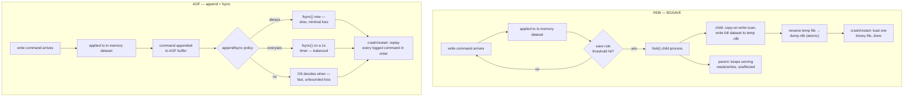

## Objective

Understand the two independent, combinable mechanisms Redis provides for getting data that lives only in memory onto disk — RDB, a point-in-time binary snapshot produced by forking a child process, and AOF, an append-only log of every write command that gets replayed on restart — and what each one actually costs and guarantees. RDB is essentials's "fast reads and writes... very similar to Redis's in-memory representation," rebuilt in one shot on restart; AOF is Redis in Action's "record of data changes... recover the entire dataset by replaying the append-only log from the beginning to the end." Both books converge on the same conclusion from different angles: neither mechanism alone is the right default for data you can't afford to lose, and Redis lets you run both at once for exactly that reason.

## Use Cases

- Choosing RDB alone for a cache or a dataset where losing the last few minutes of writes on a crash is acceptable — Redis Essentials's own guidance: "if your application has tolerance to data loss, use RDB."
- Enabling AOF (or AOF plus RDB) for data that must survive a crash with minimal loss — a queue of financial events, an inventory ledger, session state a user would notice disappearing — where Redis in Action's `appendfsync everysec` default caps the exposure at "at most one second of data."
- Sizing a backup and disaster-recovery routine around RDB specifically, because a single compact `.rdb` file is what both books recommend shipping off-box: "RDB is great for backups and disaster recovery because it allows you to save an RDB file every hour, day, week, or month."
- Deciding whether `BGSAVE`'s fork is safe to run on a given box, using Redis in Action's own measured fork costs (10-20ms/GB on real hardware or KVM, 200-300ms/GB under Xen) to decide whether automatic snapshotting needs to be disabled in favor of a scheduled `SAVE` during a maintenance window instead.
- Recovering a crashed instance and knowing, before restart, which file Redis will actually load if both `dump.rdb` and an AOF are present — Redis Essentials is explicit that "if both files exist, the AOF takes precedence because of its durability guarantees."
- Debugging a slow Redis restart on a large dataset by recognizing the AOF-replay cost directly: Redis Essentials's own `pageview` example — restoring from AOF means re-executing 100,000 `INCR` commands one at a time, where RDB just materializes the final value.
- Tuning `appendfsync` deliberately rather than leaving it on a default nobody chose: `always` for the lowest possible loss window at a real throughput cost, `everysec` as Redis in Action's "reasonable compromise," or `no` only when the operating system's own flush cadence is an acceptable risk.

## Deep Dive

### Why memory needs a way onto disk at all

Redis's core promise — in-memory speed — has a built-in cost: "memory is transient. Therefore, if a Redis instance is shut down, crashes, or needs to be rebooted, all of the stored data will be lost." Both books frame persistence as answering that one problem, but from different angles. Redis Essentials treats it as infrastructure you configure once and mostly forget. Redis in Action treats it as a design decision with real operational consequences — Carlson opens the chapter by saying the goal is "keep your data safe, even in the face of system failure," and spends real space on what a given configuration actually loses when the failure happens, not just how to turn the feature on.

### RDB: fork, copy-on-write, one binary file

RDB works by taking "a point in time representing the data stored in a Redis instance" and writing it as a single binary file, `dump.rdb` by default. The mechanism is what makes it fast and mostly non-disruptive: `SAVE` writes synchronously and blocks every client until it finishes — "avoided" for that reason — while `BGSAVE` is what's actually used in practice. On `BGSAVE`, the `redis-server` process calls `fork()`. Both books describe the identical mechanism, one operationally and one down to the OS primitive: "the main process will never perform any disk I/O operations" (Redis Essentials), because "on Unix and Unix-like systems... initially, all memory is shared between the child and parent processes. When either the parent or child process writes to memory, that memory will stop being shared" (Redis in Action's footnote on copy-on-write). The child writes the full dataset to a temporary file and renames it into place atomically when done; the parent keeps serving reads and writes the whole time, paying only for the pages it mutates during the snapshot window.

That fork is also RDB's one real cost, and Redis in Action puts numbers on it that Redis Essentials only gestures at: on real hardware, KVM, or VMware, forking costs roughly 10-20ms per gigabyte of Redis memory; under Xen virtualization (the case for older EC2 instances), that jumps to 200-300ms per gigabyte — a 20GB dataset going from a sub-half-second pause to a 4-6 second one purely because of the hypervisor underneath it. Carlson's own field example: a 50GB instance on a 68GB Xen host took 15+ seconds just to fork, then 15-20 minutes to finish the `BGSAVE` under write load — versus 3-5 minutes using a blocking `SAVE` with writes paused, because there was no fork contending with the snapshot for memory bandwidth.

Snapshot timing is driven by `save` directives — `save <seconds> <changes>` — and Redis ships three by default, evaluated as an OR: any one of them firing triggers a `BGSAVE`.

```
save 900 1
save 300 10
save 60 10000
```

Read as: at least 1 write in 900 seconds triggers a save; at least 10 writes in 300 seconds triggers a save; at least 10,000 writes in 60 seconds triggers a save. The two books frame the same knob from opposite directions — Redis Essentials warns "it is not recommended to use save directives less than 30 seconds apart from each other," while Redis in Action walks through picking a *looser* interval deliberately: a personal dev box with `save 900 1` because the operator "generally trust[s] my hardware," or disabling automatic snapshotting entirely on a big-memory production box and driving `SAVE`/`BGSAVE` by hand on a schedule, specifically to control *when* the fork pause happens instead of leaving it to whatever moment crosses the threshold.

### AOF: append every write, replay them all on restart

AOF takes the opposite approach: instead of periodically re-deriving the current state, it logs the *operations* that produced it. "Every time Redis receives a command that changes the dataset, it will append that command to the AOF." Restart replays that log from the start, "preserving the order," to rebuild the dataset one command at a time. The trade Redis Essentials names directly: "this feature comes at the expense of performance and additional disk space" — you're paying disk I/O per write instead of per snapshot interval, and the log is not a compact representation of final state the way RDB's file is; it's a full history of every mutation.

That history has one significant practical upside RDB's binary format doesn't: an AOF is a plain, ordered command log — "human-readable," in Redis Essentials's words, "no seeks and corruption problems can be easily identified" — and `redis-check-aof` can repair a truncated or corrupted file. Redis in Action pushes that further into a concrete recovery trick: because AOF is a literal sequence of Redis protocol commands, an accidental `FLUSHALL` can sometimes be undone by stopping the server, opening the AOF in a text editor, deleting the trailing `FLUSHALL` entry, and restarting — as long as no rewrite has happened since.

Durability under AOF is governed by `appendfsync`, and the choice is a direct latency-versus-loss dial. Redis in Action lays out the mechanics of what "durable" even means here: a write first lands in an in-process buffer (`write()`), which the OS may hold before it's actually on disk; `fsync()` is the explicit instruction that blocks until the data is physically committed. The three policies:

| Policy | Behavior | Cost |
|---|---|---|
| `always` | `fsync()` after every write | safest, slowest — bound by raw disk write throughput (~200/s on spinning disk) |
| `everysec` | `fsync()` once per second (the default) | loses at most ~1 second of writes on crash; "good write performance" |
| `no` | never call `fsync()`; the OS decides | fastest, least predictable — an unbounded, kernel-dependent loss window |

Redis Essentials and Redis in Action land on the identical practical recommendation from different directions: `everysec` as the default worth actually keeping, `always` reserved for data where even a one-second window is unacceptable, and `no` mentioned mainly so it's understood rather than because it's advisable — Carlson: "I generally discourage the use of this configuration option." Both books also flag the same physical hazard with `always` on solid-state media: writing every single change immediately, instead of letting the OS batch writes, can cause severe write amplification and measurably shorten an SSD's service life.

### The AOF's other cost: it only ever grows

An append-only log has no built-in mechanism to shrink — incrementing one counter 100 times leaves 100 entries in the AOF for a single final value, 99 of which are redundant for reconstructing current state. Left alone, the file both consumes unbounded disk space and makes every future restart slower, because restart means re-executing the entire log in order. `BGREWRITEAOF` solves this the same way `BGSAVE` solves RDB's problem — fork a child, and let it write a fresh, minimal log representing only the commands needed to reach the current dataset — with `auto-aof-rewrite-percentage` and `auto-aof-rewrite-min-size` controlling when that happens automatically (Redis Essentials's defaults: grow 100% past the size at last rewrite, and at least 64MB, before triggering one).



### RDB versus AOF: the book's own comparison

Redis Essentials devotes a section specifically to this trade-off, and its sharpest example is restore speed: a key called `pageview` incremented from 1 to 100,000 over a day means AOF replay has to run 100,000 `INCR` commands in sequence to reach the current value, while RDB just materializes `pageview = 100000` directly from the snapshot — "much faster." That asymmetry — AOF pays at replay time what RDB paid at snapshot time — is the core of the comparison: RDB is optimized for fast, compact recovery of a point in time; AOF is optimized for minimizing how much of that point in time can be lost.

Both books arrive at the same operational answer: run them together. "Although RDB and AOF are different strategies, they can be enabled at the same time" — and when both files exist at startup, "the AOF takes precedence because of its durability guarantees." Redis Essentials's own condensed guidance: disable both if the application tolerates no persistence at all; use RDB alone if the application tolerates losing whatever's changed since the last snapshot; use RDB and AOF together if the application needs the durability guarantee AOF provides plus the fast-restart and clean-backup properties only RDB gives you. Redis in Action reaches the identical destination from the failure-mode side — snapshots alone risk losing everything since the last completed save, so anything less than a fully durable requirement pushes toward combining both rather than picking one.

### Book vs today

> **Both books' single-file AOF is gone as of Redis 7.0 — replaced by Multi Part AOF.** Redis Essentials and Redis in Action both describe AOF as one growing file that `BGREWRITEAOF` replaces wholesale. Since Redis 7.0.0, current Redis documentation confirms AOF is instead split into a base file (at most one, in RDB or AOF format) plus one or more incremental files, all living in a dedicated directory (`appenddirname`) and tracked by a manifest file that records which files are current. A rewrite no longer means "buffer new writes in memory while the child writes a whole new file and hope the buffer doesn't grow unboundedly" — the parent simply opens a fresh incremental file and keeps appending to it while the child builds a new base file in the background, then an atomic manifest swap makes the new set current. This directly removes a real pre-7.0 failure mode Redis's own docs call out: AOF rewrites could previously buffer all writes arriving during the rewrite in memory, doubling disk writes and risking a freeze at the end of a large rewrite. The mechanism both books teach — one file, grown and periodically rewritten in place — is the *old* AOF; anyone inspecting a modern Redis data directory will find an `appendonlydir/` full of numbered base/incremental files and a manifest, not a single `appendonly.aof`.
>
> **The defaults haven't moved.** `appendfsync everysec` remains Redis's documented default and recommended policy; `appendonly` still defaults to `no`, meaning AOF is opt-in exactly as both books describe. RDB's default save points are unchanged too — current Redis ships the same `save 900 1` / `save 300 10` / `save 60 10000` triggers Redis Essentials documents. Nothing about *when* Redis decides to persist has changed since either book was written; only the shape of the AOF files on disk has.
>
> **A newer capability neither book could have anticipated: the `BACKUP` command family (Redis 8.10.0+).** Current documentation describes `BACKUP START` / `LIST` / `SEAL` / `CLEANUP`, which produce a self-contained, restorable backup — reusing the Multi Part AOF format's base/incremental/manifest layout — without the manual "disable auto-rewrite, confirm no rewrite in progress, copy files, re-enable" dance both books' backup guidance still requires today for a live AOF directory. It's additive, not a replacement for the RDB-snapshot-to-S3 pattern either book describes for disaster recovery, but it closes a gap both books' backup sections leave open by hand.

## Trade-offs

- **RDB alone is fast and compact but has a hard floor on data loss.** Even saving every minute with a low change threshold, Redis Essentials is explicit: "RDB is not a 100% guaranteed data recovery approach... be prepared to lose the latest writes in your database." There is no `save` configuration that closes this gap to zero — snapshotting is inherently a point-in-time mechanism, and the point is always in the past by definition.
- **AOF's durability is bought with disk I/O, disk space, and slower restarts on a large dataset.** `appendfsync always` gets closest to zero loss but is throughput-bound by the disk itself; even `everysec` costs more than no persistence at all. And unlike RDB's single materialized file, restoring a big AOF means re-executing its entire command history — Redis Essentials's `pageview` example is the whole trade-off in miniature.
- **Running both is the durability-plus-speed answer, but it isn't free — it's two persistence subsystems instead of one.** Redis Essentials's own decision table treats "use both" as the answer specifically for applications that "require fully durable persistence," not as a default to reach for regardless of need; it means AOF's write overhead *and* RDB's periodic fork cost, on the same instance, for the workloads that actually require both properties.
- **The fork behind `BGSAVE` (and, historically, AOF rewrites) is not free, and the cost is invisible until the dataset or the virtualization layer makes it visible.** Redis in Action's own numbers — a 10-20x cost multiplier moving from bare-metal/KVM to Xen — mean the same `save` configuration that's harmless on one host can pause Redis for multiple seconds on another. This is a reason to test persistence configuration on infrastructure that matches production, not just to tune the `save` line and assume it generalizes.
- **`appendfsync no` trades away exactly the property AOF exists to provide.** It performs identically to having no persistence at all under normal operation, with an unpredictable, kernel-dependent loss window on crash — Redis in Action documents it "for completeness" rather than as a real recommendation, and that framing is deliberate.
- **Multi Part AOF changes the *mechanics* of rewriting, not the fundamental trade-off.** It removes one specific pre-7.0 failure mode (in-memory write buffering during rewrite, and the double-write/possible-freeze at rewrite's end) without changing what `appendfsync` costs, what `fork()` costs, or the core RDB-versus-AOF durability-versus-speed calculus either book teaches. Don't read "the file format got better" as "the trade-off went away."

## Documentation Links

- Da Silva, Cassela, Nugraha, Yaramada, "Redis Essentials" (Packt Publishing, 2015) — Chapter 8, "Scaling Redis (Beyond a Single Instance)," section "Persistence" (RDB, AOF, RDB versus AOF), p. 141-146 — doc
- Josiah Carlson, "Redis in Action" (Manning, 2013) — Chapter 4, "Keeping data safe and ensuring performance," section 4.1 "Persistence options," p. 64-70 — doc
- [Redis Documentation — Redis persistence (RDB, AOF, Multi Part AOF, BACKUP command family)](https://redis.io/docs/latest/operate/oss_and_stack/management/persistence/) — doc
- [Redis Documentation — SAVE command](https://redis.io/docs/latest/commands/save/) — doc
- [Redis Documentation — BGSAVE command](https://redis.io/docs/latest/commands/bgsave/) — doc
- [Redis Documentation — BGREWRITEAOF command](https://redis.io/docs/latest/commands/bgrewriteaof/) — doc
- [Redis Documentation — Redis configuration (save, appendonly, appendfsync directives)](https://redis.io/docs/latest/operate/oss_and_stack/management/config/) — doc
- [antirez — "Redis persistence demystified"](http://oldblog.antirez.com/post/redis-persistence-demystified.html) — doc
