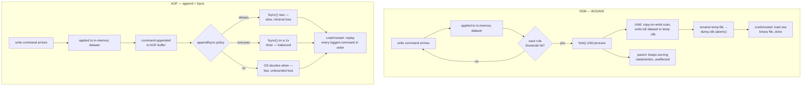

## Objective

Entender os dois mecanismos independentes e combináveis que o Redis fornece para levar dados que moram só na memória para o disco: RDB, um snapshot binário de um ponto no tempo produzido fazendo fork de um processo filho, e AOF, um log append-only de todo comando de escrita que é reproduzido no restart, e o que cada um de fato custa e garante. RDB é "leituras e escritas rápidas... muito parecido com a representação em memória do Redis" de Essentials, reconstruído de uma vez no restart; AOF é o "registro de mudanças de dado... recupere o dataset inteiro reproduzindo o log append-only do início ao fim" de Redis in Action. Os dois livros convergem para a mesma conclusão a partir de ângulos diferentes: nenhum dos dois mecanismos sozinho é o padrão certo para dado que você não pode se dar ao luxo de perder, e o Redis te deixa rodar os dois de uma vez exatamente por esse motivo.

## Use Cases

- Escolher só RDB para um cache ou um dataset onde perder os últimos minutos de escrita em um crash é aceitável: a própria orientação de Redis Essentials: "se sua aplicação tem tolerância a perda de dado, use RDB."
- Habilitar AOF (ou AOF mais RDB) para dado que precisa sobreviver a um crash com perda mínima: uma fila de eventos financeiros, um livro-razão de estoque, estado de sessão que um usuário notaria desaparecer: onde o padrão `appendfsync everysec` de Redis in Action limita a exposição a "no máximo um segundo de dado."
- Dimensionar uma rotina de backup e disaster recovery em torno de RDB especificamente, porque um único arquivo `.rdb` compacto é o que os dois livros recomendam enviar para fora da máquina: "RDB é ótimo para backups e disaster recovery porque permite salvar um arquivo RDB toda hora, dia, semana, ou mês."
- Decidir se o fork do `BGSAVE` é seguro de rodar em uma dada máquina, usando os próprios custos de fork medidos por Redis in Action (10-20ms/GB em hardware real ou KVM, 200-300ms/GB sob Xen) para decidir se o snapshotting automático precisa ser desativado em favor de um `SAVE` agendado durante uma janela de manutenção em vez disso.
- Recuperar uma instância que travou e saber, antes do restart, qual arquivo o Redis de fato vai carregar se tanto `dump.rdb` quanto um AOF estiverem presentes: Redis Essentials é explícito que "se os dois arquivos existem, o AOF tem precedência por causa de suas garantias de durabilidade."
- Depurar um restart lento do Redis em um dataset grande reconhecendo diretamente o custo de replay do AOF: o próprio exemplo `pageview` de Redis Essentials: restaurar de AOF significa reexecutar 100.000 comandos `INCR` um de cada vez, onde RDB só materializa o valor final.
- Ajustar `appendfsync` deliberadamente em vez de deixar em um padrão que ninguém escolheu: `always` para a menor janela de perda possível a um custo real de throughput, `everysec` como o "compromisso razoável" de Redis in Action, ou `no` só quando a própria cadência de flush do sistema operacional é um risco aceitável.

## Deep Dive

### Por que a memória precisa de uma forma de ir para o disco em primeiro lugar

A promessa central do Redis (velocidade em memória) tem um custo embutido: "memória é transiente. Portanto, se uma instância Redis é desligada, trava, ou precisa ser reiniciada, todo o dado armazenado será perdido." Os dois livros enquadram persistência como resposta a esse único problema, mas de ângulos diferentes. Redis Essentials a trata como infraestrutura que você configura uma vez e majoritariamente esquece. Redis in Action a trata como uma decisão de design com consequências operacionais reais: Carlson abre o capítulo dizendo que o objetivo é "manter seu dado seguro, mesmo diante de falha de sistema", e gasta espaço real sobre o que uma dada configuração de fato perde quando a falha acontece, não só como ligar o recurso.

### RDB: fork, copy-on-write, um arquivo binário

O RDB funciona pegando "um ponto no tempo representando o dado armazenado em uma instância Redis" e o escrevendo como um único arquivo binário, `dump.rdb` por padrão. O mecanismo é o que o torna rápido e majoritariamente não disruptivo: `SAVE` escreve de forma síncrona e bloqueia todo cliente até terminar (por isso "evitado"), enquanto `BGSAVE` é o que de fato é usado na prática. No `BGSAVE`, o processo `redis-server` chama `fork()`. Os dois livros descrevem o mecanismo idêntico, um operacionalmente e o outro até a primitiva do SO: "o processo principal nunca vai realizar nenhuma operação de I/O de disco" (Redis Essentials), porque "em sistemas Unix e tipo Unix... inicialmente, toda memória é compartilhada entre os processos filho e pai. Quando o pai ou o filho escreve na memória, essa memória para de ser compartilhada" (a nota de rodapé de Redis in Action sobre copy-on-write). O filho escreve o dataset completo em um arquivo temporário e o renomeia para o lugar atomicamente quando termina; o pai continua servindo leituras e escritas o tempo todo, pagando só pelas páginas que muta durante a janela de snapshot.

Esse fork também é o único custo real do RDB, e Redis in Action coloca números nisso que Redis Essentials só sinaliza: em hardware real, KVM, ou VMware, fazer fork custa aproximadamente 10-20ms por gigabyte de memória Redis; sob virtualização Xen (o caso de instâncias EC2 mais antigas), isso salta para 200-300ms por gigabyte: um dataset de 20GB indo de uma pausa de menos de meio segundo para uma de 4-6 segundos puramente por causa do hypervisor por baixo. O próprio exemplo de campo de Carlson: uma instância de 50GB em um host Xen de 68GB levou mais de 15 segundos só para fazer fork, depois 15-20 minutos para terminar o `BGSAVE` sob carga de escrita, contra 3-5 minutos usando um `SAVE` bloqueante com escritas pausadas, porque não havia fork disputando largura de banda de memória com o snapshot.

O timing de snapshot é conduzido por diretivas `save`: `save <seconds> <changes>`, e o Redis vem com três por padrão, avaliadas como um OU: qualquer uma delas disparando aciona um `BGSAVE`.

```
save 900 1
save 300 10
save 60 10000
```

Lido como: pelo menos 1 escrita em 900 segundos dispara um save; pelo menos 10 escritas em 300 segundos dispara um save; pelo menos 10.000 escritas em 60 segundos dispara um save. Os dois livros enquadram o mesmo botão de direções opostas: Redis Essentials avisa "não é recomendado usar diretivas save com menos de 30 segundos de diferença entre si", enquanto Redis in Action percorre a escolha deliberada de um intervalo *mais frouxo*: uma máquina de desenvolvimento pessoal com `save 900 1` porque o operador "geralmente confia no [meu] hardware", ou desativando snapshotting automático por completo em uma máquina de produção com muita memória e conduzindo `SAVE`/`BGSAVE` à mão em uma programação, especificamente para controlar *quando* a pausa do fork acontece em vez de deixar para qualquer momento que cruze o limiar.

### AOF: adicione toda escrita, reproduza tudo no restart

O AOF adota a abordagem oposta: em vez de rederivar periodicamente o estado atual, ele registra as *operações* que o produziram. "Toda vez que o Redis recebe um comando que muda o dataset, ele vai adicionar esse comando ao AOF." O restart reproduz esse log desde o início, "preservando a ordem", para reconstruir o dataset um comando de cada vez. A troca que Redis Essentials nomeia diretamente: "esse recurso vem à custa de desempenho e espaço em disco adicional": você está pagando I/O de disco por escrita em vez de por intervalo de snapshot, e o log não é uma representação compacta do estado final do jeito que o arquivo do RDB é; é um histórico completo de toda mutação.

Esse histórico tem uma vantagem prática significativa que o formato binário do RDB não tem: um AOF é um log de comando puro e ordenado ("legível por humano", nas palavras de Redis Essentials, "problemas de seek e corrupção podem ser facilmente identificados") e o `redis-check-aof` consegue reparar um arquivo truncado ou corrompido. Redis in Action empurra isso mais adiante em um truque de recuperação concreto: como o AOF é uma sequência literal de comandos do protocolo Redis, um `FLUSHALL` acidental às vezes pode ser desfeito parando o servidor, abrindo o AOF em um editor de texto, apagando a entrada final `FLUSHALL`, e reiniciando, contanto que nenhum rewrite tenha acontecido desde então.

Durabilidade sob AOF é governada por `appendfsync`, e a escolha é um botão direto de latência-versus-perda. Redis in Action expõe a mecânica do que "durável" sequer significa aqui: uma escrita primeiro pousa em um buffer no processo (`write()`), que o SO pode segurar antes de ela de fato estar em disco; `fsync()` é a instrução explícita que bloqueia até o dado ser fisicamente confirmado. As três políticas:

| Política | Comportamento | Custo |
|---|---|---|
| `always` | `fsync()` depois de toda escrita | mais segura, mais lenta: limitada pelo throughput de escrita bruto do disco (~200/s em disco rígido) |
| `everysec` | `fsync()` uma vez por segundo (o padrão) | perde no máximo ~1 segundo de escritas em um crash; "bom desempenho de escrita" |
| `no` | nunca chama `fsync()`; o SO decide | mais rápida, menos previsível: uma janela de perda ilimitada e dependente de kernel |

Redis Essentials e Redis in Action chegam à mesma recomendação prática idêntica a partir de direções diferentes: `everysec` como o padrão que vale a pena de fato manter, `always` reservado para dado onde mesmo uma janela de um segundo é inaceitável, e `no` mencionado principalmente para ser entendido em vez de por ser aconselhável: Carlson: "geralmente desencorajo o uso dessa opção de configuração." Os dois livros também sinalizam o mesmo perigo físico com `always` em mídia de estado sólido: escrever toda única mudança imediatamente, em vez de deixar o SO agrupar escritas, pode causar amplificação de escrita severa e encurtar mensuravelmente a vida útil de um SSD.

### O outro custo do AOF: ele só cresce

Um log append-only não tem nenhum mecanismo embutido de encolher: incrementar um contador 100 vezes deixa 100 entradas no AOF para um único valor final, 99 das quais são redundantes para reconstruir o estado atual. Deixado sozinho, o arquivo tanto consome espaço em disco ilimitado quanto torna todo restart futuro mais lento, porque restart significa reexecutar o log inteiro em ordem. O `BGREWRITEAOF` resolve isso da mesma forma que o `BGSAVE` resolve o problema do RDB: fazer fork de um filho, e deixá-lo escrever um log novo e mínimo representando só os comandos necessários para chegar ao dataset atual, com `auto-aof-rewrite-percentage` e `auto-aof-rewrite-min-size` controlando quando isso acontece automaticamente (os padrões de Redis Essentials: crescer 100% além do tamanho no último rewrite, e pelo menos 64MB, antes de disparar um).



### RDB versus AOF: a própria comparação do livro

Redis Essentials dedica uma seção especificamente a essa troca, e seu exemplo mais afiado é velocidade de restauração: uma chave chamada `pageview` incrementada de 1 para 100.000 ao longo de um dia significa que o replay de AOF precisa rodar 100.000 comandos `INCR` em sequência para chegar ao valor atual, enquanto RDB só materializa `pageview = 100000` diretamente do snapshot: "muito mais rápido." Essa assimetria (AOF paga no momento do replay o que RDB pagou no momento do snapshot) é o núcleo da comparação: RDB é otimizado para recuperação rápida e compacta de um ponto no tempo; AOF é otimizado para minimizar quanto desse ponto no tempo pode ser perdido.

Os dois livros chegam à mesma resposta operacional: rode os dois juntos. "Embora RDB e AOF sejam estratégias diferentes, eles podem ser habilitados ao mesmo tempo": e quando os dois arquivos existem na inicialização, "o AOF tem precedência por causa de suas garantias de durabilidade." A própria orientação condensada de Redis Essentials: desative os dois se a aplicação não tolera nenhuma persistência; use só RDB se a aplicação tolera perder o que quer que tenha mudado desde o último snapshot; use RDB e AOF juntos se a aplicação precisa da garantia de durabilidade que o AOF fornece mais as propriedades de restart rápido e backup limpo que só o RDB te dá. Redis in Action chega ao destino idêntico pelo lado do modo de falha: snapshots sozinhos arriscam perder tudo desde o último save concluído, então qualquer coisa menos do que um requisito totalmente durável empurra para combinar os dois em vez de escolher um.

### Livro vs. hoje

> **O AOF de arquivo único dos dois livros se foi a partir do Redis 7.0, substituído pelo Multi Part AOF.** Redis Essentials e Redis in Action ambos descrevem o AOF como um arquivo crescente que o `BGREWRITEAOF` substitui por completo. Desde o Redis 7.0.0, a documentação atual do Redis confirma que o AOF em vez disso é dividido em um arquivo base (no máximo um, em formato RDB ou AOF) mais um ou mais arquivos incrementais, todos morando em um diretório dedicado (`appenddirname`) e rastreados por um arquivo manifesto que registra quais arquivos são atuais. Um rewrite não significa mais "bufferize novas escritas em memória enquanto o filho escreve um arquivo inteiramente novo e torça para o buffer não crescer sem limite": o pai simplesmente abre um arquivo incremental novo e continua adicionando a ele enquanto o filho constrói um novo arquivo base em segundo plano, depois uma troca atômica de manifesto torna o novo conjunto atual. Isso remove diretamente um modo de falha real pré-7.0 que a própria documentação do Redis aponta: rewrites de AOF anteriormente podiam bufferizar em memória todas as escritas chegando durante o rewrite, dobrando escritas em disco e arriscando um congelamento no final de um rewrite grande. O mecanismo que os dois livros ensinam (um arquivo, crescido e periodicamente reescrito no lugar) é o AOF *antigo*; quem inspecionar um diretório de dados Redis moderno vai encontrar um `appendonlydir/` cheio de arquivos base/incrementais numerados e um manifesto, não um único `appendonly.aof`.
>
> **Os padrões não mudaram.** `appendfsync everysec` continua sendo o padrão documentado e recomendado do Redis; `appendonly` ainda tem padrão `no`, significando que o AOF é opt-in exatamente como os dois livros descrevem. Os pontos de save padrão do RDB também estão inalterados: o Redis atual vem com os mesmos gatilhos `save 900 1` / `save 300 10` / `save 60 10000` que Redis Essentials documenta. Nada sobre *quando* o Redis decide persistir mudou desde qualquer um dos dois livros ter sido escrito; só o formato dos arquivos AOF em disco.
>
> **Uma capacidade mais nova que nenhum dos dois livros poderia ter antecipado: a família de comandos `BACKUP` (Redis 8.10.0+).** A documentação atual descreve `BACKUP START` / `LIST` / `SEAL` / `CLEANUP`, que produzem um backup autocontido e restaurável (reutilizando o layout base/incremental/manifesto do formato Multi Part AOF) sem a dança manual de "desativar auto-rewrite, confirmar que nenhum rewrite está em progresso, copiar arquivos, reativar" que a orientação de backup dos dois livros ainda exige hoje para um diretório AOF ao vivo. É aditivo, não uma substituição do padrão de snapshot-RDB-para-S3 que qualquer um dos livros descreve para disaster recovery, mas fecha uma lacuna que as seções de backup dos dois livros deixam em aberto à mão.

## Trade-offs

- **RDB sozinho é rápido e compacto mas tem um piso rígido de perda de dado.** Mesmo salvando todo minuto com um limiar de mudança baixo, Redis Essentials é explícito: "RDB não é uma abordagem de recuperação de dado 100% garantida... esteja preparado para perder as últimas escritas no seu banco de dados." Não existe configuração `save` que feche essa lacuna a zero: snapshotting é inerentemente um mecanismo de ponto no tempo, e o ponto está sempre no passado por definição.
- **A durabilidade do AOF é comprada com I/O de disco, espaço em disco, e restarts mais lentos em um dataset grande.** `appendfsync always` chega mais perto de zero perda mas é limitado por throughput pelo próprio disco; até `everysec` custa mais do que nenhuma persistência de jeito nenhum. E diferente do arquivo único materializado do RDB, restaurar um AOF grande significa reexecutar seu histórico de comando inteiro: o exemplo `pageview` de Redis Essentials é a troca inteira em miniatura.
- **Rodar os dois é a resposta durabilidade-mais-velocidade, mas não é de graça: são dois subsistemas de persistência em vez de um.** A própria tabela de decisão de Redis Essentials trata "use os dois" como a resposta especificamente para aplicações que "exigem persistência totalmente durável", não como um padrão para recorrer independentemente da necessidade; significa o overhead de escrita do AOF *e* o custo periódico de fork do RDB, na mesma instância, para as cargas de trabalho que de fato exigem as duas propriedades.
- **O fork por trás do `BGSAVE` (e, historicamente, rewrites de AOF) não é de graça, e o custo é invisível até que o dataset ou a camada de virtualização o torne visível.** Os próprios números de Redis in Action (um multiplicador de custo de 10-20x movendo de bare-metal/KVM para Xen) significam que a mesma configuração `save` que é inofensiva em um host pode pausar o Redis por vários segundos em outro. Esse é um motivo para testar configuração de persistência em infraestrutura que corresponde à produção, não só ajustar a linha `save` e presumir que generaliza.
- **`appendfsync no` abre mão exatamente da propriedade que o AOF existe para fornecer.** Ele tem desempenho idêntico a não ter nenhuma persistência de jeito nenhum sob operação normal, com uma janela de perda imprevisível e dependente de kernel em caso de crash: Redis in Action o documenta "por completude" em vez de como uma recomendação real, e esse enquadramento é deliberado.
- **O Multi Part AOF muda a *mecânica* de rewriting, não a troca fundamental.** Ele remove um modo de falha específico pré-7.0 (bufferização de escrita em memória durante o rewrite, e a escrita dupla/possível congelamento no fim do rewrite) sem mudar o que `appendfsync` custa, o que `fork()` custa, ou o cálculo central de durabilidade-versus-velocidade RDB-versus-AOF que qualquer um dos livros ensina. Não leia "o formato do arquivo melhorou" como "a troca foi embora."

## Documentation Links

- [Da Silva, Cassela, Nugraha, Yaramada, "Redis Essentials" (Packt Publishing, 2015), Chapter 8, "Scaling Redis (Beyond a Single Instance)," section "Persistence" (RDB, AOF, RDB versus AOF), p. 141-146] - doc
- [Josiah Carlson, "Redis in Action" (Manning, 2013), Chapter 4, "Keeping data safe and ensuring performance," section 4.1 "Persistence options," p. 64-70] - doc
- [Redis Documentation: Redis persistence (RDB, AOF, Multi Part AOF, BACKUP command family)](https://redis.io/docs/latest/operate/oss_and_stack/management/persistence/) - doc
- [Redis Documentation: SAVE command](https://redis.io/docs/latest/commands/save/) - doc
- [Redis Documentation: BGSAVE command](https://redis.io/docs/latest/commands/bgsave/) - doc
- [Redis Documentation: BGREWRITEAOF command](https://redis.io/docs/latest/commands/bgrewriteaof/) - doc
- [Redis Documentation: Redis configuration (save, appendonly, appendfsync directives)](https://redis.io/docs/latest/operate/oss_and_stack/management/config/) - doc
- [antirez: "Redis persistence demystified"](http://oldblog.antirez.com/post/redis-persistence-demystified.html) - doc
