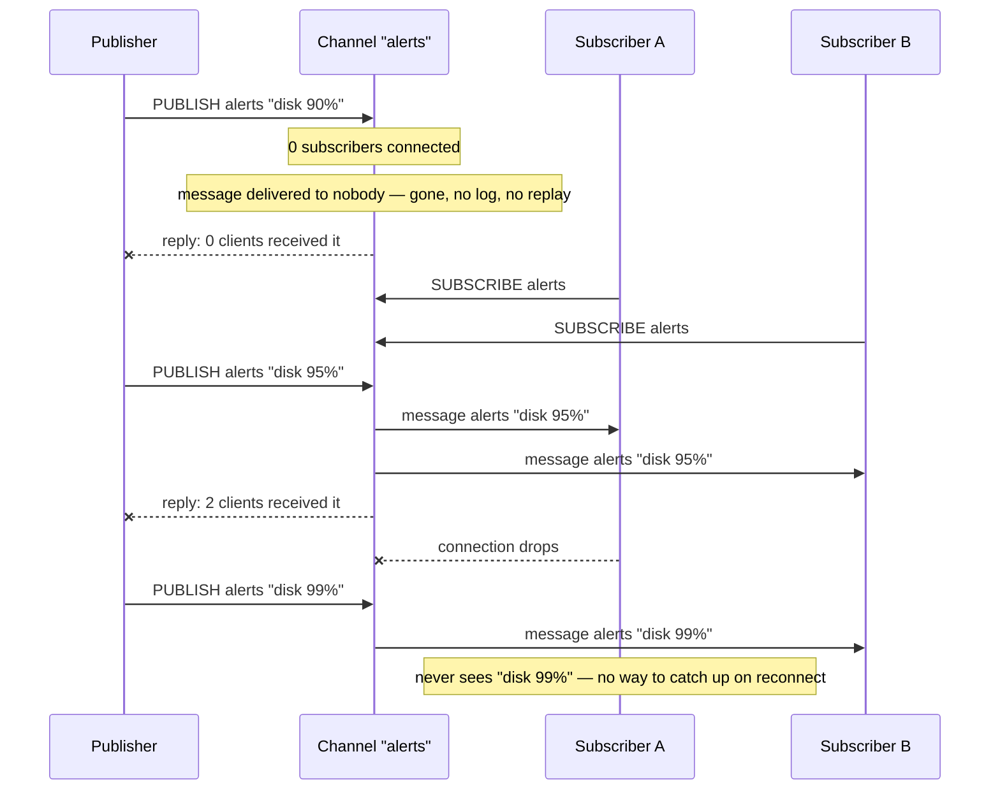

## Objective

Understand Redis Pub/Sub as what it actually is: a live message broadcast built on four commands — `SUBSCRIBE`, `PUBLISH`, `PSUBSCRIBE`, `UNSUBSCRIBE`/`PUNSUBSCRIBE` — with no storage layer underneath it at all. Redis in Action frames the whole model in one sentence: "the concept of publish/subscribe, also known as pub/sub, is characterized by listeners subscribing to channels, with publishers sending binary string messages to channels. Anyone listening to a given channel will receive all messages sent to that channel while they're connected and listening. You can think of it like a radio station." That analogy is the whole mental model, and it's also the whole limitation: a radio station broadcasts whether or not anyone is tuned in, and Redis Essentials states the consequence for Pub/Sub bluntly — "a message gets lost if there are no clients subscribed to the channel when it comes in." There is no channel-side buffer, no log, no way to ask "what did I miss." The sibling `redis-streams` concept exists specifically because some workloads can't tolerate that; this concept is about understanding Pub/Sub's own mechanics well enough to know when its simplicity is exactly what's wanted instead.

## Use Cases

- **Live dashboards and broadcast UI updates** — Redis Essentials' own list: "News and weather dashboards," any feed where a slightly-missed update self-corrects on the next publish, so losing one in-flight message under a reconnect is a non-event.
- **Chat and ephemeral notification delivery** — "Chat applications" and "Push notifications, such as subway delay alerts" — a connected client sees messages live; an offline client is expected to catch up some other way (a REST poll, a database read) rather than through Pub/Sub itself.
- **Fan-out control signals across a fleet of servers** — Redis Essentials builds exactly this as a worked example: a `PUBLISH`ed command name (`DATE`, `PING`, `HOSTNAME`) is received by every server subscribed to a channel and executed locally, "similar to what the SaltStack tool supports" — remote command execution without each server polling anything.
- **Cache-invalidation and cross-instance signaling** — one process changes something and publishes a channel message telling every other connected process ("cache key X is stale," "config reloaded") to react; if a listener happens to be down when that fires, it'll get the next signal or catch up on its own restart logic, so at-most-once is an acceptable trade for zero setup.
- **Anything where the honest answer to "what if a subscriber is offline for a second" is "that's fine"** — the moment the honest answer becomes "that's not fine, we need it to still get that exact message later," this isn't the right tool; see `redis-streams`' consumer groups and Pending Entries List for the at-least-once alternative, or `redis-partitioning-and-cluster-fundamentals` if the real problem is scaling Pub/Sub itself across a cluster (Sharded Pub/Sub, below).

## Deep Dive

### PUBLISH, SUBSCRIBE, and the "nobody home" problem

`PUBLISH channel message` sends a message to a channel and returns the number of clients that received it — which doubles as a live check of whether anyone was listening at that instant. Redis Essentials is direct about what happens otherwise: "A message gets lost if there are no clients subscribed to the channel when it comes in." Nothing is queued, nothing is written to disk, nothing waits for a subscriber to show up. Redis in Action's current documentation equivalent states the same fact as a formal guarantee: "Redis' Pub/Sub exhibits *at-most-once* message delivery semantics... Once the message is sent by the Redis server, there's no chance of it being sent again. If the subscriber is unable to handle the message [for example, due to an error or a network disconnect] the message is forever lost." At-most-once means exactly what it says: zero or one delivery, never a guaranteed one, and never a replay.

`SUBSCRIBE channel [channel ...]` opens a subscription to one or more exact channel names; `UNSUBSCRIBE [channel ...]` closes it (with no arguments, it unsubscribes from everything). Pub/Sub channels are also entirely disconnected from the keyspace — current Redis documentation is explicit: "Pub/Sub has no relation to the key space. It was made to not interfere with it on any level, including database numbers. Publishing on db 10, will be heard by a subscriber on db 1." A channel is just a name; it isn't a key, doesn't expire, doesn't show up in `KEYS`, and a Pub/Sub-only Redis instance would technically hold zero keys the whole time it's broadcasting.

### PSUBSCRIBE: pattern matching over channel names

`PSUBSCRIBE pattern [pattern ...]` subscribes to every channel whose name matches a glob-style pattern rather than one fixed name — Redis Essentials: "the commands PSUBSCRIBE and PUNSUBSCRIBE work the same way as the SUBSCRIBE and UNSUBSCRIBE commands, but they accept glob-style patterns as channel names." `PSUBSCRIBE news.*` receives everything published to `news.art.figurative`, `news.music.jazz`, or any other channel matching that pattern, with no need to know channel names in advance.

Pattern subscriptions change the message envelope a client receives. A plain `SUBSCRIBE` delivers a `message` reply — channel name, then payload. A `PSUBSCRIBE` delivers a `pmessage` reply instead — the *pattern* that matched, then the actual channel name, then the payload — so a client can tell which subscription triggered delivery even when several patterns are active at once. This distinction has a real consequence: a client subscribed to both `foo` (exact) and `f*` (pattern) receives a *single* published message on channel `foo` **twice** — once as `message`, once as `pmessage` — because both subscriptions independently matched it. That's not a bug to work around; it's how the two subscription types compose, and client code needs to be written with that in mind if it mixes exact and pattern subscriptions on overlapping names.

`PUBSUB` introspects the live subscription state without subscribing to anything: `PUBSUB CHANNELS [pattern]` lists currently active channels (those with at least one subscriber), optionally filtered by a glob pattern; `PUBSUB NUMSUB [channel ...]` returns how many clients are subscribed to each named channel via `SUBSCRIBE`; `PUBSUB NUMPAT` returns the total count of distinct patterns any client is currently subscribed to via `PSUBSCRIBE` (a single number, not a per-pattern breakdown). This is the operational surface for answering "is anyone actually listening to this channel right now" before deciding whether it's safe to `PUBLISH` something time-sensitive.

### The subscribed client: a connection that stops behaving like a normal one

Redis Essentials flags this as important enough to call out on its own: "Once a Redis client executes the command SUBSCRIBE or PSUBSCRIBE, it enters the subscribe mode and stops accepting commands, except for the commands SUBSCRIBE, PSUBSCRIBE, UNSUBSCRIBE, and PUNSUBSCRIBE." That connection is no longer a general-purpose command connection — it's dedicated to receiving pushed messages, and application code that needs to both `PUBLISH`/run other commands *and* `SUBSCRIBE` needs two separate connections, one for each role. This is exactly the pattern the book's own worked example uses: `publisher.js` opens a plain client, calls `PUBLISH`, and quits; `subscriber.js` opens a *different* client, calls `SUBSCRIBE`, and then just sits there reacting to a `message` event handler — it never issues another command on that connection.

Current Redis documentation sharpens exactly which commands are allowed on a subscribed RESP2 connection — a slightly larger set than the 2015 book's four: `PING`, `PSUBSCRIBE`, `PUNSUBSCRIBE`, `QUIT`, `RESET`, `SSUBSCRIBE`, `SUBSCRIBE`, `SUNSUBSCRIBE`, and `UNSUBSCRIBE`. Everything else is rejected on that connection until the subscription count drops back to zero. Under the newer RESP3 protocol, this restriction is lifted entirely — "a client can issue any commands while in the subscribed state" — because RESP3's push-message framing lets Redis distinguish an asynchronous pushed message from a normal command reply on the same connection, removing the need to dedicate the connection to subscriptions only.

### Delivery reliability: the buffer problem, then and now

Redis in Action's explanation of why the book mostly avoids Pub/Sub is worth reading directly, because it's a second, distinct reliability concern beyond simple message loss: "in older versions of Redis, a client that had subscribed to channels but didn't read sent messages fast enough could cause Redis itself to keep a large outgoing buffer. If this outgoing buffer grew too large, it could cause Redis to slow down drastically or crash, could cause the operating system to kill Redis, and could even cause the operating system itself to become unusable." That was a server-stability risk, not just a client-side data-loss risk — a slow subscriber could take the whole Redis instance down with it. The book immediately notes the fix that had already shipped by 2013: "Modern versions of Redis don't have this issue, and will disconnect subscribed clients that are unable to keep up with the `client-output-buffer-limit pubsub` configuration option." That configuration is still how current Redis protects itself today — a subscribed client whose output buffer exceeds the configured hard or soft limit gets disconnected outright, trading "the client silently falls behind and eventually gets some messages" for "the client is cut off cleanly and has to resubscribe," which is the safer failure mode for the server but still just another way a subscriber can lose messages.

The book's second reason is the one that matters most for this concept: "in the case of clients that have subscribed, if the client is disconnected and a message is sent before it can reconnect, the client will never see the message." A reconnecting Pub/Sub subscriber has no way to ask "what did I miss between disconnect and reconnect" — there is no history to query, unlike `redis-streams`' `XREAD ... STREAMS mystream <last-seen-id>`, which lets a reconnecting client resume exactly where it left off because the entries are still there. The book's own conclusion doubles as the practical rule for when Pub/Sub is the right tool: "If you like the simplicity of using PUBLISH/SUBSCRIBE, and you're okay with the chance that you may lose a little data, then feel free to use pub/sub."

### Sharded Pub/Sub: scaling the broadcast itself across a cluster

Classic `PUBLISH`/`SUBSCRIBE` has a scaling problem that's specific to Redis Cluster rather than to a single instance: a published message has to reach every subscriber regardless of which cluster node they're connected to, so Redis Cluster propagates every classic Pub/Sub message to *every node in the cluster* over the gossip bus, whether or not that node has any subscribers for that channel. Redis 7.0 (2022) added **Sharded Pub/Sub** to fix exactly this: `SSUBSCRIBE`, `SPUBLISH`, and `SUNSUBSCRIBE` work like their unsharded counterparts, except a shard channel is hashed to one of the cluster's 16384 hash slots by the same `CRC16(key) mod 16384` algorithm `redis-partitioning-and-cluster-fundamentals` covers for keys, and a shard message is only forwarded to the nodes that own that slot (the master and its replicas) — not the whole cluster. Current Redis documentation states the payoff directly: "Sharded Pub/Sub helps to scale the usage of Pub/Sub in cluster mode. It restricts the propagation of messages to be within the shard of a cluster... This allows users to horizontally scale the Pub/Sub usage by adding more shards." Two limitations follow from the scoping itself and are worth knowing before reaching for it: pattern subscriptions (the `PSUBSCRIBE` equivalent) are not supported in sharded mode at all, and a sharded subscriber cannot see messages published with plain `PUBLISH`, nor can a plain `SUBSCRIBE`r see `SPUBLISH`ed ones — the two systems are entirely separate channel namespaces, not two ways of reaching the same subscribers. None of this changes Pub/Sub's own delivery semantics — a sharded channel with zero subscribers still loses the message exactly the same way an unsharded one does; Sharded Pub/Sub is purely a cluster-topology fix, not a durability upgrade.

### Fire-and-forget, visualized

The same `PUBLISH` call behaves three different ways depending purely on who happens to be connected at that instant — the message itself never changes, only the number of clients that get lucky enough to be listening when it fires.

## Trade-offs

- **Zero setup versus zero guarantees is the whole trade, and it's not a flaw to design around — it's the entire point of choosing Pub/Sub.** No key to create, no group to manage, no cleanup, no trimming policy: `SUBSCRIBE`/`PUBLISH` and it works. That's the correct choice exactly when losing an occasional message under a dead or absent subscriber is genuinely fine — a live dashboard tick, a cache-invalidation ping, a "someone updated the config" nudge. `redis-streams` exists for the moment that stops being true: it trades this zero-setup simplicity for `XGROUP CREATE`, `XACK`, and `XPENDING`/`XCLAIM` recovery machinery, in exchange for at-least-once delivery and full replay. Reaching for Streams' machinery for a use case that would happily tolerate an occasional dropped message is over-engineering the wrong direction; reaching for Pub/Sub when a dropped message is actually unacceptable is the opposite mistake.
- **A reconnecting subscriber has a blind spot with no way to measure or close it.** There's no sequence number, no last-seen marker, no `XRANGE`-style backfill query for a Pub/Sub channel — the client either was connected when a message went out, or it wasn't, and there's no way after the fact to even know how much it missed. Applications that need "catch up on reconnect" behavior have to build that themselves outside Pub/Sub entirely (a periodic full-state poll, a database read on reconnect), or use Streams instead, where that behavior is what `XREAD` from a remembered ID already does.
- **A subscribed connection is a dedicated connection, which is easy to get wrong in connection-pooled code.** Issuing `SUBSCRIBE` commits that connection to Pub/Sub mode until every channel and pattern is unsubscribed (RESP2) — general commands on it will fail. Code paths that both publish and subscribe need two separate client connections, and pooling code that doesn't account for this can silently hand out a "poisoned" subscribed connection to code expecting a normal one. RESP3 removes the restriction, but only for clients that have actually negotiated RESP3 via `HELLO`.
- **Mixing exact and pattern subscriptions on overlapping names causes duplicate delivery, by design, not by bug.** A client subscribed to both `foo` and `f*` gets every message published to `foo` twice, once as `message` and once as `pmessage`. Deduplication, if it's needed, is the client's job — Redis has no concept of "this client already got a copy of this specific publish."
- **The old runaway-buffer failure mode is mitigated, not eliminated, and shifted the failure from "server crash" to "client gets disconnected and loses whatever it was about to receive."** `client-output-buffer-limit pubsub` protects Redis's own stability by cutting off a slow subscriber, which is strictly better than the pre-fix behavior the 2013 book describes (Redis or the whole OS becoming unusable) — but it's still a way a subscriber can lose messages under load, on top of the ordinary offline-gap risk, and the limit's default thresholds are worth checking rather than assuming for any Pub/Sub deployment expecting bursty publish volume.
- **Sharded Pub/Sub fixes a cluster-topology cost, not a durability gap — don't reach for it expecting stronger guarantees.** It genuinely solves "classic Pub/Sub floods every node in a cluster regardless of subscriber location," which matters at scale. It does not add persistence, acknowledgment, or replay — a message published to a shard channel with no subscribers is lost exactly as completely as an unsharded one. It also fragments the channel namespace (sharded and unsharded channels can't see each other's messages) and drops pattern-subscription support entirely, so adopting it is a decision made for cluster-scaling reasons specifically, not a general upgrade path from classic Pub/Sub.

## Documentation Links

- [Maxwell Dayvson Da Silva & Hugo Lopes Tavares, "Redis Essentials" (Packt Publishing, 2015) — Chapter 4, "Commands (Where the Wild Things Are)," section "Pub/Sub," p. 77-80](https://www.packtpub.com/product/redis-essentials/9781784392503) — doc
- [Josiah Carlson, "Redis in Action" (Manning, 2013) — Chapter 3, "Commands in Redis," section 3.6 "Publish/subscribe," p. 54-56](https://www.manning.com/books/redis-in-action) — doc
- [Redis Documentation — Redis Pub/sub](https://redis.io/docs/latest/develop/pubsub/) — doc
- [Redis Documentation — SUBSCRIBE](https://redis.io/docs/latest/commands/subscribe/) — doc
- [Redis Documentation — PUBLISH](https://redis.io/docs/latest/commands/publish/) — doc
- [Redis Documentation — PSUBSCRIBE](https://redis.io/docs/latest/commands/psubscribe/) — doc
- [Redis Documentation — PUBSUB](https://redis.io/docs/latest/commands/pubsub/) — doc
- [Redis Documentation — SSUBSCRIBE (Sharded Pub/Sub)](https://redis.io/docs/latest/commands/ssubscribe/) — doc
- [Redis Documentation — SPUBLISH (Sharded Pub/Sub)](https://redis.io/docs/latest/commands/spublish/) — doc
