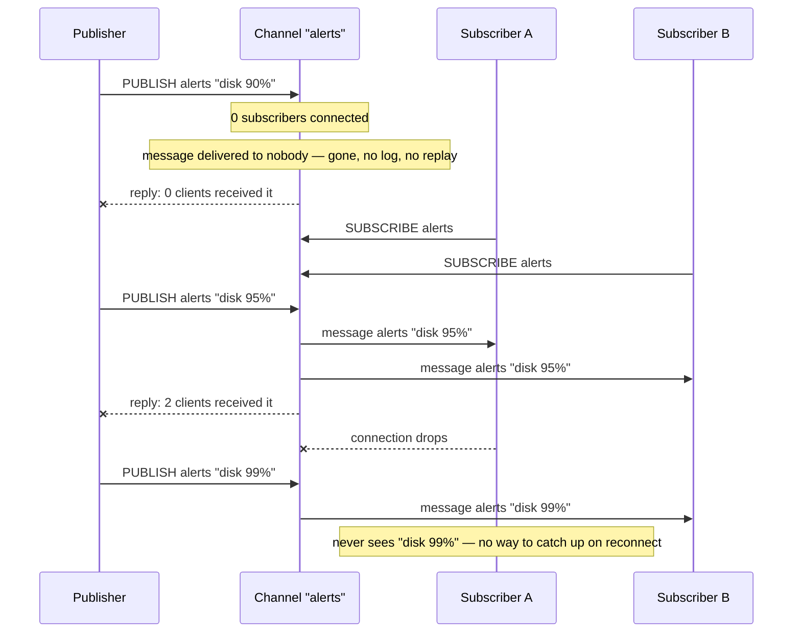

## Objective

Entender o Redis Pub/Sub pelo que ele de fato é: uma transmissão de mensagem ao vivo construída sobre quatro comandos (`SUBSCRIBE`, `PUBLISH`, `PSUBSCRIBE`, `UNSUBSCRIBE`/`PUNSUBSCRIBE`) sem nenhuma camada de armazenamento por baixo de jeito nenhum. Redis in Action enquadra o modelo inteiro em uma frase: "o conceito de publish/subscribe, também conhecido como pub/sub, é caracterizado por listeners se inscrevendo em canais, com publicadores enviando mensagens de string binária para canais. Qualquer um escutando um dado canal vai receber todas as mensagens enviadas para aquele canal enquanto estiver conectado e escutando. Você pode pensar nisso como uma estação de rádio." Essa analogia é o modelo mental inteiro, e também é a limitação inteira: uma estação de rádio transmite quer alguém esteja sintonizado ou não, e Redis Essentials declara a consequência para o Pub/Sub sem rodeios: "uma mensagem se perde se não há clientes inscritos no canal quando ela chega." Não há buffer do lado do canal, nenhum log, nenhuma forma de perguntar "o que eu perdi." O conceito irmão `redis-streams` existe especificamente porque algumas cargas de trabalho não conseguem tolerar isso; este conceito é sobre entender a mecânica do próprio Pub/Sub bem o suficiente para saber quando sua simplicidade é exatamente o que se quer.

## Use Cases

- **Dashboards ao vivo e atualizações de UI em transmissão**: a própria lista de Redis Essentials: "dashboards de notícias e clima", qualquer feed onde uma atualização levemente perdida se autocorrige na próxima publicação, então perder uma mensagem em voo sob uma reconexão é um não evento.
- **Chat e entrega de notificação efêmera**: "aplicações de chat" e "notificações push, como alertas de atraso de metrô": um cliente conectado vê mensagens ao vivo; um cliente offline é esperado a se atualizar de outra forma (um poll REST, uma leitura de banco de dados) em vez de pelo próprio Pub/Sub.
- **Sinais de controle de fan-out entre uma frota de servidores**: Redis Essentials constrói exatamente isso como um exemplo resolvido: um nome de comando `PUBLISH`ado (`DATE`, `PING`, `HOSTNAME`) é recebido por todo servidor inscrito em um canal e executado localmente, "parecido com o que a ferramenta SaltStack suporta": execução remota de comando sem cada servidor fazer polling em nada.
- **Invalidação de cache e sinalização entre instâncias**: um processo muda algo e publica uma mensagem de canal dizendo a todo outro processo conectado ("a chave de cache X está obsoleta", "config recarregada") para reagir; se um listener por acaso estiver fora do ar quando isso dispara, ele vai pegar o próximo sinal ou se atualizar na própria lógica de restart, então at-most-once é uma troca aceitável por zero configuração.
- **Qualquer coisa onde a resposta honesta para "e se um subscriber está offline por um segundo" é "tudo bem"**: no momento em que a resposta honesta se torna "não está tudo bem, precisamos que ele ainda receba essa mensagem exata depois", essa não é a ferramenta certa; veja os consumer groups e a Pending Entries List de `redis-streams` para a alternativa at-least-once, ou `redis-partitioning-and-cluster-fundamentals` se o problema real é escalar o próprio Pub/Sub em um cluster (Sharded Pub/Sub, abaixo).

## Deep Dive

### PUBLISH, SUBSCRIBE, e o problema de "ninguém em casa"

`PUBLISH channel message` envia uma mensagem para um canal e retorna o número de clientes que a receberam: que também serve como uma checagem ao vivo de se alguém estava escutando naquele instante. Redis Essentials é direto sobre o que acontece de outra forma: "uma mensagem se perde se não há clientes inscritos no canal quando ela chega." Nada é enfileirado, nada é escrito em disco, nada espera um subscriber aparecer. O equivalente na documentação atual do Redis a Redis in Action declara o mesmo fato como uma garantia formal: "o Pub/Sub do Redis exibe semântica de entrega de mensagem *at-most-once*... uma vez que a mensagem é enviada pelo servidor Redis, não há chance de ela ser enviada de novo. Se o subscriber não consegue lidar com a mensagem [por exemplo, por causa de um erro ou uma desconexão de rede] a mensagem se perde para sempre." At-most-once significa exatamente o que diz: zero ou uma entrega, nunca garantida, e nunca uma repetição.

`SUBSCRIBE channel [channel ...]` abre uma inscrição para um ou mais nomes de canal exatos; `UNSUBSCRIBE [channel ...]` a fecha (sem argumentos, desinscreve de tudo). Canais de Pub/Sub também são inteiramente desconectados do keyspace: a documentação atual do Redis é explícita: "o Pub/Sub não tem relação com o keyspace. Foi feito para não interferir com ele em nenhum nível, incluindo números de banco de dados. Publicar no db 10 vai ser ouvido por um subscriber no db 1." Um canal é só um nome; não é uma chave, não expira, não aparece em `KEYS`, e uma instância Redis só-Pub/Sub tecnicamente teria zero chaves o tempo todo em que estivesse transmitindo.

### PSUBSCRIBE: correspondência de padrão sobre nomes de canal

`PSUBSCRIBE pattern [pattern ...]` se inscreve em todo canal cujo nome corresponde a um padrão estilo glob em vez de um nome fixo: Redis Essentials: "os comandos PSUBSCRIBE e PUNSUBSCRIBE funcionam do mesmo jeito que os comandos SUBSCRIBE e UNSUBSCRIBE, mas aceitam padrões estilo glob como nomes de canal." `PSUBSCRIBE news.*` recebe tudo publicado em `news.art.figurative`, `news.music.jazz`, ou qualquer outro canal correspondendo a esse padrão, sem precisar saber os nomes de canal de antemão.

Inscrições de padrão mudam o envelope de mensagem que um cliente recebe. Um `SUBSCRIBE` simples entrega uma resposta `message`: nome do canal, depois o payload. Um `PSUBSCRIBE` entrega uma resposta `pmessage` em vez disso: o *padrão* que correspondeu, depois o nome do canal real, depois o payload: então um cliente consegue saber qual inscrição disparou a entrega mesmo quando vários padrões estão ativos ao mesmo tempo. Essa distinção tem uma consequência real: um cliente inscrito tanto em `foo` (exato) quanto em `f*` (padrão) recebe uma *única* mensagem publicada no canal `foo` **duas vezes**: uma como `message`, uma como `pmessage`: porque as duas inscrições independentemente corresponderam a ela. Isso não é um bug para contornar; é como os dois tipos de inscrição se compõem, e código de cliente precisa ser escrito com isso em mente se ele mistura inscrições exatas e de padrão em nomes sobrepostos.

`PUBSUB` inspeciona o estado de inscrição ao vivo sem se inscrever em nada: `PUBSUB CHANNELS [pattern]` lista canais atualmente ativos (aqueles com pelo menos um subscriber), opcionalmente filtrado por um padrão glob; `PUBSUB NUMSUB [channel ...]` retorna quantos clientes estão inscritos em cada canal nomeado via `SUBSCRIBE`; `PUBSUB NUMPAT` retorna a contagem total de padrões distintos que qualquer cliente está atualmente inscrito via `PSUBSCRIBE` (um único número, não um detalhamento por padrão). Essa é a superfície operacional para responder "alguém está de fato escutando esse canal agora" antes de decidir se é seguro dar `PUBLISH` em algo sensível ao tempo.

### O cliente inscrito: uma conexão que para de se comportar como uma normal

Redis Essentials sinaliza isso como importante o bastante para apontar por conta própria: "uma vez que um cliente Redis executa o comando SUBSCRIBE ou PSUBSCRIBE, ele entra no modo subscribe e para de aceitar comandos, exceto os comandos SUBSCRIBE, PSUBSCRIBE, UNSUBSCRIBE, e PUNSUBSCRIBE." Essa conexão não é mais uma conexão de comando de propósito geral; é dedicada a receber mensagens empurradas, e código de aplicação que precisa tanto `PUBLISH`ar/rodar outros comandos *quanto* `SUBSCRIBE`, precisa de duas conexões separadas, uma para cada papel. Esse é exatamente o padrão que o próprio exemplo resolvido do livro usa: `publisher.js` abre um cliente simples, chama `PUBLISH`, e sai; `subscriber.js` abre um cliente *diferente*, chama `SUBSCRIBE`, e depois só fica sentado reagindo a um handler de evento `message`; ele nunca emite outro comando naquela conexão.

A documentação atual do Redis afina exatamente quais comandos são permitidos em uma conexão RESP2 inscrita: um conjunto ligeiramente maior do que os quatro do livro de 2015: `PING`, `PSUBSCRIBE`, `PUNSUBSCRIBE`, `QUIT`, `RESET`, `SSUBSCRIBE`, `SUBSCRIBE`, `SUNSUBSCRIBE`, e `UNSUBSCRIBE`. Tudo mais é rejeitado nessa conexão até que a contagem de inscrição volte a zero. Sob o protocolo RESP3 mais novo, essa restrição é levantada por completo: "um cliente consegue emitir qualquer comando enquanto está no estado inscrito": porque o framing de mensagem push do RESP3 deixa o Redis distinguir uma mensagem empurrada assíncrona de uma resposta de comando normal na mesma conexão, removendo a necessidade de dedicar a conexão só a inscrições.

### Confiabilidade de entrega: o problema de buffer, então e agora

A explicação de Redis in Action de por que o livro majoritariamente evita Pub/Sub vale a pena ler diretamente, porque é uma segunda preocupação de confiabilidade distinta além de simples perda de mensagem: "em versões mais antigas do Redis, um cliente que tinha se inscrito em canais mas não lia mensagens enviadas rápido o suficiente podia fazer o próprio Redis manter um grande buffer de saída. Se esse buffer de saída crescesse demais, poderia fazer o Redis desacelerar drasticamente ou travar, poderia fazer o sistema operacional matar o Redis, e poderia até fazer o próprio sistema operacional ficar inutilizável." Esse era um risco de estabilidade do servidor, não só um risco de perda de dado do lado do cliente: um subscriber lento poderia derrubar a instância Redis inteira junto com ele. O livro imediatamente observa o conserto que já tinha sido lançado até 2013: "versões modernas do Redis não têm esse problema, e vão desconectar clientes inscritos que não conseguem acompanhar a opção de configuração `client-output-buffer-limit pubsub`." Essa configuração ainda é como o Redis atual se protege hoje: um cliente inscrito cujo buffer de saída ultrapassa o limite rígido ou flexível configurado é desconectado de vez, trocando "o cliente silenciosamente fica para trás e eventualmente recebe algumas mensagens" por "o cliente é cortado de forma limpa e precisa se reinscrever", que é o modo de falha mais seguro para o servidor mas ainda é só mais uma forma de um subscriber perder mensagens.

O segundo motivo do livro é o que mais importa para este conceito: "no caso de clientes que se inscreveram, se o cliente é desconectado e uma mensagem é enviada antes de ele conseguir reconectar, o cliente nunca vai ver a mensagem." Um subscriber de Pub/Sub reconectando não tem como perguntar "o que eu perdi entre a desconexão e a reconexão": não há histórico para consultar, diferente do `XREAD ... STREAMS mystream <last-seen-id>` de `redis-streams`, que deixa um cliente reconectando retomar exatamente de onde parou porque as entradas ainda estão lá. A própria conclusão do livro serve como a regra prática para quando o Pub/Sub é a ferramenta certa: "se você gosta da simplicidade de usar PUBLISH/SUBSCRIBE, e está de boa com a chance de que pode perder um pouco de dado, fique à vontade para usar pub/sub."

### Sharded Pub/Sub: escalando a própria transmissão em um cluster

O `PUBLISH`/`SUBSCRIBE` clássico tem um problema de escala específico do Redis Cluster em vez de uma única instância: uma mensagem publicada precisa alcançar todo subscriber independentemente de a qual nó do cluster ele está conectado, então o Redis Cluster propaga toda mensagem clássica de Pub/Sub para *todo nó no cluster* pelo barramento de gossip, quer aquele nó tenha algum subscriber para aquele canal ou não. O Redis 7.0 (2022) adicionou o **Sharded Pub/Sub** para consertar exatamente isso: `SSUBSCRIBE`, `SPUBLISH`, e `SUNSUBSCRIBE` funcionam como seus equivalentes não fragmentados, exceto que um canal de shard é hasheado para um dos 16384 hash slots do cluster pelo mesmo algoritmo `CRC16(key) mod 16384` que `redis-partitioning-and-cluster-fundamentals` cobre para chaves, e uma mensagem de shard só é encaminhada para os nós que possuem aquele slot (o master e suas réplicas), não o cluster inteiro. A documentação atual do Redis declara o ganho diretamente: "o Sharded Pub/Sub ajuda a escalar o uso de Pub/Sub em modo cluster. Ele restringe a propagação de mensagens para dentro do shard de um cluster... isso permite que usuários escalem horizontalmente o uso de Pub/Sub adicionando mais shards." Duas limitações decorrem do próprio escopo e valem a pena saber antes de recorrer a isso: inscrições de padrão (o equivalente do `PSUBSCRIBE`) não são suportadas em modo fragmentado de jeito nenhum, e um subscriber fragmentado não consegue ver mensagens publicadas com `PUBLISH` simples, nem um subscriber de `SUBSCRIBE` simples consegue ver mensagens `SPUBLISH`adas: os dois sistemas são espaços de nome de canal inteiramente separados, não duas formas de alcançar os mesmos subscribers. Nada disso muda a própria semântica de entrega do Pub/Sub: um canal fragmentado com zero subscribers ainda perde a mensagem exatamente do mesmo jeito que um não fragmentado; o Sharded Pub/Sub é puramente um conserto de topologia de cluster, não um upgrade de durabilidade.

### Fire-and-forget, visualizado

A mesma chamada de `PUBLISH` se comporta de três formas diferentes dependendo puramente de quem por acaso está conectado naquele instante: a mensagem em si nunca muda, só o número de clientes com sorte suficiente de estar escutando quando ela dispara.

## Trade-offs

- **Zero configuração versus zero garantias é a troca inteira, e não é uma falha para contornar; é o ponto inteiro de escolher Pub/Sub.** Nenhuma chave para criar, nenhum grupo para gerenciar, nenhuma limpeza, nenhuma política de aparo: `SUBSCRIBE`/`PUBLISH` e funciona. Essa é a escolha correta exatamente quando perder uma mensagem ocasional sob um subscriber morto ou ausente é genuinamente aceitável: um tick de dashboard ao vivo, um ping de invalidação de cache, um empurrão de "alguém atualizou a config." O `redis-streams` existe para o momento em que isso deixa de ser verdade: ele troca essa simplicidade de zero configuração por maquinaria de recuperação `XGROUP CREATE`, `XACK`, e `XPENDING`/`XCLAIM`, em troca de entrega at-least-once e replay completo. Recorrer à maquinaria do Streams para um caso de uso que toleraria tranquilamente uma mensagem perdida ocasional é superengenharia na direção errada; recorrer ao Pub/Sub quando uma mensagem perdida é de fato inaceitável é o erro oposto.
- **Um subscriber reconectando tem um ponto cego sem forma de medi-lo ou fechá-lo.** Não há número de sequência, nenhum marcador de último-visto, nenhuma consulta de preenchimento estilo `XRANGE` para um canal de Pub/Sub: o cliente ou estava conectado quando uma mensagem saiu, ou não estava, e não há como depois sequer saber quanto perdeu. Aplicações que precisam de comportamento de "atualizar na reconexão" precisam construir isso elas mesmas fora do Pub/Sub por completo (um poll periódico de estado completo, uma leitura de banco de dados na reconexão), ou usar Streams em vez disso, onde esse comportamento é o que `XREAD` a partir de um ID lembrado já faz.
- **Uma conexão inscrita é uma conexão dedicada, o que é fácil de errar em código com pool de conexão.** Emitir `SUBSCRIBE` compromete essa conexão ao modo Pub/Sub até que todo canal e padrão seja desinscrito (RESP2): comandos gerais nela vão falhar. Caminhos de código que tanto publicam quanto se inscrevem precisam de duas conexões de cliente separadas, e código de pool que não considera isso pode silenciosamente entregar uma conexão inscrita "envenenada" para código esperando uma normal. O RESP3 remove a restrição, mas só para clientes que de fato negociaram RESP3 via `HELLO`.
- **Misturar inscrições exatas e de padrão em nomes sobrepostos causa entrega duplicada, por design, não por bug.** Um cliente inscrito tanto em `foo` quanto em `f*` recebe toda mensagem publicada em `foo` duas vezes, uma como `message` e uma como `pmessage`. Deduplicação, se necessária, é trabalho do cliente: o Redis não tem conceito de "esse cliente já recebeu uma cópia dessa publicação específica."
- **O antigo modo de falha de buffer descontrolado é mitigado, não eliminado, e mudou a falha de "crash do servidor" para "cliente é desconectado e perde o que quer que estivesse prestes a receber".** `client-output-buffer-limit pubsub` protege a própria estabilidade do Redis cortando um subscriber lento, que é estritamente melhor do que o comportamento pré-conserto que o livro de 2013 descreve (o Redis ou o SO inteiro ficando inutilizável), mas ainda é uma forma de um subscriber perder mensagens sob carga, em cima do risco comum de lacuna offline, e os limiares padrão do limite valem a pena checar em vez de presumir para qualquer deployment de Pub/Sub esperando volume de publicação em rajadas.
- **O Sharded Pub/Sub conserta um custo de topologia de cluster, não uma lacuna de durabilidade: não recorra a ele esperando garantias mais fortes.** Ele genuinamente resolve "o Pub/Sub clássico inunda todo nó em um cluster independentemente da localização do subscriber", que importa em escala. Ele não adiciona persistência, confirmação, ou replay: uma mensagem publicada em um canal de shard sem subscribers se perde exatamente tão completamente quanto uma não fragmentada. Ele também fragmenta o espaço de nome de canal (canais fragmentados e não fragmentados não conseguem ver as mensagens um do outro) e derruba o suporte a inscrição de padrão por completo, então adotá-lo é uma decisão tomada por motivos de escala de cluster especificamente, não um caminho de upgrade geral a partir do Pub/Sub clássico.

## Documentation Links

- [Maxwell Dayvson Da Silva & Hugo Lopes Tavares, "Redis Essentials" (Packt Publishing, 2015), Chapter 4, "Commands (Where the Wild Things Are)," section "Pub/Sub," p. 77-80] - doc
- [Josiah Carlson, "Redis in Action" (Manning, 2013), Chapter 3, "Commands in Redis," section 3.6 "Publish/subscribe," p. 54-56] - doc
- [Redis Documentation: Redis Pub/sub](https://redis.io/docs/latest/develop/pubsub/) - doc
- [Redis Documentation: SUBSCRIBE](https://redis.io/docs/latest/commands/subscribe/) - doc
- [Redis Documentation: PUBLISH](https://redis.io/docs/latest/commands/publish/) - doc
- [Redis Documentation: PSUBSCRIBE](https://redis.io/docs/latest/commands/psubscribe/) - doc
- [Redis Documentation: PUBSUB](https://redis.io/docs/latest/commands/pubsub/) - doc
- [Redis Documentation: SSUBSCRIBE (Sharded Pub/Sub)](https://redis.io/docs/latest/commands/ssubscribe/) - doc
- [Redis Documentation: SPUBLISH (Sharded Pub/Sub)](https://redis.io/docs/latest/commands/spublish/) - doc
