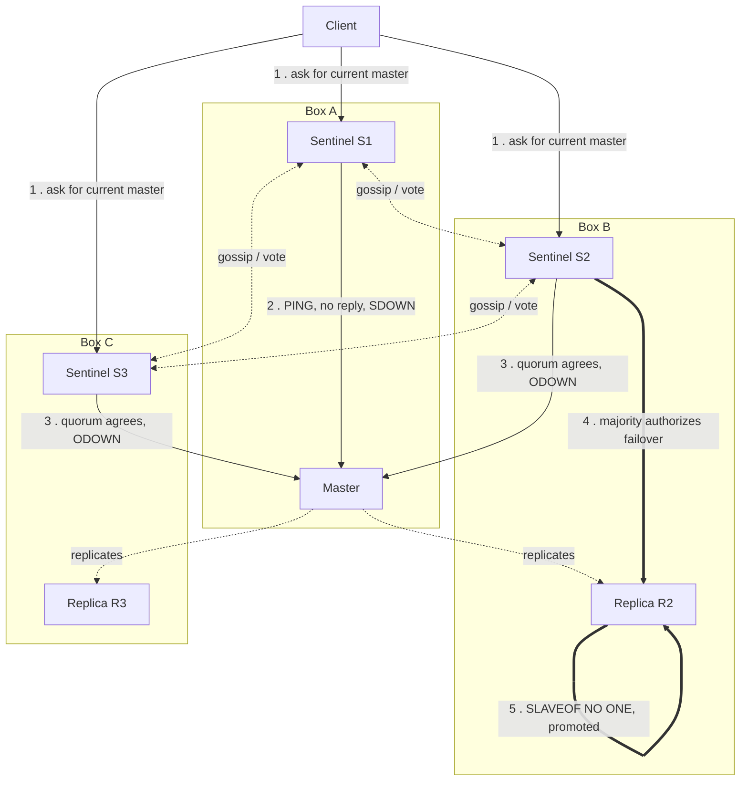

## Objective

Go past the one-paragraph summary in `redis-partitioning-and-cluster-fundamentals` — "Redis Sentinel handles quorum-based failover for a plain master/replica pair without sharding anything" — and trace the actual mechanism the book walks through: how a cluster of Sentinel processes detects that a master is unreachable, why detecting a failure (quorum) and authorizing a failover (majority) are two separate votes, what the four core directives (`monitor`, `down-after-milliseconds`, `failover-timeout`, `parallel-syncs`) actually control during that sequence, how a client finds the current master through Sentinel instead of a hardcoded address, and exactly how — and why — a network partition can still lose acknowledged writes even though the failover itself worked correctly.

## Use Cases

- Sizing a Sentinel deployment for a single master/replica pair — how many Sentinel processes, where to place them, and what quorum value to configure — without accidentally building the two-Sentinel setup the book (and Redis's own documentation) explicitly calls broken.
- Debugging "why didn't my master fail over" by reasoning about the SDOWN → ODOWN → majority-authorization pipeline instead of assuming quorum alone triggers a promotion.
- Wiring a Sentinel-aware client library (or reasoning about the `redis://mymaster` pattern shown in the book) so the application asks Sentinel for the current master's address on every reconnect, rather than caching an IP that goes stale the moment a failover happens.
- Explaining to a team why their Sentinel-protected master lost writes during a real network partition even though the failover "worked" — and knowing `min-replicas-to-write`/`min-replicas-max-lag` is the mitigation, not a bug to file against Sentinel.
- Choosing between Sentinel and Redis Cluster for a specific deployment — this concept's companion decision, covered at a summary level in `redis-partitioning-and-cluster-fundamentals`, argued here from the mechanism outward: Sentinel adds zero sharding, so it only ever makes sense when one instance's worth of data and throughput is enough.
- Tuning `down-after-milliseconds` and `failover-timeout` against a real SLA — too aggressive triggers failovers on transient blips, too conservative extends an outage window past what the business will tolerate.

## Deep Dive

### What the summary skipped: quorum detects, majority authorizes

The one-line version in `redis-partitioning-and-cluster-fundamentals` is accurate but compresses two distinct steps into "quorum-based failover." The book's own worked configuration is where the mechanism actually lives:

```
sentinel monitor mymaster 127.0.0.1 6379 2
sentinel down-after-milliseconds mymaster 30000
sentinel failover-timeout mymaster 180000
sentinel parallel-syncs mymaster 1
```

`sentinel monitor <name> <ip> <port> <quorum>` names the master (`mymaster`), points at its current address, and sets the **quorum** — "the fewest number of sentinels that need to agree that the current master is down before starting a new master election," per the book. That is the entire role quorum plays: it governs *detection*, not the failover itself. Redis's own Sentinel documentation is explicit about the second step the book only implies: "the quorum is only used to detect the failure. In order to actually perform a failover, one of the Sentinels need to be elected leader for the failover and be authorized to proceed. This only happens with the vote of the **majority of the Sentinel processes**." With 5 Sentinels and quorum 2: two Sentinels agreeing the master is unreachable is enough to *attempt* a failover, but the attempt only proceeds if at least 3 of the 5 (a majority) are reachable to authorize it. A quorum of 1 with two Sentinels total can technically satisfy the quorum check — and is precisely the setup the current docs label, in bold, "**DON'T DO THIS**": if the box running the master also runs one of the two Sentinels, losing that box removes both the master and half the voting Sentinels at once, and the surviving Sentinel can never reach the majority (2 of 2) needed to authorize anything. Current guidance is unambiguous: **at least three Sentinel instances, in three independently-failing locations, always** — the book's quorum=2 three-box example is the minimum viable shape, not one option among several.

Underneath "quorum" and "majority" the current implementation actually tracks two named states the book doesn't name explicitly: **SDOWN** (Subjectively Down — one Sentinel's own PING to the master has gone unanswered for `down-after-milliseconds`) escalates to **ODOWN** (Objectively Down — enough other Sentinels, at least `quorum`-many, report the same master as SDOWN via gossip) before any failover attempt is even considered. ODOWN only ever applies to masters; a Sentinel or replica that stops responding just stays SDOWN. Reaching ODOWN still isn't authorization — that final gate is the separate majority vote described above. The practical shape is a two-stage funnel: local suspicion (SDOWN) → collective suspicion (ODOWN) → majority-authorized action (failover).

### The four directives, mapped to the sequence

- **`sentinel monitor <name> <ip> <port> <quorum>`** — identifies the master and sets how many Sentinels must independently agree (SDOWN → ODOWN) before a failover is even attempted. Replicas and other Sentinels are auto-discovered via gossip and never need to be listed.
- **`down-after-milliseconds`** — how long a master can go without answering PING (or answer with something other than `+PONG`, `-LOADING`, or `-MASTERDOWN`) before *that Sentinel* privately marks it SDOWN. This is a per-Sentinel local timer, not a group decision.
- **`failover-timeout`** — the book's own example makes the purpose concrete: master R1 fails, replica R2 is promoted, R1 rejoins as a replica; if R2 then fails before `failover-timeout` elapses, R1 is excluded from the new election, preventing the cluster from flapping back onto a node that just had problems.
- **`parallel-syncs`** — how many replicas get reconfigured to the new master at once. Each replica being resynced is briefly unavailable to clients, so the book's advice — keep this low, often 1 — trades a slower cutover for fewer simultaneously-unreachable replicas.

### The failover sequence, end to end

1. Each Sentinel independently PINGs the master it monitors. One stops getting a valid reply for `down-after-milliseconds` and marks the master SDOWN locally.
2. That Sentinel asks the others (`SENTINEL IS-MASTER-DOWN-BY-ADDR`); once `quorum`-many agree, the master is promoted to ODOWN.
3. Sentinels vote for one of themselves to lead the failover attempt (`+try-failover`, `+new-epoch`); the leader needs the vote of a **majority of all known Sentinel processes**, not just the quorum-many that flagged ODOWN, to be authorized (`+elected-leader`).
4. The leader selects a replica to promote, weighing disconnection time, `replica-priority` (a replica configured with priority 0 is never selected), replication offset processed, and run ID as tiebreakers — the book's example of pinning a same-datacenter replica to priority 10 versus a cross-datacenter one at 100 is exactly this mechanism in use.
5. The chosen replica gets `SLAVEOF NO ONE` (`failover-state-send-slaveof-noone`); this is the same manual step the book notes was required before Sentinel existed, now issued automatically.
6. Remaining replicas are reconfigured to replicate from the new master, `parallel-syncs`-many at a time (`+slave-reconf-sent` → `+slave-reconf-inprog` → `+slave-reconf-done`).
7. Sentinels propagate a `switch-master <name> <old-ip> <old-port> <new-ip> <new-port>` event — "the message most external users are interested in," per Redis's own docs — and the old master, once it returns, is folded back in as a replica of the new one.

### Client discovery: never hardcode the master

The book's Ruby example is the pattern worth internalizing independent of language:

```ruby
SENTINELS = [
  {:host => "127.0.0.1", :port => 26380},
  {:host => "127.0.0.1", :port => 26381}
]
redis = Redis.new(:url => "redis://mymaster", :sentinels => SENTINELS, :role => :master)
```

The client never connects to a Redis instance address directly. It connects to a Sentinel, asks `SENTINEL get-master-addr-by-name mymaster`, and gets back whatever address is currently authoritative — pre- or post-failover, the call shape doesn't change. This is, per the book, "the major difference when using Redis Sentinel": it requires a Sentinel-aware client library, because a plain Redis client has no concept of "ask an intermediary where the master is right now." Sentinel is explicitly a "configuration provider" in this role, alongside its monitoring and notification duties — a client that skips Sentinel and connects straight to a cached IP will silently keep writing to a demoted replica after a failover.

### Split-brain: the failover mechanism working exactly as designed, and still losing data

This is the scenario `redis-partitioning-and-cluster-fundamentals`'s CAP-theorem framing gestures at without walking through — the book spells it out concretely. Start with three Redis instances (one master, two replicas), one Sentinel colocated with each, and a client writing to the master. A network partition isolates the master (and its Sentinel) from the two replicas (and their Sentinels). The two replica-side Sentinels reach quorum, reach ODOWN, and — since two of three Sentinels is a majority — authorize a failover; one replica is promoted. Meanwhile the client, still connected to the *old*, isolated master, has no idea anything happened and keeps writing. When the partition heals, the majority of Sentinels (now including the recovering old-master Sentinel) agree the old master should demote to a replica of the new one. At that instant every write the client sent during the partition is discarded — "there is no data synchronization in this process," as the book puts it, because Redis's asynchronous replication never guaranteed those writes reached anyone else in the first place.

The load-bearing point: the failover mechanism did not malfunction. Quorum correctly detected the outage, the majority vote correctly authorized promotion, and the correct replica was promoted. The data loss is a separate, orthogonal property — Sentinel guarantees automatic *failover*, never write durability during a partition, and the book's own two-Sentinel "DON'T DO THIS" warning and this split-brain walkthrough are really the same lesson from two angles: Sentinel's guarantees are exactly what its mechanism can provide, no more.

One mitigation the book flags without dwelling on: `min-replicas-to-write <n>` and `min-replicas-max-lag <seconds>`, set on the master, make it stop accepting writes once fewer than `n` replicas have acknowledged within the lag window. Applied to the split-brain scenario above with `min-replicas-to-write 1`, the isolated old master stops accepting the client's writes once it notices it can no longer reach any replica — shrinking the data-loss window from "however long the partition lasts" to roughly `min-replicas-max-lag` seconds, at the cost of the master refusing writes entirely if all replicas happen to be down for unrelated reasons.

## Trade-offs

- **Quorum and majority are different gates protecting against different failure modes, and conflating them produces broken deployments.** Quorum (detection) can be satisfied by as few as 1 Sentinel in a degenerate config; majority (authorization) cannot, by construction, be satisfied by a minority partition. The two-Sentinel setup the current docs mark "DON'T DO THIS" is exactly what happens when a quorum value is chosen without also reasoning about total Sentinel count and placement — it looks correctly configured and fails the first time the box hosting the master also hosts a Sentinel.
- **Sentinel-aware clients are a real integration cost, not a footnote.** Every client touching a Sentinel-protected master needs library support for the `get-master-addr-by-name` discovery pattern; a client that connects directly to a cached address defeats the entire point of automatic failover, because nothing tells it the master moved.
- **Automatic failover and write durability are separate guarantees, and Sentinel only ever promised the first one.** The split-brain walkthrough demonstrates the mechanism succeeding at its actual job (fast, automatic promotion) while still losing acknowledged writes, because asynchronous replication was never a durability guarantee to begin with. `min-replicas-to-write` trades some availability (the master can refuse writes) to shrink, not eliminate, that data-loss window.
- **`down-after-milliseconds` and `failover-timeout` trade false-positive risk against outage duration in opposite directions, and both are per-master tunables that need an actual SLA behind them.** Too short a `down-after-milliseconds` triggers failovers on transient network blips or GC pauses; too long extends genuine outages. Too short a `failover-timeout` risks flapping back onto a node that just had problems; too long delays recovering from a bad promotion.
- **Sentinel buys nothing toward scaling, on purpose.** It is not a lesser version of Redis Cluster maturing toward sharding — it solves a narrower problem deliberately, per the book's own framing of the 2011 project split. Reaching for Sentinel because a dataset outgrew one instance is a category error: "Sentinel is not a distributed data store," full stop.

### Book vs today

> **Sentinel's core mechanics are unchanged; today's docs are sharper about quorum-versus-majority and stronger about minimum topology.** The four directives (`monitor`, `down-after-milliseconds`, `failover-timeout`, `parallel-syncs`), the `__sentinel__:hello` gossip channel, and the split-brain data-loss scenario are described identically in current Redis documentation. What current docs add explicitly, where the book was looser: the SDOWN/ODOWN two-stage detection model by name, the hard "at least three Sentinel instances, independently failing locations, always" rule (with the two-Sentinel setup called out as broken by name), and the `min-replicas-to-write`/`min-replicas-max-lag` mitigation for the split-brain write-loss window.
>
> **Positioning has sharpened since 2015: Sentinel is now explicitly framed as the answer for *non-clustered* Redis.** Current Redis documentation's own one-line description of the Sentinel page is "High availability for non-clustered Redis," and its opening sentence states plainly: "Redis Sentinel provides high availability for Redis when not using Redis Cluster." The book's framing — Sentinel and Cluster as two purpose-built systems solving different problems (failover-only versus sharding-plus-failover) — holds up, but today's guidance is more direct about the practical decision: Redis Cluster has its own built-in failover (masters with replicas, automatic promotion on failure), so a deployment that already needs Cluster for sharding gets HA "for free" and has no separate reason to also run Sentinel. Sentinel's relevance today is concentrated on the case the book's quorum walkthrough describes throughout — a single master/replica pair, or several such pairs, where sharding was never the requirement in the first place.



The diagram traces the same sequence the Deep Dive walks through by number: Sentinels continuously gossip and vote among themselves (dotted lines) while independently pinging the master; once enough of them privately reach SDOWN and collectively reach ODOWN (step 3), a majority-authorized leader promotes a replica (steps 4-5) — and only then does `switch-master` go out, which is the event a Sentinel-aware client (top) is really waiting on when it asks "who is master right now."

## Documentation Links

- [Vinicius Da Silva, Henrique Cassela, Adhitya Rachman Nugraha, Naga Venkata Sudheer Yaramada, "Redis Essentials" (Packt Publishing, 2015) — Chapter 9, "Redis Cluster and Redis Sentinel (Collective Intelligence)", section "Redis Sentinel", p. 169-176](https://www.packtpub.com/product/redis-essentials/9781784392503) — doc
- [Redis Documentation — High availability with Redis Sentinel](https://redis.io/docs/latest/operate/oss_and_stack/management/sentinel/) — doc
- [Redis Documentation — Sentinel clients guidelines](https://redis.io/docs/latest/develop/reference/sentinel-clients) — doc
- [Redis Documentation — Scale with Redis Cluster](https://redis.io/docs/latest/operate/oss_and_stack/management/scaling/) — doc
