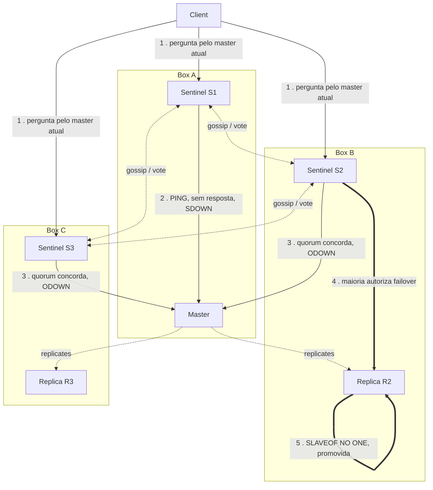

## Objective

Ir além do resumo de um parágrafo em `redis-partitioning-and-cluster-fundamentals` ("o Redis Sentinel lida com failover baseado em quorum para um par primário/réplica comum sem fazer sharding de nada") e rastrear o mecanismo real que o livro percorre: como um cluster de processos Sentinel detecta que um master está inacessível, por que detectar uma falha (quorum) e autorizar um failover (maioria) são dois votos separados, o que as quatro diretivas centrais (`monitor`, `down-after-milliseconds`, `failover-timeout`, `parallel-syncs`) de fato controlam durante essa sequência, como um cliente encontra o master atual através do Sentinel em vez de um endereço fixo no código, e exatamente como (e por que) uma partição de rede ainda consegue perder escritas confirmadas mesmo que o próprio failover tenha funcionado corretamente.

## Use Cases

- Dimensionar um deployment de Sentinel para um único par primário/réplica (quantos processos Sentinel, onde posicioná-los, e qual valor de quorum configurar) sem acidentalmente construir a configuração de dois Sentinels que o livro (e a própria documentação do Redis) explicitamente chama de quebrada.
- Depurar "por que meu master não fez failover" raciocinando sobre o pipeline SDOWN → ODOWN → autorização-por-maioria em vez de presumir que quorum sozinho dispara uma promoção.
- Conectar uma biblioteca de cliente ciente do Sentinel (ou raciocinar sobre o padrão `redis://mymaster` mostrado no livro) para que a aplicação pergunte ao Sentinel o endereço do master atual a cada reconexão, em vez de cachear um IP que fica obsoleto no instante em que um failover acontece.
- Explicar a uma equipe por que seu master protegido pelo Sentinel perdeu escritas durante uma partição de rede real mesmo que o failover tenha "funcionado", e saber que `min-replicas-to-write`/`min-replicas-max-lag` é a mitigação, não um bug para reportar contra o Sentinel.
- Escolher entre Sentinel e Redis Cluster para um deployment específico: a decisão companheira deste conceito, coberta em nível de resumo em `redis-partitioning-and-cluster-fundamentals`, argumentada aqui a partir do mecanismo para fora: o Sentinel adiciona zero sharding, então só faz sentido quando o dado e o throughput de uma instância são suficientes.
- Ajustar `down-after-milliseconds` e `failover-timeout` contra um SLA real: agressivo demais dispara failovers em soluços transitórios de rede, conservador demais estende uma janela de indisponibilidade além do que o negócio vai tolerar.

## Deep Dive

### O que o resumo pulou: quorum detecta, maioria autoriza

A versão de uma linha em `redis-partitioning-and-cluster-fundamentals` é precisa mas comprime dois passos distintos em "failover baseado em quorum." A própria configuração resolvida do livro é onde o mecanismo de fato mora:

```
sentinel monitor mymaster 127.0.0.1 6379 2
sentinel down-after-milliseconds mymaster 30000
sentinel failover-timeout mymaster 180000
sentinel parallel-syncs mymaster 1
```

`sentinel monitor <name> <ip> <port> <quorum>` nomeia o master (`mymaster`), aponta para seu endereço atual, e define o **quorum**: "o menor número de sentinels que precisam concordar que o master atual está fora do ar antes de começar uma nova eleição de master", segundo o livro. Esse é o papel inteiro que o quorum desempenha: ele governa a *detecção*, não o próprio failover. A própria documentação de Sentinel do Redis é explícita sobre o segundo passo que o livro só implica: "o quorum é usado só para detectar a falha. Para de fato realizar um failover, um dos Sentinels precisa ser eleito líder para o failover e ser autorizado a prosseguir. Isso só acontece com o voto da **maioria dos processos Sentinel**." Com 5 Sentinels e quorum 2: dois Sentinels concordando que o master está inacessível é suficiente para *tentar* um failover, mas a tentativa só prossegue se pelo menos 3 dos 5 (uma maioria) estiverem acessíveis para autorizá-la. Um quorum de 1 com dois Sentinels no total pode tecnicamente satisfazer a checagem de quorum, e é precisamente a configuração que a documentação atual rotula, em negrito, "**NÃO FAÇA ISSO**": se a máquina rodando o master também roda um dos dois Sentinels, perder essa máquina remove tanto o master quanto metade dos Sentinels votantes de uma vez, e o Sentinel sobrevivente nunca consegue alcançar a maioria (2 de 2) necessária para autorizar qualquer coisa. A orientação atual é inequívoca: **pelo menos três instâncias Sentinel, em três localizações que falham independentemente, sempre**: o exemplo de três máquinas com quorum=2 do livro é o formato minimamente viável, não uma opção entre várias.

Por baixo de "quorum" e "maioria" a implementação atual de fato rastreia dois estados nomeados que o livro não nomeia explicitamente: **SDOWN** (Subjectively Down, o próprio PING de um Sentinel ao master ficou sem resposta por `down-after-milliseconds`) escala para **ODOWN** (Objectively Down, Sentinels suficientes, pelo menos tantos quanto o `quorum`, reportam o mesmo master como SDOWN via gossip) antes de qualquer tentativa de failover sequer ser considerada. ODOWN só se aplica a masters; um Sentinel ou réplica que para de responder simplesmente fica SDOWN. Alcançar ODOWN ainda não é autorização: esse portão final é o voto de maioria separado descrito acima. O formato prático é um funil de dois estágios: suspeita local (SDOWN) → suspeita coletiva (ODOWN) → ação autorizada por maioria (failover).

### As quatro diretivas, mapeadas para a sequência

- **`sentinel monitor <name> <ip> <port> <quorum>`**: identifica o master e define quantos Sentinels precisam concordar independentemente (SDOWN → ODOWN) antes de um failover sequer ser tentado. Réplicas e outros Sentinels são autodescobertos via gossip e nunca precisam ser listados.
- **`down-after-milliseconds`**: por quanto tempo um master pode ficar sem responder PING (ou responder com algo diferente de `+PONG`, `-LOADING`, ou `-MASTERDOWN`) antes de *aquele Sentinel* marcá-lo SDOWN privadamente. Esse é um timer local por Sentinel, não uma decisão de grupo.
- **`failover-timeout`**: o próprio exemplo do livro torna o propósito concreto: o master R1 falha, a réplica R2 é promovida, R1 se reincorpora como réplica; se R2 então falha antes de `failover-timeout` decorrer, R1 é excluído da nova eleição, prevenindo que o cluster oscile de volta para um nó que acabou de ter problemas.
- **`parallel-syncs`**: quantas réplicas são reconfiguradas para o novo master de uma vez. Cada réplica sendo ressincronizada fica brevemente indisponível para clientes, então o conselho do livro (manter isso baixo, muitas vezes 1) troca uma transição mais lenta por menos réplicas simultaneamente inacessíveis.

### A sequência de failover, de ponta a ponta

1. Cada Sentinel independentemente dá PING no master que monitora. Um para de receber uma resposta válida por `down-after-milliseconds` e marca o master SDOWN localmente.
2. Esse Sentinel pergunta aos outros (`SENTINEL IS-MASTER-DOWN-BY-ADDR`); uma vez que Sentinels suficientes (o `quorum`) concordam, o master é promovido a ODOWN.
3. Sentinels votam em um deles mesmos para liderar a tentativa de failover (`+try-failover`, `+new-epoch`); o líder precisa do voto de uma **maioria de todos os processos Sentinel conhecidos**, não só os do quorum que sinalizaram ODOWN, para ser autorizado (`+elected-leader`).
4. O líder seleciona uma réplica para promover, pesando tempo de desconexão, `replica-priority` (uma réplica configurada com prioridade 0 nunca é selecionada), offset de replicação processado, e run ID como desempates: o exemplo do livro de fixar uma réplica no mesmo data center em prioridade 10 versus uma entre data centers em 100 é exatamente esse mecanismo em uso.
5. A réplica escolhida recebe `SLAVEOF NO ONE` (`failover-state-send-slaveof-noone`); esse é o mesmo passo manual que o livro observa que era exigido antes de o Sentinel existir, agora emitido automaticamente.
6. Réplicas restantes são reconfiguradas para replicar do novo master, tantas de cada vez quanto `parallel-syncs` (`+slave-reconf-sent` → `+slave-reconf-inprog` → `+slave-reconf-done`).
7. Sentinels propagam um evento `switch-master <name> <old-ip> <old-port> <new-ip> <new-port>` ("a mensagem em que a maioria dos usuários externos está interessada", segundo a própria documentação do Redis), e o antigo master, uma vez que retorna, é reincorporado como uma réplica do novo.

### Descoberta de cliente: nunca fixe o master no código

O exemplo em Ruby do livro é o padrão que vale a pena internalizar independentemente de linguagem:

```ruby
SENTINELS = [
  {:host => "127.0.0.1", :port => 26380},
  {:host => "127.0.0.1", :port => 26381}
]
redis = Redis.new(:url => "redis://mymaster", :sentinels => SENTINELS, :role => :master)
```

O cliente nunca se conecta a um endereço de instância Redis diretamente. Ele se conecta a um Sentinel, pergunta `SENTINEL get-master-addr-by-name mymaster`, e recebe de volta qualquer endereço que atualmente é autoritativo: antes ou depois do failover, o formato da chamada não muda. Isso é, segundo o livro, "a diferença importante ao usar Redis Sentinel": exige uma biblioteca de cliente ciente do Sentinel, porque um cliente Redis simples não tem conceito de "perguntar a um intermediário onde o master está agora." O Sentinel é explicitamente um "provedor de configuração" nesse papel, junto com seus deveres de monitoramento e notificação: um cliente que pula o Sentinel e se conecta diretamente a um IP cacheado vai continuar escrevendo silenciosamente em uma réplica rebaixada depois de um failover.

### Split-brain: o mecanismo de failover funcionando exatamente como projetado, e ainda assim perdendo dado

Esse é o cenário para o qual o enquadramento de teorema CAP de `redis-partitioning-and-cluster-fundamentals` aponta sem percorrer: o livro o explica concretamente. Comece com três instâncias Redis (um master, duas réplicas), um Sentinel colocalizado com cada uma, e um cliente escrevendo no master. Uma partição de rede isola o master (e seu Sentinel) das duas réplicas (e seus Sentinels). Os dois Sentinels do lado da réplica alcançam quorum, alcançam ODOWN, e, já que dois de três Sentinels é uma maioria, autorizam um failover; uma réplica é promovida. Enquanto isso o cliente, ainda conectado ao master antigo e isolado, não tem ideia de que algo aconteceu e continua escrevendo. Quando a partição se cura, a maioria dos Sentinels (agora incluindo o Sentinel do antigo master se recuperando) concorda que o antigo master deveria se rebaixar para réplica do novo. Nesse instante toda escrita que o cliente enviou durante a partição é descartada: "não há sincronização de dado nesse processo", como o livro coloca, porque a replicação assíncrona do Redis nunca garantiu que essas escritas chegassem a mais ninguém em primeiro lugar.

O ponto estrutural: o mecanismo de failover não funcionou mal. O quorum detectou corretamente a indisponibilidade, o voto de maioria autorizou corretamente a promoção, e a réplica correta foi promovida. A perda de dado é uma propriedade separada e ortogonal: o Sentinel garante *failover* automático, nunca durabilidade de escrita durante uma partição, e o próprio aviso de "NÃO FAÇA ISSO" com dois Sentinels do livro e esse passo a passo de split-brain são de fato a mesma lição vista de dois ângulos: as garantias do Sentinel são exatamente o que seu mecanismo consegue fornecer, nada mais.

Uma mitigação que o livro sinaliza sem se demorar: `min-replicas-to-write <n>` e `min-replicas-max-lag <seconds>`, definidos no master, o fazem parar de aceitar escritas uma vez que menos de `n` réplicas confirmaram dentro da janela de lag. Aplicado ao cenário de split-brain acima com `min-replicas-to-write 1`, o antigo master isolado para de aceitar as escritas do cliente uma vez que percebe que não consegue mais alcançar nenhuma réplica: encolhendo a janela de perda de dado de "o tempo que a partição durar" para aproximadamente `min-replicas-max-lag` segundos, ao custo de o master se recusar a escrever por completo se todas as réplicas por acaso estiverem fora do ar por motivos não relacionados.

## Trade-offs

- **Quorum e maioria são portões diferentes protegendo contra modos de falha diferentes, e confundi-los produz deployments quebrados.** O quorum (detecção) pode ser satisfeito por até 1 Sentinel em uma configuração degenerada; a maioria (autorização) não pode, por construção, ser satisfeita por uma partição minoritária. A configuração de dois Sentinels que a documentação atual marca "NÃO FAÇA ISSO" é exatamente o que acontece quando um valor de quorum é escolhido sem também raciocinar sobre a contagem e posicionamento total de Sentinel: parece corretamente configurada e falha na primeira vez em que a máquina hospedando o master também hospeda um Sentinel.
- **Clientes cientes do Sentinel são um custo de integração real, não uma nota de rodapé.** Todo cliente tocando um master protegido pelo Sentinel precisa de suporte de biblioteca para o padrão de descoberta `get-master-addr-by-name`; um cliente que se conecta diretamente a um endereço cacheado anula o ponto inteiro de failover automático, porque nada diz a ele que o master se mudou.
- **Failover automático e durabilidade de escrita são garantias separadas, e o Sentinel só prometeu a primeira.** O passo a passo de split-brain demonstra o mecanismo tendo sucesso no seu trabalho de fato (promoção rápida e automática) enquanto ainda perde escritas confirmadas, porque replicação assíncrona nunca foi uma garantia de durabilidade para começar. `min-replicas-to-write` troca alguma disponibilidade (o master pode se recusar a escrever) para encolher, não eliminar, essa janela de perda de dado.
- **`down-after-milliseconds` e `failover-timeout` trocam risco de falso positivo por duração de indisponibilidade em direções opostas, e ambos são ajustes por master que precisam de um SLA real por trás.** Um `down-after-milliseconds` curto demais dispara failovers em soluços transitórios de rede ou pausas de GC; longo demais estende indisponibilidades genuínas. Um `failover-timeout` curto demais arrisca oscilar de volta para um nó que acabou de ter problemas; longo demais atrasa a recuperação de uma promoção ruim.
- **O Sentinel não compra nada em relação a escala, de propósito.** Não é uma versão menor do Redis Cluster amadurecendo em direção a sharding; ele resolve um problema mais estreito deliberadamente, segundo o próprio enquadramento do livro da divisão de projeto de 2011. Recorrer ao Sentinel porque um dataset cresceu além de uma instância é um erro de categoria: "o Sentinel não é um armazenamento de dados distribuído", ponto final.

### Livro vs. hoje

> **A mecânica central do Sentinel está inalterada; a documentação de hoje é mais afiada sobre quorum-versus-maioria e mais firme sobre topologia mínima.** As quatro diretivas (`monitor`, `down-after-milliseconds`, `failover-timeout`, `parallel-syncs`), o canal de gossip `__sentinel__:hello`, e o cenário de perda de dado por split-brain são descritos identicamente na documentação atual do Redis. O que a documentação atual adiciona explicitamente, onde o livro era mais frouxo: o modelo de detecção de dois estágios SDOWN/ODOWN nomeado, a regra rígida de "pelo menos três instâncias Sentinel, localizações que falham independentemente, sempre" (com a configuração de dois Sentinels apontada como quebrada nomeadamente), e a mitigação `min-replicas-to-write`/`min-replicas-max-lag` para a janela de perda de escrita do split-brain.
>
> **O posicionamento se afiou desde 2015: o Sentinel agora é explicitamente enquadrado como a resposta para Redis *não clusterizado*.** A própria descrição de uma linha da página do Sentinel na documentação atual do Redis é "Alta disponibilidade para Redis não clusterizado", e sua frase de abertura declara diretamente: "o Redis Sentinel fornece alta disponibilidade para o Redis quando o Redis Cluster não está em uso." O enquadramento do livro (Sentinel e Cluster como dois sistemas feitos sob medida resolvendo problemas diferentes: só failover versus sharding-mais-failover) se sustenta, mas a orientação de hoje é mais direta sobre a decisão prática: o Redis Cluster tem seu próprio failover embutido (masters com réplicas, promoção automática em falha), então um deployment que já precisa do Cluster para sharding ganha HA "de graça" e não tem motivo separado para também rodar o Sentinel. A relevância do Sentinel hoje está concentrada no caso que o passo a passo de quorum do livro descreve o tempo todo: um único par primário/réplica, ou vários desses pares, onde sharding nunca foi o requisito em primeiro lugar.



O diagrama traça a mesma sequência que o Deep Dive percorre por número: Sentinels continuamente fofocam e votam entre si (linhas pontilhadas) enquanto independentemente dão PING no master; uma vez que o suficiente deles privadamente alcança SDOWN e coletivamente alcança ODOWN (passo 3), um líder autorizado por maioria promove uma réplica (passos 4-5), e só então o `switch-master` sai, que é o evento que um cliente ciente do Sentinel (topo) está de fato esperando quando pergunta "quem é o master agora."

## Documentation Links

- [Vinicius Da Silva, Henrique Cassela, Adhitya Rachman Nugraha, Naga Venkata Sudheer Yaramada, "Redis Essentials" (Packt Publishing, 2015), Chapter 9, "Redis Cluster and Redis Sentinel (Collective Intelligence)", section "Redis Sentinel", p. 169-176] - doc
- [Redis Documentation: High availability with Redis Sentinel](https://redis.io/docs/latest/operate/oss_and_stack/management/sentinel/) - doc
- [Redis Documentation: Sentinel clients guidelines](https://redis.io/docs/latest/develop/reference/sentinel-clients) - doc
- [Redis Documentation: Scale with Redis Cluster](https://redis.io/docs/latest/operate/oss_and_stack/management/scaling/) - doc
