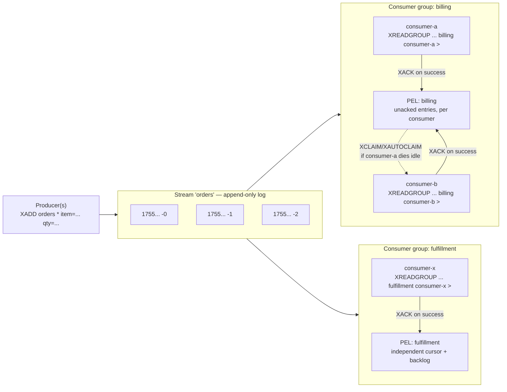

## Objective

Understand what a Redis Stream actually is — "a data structure that acts like an append-only log but also implements several operations to overcome some of the limits of a typical append-only log" — and why Redis 5.0 (2018) added it as a fifth core data type instead of leaving event distribution to Pub/Sub or a hand-rolled List queue. A Stream is an ordered, persisted sequence of entries, each stamped with an ID that encodes when it was written (`<milliseconds>-<sequence>`), so "the ID is related to the time the entry is generated" and range queries by time come "basically for free." That gets a Stream halfway there: `XADD`/`XRANGE`/`XREAD` alone already beat Pub/Sub at "give me what happened," because the log persists and can be replayed. The other half — and the more important one — is **consumer groups**: `XGROUP`/`XREADGROUP`/`XACK`/`XPENDING`/`XCLAIM` let several independent consumers cooperatively split one stream's workload, with Redis tracking exactly which entry each consumer has and hasn't acknowledged, and a documented path to reassign an unacknowledged entry when its consumer dies. That combination — persisted history plus per-message, per-consumer acknowledgment with failure recovery — is the thing neither Pub/Sub nor a plain List queue has ever offered, and it's the reason Streams exist as their own data type rather than as a recipe built from Lists.

## Use Cases

- **Event sourcing and activity feeds** — the canonical Stream use case cited in Redis's own docs: recording every user action, click, or state change as an immutable, appendable log that downstream code can replay from any point, not just consume live.
- **Sensor and IoT telemetry ingestion** — many devices `XADD`-ing readings into one stream (or one stream per device), where the auto-generated timestamp-encoded ID means "give me every reading between 14:00 and 14:05" is a plain `XRANGE`, no separate timestamp field or index required.
- **A durable, replayable notification or chat history** — unlike a Pub/Sub channel, where a client that reconnects has simply missed whatever was published while it was offline, a Stream lets a reconnecting client resume exactly where it left off with `XREAD ... STREAMS mystream <last-seen-id>`, because the messages are still there to be read.
- **A work queue processed by a pool of workers, with guaranteed at-least-once processing and crash recovery** — the reliability problem the sibling `redis-core-data-types-strings-lists-hashes` concept flags as a real gap in the `LPUSH`/`BRPOP` queue pattern (an item popped by `BRPOP` is simply gone if the consumer crashes before finishing it, and even the `RPOPLPUSH`-into-a-processing-list mitigation still requires the consumer to remember to clean up after itself). A consumer group's Pending Entries List (PEL) plus `XCLAIM`/`XAUTOCLAIM` solves exactly this, natively, which is why that concept calls Streams the pattern's eventual replacement.
- **Fan-out to multiple independent downstream services, each processing every event at its own pace** — order-placed events feeding both a billing service and a fulfillment service, where each service needs to see *every* event exactly once from its own point of view, not race each other for messages the way two Pub/Sub subscribers or two consumers on one List queue would. Two separate consumer groups on the same stream give each service its own independent read position and its own PEL.

## Deep Dive

### The Stream itself: an append-only log addressed by time-ordered IDs

`XADD key <id|*> field value [field value ...]` appends one entry — a small ordered set of field-value pairs — to the stream at `key`, creating the key if it doesn't exist (`NOMKSTREAM` suppresses that). Passing `*` as the ID tells Redis to auto-generate one in the form `<milliseconds>-<sequence>`, where the milliseconds part is the server's Unix time at the moment of the write and the sequence part disambiguates multiple entries written in the same millisecond. Redis's own guarantee is explicit: "Redis guarantees that IDs are always incremental: the ID of any entry you insert will be greater than any previous ID, so entries are totally ordered inside a stream" — and if the local clock ever jumps backward (a clock adjustment, a failover to a replica with a different clock), Redis keeps using the previous top ID's timestamp and just increments the sequence, so monotonicity never breaks. An explicit ID can be supplied instead of `*` (useful mainly when mirroring IDs from another system), but `XADD` rejects any ID that isn't strictly greater than the stream's current top ID.

| Command | Does |
|---|---|
| `XADD key [NOMKSTREAM] [MAXLEN\|MINID [~] threshold] <*\|id> field value [...]` | Appends an entry; `*` auto-generates the ID. `MAXLEN`/`MINID` optionally cap the stream's size in the same call — `~` requests fast, approximate trimming instead of exact |
| `XLEN key` | Number of entries in the stream, O(1) |
| `XRANGE key start end [COUNT n]` | Entries with IDs between `start` and `end` inclusive, oldest first; `-`/`+` mean smallest/greatest possible ID, and a `(`-prefixed ID makes that end exclusive |
| `XREVRANGE key end start [COUNT n]` | Same as `XRANGE` but newest first |
| `XDEL key id [id ...]` | Removes specific entries by ID |
| `XTRIM key MAXLEN\|MINID [~] threshold` | Evicts the oldest entries beyond a length or ID threshold — the same trimming `XADD ... MAXLEN` performs inline |

Because the ID *is* a timestamp plus a tiebreaker, `XRANGE mystream 1691765278160 1691765279999` is a legitimate time-range query with no secondary index — the ordering the log already has for free doubles as the index.

### XREAD: the basic log-consumption model

`XREAD [COUNT n] [BLOCK ms] STREAMS key [key ...] id [id ...]` reads entries with an ID greater than the one supplied, across one or more streams at once, and can block for up to `ms` milliseconds (or indefinitely with `BLOCK 0`) waiting for new entries when `$` is given as the ID (meaning "only entries added after this call started"). This is the closest Stream analogue to what Pub/Sub already does — deliver whatever comes in — except every reader can independently pick *where in the log* to start, and rereading the same range twice is just two `XREAD`s with the same IDs. What plain `XREAD` does *not* do is remember, on the server side, what any particular client has already consumed, or coordinate delivery across multiple readers so each entry goes to only one of them — every client calling `XREAD` on a stream sees every entry, same as `SUBSCRIBE` would, just with the added ability to also ask for history. Turning that into cooperative, tracked, exactly-one-consumer-per-entry delivery is what consumer groups add.

### Consumer groups: turning a shared log into a coordinated work queue

`XGROUP CREATE key group <id|$> [MKSTREAM]` creates a named cursor over a stream: "the command's `id` argument specifies the last delivered entry in the stream from the new group's perspective. The special ID `$` is the ID of the last entry in the stream, but you can substitute it with any valid ID." Creating a group with `$` means it only ever sees entries added *after* creation — history already in the stream is invisible to it unless `0` (or another earlier ID) is used instead. `MKSTREAM` atomically creates the stream too, for the common case of provisioning a group before any producer has written anything.

`XREADGROUP GROUP group consumer STREAMS key > ` is the consumer-group read: the special ID `>` means "give me only entries that were never delivered to any consumer in this group." Multiple consumers reading the same group with `>` split the stream's entries between them — "if, for instance, the stream gets the new entries A, B, and C and there are two consumers reading via a consumer group, one client will get, for instance, the messages A and C, and the other the message B" — which is the sharding/partitioning behavior a plain `XREAD` or a Pub/Sub channel cannot express, since both of those deliver every message to every listener. Every entry handed out this way lands in the group's **Pending Entries List (PEL)**: "one of the guarantees of consumer groups is that a given consumer can only see the history of messages that were delivered to it, so a message has just a single owner," and Redis tracks, per entry, which consumer holds it, how long it's been held, and how many times it's been delivered. A stream can carry several independent consumer groups at once, each with its own last-delivered pointer and its own PEL — the mechanism behind the "two services, each sees every event once, independently" fan-out use case above.

### XACK, XPENDING, and recovering from a dead consumer

A consumer finishes processing an entry by calling `XACK key group id`, which "will immediately remove the pending entry from the Pending Entries List (PEL) since once a message is successfully processed, there is no longer need for the consumer group to track it and to remember the current owner of the message." Anything still sitting in the PEL is, by definition, work that was handed out but never confirmed done.

`XPENDING key group` (no range) returns a summary — total pending count, lowest and highest pending ID, and a per-consumer breakdown of how many entries each one is holding. Adding a range and count (`XPENDING key group - + 10`, optionally filtered by `IDLE min-ms` or a specific consumer) switches to the extended form: one row per pending entry, giving its ID, current owning consumer, milliseconds since last delivery, and delivery count. That's the observability surface for "what's stuck and with whom."

Recovery from a crashed or hung consumer is `XCLAIM key group new-consumer min-idle-time id [id ...]`, which reassigns ownership of entries that have been pending for at least `min-idle-time` milliseconds to a different, presumably healthy consumer — bumping their delivery counter each time. `XAUTOCLAIM key group new-consumer min-idle-time start [COUNT n]` (added in Redis 6.2) does the same scan-and-reclaim automatically with a returned cursor, instead of requiring the caller to already know which IDs are stuck. The documented recovery loop after an actual consumer crash is simpler still: call `XREADGROUP` with `0` (or any specific old ID) instead of `>` — "any other ID... will have the effect of returning entries that are pending for the consumer sending the command" — to replay a consumer's own unacknowledged backlog before rejoining the group with `>` for new messages. This delivery-tracking-plus-reclaim loop is exactly what makes consumer groups **at-least-once**: an entry is never silently dropped the way a Pub/Sub message is, because it stays in some consumer's PEL, claimable, until somebody `XACK`s it.

### Streams vs. Pub/Sub vs. Lists-as-a-queue

This is the comparison that actually explains why Streams exist as their own data type. Redis's own Pub/Sub documentation states the gap plainly: "Redis' Pub/Sub exhibits *at-most-once* message delivery semantics. As the name suggests, it means that a message will be delivered once if at all. Once the message is sent by the Redis server, there's no chance of it being sent again. If the subscriber is unable to handle the message... the message is forever lost. If your application requires stronger delivery guarantees, you may want to learn about Redis Streams. Messages in streams are persisted, and support both *at-most-once* as well as *at-least-once* delivery semantics." A List used as a queue (`LPUSH`/`BRPOP`) sits in between: an item does persist until popped, but once popped it's gone from Redis entirely, and there's no built-in mechanism tracking whether the popping consumer actually finished with it — the `RPOPLPUSH`-into-a-processing-list idiom papers over that, by hand, without acknowledgment, retry counts, or a way to inspect what's stuck.

| | Pub/Sub | List as queue | Stream + consumer group |
|---|---|---|---|
| Message persists after delivery? | No — never stored | Until popped, then gone | Until trimmed, regardless of consumption |
| Late/reconnecting subscriber sees history? | No — missed entirely | N/A (item already consumed) | Yes — `XRANGE`/`XREAD` from any earlier ID |
| Multiple independent consumer groups off one source? | No — every subscriber gets everything | No — one queue, one logical consumer per item | Yes — each group has its own cursor and PEL |
| Per-message ack + redelivery on failure? | No | Only hand-rolled (`RPOPLPUSH` + manual cleanup) | Native — `XACK`, `XPENDING`, `XCLAIM`/`XAUTOCLAIM` |
| Delivery guarantee | At-most-once | Effectively at-most-once unless hand-built | At-least-once (with consumer groups) |

Each consumer group reads the *same* underlying log independently — `billing` and `fulfillment` each see every order entry exactly once from their own perspective, and a dead `consumer-a` doesn't lose its in-flight entries, it just leaves them claimable in the `billing` group's PEL.

## Trade-offs

- **Streams trade Pub/Sub's zero-setup simplicity for real operational machinery.** A Pub/Sub channel needs no key, no group, no cleanup — `SUBSCRIBE`/`PUBLISH` and you're done. A Stream needs `XGROUP CREATE` per consumer group, a trimming policy, and application code that calls `XACK` and handles `XPENDING`/`XCLAIM` for recovery. That's the right trade only when replay, ack, or multi-consumer-group fan-out are actually needed — a live "who's online" broadcast or a simple cache-invalidation ping is still better served by Pub/Sub's at-most-once, fire-and-forget model.
- **A Stream grows forever unless something trims it.** Unlike a List queue, which self-drains as items are popped, `XADD` never removes anything on its own — `MAXLEN`/`MINID` (either inline on `XADD` or via a separate `XTRIM`) is a decision the application has to make deliberately, and forgetting it means unbounded memory growth. Trimming interacts with consumer groups, too: as of Redis 8.2, `XADD`/`XTRIM`'s `KEEPREF`/`DELREF`/`ACKED` options control whether trimmed entries still referenced by a slow consumer group's PEL are removed anyway (`KEEPREF`, the default), force-removed from every group's PEL (`DELREF`), or only removed once every group has acknowledged them (`ACKED`) — the fan-out use case (multiple independent groups) makes "the slowest group" a real constraint on how aggressively a stream can be trimmed.
- **At-least-once means possibly-more-than-once — Streams don't give you exactly-once for free.** `XCLAIM`/`XAUTOCLAIM` reassign an entry once it's been idle past a threshold, but "idle" can mean "the original consumer is dead" or just "the original consumer is slow." A wrongly-tuned idle threshold can hand the same entry to a second consumer while the first one is still legitimately working on it — processing logic still needs to be idempotent, the same discipline any at-least-once system requires. (This is a *consumption*-side concern; Redis 8.6's `IDMP`/`IDMPAUTO` options on `XADD` solve a different problem — deduplicating a *producer* that might retry the same write.)
- **A consumer group created with `$` silently starts blind to history.** `XGROUP CREATE key group $` is a common default, but it means that group's first `XREADGROUP ... >` call only ever returns entries added after the group existed — a group created to backfill or audit needs `0` (or an explicit earlier ID) instead, and this is a one-time choice made at creation, not something adjusted painlessly later (though `XGROUP SETID` can move a group's cursor after the fact).
- **Choosing among Pub/Sub, a List queue, and a Stream is a delivery-guarantee decision, not a preference.** The comparison table above is the whole decision: reach for Pub/Sub when losing a message under a dead or absent subscriber is acceptable and simplicity matters most; reach for a List when there's exactly one logical queue with one class of consumer and the reliable-queue idiom's manual bookkeeping is tolerable; reach for a Stream the moment more than one independent consumer (or consumer group) needs to see the same events, or a crashed consumer's in-flight work needs to be recoverable rather than silently lost.

## Documentation Links

- [Redis Documentation — Redis Streams](https://redis.io/docs/latest/develop/data-types/streams/) — doc
- [Redis Documentation — XADD](https://redis.io/docs/latest/commands/xadd/) — doc
- [Redis Documentation — XREAD](https://redis.io/docs/latest/commands/xread/) — doc
- [Redis Documentation — XGROUP CREATE](https://redis.io/docs/latest/commands/xgroup-create/) — doc
- [Redis Documentation — XREADGROUP](https://redis.io/docs/latest/commands/xreadgroup/) — doc
- [Redis Documentation — XACK](https://redis.io/docs/latest/commands/xack/) — doc
- [Redis Documentation — XPENDING](https://redis.io/docs/latest/commands/xpending/) — doc
- [Redis Documentation — XCLAIM](https://redis.io/docs/latest/commands/xclaim/) — doc
- [Redis Documentation — XAUTOCLAIM](https://redis.io/docs/latest/commands/xautoclaim/) — doc
- [Redis Documentation — Pub/Sub (delivery semantics)](https://redis.io/docs/latest/develop/pubsub/) — doc
