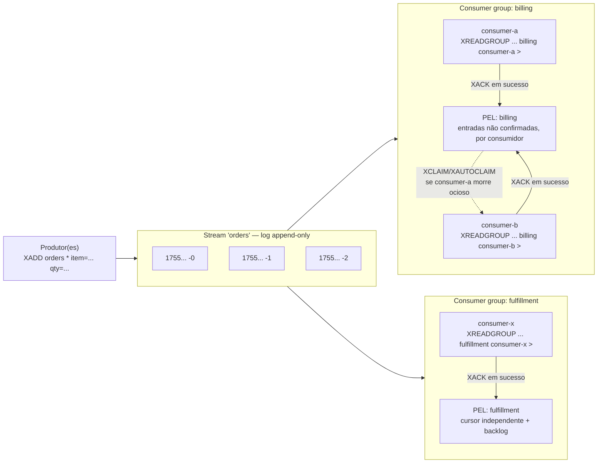

## Objective

Entender o que uma Redis Stream de fato é ("uma estrutura de dados que age como um log append-only mas também implementa várias operações para superar alguns dos limites de um log append-only típico") e por que o Redis 5.0 (2018) a adicionou como um quinto tipo de dado central em vez de deixar distribuição de evento para o Pub/Sub ou uma fila de List feita à mão. Uma Stream é uma sequência ordenada e persistida de entradas, cada uma carimbada com um ID que codifica quando foi escrita (`<milissegundos>-<sequência>`), então "o ID está relacionado ao momento em que a entrada é gerada" e consultas de faixa por tempo vêm "basicamente de graça." Isso leva uma Stream até a metade do caminho: `XADD`/`XRANGE`/`XREAD` sozinhos já vencem o Pub/Sub em "me dê o que aconteceu", porque o log persiste e pode ser reproduzido. A outra metade, e a mais importante, são os **consumer groups**: `XGROUP`/`XREADGROUP`/`XACK`/`XPENDING`/`XCLAIM` deixam vários consumidores independentes dividirem cooperativamente a carga de trabalho de uma stream, com o Redis rastreando exatamente qual entrada cada consumidor confirmou e não confirmou, e um caminho documentado para reatribuir uma entrada não confirmada quando seu consumidor morre. Essa combinação (histórico persistido mais confirmação por mensagem e por consumidor com recuperação de falha) é a coisa que nem o Pub/Sub nem uma fila de List comum jamais ofereceram, e é o motivo de Streams existirem como seu próprio tipo de dado em vez de como uma receita construída a partir de Lists.

## Use Cases

- **Event sourcing e feeds de atividade**: o caso de uso canônico de Stream citado na própria documentação do Redis: registrar toda ação de usuário, clique, ou mudança de estado como um log imutável e anexável que código a jusante pode reproduzir de qualquer ponto, não só consumir ao vivo.
- **Ingestão de telemetria de sensor e IoT**: muitos dispositivos dando `XADD` em leituras em uma stream (ou uma stream por dispositivo), onde o ID auto-gerado codificado com timestamp significa que "me dê toda leitura entre 14:00 e 14:05" é um `XRANGE` simples, sem campo ou índice de timestamp separado necessário.
- **Um histórico de notificação ou chat durável e reproduzível**: diferente de um canal Pub/Sub, onde um cliente que reconecta simplesmente perdeu o que foi publicado enquanto estava offline, uma Stream deixa um cliente reconectando retomar exatamente de onde parou com `XREAD ... STREAMS mystream <last-seen-id>`, porque as mensagens ainda estão lá para serem lidas.
- **Uma fila de trabalho processada por um pool de workers, com processamento at-least-once garantido e recuperação de crash**: o problema de confiabilidade que o conceito irmão `redis-core-data-types-strings-lists-hashes` sinaliza como uma lacuna real no padrão de fila `LPUSH`/`BRPOP` (um item removido por `BRPOP` simplesmente se foi se o consumidor travar antes de terminá-lo, e mesmo a mitigação de `RPOPLPUSH`-para-uma-lista-de-processamento ainda exige que o consumidor lembre de limpar depois de si). A Pending Entries List (PEL) de um consumer group mais `XCLAIM`/`XAUTOCLAIM` resolve exatamente isso, nativamente, que é por que aquele conceito chama Streams a eventual substituição do padrão.
- **Fan-out para vários serviços downstream independentes, cada um processando todo evento em seu próprio ritmo**: eventos de pedido-realizado alimentando tanto um serviço de faturamento quanto um serviço de atendimento, onde cada serviço precisa ver *todo* evento exatamente uma vez do seu próprio ponto de vista, não competir um com o outro por mensagens do jeito que dois subscribers de Pub/Sub ou dois consumidores em uma fila de List fariam. Dois consumer groups separados na mesma stream dão a cada serviço sua própria posição de leitura independente e sua própria PEL.

## Deep Dive

### A própria Stream: um log append-only endereçado por IDs ordenados por tempo

`XADD key <id|*> field value [field value ...]` adiciona uma entrada (um pequeno conjunto ordenado de pares campo-valor) à stream em `key`, criando a chave se ela não existir (`NOMKSTREAM` suprime isso). Passar `*` como o ID diz ao Redis para autogerar um no formato `<milissegundos>-<sequência>`, onde a parte de milissegundos é o tempo Unix do servidor no momento da escrita e a parte de sequência desambigua várias entradas escritas no mesmo milissegundo. A própria garantia do Redis é explícita: "o Redis garante que os IDs sempre são incrementais: o ID de qualquer entrada que você insere vai ser maior do que qualquer ID anterior, então entradas são totalmente ordenadas dentro de uma stream": e se o relógio local alguma vez pular para trás (um ajuste de relógio, um failover para uma réplica com um relógio diferente), o Redis continua usando o timestamp do ID mais alto anterior e só incrementa a sequência, então monotonicidade nunca quebra. Um ID explícito pode ser fornecido em vez de `*` (útil principalmente ao espelhar IDs de outro sistema), mas o `XADD` rejeita qualquer ID que não seja estritamente maior do que o ID mais alto atual da stream.

| Comando | Faz |
|---|---|
| `XADD key [NOMKSTREAM] [MAXLEN\|MINID [~] threshold] <*\|id> field value [...]` | Adiciona uma entrada; `*` autogera o ID. `MAXLEN`/`MINID` opcionalmente limitam o tamanho da stream na mesma chamada; `~` pede aparo rápido e aproximado em vez de exato |
| `XLEN key` | Número de entradas na stream, O(1) |
| `XRANGE key start end [COUNT n]` | Entradas com IDs entre `start` e `end` inclusive, mais antigas primeiro; `-`/`+` significam menor/maior ID possível, e um ID prefixado com `(` torna esse limite exclusivo |
| `XREVRANGE key end start [COUNT n]` | O mesmo que `XRANGE` mas mais novas primeiro |
| `XDEL key id [id ...]` | Remove entradas específicas por ID |
| `XTRIM key MAXLEN\|MINID [~] threshold` | Descarta as entradas mais antigas além de um limiar de comprimento ou ID: o mesmo aparo que `XADD ... MAXLEN` realiza inline |

Como o ID *é* um timestamp mais um desempate, `XRANGE mystream 1691765278160 1691765279999` é uma consulta de faixa de tempo legítima sem nenhum índice secundário: a ordenação que o log já tem de graça também funciona como o índice.

### XREAD: o modelo básico de consumo de log

`XREAD [COUNT n] [BLOCK ms] STREAMS key [key ...] id [id ...]` lê entradas com um ID maior do que o fornecido, em uma ou várias streams de uma vez, e pode bloquear por até `ms` milissegundos (ou indefinidamente com `BLOCK 0`) esperando por entradas novas quando `$` é dado como o ID (significando "só entradas adicionadas depois que essa chamada começou"). Esse é o análogo de Stream mais próximo do que o Pub/Sub já faz: entregar o que quer que chegue, exceto que todo leitor consegue escolher independentemente *de onde no log* começar, e reler a mesma faixa duas vezes é só dois `XREAD`s com os mesmos IDs. O que o `XREAD` simples *não* faz é lembrar, do lado do servidor, o que um cliente específico já consumiu, ou coordenar entrega entre vários leitores para que cada entrada vá para só um deles: todo cliente chamando `XREAD` em uma stream vê toda entrada, igual a `SUBSCRIBE` faria, só com a capacidade adicional de também pedir por histórico. Transformar isso em entrega cooperativa, rastreada, e exatamente-um-consumidor-por-entrada é o que consumer groups adicionam.

### Consumer groups: transformando um log compartilhado em uma fila de trabalho coordenada

`XGROUP CREATE key group <id|$> [MKSTREAM]` cria um cursor nomeado sobre uma stream: "o argumento `id` do comando especifica a última entrada entregue na stream do ponto de vista do novo grupo. O ID especial `$` é o ID da última entrada na stream, mas você pode substituí-lo por qualquer ID válido." Criar um grupo com `$` significa que ele só vai ver entradas adicionadas *depois* da criação; histórico já na stream fica invisível para ele a menos que `0` (ou outro ID mais antigo) seja usado em vez disso. `MKSTREAM` cria a stream atomicamente também, para o caso comum de provisionar um grupo antes de qualquer produtor ter escrito algo.

`XREADGROUP GROUP group consumer STREAMS key >` é a leitura de consumer group: o ID especial `>` significa "me dê só entradas que nunca foram entregues a nenhum consumidor nesse grupo." Vários consumidores lendo o mesmo grupo com `>` dividem as entradas da stream entre eles: "se, por exemplo, a stream recebe as novas entradas A, B, e C e há dois consumidores lendo via um consumer group, um cliente vai receber, por exemplo, as mensagens A e C, e o outro a mensagem B": que é o comportamento de sharding/particionamento que um `XREAD` simples ou um canal Pub/Sub não conseguem expressar, já que ambos entregam toda mensagem a todo ouvinte. Toda entrada distribuída dessa forma pousa na **Pending Entries List (PEL)** do grupo: "uma das garantias de consumer groups é que um dado consumidor só consegue ver o histórico de mensagens que foram entregues a ele, então uma mensagem tem só um único dono", e o Redis rastreia, por entrada, qual consumidor a possui, por quanto tempo tem sido possuída, e quantas vezes foi entregue. Uma stream pode carregar vários consumer groups independentes ao mesmo tempo, cada um com seu próprio ponteiro de última entrega e sua própria PEL: o mecanismo por trás do caso de uso de fan-out "dois serviços, cada um vê todo evento uma vez, independentemente" acima.

### XACK, XPENDING, e recuperação de um consumidor morto

Um consumidor termina de processar uma entrada chamando `XACK key group id`, que "vai imediatamente remover a entrada pendente da Pending Entries List (PEL) já que, uma vez que uma mensagem é processada com sucesso, não há mais necessidade de o consumer group rastreá-la e lembrar o dono atual da mensagem." Qualquer coisa ainda sentada na PEL é, por definição, trabalho que foi distribuído mas nunca confirmado como concluído.

`XPENDING key group` (sem faixa) retorna um resumo: contagem total pendente, o menor e o maior ID pendente, e um detalhamento por consumidor de quantas entradas cada um está segurando. Adicionar uma faixa e uma contagem (`XPENDING key group - + 10`, opcionalmente filtrado por `IDLE min-ms` ou um consumidor específico) muda para a forma estendida: uma linha por entrada pendente, dando seu ID, o consumidor dono atual, milissegundos desde a última entrega, e contagem de entrega. Essa é a superfície de observabilidade para "o que está travado e com quem."

A recuperação de um consumidor que travou ou ficou preso é `XCLAIM key group new-consumer min-idle-time id [id ...]`, que reatribui a posse de entradas que estão pendentes há pelo menos `min-idle-time` milissegundos para um consumidor diferente, presumivelmente saudável, incrementando o contador de entrega delas a cada vez. `XAUTOCLAIM key group new-consumer min-idle-time start [COUNT n]` (adicionado no Redis 6.2) faz a mesma varredura-e-recuperação automaticamente com um cursor retornado, em vez de exigir que quem chama já saiba quais IDs estão travados. O loop de recuperação documentado depois de um crash real de consumidor é ainda mais simples: chame `XREADGROUP` com `0` (ou qualquer ID antigo específico) em vez de `>`: "qualquer outro ID... vai ter o efeito de retornar entradas que estão pendentes para o consumidor enviando o comando", para reproduzir o backlog não confirmado do próprio consumidor antes de rejuntar-se ao grupo com `>` para mensagens novas. Esse loop de rastreamento-de-entrega-mais-recuperação é exatamente o que torna consumer groups **at-least-once**: uma entrada nunca é silenciosamente descartada do jeito que uma mensagem de Pub/Sub é, porque ela permanece na PEL de algum consumidor, reivindicável, até que alguém dê `XACK` nela.

### Streams vs. Pub/Sub vs. Lists-como-fila

Essa é a comparação que de fato explica por que Streams existem como seu próprio tipo de dado. A própria documentação de Pub/Sub do Redis declara a lacuna claramente: "o Pub/Sub do Redis exibe semântica de entrega de mensagem *at-most-once*. Como o nome sugere, significa que uma mensagem será entregue uma vez, se for entregue. Uma vez que a mensagem é enviada pelo servidor Redis, não há chance de ela ser enviada de novo. Se o subscriber não consegue lidar com a mensagem... a mensagem se perde para sempre. Se sua aplicação exige garantias de entrega mais fortes, você pode querer aprender sobre Redis Streams. Mensagens em streams são persistidas, e suportam tanto semântica de entrega *at-most-once* quanto *at-least-once*." Uma List usada como fila (`LPUSH`/`BRPOP`) fica no meio: um item de fato persiste até ser removido, mas uma vez removido ele se foi do Redis por completo, e não há nenhum mecanismo embutido rastreando se o consumidor que o removeu de fato terminou com ele; o idioma `RPOPLPUSH`-para-uma-lista-de-processamento disfarça isso, à mão, sem confirmação, contagens de retentativa, ou uma forma de inspecionar o que está travado.

| | Pub/Sub | List como fila | Stream + consumer group |
|---|---|---|---|
| Mensagem persiste após entrega? | Não: nunca armazenada | Até ser removida, depois some | Até ser aparada, independentemente de consumo |
| Subscriber atrasado/reconectando vê histórico? | Não: perdida por completo | N/A (item já consumido) | Sim: `XRANGE`/`XREAD` a partir de qualquer ID anterior |
| Vários consumer groups independentes de uma fonte? | Não: todo subscriber recebe tudo | Não: uma fila, um consumidor lógico por item | Sim: cada grupo tem seu próprio cursor e PEL |
| Ack por mensagem + reentrega em falha? | Não | Só feito à mão (`RPOPLPUSH` + limpeza manual) | Nativo: `XACK`, `XPENDING`, `XCLAIM`/`XAUTOCLAIM` |
| Garantia de entrega | At-most-once | Efetivamente at-most-once a menos que feito à mão | At-least-once (com consumer groups) |

Cada consumer group lê o *mesmo* log subjacente independentemente: `billing` e `fulfillment` cada um vê toda entrada de pedido exatamente uma vez do seu próprio ponto de vista, e um `consumer-a` morto não perde suas entradas em voo, ele só as deixa reivindicáveis na PEL do grupo `billing`.

## Trade-offs

- **Streams trocam a simplicidade de zero configuração do Pub/Sub por maquinaria operacional real.** Um canal Pub/Sub não precisa de chave, nem grupo, nem limpeza: `SUBSCRIBE`/`PUBLISH` e pronto. Uma Stream precisa de `XGROUP CREATE` por consumer group, uma política de aparo, e código de aplicação que chama `XACK` e trata `XPENDING`/`XCLAIM` para recuperação. Essa é a troca certa só quando replay, ack, ou fan-out de múltiplos consumer groups de fato são necessários: uma transmissão ao vivo de "quem está online" ou um simples ping de invalidação de cache ainda são melhor servidos pelo modelo at-most-once e fire-and-forget do Pub/Sub.
- **Uma Stream cresce para sempre a menos que algo a apare.** Diferente de uma fila de List, que se autoesvazia conforme itens são removidos, o `XADD` nunca remove nada por conta própria: `MAXLEN`/`MINID` (seja inline no `XADD` ou via um `XTRIM` separado) é uma decisão que a aplicação precisa tomar deliberadamente, e esquecer isso significa crescimento ilimitado de memória. Aparo também interage com consumer groups: a partir do Redis 8.2, as opções `KEEPREF`/`DELREF`/`ACKED` de `XADD`/`XTRIM` controlam se entradas aparadas ainda referenciadas pela PEL de um consumer group lento são removidas de qualquer forma (`KEEPREF`, o padrão), forçadamente removidas da PEL de todo grupo (`DELREF`), ou só removidas uma vez que todo grupo as confirmou (`ACKED`): o caso de uso de fan-out (vários grupos independentes) faz de "o grupo mais lento" uma restrição real sobre quão agressivamente uma stream pode ser aparada.
- **At-least-once significa possivelmente-mais-de-uma-vez: Streams não dão exactly-once de graça.** `XCLAIM`/`XAUTOCLAIM` reatribuem uma entrada uma vez que ela ficou ociosa além de um limiar, mas "ocioso" pode significar "o consumidor original está morto" ou só "o consumidor original está lento." Um limiar de ociosidade mal ajustado pode entregar a mesma entrada a um segundo consumidor enquanto o primeiro ainda está legitimamente trabalhando nela: a lógica de processamento ainda precisa ser idempotente, a mesma disciplina que qualquer sistema at-least-once exige. (Essa é uma preocupação do lado do *consumo*; as opções `IDMP`/`IDMPAUTO` do `XADD` no Redis 8.6 resolvem um problema diferente: deduplicar um *produtor* que pode retentar a mesma escrita.)
- **Um consumer group criado com `$` silenciosamente começa cego ao histórico.** `XGROUP CREATE key group $` é um padrão comum, mas significa que a primeira chamada `XREADGROUP ... >` daquele grupo só retorna entradas adicionadas depois que o grupo existiu: um grupo criado para backfill ou auditoria precisa de `0` (ou um ID anterior explícito) em vez disso, e essa é uma escolha de uma vez feita na criação, não algo ajustado sem dor depois (embora `XGROUP SETID` possa mover o cursor de um grupo depois do fato).
- **Escolher entre Pub/Sub, uma fila de List, e uma Stream é uma decisão de garantia de entrega, não uma preferência.** A tabela de comparação acima é a decisão inteira: recorra ao Pub/Sub quando perder uma mensagem sob um subscriber morto ou ausente é aceitável e simplicidade importa mais; recorra a uma List quando há exatamente uma fila lógica com uma classe de consumidor e a contabilidade manual do idioma de fila confiável é tolerável; recorra a uma Stream no momento em que mais de um consumidor independente (ou consumer group) precisa ver os mesmos eventos, ou o trabalho em voo de um consumidor que travou precisa ser recuperável em vez de silenciosamente perdido.

## Documentation Links

- [Redis Documentation: Redis Streams](https://redis.io/docs/latest/develop/data-types/streams/) - doc
- [Redis Documentation: XADD](https://redis.io/docs/latest/commands/xadd/) - doc
- [Redis Documentation: XREAD](https://redis.io/docs/latest/commands/xread/) - doc
- [Redis Documentation: XGROUP CREATE](https://redis.io/docs/latest/commands/xgroup-create/) - doc
- [Redis Documentation: XREADGROUP](https://redis.io/docs/latest/commands/xreadgroup/) - doc
- [Redis Documentation: XACK](https://redis.io/docs/latest/commands/xack/) - doc
- [Redis Documentation: XPENDING](https://redis.io/docs/latest/commands/xpending/) - doc
- [Redis Documentation: XCLAIM](https://redis.io/docs/latest/commands/xclaim/) - doc
- [Redis Documentation: XAUTOCLAIM](https://redis.io/docs/latest/commands/xautoclaim/) - doc
- [Redis Documentation: Pub/Sub (delivery semantics)](https://redis.io/docs/latest/develop/pubsub/) - doc
