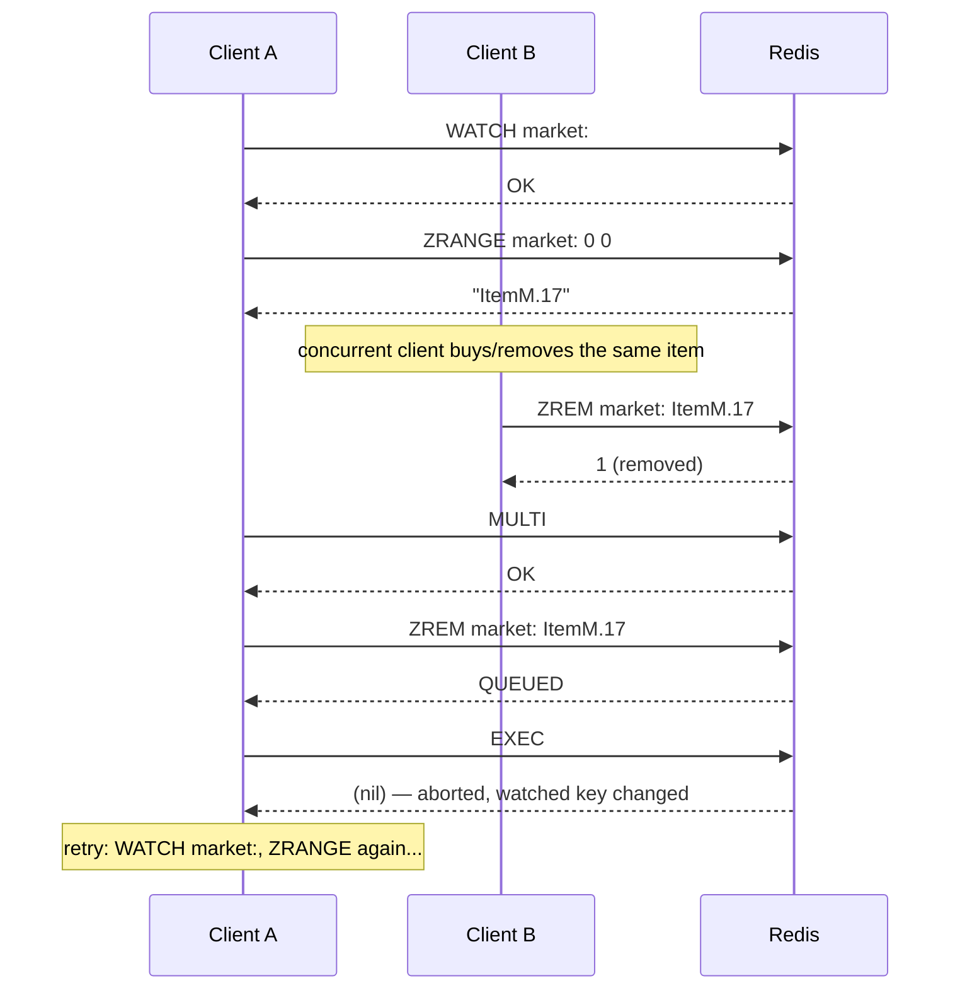

## Objective

Understand what `MULTI`/`EXEC` actually guarantees in Redis — an isolated, uninterrupted run of a queued command sequence, not a relational database's rollback-on-error transaction — and the single most commonly misunderstood consequence of that: a command that fails partway through `EXEC` does **not** abort the ones after it. Then see what `WATCH` adds on top (optimistic-locking check-and-set) and, separately, what a pipeline is: a purely network-level optimization that batches commands into one round trip, with no relationship to atomicity at all — you can pipeline without `MULTI`/`EXEC`, and `MULTI`/`EXEC` is itself always sent as a pipeline under the hood.

## Use Cases

- Wrapping a multi-key balance transfer (`DECRBY` the source account, `INCRBY` the destination) in `MULTI`/`EXEC` so no other client can observe or interleave with the transfer mid-flight — with the insufficient-funds check made by the *application*, before `EXEC` is ever called, and `DISCARD` used to cancel the queued commands if the check fails.
- Implementing an atomic "pop the lowest-scored member" operation that Redis has no single command for (pre-5.0, before `ZPOPMIN` existed) by combining `WATCH` on the sorted set, a `ZRANGE` read, and a `MULTI`/`ZREM`/`EXEC` — retrying the whole read-decide-write cycle whenever `EXEC` reports the watched key changed underneath it.
- Collapsing a request handler's several independent writes — a login-token `HSET`, a "recently viewed" `ZADD`, a per-item view-count `ZINCRBY`, a trim `ZREMRANGEBYRANK` — into a single non-transactional pipeline purely to cut round trips, when none of those writes needs to be isolated from other clients' commands.
- Fetching a full page of results that would otherwise cost one round trip per item (the book's own example: 26 round trips to render a page of articles) by batching the reads into one pipeline instead, with no `MULTI`/`EXEC` involved at all.
- Sending an already-transactional `WATCH`/`MULTI`/`EXEC` sequence itself over a pipeline, since — per *Redis Essentials* — "It is a good idea to send transactions in a pipeline to avoid an extra round trip"; some clients (`node_redis`) do this automatically, others need it requested explicitly.

## Deep Dive

### What MULTI/EXEC actually guarantees

*Redis Essentials* states it plainly: "The command `MULTI` marks the beginning of a transaction, and the command `EXEC` marks its end. Any commands between the `MULTI` and `EXEC` commands are serialized and executed as an atomic operation. Redis does not serve any other client in the middle of a transaction." Commands issued after `MULTI` aren't run immediately — the client queues them (replying `QUEUED` to each), and Redis executes the whole queue back-to-back, uninterrupted by any other connection, only once `EXEC` arrives.

*Redis in Action* frames the same guarantee from the isolation angle, with a concrete demonstration: three threads each `INCR` then, after a 100ms sleep, `-1` a shared counter. Run without a transaction, the three threads interleave freely and the counter climbs to values like 1, 2, 3 mid-flight — a visible race. Wrap the same increment/sleep/decrement pair in a `MULTI`/`EXEC` pipeline and every thread's result comes back `1`, because "each increment/sleep/decrement pair is executed inside a transaction, no other commands can be interleaved."

### The gotcha: EXEC does not roll back

This is the part most people coming from a SQL background get wrong. *Redis Essentials* is explicit: "Unlike in traditional SQL databases, transactions in Redis are not rolled back if they produce failures. Redis executes the commands in order, and if any of them fail, it proceeds to the next command." Current Redis documentation confirms this is still exactly how it works: "even when a command fails, all the other commands in the queue are processed — Redis will *not* stop the processing of commands," and "Redis does not support rollbacks of transactions since supporting rollbacks would have a significant impact on the simplicity and performance of Redis."

Concretely, `SET a abc` followed by `LPOP a` inside a transaction: the `SET` succeeds, the `LPOP` fails with `WRONGTYPE` because `a` now holds a string, not a list — and `EXEC` still returns both results, one success and one error, with the `SET` fully applied. Nothing rolls it back.

There are two distinct failure classes, and only one of them aborts the transaction:

- **Errors queueing a command (before `EXEC`)** — a syntactically wrong command (bad arity, unknown command name) is rejected immediately at queue time. Since Redis 2.6.5, the server tracks this and refuses to run the transaction at all when `EXEC` is called, discarding it outright.
- **Errors executing a command (during `EXEC`)** — a command that's syntactically valid but fails at runtime (`LPOP` against a string, `INCR` against a non-numeric value) simply returns its own error in the reply array. Every other queued command still runs.

This is also why the book's bank-transfer example decides *before* queuing anything, not by relying on Redis to catch a bad state: the `transfer()` function checks `balance >= value` in application code and calls either `multi.exec()` or `multi.discard()` — Redis itself never evaluates the balance or aborts on it. *Redis in Action* makes the same limitation explicit from the other side: "In Redis, every command passed as part of a basic `MULTI`/`EXEC` transaction is executed one after another until they've completed" — there's no branching *inside* the queue; the decision of what to queue, or whether to `EXEC` at all, has to be made beforehand, in the client.

### WATCH: optimistic locking, not blocking

`WATCH` is what turns a plain `MULTI`/`EXEC` into a check-and-set. Current Redis documentation: "`WATCH`ed keys are monitored in order to detect changes against them. If at least one watched key is modified before the `EXEC` command, the whole transaction aborts, and `EXEC` returns a Null reply to notify that the transaction failed... This form of locking is called *optimistic locking*." *Redis in Action*'s canonical example is exactly the `ZPOP` case from Use Cases above:

```
WATCH zset
element = ZRANGE zset 0 0
MULTI
ZREM zset element
EXEC
```

If `EXEC` returns nil, another client changed `zset` between the `WATCH` and the `EXEC` — the caller just repeats the whole sequence. *Redis Essentials*' Node.js equivalent (`client.watch(key, ...)` then `zrange` then `multi.exec()`, falling back to calling `zpop` again on failure) is the same pattern in a different client. Note that `WATCH` only guards against changes to the *watched keys* — it says nothing about the commands queued inside the transaction itself: "Commands within a transaction won't trigger the `WATCH` condition since they are only queued until the `EXEC` is sent."

The sequence below shows exactly this: Client A watches a key, reads it, then queues a command against it — but Client B modifies the same key in between, so A's `EXEC` comes back empty and A has to retry from the top.



This works, but it degrades badly once contention rises — every conflicting write forces a full retry of the read-decide-write cycle. That's the exact motivation the sibling concept **Redis Distributed Locking and Semaphores** builds on: it walks through what happens to this pattern under load (retries spiking into the hundreds of thousands on a busy marketplace) and why the book reaches for a hand-rolled `SETNX`-based lock instead. This concept stops at the transaction/pipeline mechanics themselves; see that one for the locking build-out.

### Pipelines: a network optimization, not a consistency guarantee

A pipeline solves a completely different problem than a transaction does: round trips. *Redis Essentials* names the cost directly: "The time taken for a Redis client to send a command and obtain a reply from the Redis server is called Round Trip Time (RTT)... if the network link between a client and server has an RTT of 100 ms, the maximum number of commands that can be sent per second is 10, no matter how many commands can be handled by the Redis server." A pipeline sends a batch of commands together and reads all the replies at once, so ten commands cost one RTT instead of ten.

Crucially, a pipeline carries **no** atomicity or isolation guarantee on its own. *Redis Essentials* is explicit: "Redis commands sent in a pipeline must be independent. They run sequentially in the server (the order is preserved), but they do not run as a transaction. Even though pipelines are neither transactional nor atomic (this means that different Redis commands may occur between the ones in the pipeline), they are still useful because they can save a lot of network time."

*Redis in Action* shows this is the same client-side mechanism as a transaction, just with the transactional wrapping switched off. Its Python client exposes one `pipeline()` call for both cases: `conn.pipeline()` (or `conn.pipeline(True)`) collects commands and wraps them in `MULTI`/`EXEC` automatically; `conn.pipeline(False)` collects the same way but sends them as a plain batch, with no `MULTI`/`EXEC` at all. The non-transactional version of `update_token()` — batching an `HSET`, two or three `ZADD`/`ZREMRANGEBYRANK`/`ZINCRBY` calls into one `pipe.execute()` — cuts round trips from three-to-five down to one, with measured throughput gains from the book's own benchmark table:

| Connection | RTT | Without pipeline | With pipeline |
|---|---|---|---|
| Local machine (Unix socket) | 0.015ms | 3,761 calls/s | 6,394 calls/s |
| Remote, shared switch | 0.271ms | 739 calls/s | 2,841 calls/s |
| Remote, VPN | 48ms | 3.67 calls/s | 18.2 calls/s |

The higher the latency, the bigger the win — up to 5x on the slow VPN link, because pipelining amortizes RTT across many commands instead of paying it once per command.

Putting the two together: pipelining and transactions are orthogonal axes, not a spectrum.

- **Pipeline without transaction** — batch independent commands purely to save round trips; each command still executes atomically on its own, but other clients' commands *can* interleave between the ones in your pipeline.
- **Transaction without an explicit pipeline call** — doesn't really happen in practice, because `MULTI`/`EXEC` is itself always sent as a pipeline: the client queues every command locally and flushes them together with `EXEC`, for exactly the same round-trip-saving reason. *Redis Essentials* recommends this explicitly for clients that don't do it by default: "It is a good idea to send transactions in a pipeline to avoid an extra round trip."
- **Transaction with pipeline** — the normal case: one round trip *and* isolation from other clients, which is what `conn.pipeline(True)` gives you by default in `redis-py`.

### Book vs today

> **The core semantics haven't changed.** Current Redis documentation describes `MULTI`/`EXEC`/`DISCARD`/`WATCH` in essentially the same terms as both books: serialized, uninterrupted execution; no rollback on runtime errors ("Redis does not support rollbacks of transactions since supporting rollbacks would have a significant impact on the simplicity and performance of Redis"); `WATCH` as check-and-set optimistic locking. One real behavioral change did land since these books: before Redis 6.0.9, a key expiring naturally between `WATCH` and `EXEC` did **not** abort the transaction; from 6.0.9 onward it does, closing a subtle correctness gap the books don't mention (they predate it).

> **Redis 8.4 adds a narrower alternative to WATCH for the single-key case.** For a plain check-and-set on one string key, `SET key value IFEQ old_value` (with `IFNE`/`IFDEQ`/`IFDNE` variants) and the `DELEX key IFEQ value` command now do in one atomic round trip what `WATCH`+`GET`+`MULTI`+`SET`+`EXEC` needed five for. It doesn't replace `WATCH` for multi-key or multi-type coordination — the marketplace-style cases both books use `WATCH` for still need it — but it removes the retry loop entirely for the common single-key case.

> **Lua scripting and Redis Functions solve the one thing MULTI/EXEC genuinely can't.** Neither book's transaction can branch on a value it just read — "it is not possible to make any decisions inside the transaction, since all the commands are queued," as *Redis Essentials* puts it — which is exactly why the bank-transfer example has to check the balance in application code before deciding to `EXEC` or `DISCARD`. A Lua script (`EVAL`, available since Redis 2.6) runs server-side as a single atomic, uninterrupted unit — like a transaction, but able to read a value and branch on it in the same atomic step. Current Redis documentation puts it directly: "Everything you can do with a Redis Transaction, you can also do with a script, and usually the script will be both simpler and faster." Redis Functions (`FUNCTION LOAD`/`FCALL`, 7.0+) build on the same Lua execution model but as named, persistent, replicated server-side code instead of an ad hoc script resent on every call — the modern choice when the logic is reused often enough to be worth deploying rather than shipping inline each time.

## Trade-offs

- **A transaction buys isolation from other clients, not correctness of your own command sequence.** Nothing stops a `SET` from committing while the `LPOP` right after it fails — if your application assumes "all or nothing," it will be wrong the first time a wrong-type or out-of-range command lands in the middle of a `MULTI` block. Design each queued command to be safe to have run even if a later one in the same transaction fails.
- **WATCH gives you retry-based optimistic concurrency, not a queue.** A failed `EXEC` doesn't wait its turn — it fails immediately and hands the retry back to the client. That's cheap and fine under low contention; under high contention it's exactly the degradation the sibling **Redis Distributed Locking and Semaphores** concept measures and works around with a hand-rolled lock. Don't reach for `WATCH` on a hot key expecting it to behave like a mutex.
- **A non-transactional pipeline trades isolation for throughput — deliberately.** Batching independent commands into `pipe = conn.pipeline(False)` is exactly right when nothing needs to be atomic across them, and wrong the moment another client touching the same keys mid-batch would corrupt your result. If you need "nothing else touches this data while I do these N things," that's `MULTI`/`EXEC`, not a bare pipeline.
- **Conflating pipelining with atomicity costs you one way or the other.** Assuming a pipeline is transactional gets you silent race conditions the first time two clients' pipelines interleave; assuming `MULTI`/`EXEC` is "just for performance" and skipping it when you actually needed isolation reintroduces the exact check-then-act race both books spend a whole section warning about.
- **Big batches — pipelined or transactional — cost the rest of the system while they run.** A `MULTI`/`EXEC` blocks every other client for its full duration by design; an oversized pipeline builds up memory client- and server-side before it flushes. *Redis in Action*'s own aside — "when sending many commands, it might be a good idea to use multiple pipelines rather than one big pipeline" — applies just as much to how large a single transaction should be.
- **Lua scripts and Functions remove the "no branching" limitation but aren't free.** A script that reads and decides atomically also blocks the server for its entire runtime, same as an oversized transaction — a slow or accidentally-looping script is a full outage, not a slow query. Functions add real operational surface (versioning, deployment, `FUNCTION LOAD` as a step in your release process) that a one-off `MULTI`/`EXEC` block never had.

## Documentation Links

- Maxwell Dayvson Da Silva & Hugo Lopes Tavares, "Redis Essentials" (Packt, 2015) — Chapter 4, "Commands (Where the Wild Things Are)," sections "Transactions" and "Pipelines," p. 81-85 — doc
- Josiah Carlson, "Redis in Action" (Manning, 2013) — Chapter 3.7.2 "Basic Redis transactions," p. 58-60, and Chapter 4.5 "Non-transactional pipelines," p. 84-87 — doc
- [Redis Documentation — Transactions (MULTI, EXEC, DISCARD, WATCH, errors inside a transaction, optimistic locking, Redis scripting and transactions)](https://redis.io/docs/latest/develop/using-commands/transactions/) — doc
- [Redis Documentation — SET command (IFEQ/IFNE/IFDEQ/IFDNE compare-and-set options, Redis 8.4+)](https://redis.io/docs/latest/commands/set/) — doc
- [Redis Documentation — Scripting with Lua (EVAL, atomicity guarantees)](https://redis.io/docs/latest/develop/programmability/eval-intro/) — doc
- [Redis Documentation — Redis Functions (FUNCTION LOAD, FCALL, Redis 7.0+)](https://redis.io/docs/latest/develop/programmability/functions-intro/) — doc
- [Redis Blog — "You Don't Need Transaction Rollbacks in Redis"](https://redis.io/blog/you-dont-need-transaction-rollbacks-in-redis/) — doc
