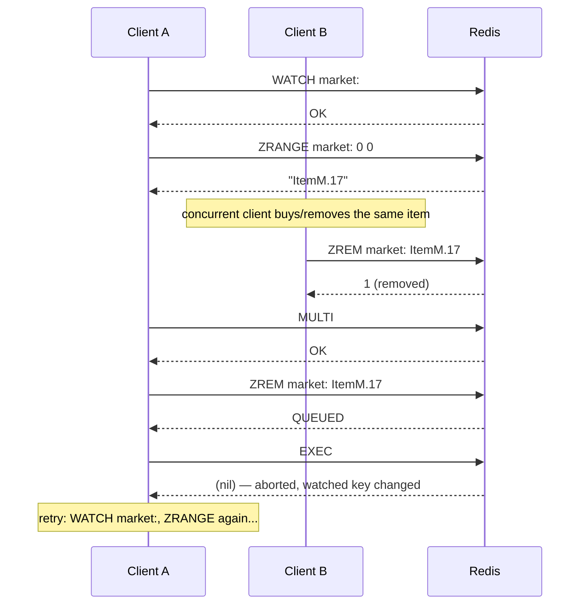

## Objective

Entender o que `MULTI`/`EXEC` de fato garante no Redis: uma execução isolada e ininterrupta de uma sequência de comando enfileirada, não a transação de rollback-em-erro de um banco de dados relacional, e a consequência única mais comumente mal entendida disso: um comando que falha no meio do `EXEC` **não** aborta os que vêm depois dele. Depois ver o que o `WATCH` adiciona por cima (check-and-set de locking otimista) e, separadamente, o que um pipeline é: uma otimização puramente em nível de rede que agrupa comandos em uma ida e volta, sem nenhuma relação com atomicidade de jeito nenhum: você pode fazer pipeline sem `MULTI`/`EXEC`, e o próprio `MULTI`/`EXEC` sempre é enviado como um pipeline por baixo dos panos.

## Use Cases

- Envolver uma transferência de saldo multi-chave (`DECRBY` na conta de origem, `INCRBY` na de destino) em `MULTI`/`EXEC` para que nenhum outro cliente consiga observar ou se intercalar com a transferência em voo: com a checagem de fundos insuficientes feita pela *aplicação*, antes de o `EXEC` ser sequer chamado, e `DISCARD` usado para cancelar os comandos enfileirados se a checagem falhar.
- Implementar uma operação atômica de "pop do membro com menor score" para a qual o Redis não tem um único comando (pré-5.0, antes de o `ZPOPMIN` existir) combinando `WATCH` no sorted set, uma leitura `ZRANGE`, e um `MULTI`/`ZREM`/`EXEC`: retentando o ciclo inteiro de ler-decidir-escrever sempre que o `EXEC` reportar que a chave observada mudou por baixo dele.
- Colapsar várias escritas independentes de um handler de requisição (um `HSET` de token de login, um `ZADD` de "vistos recentemente", um `ZINCRBY` de contagem de visualização por item, um aparo `ZREMRANGEBYRANK`) em um único pipeline não transacional puramente para cortar idas e voltas, quando nenhuma dessas escritas precisa ser isolada dos comandos de outros clientes.
- Buscar uma página completa de resultados que de outra forma custaria uma ida e volta por item (o próprio exemplo do livro: 26 idas e voltas para renderizar uma página de artigos) agrupando as leituras em um pipeline em vez disso, sem nenhum `MULTI`/`EXEC` envolvido.
- Enviar uma sequência `WATCH`/`MULTI`/`EXEC` já transacional em si mesma por cima de um pipeline, já que, segundo *Redis Essentials*, "é uma boa ideia enviar transações em um pipeline para evitar uma ida e volta extra"; alguns clientes (`node_redis`) fazem isso automaticamente, outros precisam que seja solicitado explicitamente.

## Deep Dive

### O que o MULTI/EXEC de fato garante

*Redis Essentials* declara isso claramente: "o comando `MULTI` marca o início de uma transação, e o comando `EXEC` marca seu fim. Quaisquer comandos entre os comandos `MULTI` e `EXEC` são serializados e executados como uma operação atômica. O Redis não atende nenhum outro cliente no meio de uma transação." Comandos emitidos depois de `MULTI` não rodam imediatamente: o cliente os enfileira (respondendo `QUEUED` a cada um), e o Redis executa a fila inteira de uma vez, ininterrupto por qualquer outra conexão, só quando o `EXEC` chega.

*Redis in Action* enquadra a mesma garantia pelo ângulo de isolamento, com uma demonstração concreta: três threads cada uma dá `INCR` e depois, após um sleep de 100ms, `-1` em um contador compartilhado. Rodado sem uma transação, as três threads se intercalam livremente e o contador sobe para valores como 1, 2, 3 em voo: uma corrida visível. Envolver o mesmo par de incremento/sleep/decremento em um pipeline `MULTI`/`EXEC` e o resultado de toda thread volta `1`, porque "cada par de incremento/sleep/decremento é executado dentro de uma transação, nenhum outro comando consegue se intercalar."

### A pegadinha: o EXEC não reverte

Essa é a parte que a maioria de quem vem de um background SQL erra. *Redis Essentials* é explícito: "diferente de bancos de dados SQL tradicionais, transações no Redis não são revertidas se produzem falhas. O Redis executa os comandos em ordem, e se algum deles falha, ele prossegue para o próximo comando." A documentação atual do Redis confirma que é exatamente assim que ainda funciona: "mesmo quando um comando falha, todos os outros comandos na fila são processados; o Redis *não* vai parar o processamento de comandos", e "o Redis não suporta rollback de transações já que suportar rollbacks teria um impacto significativo na simplicidade e desempenho do Redis."

Concretamente, `SET a abc` seguido de `LPOP a` dentro de uma transação: o `SET` tem sucesso, o `LPOP` falha com `WRONGTYPE` porque `a` agora guarda uma string, não uma lista, e o `EXEC` ainda retorna os dois resultados, um sucesso e um erro, com o `SET` totalmente aplicado. Nada o reverte.

Existem duas classes de falha distintas, e só uma delas aborta a transação:

- **Erros ao enfileirar um comando (antes do `EXEC`)**: um comando sintaticamente errado (aridade errada, nome de comando desconhecido) é rejeitado imediatamente no momento de enfileirar. Desde o Redis 2.6.5, o servidor rastreia isso e se recusa a rodar a transação de todo quando o `EXEC` é chamado, descartando-a de vez.
- **Erros ao executar um comando (durante o `EXEC`)**: um comando que é sintaticamente válido mas falha em runtime (`LPOP` contra uma string, `INCR` contra um valor não numérico) simplesmente retorna seu próprio erro no array de resposta. Todo outro comando enfileirado ainda roda.

Isso também é por que o exemplo de transferência bancária do livro decide *antes* de enfileirar qualquer coisa, não confiando no Redis para pegar um estado ruim: a função `transfer()` checa `balance >= value` em código de aplicação e chama ou `multi.exec()` ou `multi.discard()`: o próprio Redis nunca avalia o saldo nem aborta por causa dele. *Redis in Action* torna a mesma limitação explícita do outro lado: "no Redis, todo comando passado como parte de uma transação `MULTI`/`EXEC` básica é executado um depois do outro até que tenham terminado": não há ramificação *dentro* da fila; a decisão do que enfileirar, ou se deve dar `EXEC` de todo, precisa ser tomada de antemão, no cliente.

### WATCH: locking otimista, não bloqueante

`WATCH` é o que transforma um `MULTI`/`EXEC` simples em um check-and-set. A documentação atual do Redis: "chaves observadas por `WATCH` são monitoradas para detectar mudanças contra elas. Se pelo menos uma chave observada é modificada antes do comando `EXEC`, a transação inteira aborta, e o `EXEC` retorna uma resposta Null para notificar que a transação falhou... essa forma de locking é chamada de *locking otimista*." O exemplo canônico de *Redis in Action* é exatamente o caso `ZPOP` dos Use Cases acima:

```
WATCH zset
element = ZRANGE zset 0 0
MULTI
ZREM zset element
EXEC
```

Se o `EXEC` retorna nil, outro cliente mudou `zset` entre o `WATCH` e o `EXEC`: quem chamou simplesmente repete a sequência inteira. O equivalente Node.js de *Redis Essentials* (`client.watch(key, ...)` depois `zrange` depois `multi.exec()`, recorrendo a chamar `zpop` de novo em caso de falha) é o mesmo padrão em um cliente diferente. Note que `WATCH` só protege contra mudanças nas *chaves observadas*: ele não diz nada sobre os comandos enfileirados dentro da própria transação: "comandos dentro de uma transação não vão disparar a condição de `WATCH` já que só são enfileirados até que o `EXEC` seja enviado."

A sequência abaixo mostra exatamente isso: o Cliente A observa uma chave, a lê, depois enfileira um comando contra ela, mas o Cliente B modifica a mesma chave no meio, então o `EXEC` de A volta vazio e A precisa retentar do início.



Isso funciona, mas degrada mal assim que a contenção sobe: toda escrita conflitante força uma retentativa completa do ciclo ler-decidir-escrever. Essa é exatamente a motivação sobre a qual o conceito irmão **Locking Distribuído e Semáforos no Redis** se apoia: ele percorre o que acontece com esse padrão sob carga (retentativas subindo para centenas de milhares em um marketplace movimentado) e por que o livro recorre a um lock feito à mão baseado em `SETNX` em vez disso. Este conceito para na própria mecânica de transação/pipeline; veja aquele para a construção de locking.

### Pipelines: uma otimização de rede, não uma garantia de consistência

Um pipeline resolve um problema completamente diferente de uma transação: idas e voltas. *Redis Essentials* nomeia o custo diretamente: "o tempo que um cliente Redis leva para enviar um comando e obter uma resposta do servidor Redis é chamado de Round Trip Time (RTT)... se o link de rede entre um cliente e um servidor tem um RTT de 100 ms, o número máximo de comandos que podem ser enviados por segundo é 10, não importa quantos comandos o servidor Redis consiga tratar." Um pipeline envia um lote de comandos junto e lê todas as respostas de uma vez, então dez comandos custam um RTT em vez de dez.

Crucialmente, um pipeline não carrega **nenhuma** garantia de atomicidade ou isolamento por conta própria. *Redis Essentials* é explícito: "comandos Redis enviados em um pipeline precisam ser independentes. Eles rodam sequencialmente no servidor (a ordem é preservada), mas não rodam como uma transação. Mesmo que pipelines não sejam nem transacionais nem atômicos (isso significa que comandos Redis diferentes podem ocorrer entre os do pipeline), eles ainda são úteis porque podem economizar muito tempo de rede."

*Redis in Action* mostra que isso é o mesmo mecanismo do lado do cliente que uma transação, só com o envolvimento transacional desligado. Seu cliente Python expõe uma única chamada `pipeline()` para os dois casos: `conn.pipeline()` (ou `conn.pipeline(True)`) coleta comandos e os envolve em `MULTI`/`EXEC` automaticamente; `conn.pipeline(False)` coleta da mesma forma mas os envia como um lote simples, sem nenhum `MULTI`/`EXEC` de jeito nenhum. A versão não transacional de `update_token()` (agrupando um `HSET`, duas ou três chamadas `ZADD`/`ZREMRANGEBYRANK`/`ZINCRBY` em um único `pipe.execute()`) corta idas e voltas de três-a-cinco para uma, com ganhos de throughput medidos a partir da própria tabela de benchmark do livro:

| Conexão | RTT | Sem pipeline | Com pipeline |
|---|---|---|---|
| Máquina local (socket Unix) | 0,015ms | 3.761 chamadas/s | 6.394 chamadas/s |
| Remota, switch compartilhado | 0,271ms | 739 chamadas/s | 2.841 chamadas/s |
| Remota, VPN | 48ms | 3,67 chamadas/s | 18,2 chamadas/s |

Quanto maior a latência, maior o ganho: até 5x no link de VPN lento, porque pipelining amortiza o RTT entre vários comandos em vez de pagá-lo uma vez por comando.

Colocando os dois juntos: pipelining e transações são eixos ortogonais, não um espectro.

- **Pipeline sem transação**: agrupa comandos independentes puramente para economizar idas e voltas; cada comando ainda executa atomicamente por conta própria, mas comandos de outros clientes *podem* se intercalar entre os do seu pipeline.
- **Transação sem uma chamada de pipeline explícita**: não acontece de verdade na prática, porque o próprio `MULTI`/`EXEC` sempre é enviado como um pipeline: o cliente enfileira todo comando localmente e os despeja juntos com o `EXEC`, exatamente pelo mesmo motivo de economia de ida e volta. *Redis Essentials* recomenda isso explicitamente para clientes que não fazem isso por padrão: "é uma boa ideia enviar transações em um pipeline para evitar uma ida e volta extra."
- **Transação com pipeline**: o caso normal: uma ida e volta *e* isolamento de outros clientes, que é o que `conn.pipeline(True)` te dá por padrão no `redis-py`.

### Livro vs. hoje

> **A semântica central não mudou.** A documentação atual do Redis descreve `MULTI`/`EXEC`/`DISCARD`/`WATCH` em termos essencialmente iguais aos dois livros: execução serializada e ininterrupta; sem rollback em erros de runtime ("o Redis não suporta rollback de transações já que suportar rollbacks teria um impacto significativo na simplicidade e desempenho do Redis"); `WATCH` como check-and-set de locking otimista. Uma mudança de comportamento real de fato aconteceu desde esses livros: antes do Redis 6.0.9, uma chave expirando naturalmente entre `WATCH` e `EXEC` **não** abortava a transação; a partir da 6.0.9 aborta, fechando uma lacuna sutil de correção que os livros não mencionam (eles antecedem isso).

> **O Redis 8.4 adiciona uma alternativa mais estreita ao WATCH para o caso de uma única chave.** Para um check-and-set simples em uma chave string, `SET key value IFEQ old_value` (com variantes `IFNE`/`IFDEQ`/`IFDNE`) e o comando `DELEX key IFEQ value` agora fazem em uma única ida e volta atômica o que `WATCH`+`GET`+`MULTI`+`SET`+`EXEC` precisava de cinco para. Isso não substitui o `WATCH` para coordenação multi-chave ou multi-tipo: os casos estilo marketplace que os dois livros usam `WATCH` para ainda precisam dele, mas remove por completo o loop de retentativa para o caso comum de uma única chave.

> **Scripting Lua e Redis Functions resolvem a única coisa que o MULTI/EXEC genuinamente não consegue.** Nenhuma transação de nenhum dos livros consegue ramificar sobre um valor que acabou de ler: "não é possível tomar nenhuma decisão dentro da transação, já que todos os comandos são enfileirados", como *Redis Essentials* coloca: que é exatamente por que o exemplo de transferência bancária precisa checar o saldo em código de aplicação antes de decidir dar `EXEC` ou `DISCARD`. Um script Lua (`EVAL`, disponível desde o Redis 2.6) roda do lado do servidor como uma única unidade atômica e ininterrupta: como uma transação, mas capaz de ler um valor e ramificar sobre ele no mesmo passo atômico. A documentação atual do Redis coloca isso diretamente: "tudo que você consegue fazer com uma Transação Redis, você também consegue fazer com um script, e geralmente o script vai ser tanto mais simples quanto mais rápido." O Redis Functions (`FUNCTION LOAD`/`FCALL`, 7.0+) se apoia no mesmo modelo de execução Lua mas como código do lado do servidor nomeado, persistente, e replicado em vez de um script ad hoc reenviado a cada chamada: a escolha moderna quando a lógica é reutilizada com frequência suficiente para valer a pena implantar em vez de enviar inline toda vez.

## Trade-offs

- **Uma transação compra isolamento de outros clientes, não correção da sua própria sequência de comando.** Nada impede um `SET` de ser confirmado enquanto o `LPOP` logo depois dele falha: se sua aplicação presume "tudo ou nada", ela vai estar errada na primeira vez que um comando de tipo errado ou fora de faixa pousar no meio de um bloco `MULTI`. Projete cada comando enfileirado para ser seguro de ter rodado mesmo que um posterior na mesma transação falhe.
- **O WATCH te dá concorrência otimista baseada em retentativa, não uma fila.** Um `EXEC` que falha não espera sua vez: ele falha imediatamente e devolve a retentativa ao cliente. Isso é barato e bom sob baixa contenção; sob alta contenção é exatamente a degradação que o conceito irmão **Locking Distribuído e Semáforos no Redis** mede e contorna com um lock feito à mão. Não recorra ao `WATCH` em uma chave quente esperando que se comporte como um mutex.
- **Um pipeline não transacional troca isolamento por throughput, deliberadamente.** Agrupar comandos independentes em `pipe = conn.pipeline(False)` é exatamente certo quando nada precisa ser atômico entre eles, e errado no momento em que outro cliente tocando as mesmas chaves no meio do lote corromperia seu resultado. Se você precisa de "nada mais toca esse dado enquanto eu faço essas N coisas", isso é `MULTI`/`EXEC`, não um pipeline puro.
- **Confundir pipelining com atomicidade custa de um jeito ou de outro.** Presumir que um pipeline é transacional te dá condições de corrida silenciosas na primeira vez que os pipelines de dois clientes se intercalam; presumir que `MULTI`/`EXEC` é "só para desempenho" e pulá-lo quando você de fato precisava de isolamento reintroduz exatamente a corrida de checar-então-agir sobre a qual os dois livros gastam uma seção inteira avisando.
- **Lotes grandes, em pipeline ou transacionais, custam ao resto do sistema enquanto rodam.** Um `MULTI`/`EXEC` bloqueia todo outro cliente por sua duração completa por design; um pipeline superdimensionado acumula memória do lado do cliente e do servidor antes de despejar. O próprio comentário de *Redis in Action*: "ao enviar muitos comandos, pode ser uma boa ideia usar vários pipelines em vez de um pipeline grande": se aplica tanto quanto quão grande uma única transação deveria ser.
- **Scripts Lua e Functions removem a limitação de "sem ramificação" mas não são de graça.** Um script que lê e decide atomicamente também bloqueia o servidor por seu runtime inteiro, igual a uma transação superdimensionada: um script lento ou acidentalmente em loop é uma indisponibilidade completa, não uma consulta lenta. Functions adicionam superfície operacional real (versionamento, deployment, `FUNCTION LOAD` como um passo no seu processo de release) que um bloco `MULTI`/`EXEC` de uso único nunca teve.

## Documentation Links

- [Maxwell Dayvson Da Silva & Hugo Lopes Tavares, "Redis Essentials" (Packt, 2015), Chapter 4, "Commands (Where the Wild Things Are)," sections "Transactions" and "Pipelines," p. 81-85] - doc
- [Josiah Carlson, "Redis in Action" (Manning, 2013), Chapter 3.7.2 "Basic Redis transactions," p. 58-60, and Chapter 4.5 "Non-transactional pipelines," p. 84-87] - doc
- [Redis Documentation: Transactions (MULTI, EXEC, DISCARD, WATCH, errors inside a transaction, optimistic locking, Redis scripting and transactions)](https://redis.io/docs/latest/develop/using-commands/transactions/) - doc
- [Redis Documentation: SET command (IFEQ/IFNE/IFDEQ/IFDNE compare-and-set options, Redis 8.4+)](https://redis.io/docs/latest/commands/set/) - doc
- [Redis Documentation: Scripting with Lua (EVAL, atomicity guarantees)](https://redis.io/docs/latest/develop/programmability/eval-intro/) - doc
- [Redis Documentation: Redis Functions (FUNCTION LOAD, FCALL, Redis 7.0+)](https://redis.io/docs/latest/develop/programmability/functions-intro/) - doc
- [Redis Blog: "You Don't Need Transaction Rollbacks in Redis"](https://redis.io/blog/you-dont-need-transaction-rollbacks-in-redis/) - doc
