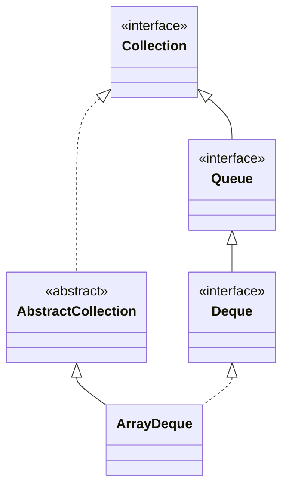

## Objective

Understand `ArrayDeque`, a resizable-array `Deque` implementation with no capacity restriction — usable as a stack (LIFO, via `push`/`pop`) or a queue (FIFO, via `offer`/`poll`), and generally the JDK-recommended choice over the legacy `Stack` class or a `LinkedList` for either role.

## Use Cases

- Implementing a stack without reaching for the legacy, synchronized `Stack` class.
- Implementing a FIFO queue without `LinkedList`'s per-node allocation overhead.
- Double-ended workloads that push/pop or add/remove from both ends.
- A resizable buffer with no fixed capacity, unlike bounded `Deque` implementations.

## Deep Dive

### ArrayDeque extends AbstractCollection

```java
class ArrayDeque<E>
```

Implements `Deque<E>` and adds no methods of its own — everything it offers comes from `Deque`. Three constructors:

```java
ArrayDeque<String> a = new ArrayDeque<>();          // empty, capacity sufficient for 16 elements
ArrayDeque<String> b = new ArrayDeque<>(100);        // pre-sized for 100 elements
ArrayDeque<String> c = new ArrayDeque<>(List.of("x", "y")); // initialized from a collection
```

Capacity grows automatically as elements are added — `Deque` permits capacity-restricted implementations, but `ArrayDeque` isn't one of them.



### Using it as a stack

```java
ArrayDeque<String> stack = new ArrayDeque<>();
stack.push("A"); stack.push("B"); stack.push("D"); stack.push("E"); stack.push("F");
while (stack.peek() != null) {
    System.out.print(stack.pop() + " "); // F E D B A — last pushed, first popped
}
```

`push`/`pop` are `Deque`'s stack-oriented aliases for `addFirst`/`removeFirst`.

### Using it as a queue

```java
ArrayDeque<String> queue = new ArrayDeque<>();
queue.offer("A"); queue.offer("B"); queue.offer("C");
queue.poll(); // "A" — first offered, first polled
```

`offer`/`poll` here work identically to the `Queue` methods described in the Queue interface concept — `ArrayDeque` satisfies `Queue` through `Deque`.

## Trade-offs

- **`null` elements are prohibited** (`NullPointerException` on insert) — unlike `LinkedList`, which permits `null` since it isn't dedicated solely to `Deque`-style usage:

  ```java
  ArrayDeque<String> dq = new ArrayDeque<>();
  dq.add(null); // NullPointerException
  ```
- **No capacity restriction and no blocking behavior** — if a bounded, backpressure-producing queue is the actual requirement, `ArrayDeque` is the wrong tool; that's what capacity-restricted implementations like `ArrayBlockingQueue` are for.
- **Not synchronized** — same caveat as every other class covered here; concurrent access from multiple threads needs external synchronization or a concurrent collection instead.
- **Array-backed storage avoids `LinkedList`'s per-node allocation**, which is why the JDK documentation recommends `ArrayDeque` over `LinkedList` for stack/queue use when `null` elements aren't needed — the trade-off is the same amortized-resize cost `ArrayList` pays, in exchange for no per-element node overhead.

## Documentation Links

- *Java: The Complete Reference*, 12th Edition (Herbert Schildt) — Chapter 20, pp. 594–595 — book
- [ArrayDeque — Java SE 25 API](https://docs.oracle.com/en/java/javase/25/docs/api/java.base/java/util/ArrayDeque.html) — doc
- [Deque — Java SE 25 API](https://docs.oracle.com/en/java/javase/25/docs/api/java.base/java/util/Deque.html) — doc
