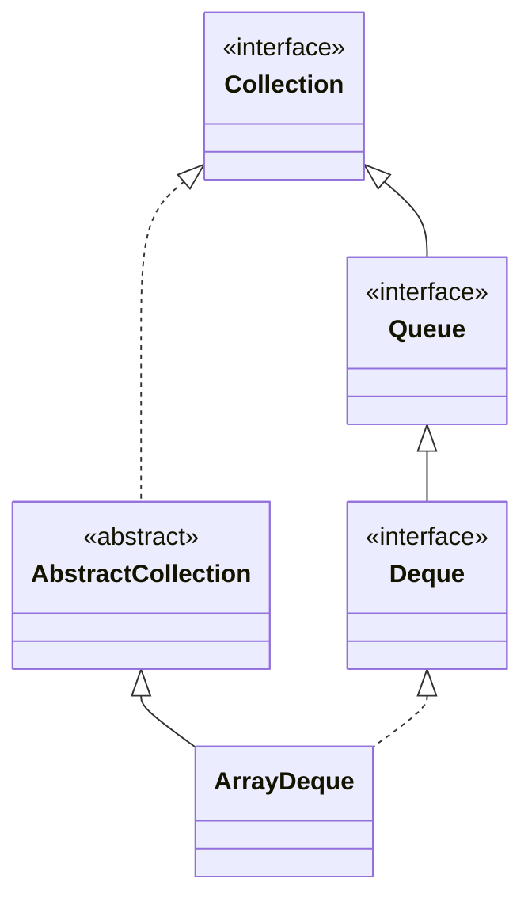

## Objective

Entender `ArrayDeque`, uma implementação de `Deque` com array redimensionável e sem restrição de capacidade — utilizável como pilha (LIFO, via `push`/`pop`) ou fila (FIFO, via `offer`/`poll`), e geralmente a escolha recomendada pelo JDK em vez da classe legada `Stack` ou de uma `LinkedList` para qualquer um dos dois papéis.

## Use Cases

- Implementar uma pilha sem recorrer à classe `Stack`, legada e sincronizada.
- Implementar uma fila FIFO sem a sobrecarga de alocação por nó da `LinkedList`.
- Cargas de trabalho de duas pontas que adicionam/removem de ambas as extremidades.
- Um buffer redimensionável sem capacidade fixa, ao contrário de implementações de `Deque` com capacidade limitada.

## Deep Dive

### ArrayDeque estende AbstractCollection

```java
class ArrayDeque<E>
```

Implementa `Deque<E>` e não adiciona métodos próprios — tudo o que oferece vem de `Deque`. Três construtores:

```java
ArrayDeque<String> a = new ArrayDeque<>();          // empty, capacity sufficient for 16 elements
ArrayDeque<String> b = new ArrayDeque<>(100);        // pre-sized for 100 elements
ArrayDeque<String> c = new ArrayDeque<>(List.of("x", "y")); // initialized from a collection
```

A capacidade cresce automaticamente à medida que elementos são adicionados — `Deque` permite implementações com capacidade restrita, mas `ArrayDeque` não é uma delas.



### Usando como pilha

```java
ArrayDeque<String> stack = new ArrayDeque<>();
stack.push("A"); stack.push("B"); stack.push("D"); stack.push("E"); stack.push("F");
while (stack.peek() != null) {
    System.out.print(stack.pop() + " "); // F E D B A — last pushed, first popped
}
```

`push`/`pop` são os aliases orientados a pilha do `Deque` para `addFirst`/`removeFirst`.

### Veja acontecendo: push() construindo uma pilha

Cada `push()` cai no início — o slot 0 abaixo é o topo da pilha, o próximo alvo de `pop()`:

```viz
type: formula
capacity = count
slot = capacity - 1 - index
---
A
B
D
E
F
```

Sem colisões aqui, diferente de uma tabela hash — cada push ganha seu próprio slot, e o último a entrar (`F`) fica no slot 0, exatamente de onde `pop()` lê primeiro.

### Usando como fila

```java
ArrayDeque<String> queue = new ArrayDeque<>();
queue.offer("A"); queue.offer("B"); queue.offer("C");
queue.poll(); // "A" — first offered, first polled
```

`offer`/`poll` aqui funcionam identicamente aos métodos de `Queue` descritos no conceito da interface Queue — `ArrayDeque` satisfaz `Queue` através de `Deque`.

## Trade-offs

- **Elementos `null` são proibidos** (`NullPointerException` na inserção) — diferente de `LinkedList`, que permite `null` já que não é dedicada exclusivamente ao uso estilo `Deque`:

  ```java
  ArrayDeque<String> dq = new ArrayDeque<>();
  dq.add(null); // NullPointerException
  ```
- **Sem restrição de capacidade e sem comportamento de bloqueio** — se uma fila limitada, que produz backpressure, é o requisito real, `ArrayDeque` é a ferramenta errada; é para isso que existem implementações com capacidade restrita como `ArrayBlockingQueue`.
- **Não sincronizada** — mesma ressalva das demais classes cobertas aqui; acesso concorrente de múltiplas threads precisa de sincronização externa ou de uma collection concorrente.
- **O armazenamento baseado em array evita a alocação por nó da `LinkedList`**, motivo pelo qual a documentação do JDK recomenda `ArrayDeque` em vez de `LinkedList` para uso como pilha/fila quando elementos `null` não são necessários — o trade-off é o mesmo custo de redimensionamento amortizado que `ArrayList` paga, em troca de nenhuma sobrecarga de nó por elemento.

## Documentation Links

- *Java: The Complete Reference*, 12th Edition (Herbert Schildt) — Chapter 20, pp. 594–595 — book
- [ArrayDeque — Java SE 25 API](https://docs.oracle.com/en/java/javase/25/docs/api/java.base/java/util/ArrayDeque.html) — doc
- [Deque — Java SE 25 API](https://docs.oracle.com/en/java/javase/25/docs/api/java.base/java/util/Deque.html) — doc
