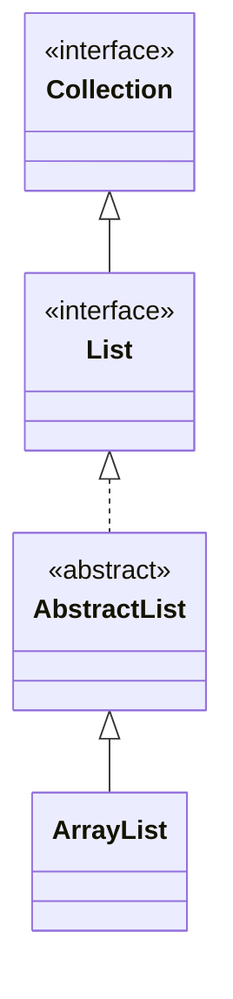

## Objective

Understand `ArrayList`, the default general-purpose `List` implementation: a resizable array of object references that grows automatically as elements are added, giving constant-time indexed access in exchange for costlier inserts and removals away from the end.

## Use Cases

- The default choice for a `List` when reads by index dominate over inserts/removes in the middle.
- Converting a collection to a plain array to hand off to array-only APIs.
- Pre-sizing the backing array up front when the eventual element count is roughly known, to avoid repeated reallocation.
- Shrinking the backing array's memory footprint after a large batch of removals.

## Deep Dive

### ArrayList extends AbstractList

```java
class ArrayList<E>
```

`ArrayList` implements `List<E>`, plus the marker interfaces `RandomAccess`, `Cloneable`, and `Serializable`. `E` specifies the element type. Three constructors:

```java
ArrayList<String> a = new ArrayList<>();                      // empty, default capacity
ArrayList<String> b = new ArrayList<>(List.of("x", "y"));     // initialized from a collection
ArrayList<String> c = new ArrayList<>(100);                   // pre-sized to hold 100 without resizing
```



### Capacity vs. size

Capacity (the length of the backing array) and size (the element count) are different numbers. Capacity grows automatically, but you can manage it directly:

```java
ArrayList<Integer> nums = new ArrayList<>();
nums.ensureCapacity(1000);  // resize once, up front, before a large batch of adds
// ... add up to 1000 elements without further reallocation ...
nums.trimToSize();          // shrink the backing array down to exactly size()
```

Calling `ensureCapacity()` before a known-large batch of inserts avoids the cost of several incremental reallocations as the list grows past its current capacity one add at a time.

### Watch it happen: add() appending at the end

Every `add(E)` lands in the next free slot, in arrival order — no hashing, no sorting, just the backing array growing by one:

```viz
type: formula
capacity = count
slot = index
---
Apple
Orange
Banana
Grape
Melon
```

No collisions, no reordering — index and slot are the same number, which is exactly why `get(index)` is O(1): it jumps straight there.

### toArray(): three overloads

```java
Object[] toArray();
<T> T[] toArray(T[] array);
default <T> T[] toArray(IntFunction<T[]> generator);  // added in JDK 11
```

The first returns a raw `Object[]`. The second and third return an array of the actual element type — the third lets you supply the array constructor directly instead of a pre-sized array:

```java
ArrayList<Integer> al = new ArrayList<>(List.of(1, 2, 3, 4));
Integer[] ia = al.toArray(new Integer[0]);
Integer[] ia2 = al.toArray(Integer[]::new); // JDK 11+, equivalent, no throwaway array literal
```

## Trade-offs

- **Indexed access is O(1), but inserting or removing away from the end is O(n)** — `get(index)`/`set(index, E)` read or overwrite a slot directly, while `add(index, E)`/`remove(index)` shift every following element by one:

  ```java
  ArrayList<String> al = new ArrayList<>(List.of("a", "b", "c", "d"));
  al.add(1, "x");   // shifts b, c, d one slot right
  ```

  A `LinkedList` inverts this trade-off.
- **A no-arg `ArrayList()` doesn't allocate its backing array until the first element is added** — `size()` is `0` immediately, but no 10-slot array exists yet; the allocation is deferred to the first `add()` call, not the constructor.
- **`ArrayList` is not synchronized** — concurrently modifying it from multiple threads, or structurally modifying it while iterating (other than through the iterator's own `remove()`), produces undefined behavior or a `ConcurrentModificationException`:

  ```java
  ArrayList<String> al = new ArrayList<>(List.of("a", "b"));
  for (String s : al) {
      al.add("c"); // ConcurrentModificationException on the next iteration
  }
  ```

## Documentation Links

- *Java: The Complete Reference*, 12th Edition (Herbert Schildt) — Chapter 20, pp. 585–589 — book
- [ArrayList — Java SE 25 API](https://docs.oracle.com/en/java/javase/25/docs/api/java.base/java/util/ArrayList.html) — doc
- [List — Java SE 25 API](https://docs.oracle.com/en/java/javase/25/docs/api/java.base/java/util/List.html) — doc
