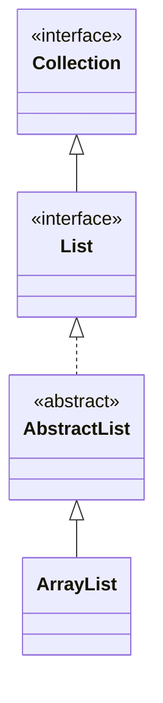

## Objective

Entender `ArrayList`, a implementação padrão de propósito geral de `List`: um array redimensionável de referências a objetos que cresce automaticamente à medida que elementos são adicionados, oferecendo acesso indexado em tempo constante em troca de inserções e remoções mais custosas fora do final.

## Use Cases

- A escolha padrão para uma `List` quando leituras por índice predominam sobre inserções/remoções no meio.
- Converter uma collection para um array simples para repassar a APIs que só aceitam arrays.
- Pré-dimensionar o array subjacente antecipadamente quando a contagem final de elementos é aproximadamente conhecida, para evitar realocações repetidas.
- Reduzir a pegada de memória do array subjacente depois de um grande lote de remoções.

## Deep Dive

### ArrayList estende AbstractList

```java
class ArrayList<E>
```

`ArrayList` implementa `List<E>`, além das interfaces marcadoras `RandomAccess`, `Cloneable` e `Serializable`. `E` especifica o tipo do elemento. Três construtores:

```java
ArrayList<String> a = new ArrayList<>();                      // empty, default capacity
ArrayList<String> b = new ArrayList<>(List.of("x", "y"));     // initialized from a collection
ArrayList<String> c = new ArrayList<>(100);                   // pre-sized to hold 100 without resizing
```



### Capacidade vs. tamanho

Capacidade (o comprimento do array subjacente) e tamanho (a contagem de elementos) são números diferentes. A capacidade cresce automaticamente, mas você pode gerenciá-la diretamente:

```java
ArrayList<Integer> nums = new ArrayList<>();
nums.ensureCapacity(1000);  // resize once, up front, before a large batch of adds
// ... add up to 1000 elements without further reallocation ...
nums.trimToSize();          // shrink the backing array down to exactly size()
```

Chamar `ensureCapacity()` antes de um lote grande e conhecido de inserções evita o custo de várias realocações incrementais à medida que a lista cresce além da capacidade atual um `add` de cada vez.

### Veja acontecendo: add() anexando ao final

Todo `add(E)` cai no próximo slot livre, na ordem de chegada — sem hashing, sem ordenação, apenas o array subjacente crescendo de um em um:

```viz
type: formula
capacity = count
slot = index
---
Apple
Orange
Banana
Grape
Melon
```

Sem colisões, sem reordenação — índice e slot são o mesmo número, e é exatamente por isso que `get(index)` é O(1): ele pula direto para lá.

### toArray(): três overloads

```java
Object[] toArray();
<T> T[] toArray(T[] array);
default <T> T[] toArray(IntFunction<T[]> generator);  // added in JDK 11
```

O primeiro retorna um `Object[]` bruto. O segundo e o terceiro retornam um array do tipo real do elemento — o terceiro permite fornecer diretamente o construtor do array em vez de um array pré-dimensionado:

```java
ArrayList<Integer> al = new ArrayList<>(List.of(1, 2, 3, 4));
Integer[] ia = al.toArray(new Integer[0]);
Integer[] ia2 = al.toArray(Integer[]::new); // JDK 11+, equivalent, no throwaway array literal
```

## Trade-offs

- **O acesso indexado é O(1), mas inserir ou remover fora do final é O(n)** — `get(index)`/`set(index, E)` leem ou sobrescrevem um slot diretamente, enquanto `add(index, E)`/`remove(index)` deslocam cada elemento seguinte em uma posição:

  ```java
  ArrayList<String> al = new ArrayList<>(List.of("a", "b", "c", "d"));
  al.add(1, "x");   // shifts b, c, d one slot right
  ```

  Uma `LinkedList` inverte esse trade-off.
- **Um `ArrayList()` sem argumentos não aloca seu array subjacente até que o primeiro elemento seja adicionado** — `size()` é `0` imediatamente, mas nenhum array de 10 slots existe ainda; a alocação é adiada até a primeira chamada de `add()`, não no construtor.
- **`ArrayList` não é sincronizado** — modificá-lo concorrentemente a partir de múltiplas threads, ou modificá-lo estruturalmente enquanto itera (fora pelo próprio `remove()` do iterator), produz comportamento indefinido ou uma `ConcurrentModificationException`:

  ```java
  ArrayList<String> al = new ArrayList<>(List.of("a", "b"));
  for (String s : al) {
      al.add("c"); // ConcurrentModificationException on the next iteration
  }
  ```

## Documentation Links

- *Java: The Complete Reference*, 12th Edition (Herbert Schildt) — Chapter 20, pp. 585–589 — book
- [ArrayList — Java SE 25 API](https://docs.oracle.com/en/java/javase/25/docs/api/java.base/java/util/ArrayList.html) — doc
- [List — Java SE 25 API](https://docs.oracle.com/en/java/javase/25/docs/api/java.base/java/util/List.html) — doc
