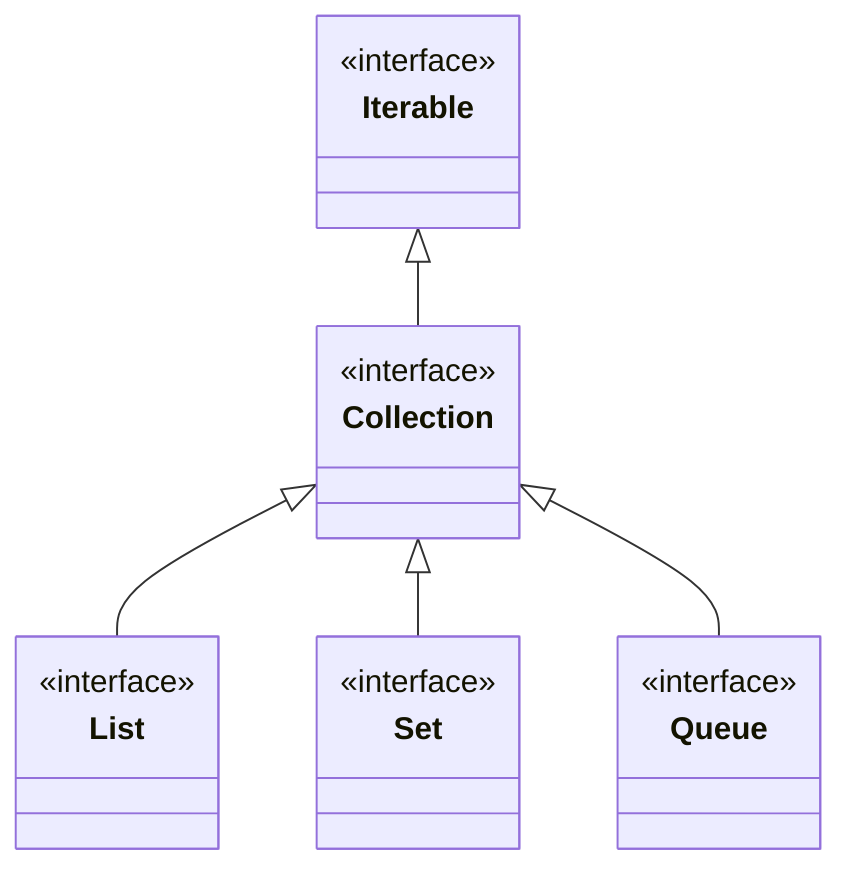

## Objective

Understand the `Collection` interface: the generic root upon which the Collections Framework is built. Any class that defines a collection must implement it (directly or through a subinterface like `List` or `Set`), and because `Collection` extends `Iterable`, every collection can be cycled through with a for-each loop.

## Use Cases

- Writing a method that accepts any kind of group of objects — `ArrayList`, `HashSet`, `ArrayDeque`, ... — by declaring the parameter as `Collection<E>` instead of a specific implementation.
- Adding or removing elements one at a time (`add`, `remove`) or against another collection in bulk (`addAll`, `removeAll`, `retainAll`).
- Checking membership or overlap between two collections without iterating manually (`contains`, `containsAll`).
- Converting a collection to an array to interoperate with array-based APIs (`toArray`).
- Processing elements as a `Stream` (`stream`, `parallelStream`) instead of writing an explicit loop.
- Recognizing, before calling a mutator, that a collection produced by a factory like `List.of()` is unmodifiable.

## Deep Dive

### Collection extends Iterable

```java
interface Collection<E>
```

Here, `E` specifies the type of objects the collection will hold. `Collection` extends `Iterable`, so only classes that implement `Collection` (directly or transitively) can be cycled through by a for-each loop, and any class implementing it is forced to supply an `iterator()`.



### Adding elements: add and addAll

```java
Collection<String> names = new ArrayList<>();
names.add("Ann");                                  // boolean add(E obj)

Collection<String> more = new ArrayList<>(List.of("Bob", "Cid"));
names.addAll(more);                                // boolean addAll(Collection<? extends E> c)
```

`add()` returns `false` if the collection doesn't allow duplicates and the object is already a member (e.g., a `Set`); otherwise it returns `true`. `addAll()` adds every element of `c` to the invoking collection and returns `true` if the invoking collection changed as a result.

### Removing elements: remove, removeAll, retainAll, removeIf, clear

```java
names.remove("Ann");                       // remove one specific object
names.removeAll(List.of("Bob"));           // remove every element also in c
names.retainAll(List.of("Cid"));           // keep only elements also in c
names.removeIf(n -> n.length() > 3);       // default method; remove those matching a Predicate
names.clear();                              // empty the collection completely
```

`removeAll()` computes a set *difference* (invoking collection minus `c`); `retainAll()` computes an *intersection* (only what's shared with `c`). Both return `true` if the invoking collection changed.

### Querying: contains, containsAll, isEmpty, size, equals

```java
names.contains("Cid");                     // true if Cid is a member
names.containsAll(List.of("Cid", "Ann"));  // true if all of these are members
names.isEmpty();
names.size();
```

Two collections can be compared for equality with `equals()`, but the precise meaning of "equal" depends on the implementing subinterface — `List` cares about element order, `Set` doesn't.

### Iterating and streaming

```java
Iterator<String> it = names.iterator();          // manual traversal
Stream<String> s = names.stream();               // default method
Stream<String> ps = names.parallelStream();      // default method, may run in parallel
Spliterator<String> sp = names.spliterator();    // default method
```

`stream()` returns a stream that uses the invoking collection as its source; `parallelStream()` returns one that, if possible, splits its source across parallel operations.

### Converting to an array: toArray()

`toArray()` has three forms:

```java
Object[] a1 = names.toArray();                     // Object[] toArray()
String[] a2 = names.toArray(new String[0]);         // <T> T[] toArray(T[] array)
String[] a3 = names.toArray(String[]::new);         // default <T> T[] toArray(IntFunction<T[]> gen), JDK 11+
```

The first form always returns `Object[]`. The second returns an array typed to match the array passed in — but that type parameter `T` is independent of `E`, so the compiler accepts an array of the *wrong* element type, and the mismatch only surfaces at runtime:

```java
Collection<String> names = List.of("Ann", "Bob");
Integer[] wrongType = names.toArray(new Integer[0]); // compiles; ArrayStoreException at runtime
```

### Unmodifiable collections

Factory methods like `List.of()` return a fixed collection whose contents cannot be changed. Calling any mutator on one throws `UnsupportedOperationException` rather than silently doing nothing:

```java
Collection<String> fixed = List.of("Ann", "Bob");
fixed.add("Cid"); // UnsupportedOperationException
```

## Trade-offs

- **`removeAll` vs. `retainAll` read almost identically but do opposite things** — `removeAll(c)` keeps only elements *not* found in `c` (difference), while `retainAll(c)` keeps only elements *also* found in `c` (intersection). Reaching for the wrong one by habit swaps the result to its complement instead of raising an error.
- **Optional methods fail at runtime, not compile time** — `add`, `remove`, and the other mutators are declared by `Collection`, but an implementation is free to reject them. Calling one on an unmodifiable collection compiles fine and throws only when executed:

  ```java
  Collection<String> fixed = List.of("a", "b");
  fixed.add("c"); // UnsupportedOperationException
  ```
- **Object-typed queries trade static safety for ClassCastException** — `contains`, `remove`, and similar methods accept `Object`, not `E`, so passing a value of an incompatible type compiles without complaint and only fails when the collection actually tries to compare it:

  ```java
  Collection<String> set = new TreeSet<>(List.of("a", "b"));
  set.contains(42); // ClassCastException: Integer cannot be compared to String
  ```
- **`toArray(T[])` compiles for any component type, correct or not** — because its type parameter isn't tied to the collection's element type `E`, an array of an incompatible type is accepted at compile time and only fails when elements are actually copied into it:

  ```java
  Collection<String> names = List.of("Ann", "Bob");
  Integer[] wrongType = names.toArray(new Integer[0]); // ArrayStoreException
  ```

## Documentation Links

- [Collection — Java SE 25 API](https://docs.oracle.com/en/java/javase/25/docs/api/java.base/java/util/Collection.html) — doc
- [List — Java SE 25 API](https://docs.oracle.com/en/java/javase/25/docs/api/java.base/java/util/List.html) — doc
- [Collections Framework Overview — The Java Tutorials](https://docs.oracle.com/javase/tutorial/collections/index.html) — doc
