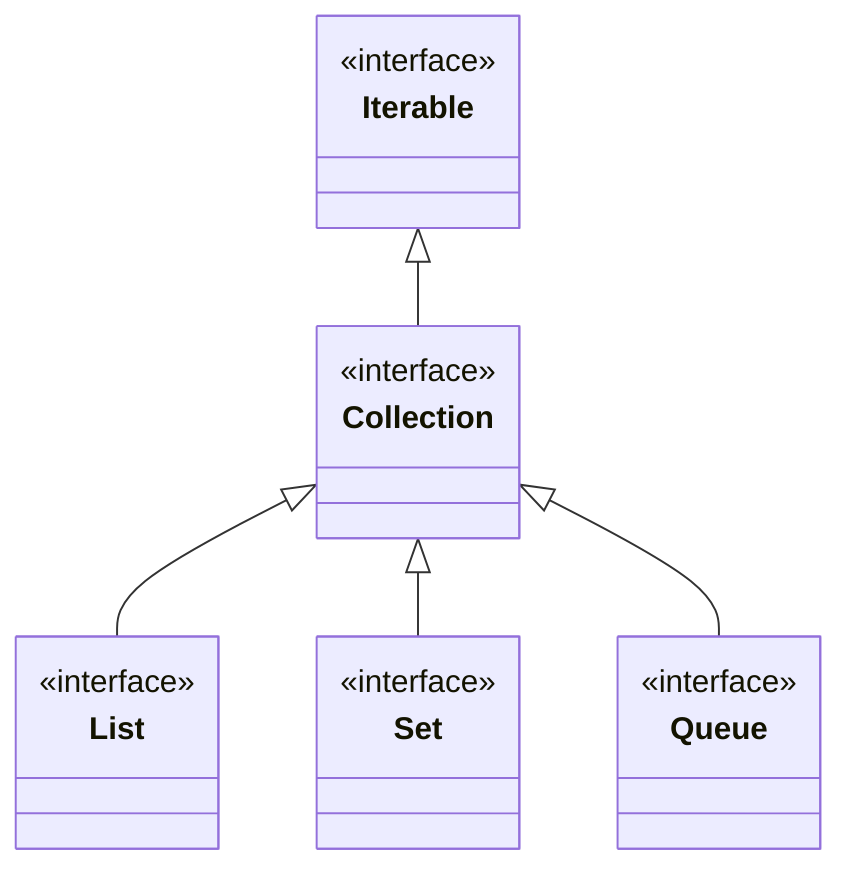

## Objective

Entender a interface `Collection`: a raiz genérica sobre a qual o Collections Framework é construído. Toda classe que define uma coleção precisa implementá-la (diretamente ou através de uma subinterface como `List` ou `Set`), e como `Collection` estende `Iterable`, toda coleção pode ser percorrida com um for-each.

## Use Cases

- Escrever um método que aceita qualquer tipo de grupo de objetos — `ArrayList`, `HashSet`, `ArrayDeque`, ... — declarando o parâmetro como `Collection<E>` em vez de uma implementação específica.
- Adicionar ou remover elementos um de cada vez (`add`, `remove`) ou contra outra coleção em bloco (`addAll`, `removeAll`, `retainAll`).
- Checar associação ou sobreposição entre duas coleções sem iterar manualmente (`contains`, `containsAll`).
- Converter uma coleção em array para interoperar com APIs baseadas em array (`toArray`).
- Processar elementos como um `Stream` (`stream`, `parallelStream`) em vez de escrever um loop explícito.
- Reconhecer, antes de chamar um mutador, que uma coleção produzida por uma factory como `List.of()` é não modificável.

## Deep Dive

### Collection estende Iterable

```java
interface Collection<E>
```

Aqui, `E` especifica o tipo de objetos que a coleção vai armazenar. `Collection` estende `Iterable`, então só classes que implementam `Collection` (direta ou transitivamente) podem ser percorridas por um for-each, e qualquer classe que a implemente é obrigada a fornecer um `iterator()`.



### Adicionando elementos: add e addAll

```java
Collection<String> names = new ArrayList<>();
names.add("Ann");                                  // boolean add(E obj)

Collection<String> more = new ArrayList<>(List.of("Bob", "Cid"));
names.addAll(more);                                // boolean addAll(Collection<? extends E> c)
```

`add()` retorna `false` se a coleção não permite duplicatas e o objeto já é um membro (ex.: um `Set`); caso contrário retorna `true`. `addAll()` adiciona todo elemento de `c` à coleção que chamou o método e retorna `true` se essa coleção mudou como resultado.

### Removendo elementos: remove, removeAll, retainAll, removeIf, clear

```java
names.remove("Ann");                       // remove one specific object
names.removeAll(List.of("Bob"));           // remove every element also in c
names.retainAll(List.of("Cid"));           // keep only elements also in c
names.removeIf(n -> n.length() > 3);       // default method; remove those matching a Predicate
names.clear();                              // empty the collection completely
```

`removeAll()` calcula uma *diferença* de conjuntos (coleção que chamou o método menos `c`); `retainAll()` calcula uma *interseção* (só o que é compartilhado com `c`). Ambos retornam `true` se a coleção que chamou o método mudou.

### Consultando: contains, containsAll, isEmpty, size, equals

```java
names.contains("Cid");                     // true if Cid is a member
names.containsAll(List.of("Cid", "Ann"));  // true if all of these are members
names.isEmpty();
names.size();
```

Duas coleções podem ser comparadas por igualdade com `equals()`, mas o significado exato de "igual" depende da subinterface implementadora — `List` se importa com a ordem dos elementos, `Set` não.

### Iterando e transformando em stream

```java
Iterator<String> it = names.iterator();          // manual traversal
Stream<String> s = names.stream();               // default method
Stream<String> ps = names.parallelStream();      // default method, may run in parallel
Spliterator<String> sp = names.spliterator();    // default method
```

`stream()` retorna um stream que usa a coleção que chamou o método como sua fonte; `parallelStream()` retorna um que, se possível, divide sua fonte entre operações paralelas.

### Convertendo para array: toArray()

`toArray()` tem três formas:

```java
Object[] a1 = names.toArray();                     // Object[] toArray()
String[] a2 = names.toArray(new String[0]);         // <T> T[] toArray(T[] array)
String[] a3 = names.toArray(String[]::new);         // default <T> T[] toArray(IntFunction<T[]> gen), JDK 11+
```

A primeira forma sempre retorna `Object[]`. A segunda retorna um array com o tipo do array passado — mas esse parâmetro de tipo `T` é independente de `E`, então o compilador aceita um array do tipo de elemento *errado*, e a incompatibilidade só aparece em runtime:

```java
Collection<String> names = List.of("Ann", "Bob");
Integer[] wrongType = names.toArray(new Integer[0]); // compiles; ArrayStoreException at runtime
```

### Coleções não modificáveis

Factory methods como `List.of()` retornam uma coleção fixa cujo conteúdo não pode ser alterado. Chamar qualquer mutador nela lança `UnsupportedOperationException` em vez de simplesmente não fazer nada silenciosamente:

```java
Collection<String> fixed = List.of("Ann", "Bob");
fixed.add("Cid"); // UnsupportedOperationException
```

## Trade-offs

- **`removeAll` vs. `retainAll` se leem de forma quase idêntica mas fazem o oposto** — `removeAll(c)` mantém só os elementos *que não estão* em `c` (diferença), enquanto `retainAll(c)` mantém só os elementos *que também estão* em `c` (interseção). Usar o errado por hábito troca o resultado pelo seu complemento em vez de gerar um erro.
- **Métodos opcionais falham em runtime, não em tempo de compilação** — `add`, `remove` e os demais mutadores são declarados por `Collection`, mas uma implementação é livre para rejeitá-los. Chamar um deles em uma coleção não modificável compila sem problema e só lança exceção quando executado:

  ```java
  Collection<String> fixed = List.of("a", "b");
  fixed.add("c"); // UnsupportedOperationException
  ```
- **Consultas tipadas como `Object` trocam segurança estática por `ClassCastException`** — `contains`, `remove` e métodos similares aceitam `Object`, não `E`, então passar um valor de tipo incompatível compila sem reclamação e só falha quando a coleção de fato tenta compará-lo:

  ```java
  Collection<String> set = new TreeSet<>(List.of("a", "b"));
  set.contains(42); // ClassCastException: Integer cannot be compared to String
  ```
- **`toArray(T[])` compila para qualquer tipo de componente, correto ou não** — como seu parâmetro de tipo não está vinculado ao tipo de elemento `E` da coleção, um array de tipo incompatível é aceito em tempo de compilação e só falha quando os elementos são de fato copiados para dentro dele:

  ```java
  Collection<String> names = List.of("Ann", "Bob");
  Integer[] wrongType = names.toArray(new Integer[0]); // ArrayStoreException
  ```

## Documentation Links

- [Collection — Java SE 25 API](https://docs.oracle.com/en/java/javase/25/docs/api/java.base/java/util/Collection.html) — doc
- [List — Java SE 25 API](https://docs.oracle.com/en/java/javase/25/docs/api/java.base/java/util/List.html) — doc
- [Collections Framework Overview — The Java Tutorials](https://docs.oracle.com/javase/tutorial/collections/index.html) — doc
