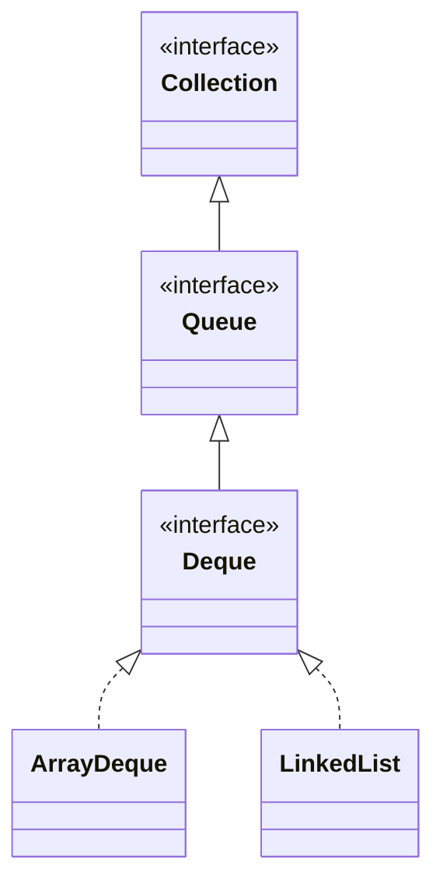

## Objective

Understand `Deque` (pronounced "deck"): a `Queue` that extends it into a double-ended queue. Double-ended queues can function as standard first-in, first-out queues, or as last-in, first-out stacks — `Deque` adds methods for operating on either end explicitly, plus `push()`/`pop()` for the stack idiom.

## Use Cases

- Adding or removing elements at either end of a sequence, instead of only at the head like `Queue`.
- Using a single type as both a FIFO queue (`addLast` + `pollFirst`) and a LIFO stack (`push` + `pop`), depending on which pair of methods is called.
- Removing a specific value from the front or back of the sequence, rather than the head, with `removeFirstOccurrence` / `removeLastOccurrence`.
- Walking the elements from tail to head with `descendingIterator()` instead of maintaining a separately reversed structure.
- Working with a capacity-restricted deque where "no more room" needs to be handled as either an exception or a boolean, depending on the call site.

## Deep Dive

### Deque extends Queue

```java
interface Deque<E>
```

`E` specifies the type of objects the deque will hold. Everything `Queue` declares is still available, but where `Queue` only exposes the head, `Deque` gives explicit access to both ends.



### Adding at either end: addFirst/addLast vs. offerFirst/offerLast

```java
Deque<Integer> d = new ArrayDeque<>();
d.addFirst(1);          // add to the head
d.addLast(2);            // add to the tail
```

```java
Deque<Integer> bounded = new ArrayDeque<>(1);
boolean added = bounded.offerFirst(9); // reports failure instead of throwing
```

`addFirst`/`addLast` throw `IllegalStateException` if a capacity-restricted deque is out of space; `offerFirst`/`offerLast` return `false` instead.

### Looking without removing: getFirst/getLast vs. peekFirst/peekLast

```java
Deque<String> d = new ArrayDeque<>(List.of("a", "b", "c"));
d.getFirst();   // "a" — throws NoSuchElementException if empty
d.peekFirst();  // "a" — returns null if empty
d.getLast();    // "c"
d.peekLast();   // "c"
```

### Removing from an end: removeFirst/removeLast vs. pollFirst/pollLast

```java
d.removeFirst(); // removes and returns "a" — throws NoSuchElementException if empty
d.pollFirst();    // removes and returns the new head — null if empty
d.removeLast();
d.pollLast();
```

### Removing a specific value: removeFirstOccurrence / removeLastOccurrence

```java
Deque<String> d = new ArrayDeque<>(List.of("a", "b", "a"));
d.removeFirstOccurrence("a"); // true — removes the first "a", leaves [b, a]
d.removeLastOccurrence("a");  // true — removes the remaining "a", leaves [b]
```

Unlike `removeFirst`/`removeLast`, these search by value and report success as a `boolean` rather than throwing.

### Deque as a stack: push and pop

```java
Deque<Integer> stack = new ArrayDeque<>();
stack.push(1);   // equivalent to addFirst(1)
stack.push(2);   // equivalent to addFirst(2)
stack.pop();     // 2 — equivalent to removeFirst(), LIFO order
```

`push()` adds to the head and `pop()` removes from the head, so using this pair turns the same `Deque` into a stack instead of a queue.

### Reverse iteration

```java
Deque<Integer> d = new ArrayDeque<>(List.of(1, 2, 3));
Iterator<Integer> it = d.descendingIterator(); // walks 3, 2, 1
```

## Trade-offs

- **A capacity-restricted deque fails two different ways depending on which method is called** — `addFirst`/`addLast` throw, `offerFirst`/`offerLast` report `false`:

  ```java
  Deque<Integer> d = new ArrayDeque<>(1);
  d.addFirst(1);
  d.addFirst(2);  // IllegalStateException: full

  Deque<Integer> d2 = new ArrayDeque<>(1);
  d2.addFirst(1);
  boolean ok = d2.offerFirst(2); // false, no exception
  ```
- **getFirst/getLast throw on an empty deque, peekFirst/peekLast don't** — same split as `Queue`'s `element()`/`peek()`, now doubled across both ends:

  ```java
  Deque<String> empty = new ArrayDeque<>();
  empty.getFirst();   // NoSuchElementException
  empty.peekFirst();  // null
  ```
- **removeFirstOccurrence/removeLastOccurrence report failure instead of throwing, unlike removeFirst/removeLast** — searching for a value that isn't present just returns `false`, while removing from an empty deque by position throws:

  ```java
  Deque<String> d = new ArrayDeque<>(List.of("a"));
  d.removeFirstOccurrence("z"); // false — not found, no exception
  d.removeFirst();               // "a"
  d.removeFirst();               // NoSuchElementException — now empty
  ```
- **push()/pop() and the Queue-inherited offer()/poll() don't agree on which end is "the front"** — `push`/`pop` operate at the head (LIFO), while `offer`/`poll` operate tail-in, head-out (FIFO); mixing both idioms on the same `Deque` instance produces a traversal order that depends on which pair of methods was used to build it, not on the data alone.

## Documentation Links

- [Deque — Java SE 25 API](https://docs.oracle.com/en/java/javase/25/docs/api/java.base/java/util/Deque.html) — doc
- [Queue — Java SE 25 API](https://docs.oracle.com/en/java/javase/25/docs/api/java.base/java/util/Queue.html) — doc
