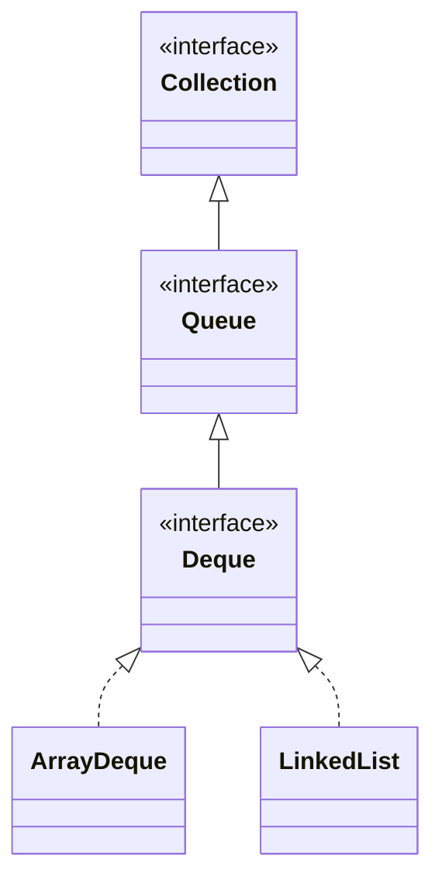

## Objective

Entender `Deque` (pronuncia-se "deck"): uma `Queue` que ela estende para uma fila de duas pontas (double-ended queue). Filas de duas pontas podem funcionar como filas padrão FIFO (first-in, first-out), ou como pilhas LIFO (last-in, first-out) — `Deque` adiciona métodos para operar explicitamente em qualquer uma das pontas, além de `push()`/`pop()` para o idioma de pilha.

## Use Cases

- Adicionar ou remover elementos em qualquer uma das pontas de uma sequência, em vez de só na cabeça como em `Queue`.
- Usar um único tipo tanto como fila FIFO (`addLast` + `pollFirst`) quanto como pilha LIFO (`push` + `pop`), dependendo de qual par de métodos é chamado.
- Remover um valor específico do início ou do fim da sequência, em vez da cabeça, com `removeFirstOccurrence` / `removeLastOccurrence`.
- Percorrer os elementos da cauda para a cabeça com `descendingIterator()` em vez de manter uma estrutura invertida separada.
- Trabalhar com um deque de capacidade restrita, onde "sem mais espaço" precisa ser tratado como exceção ou como booleano, dependendo do call site.

## Deep Dive

### Deque estende Queue

```java
interface Deque<E>
```

`E` especifica o tipo dos objetos que o deque vai armazenar. Tudo que `Queue` declara continua disponível, mas onde `Queue` só expõe a cabeça, `Deque` dá acesso explícito às duas pontas.



### Adicionando em qualquer ponta: addFirst/addLast vs. offerFirst/offerLast

```java
Deque<Integer> d = new ArrayDeque<>();
d.addFirst(1);          // add to the head
d.addLast(2);            // add to the tail
```

```java
Deque<Integer> bounded = new ArrayDeque<>(1);
boolean added = bounded.offerFirst(9); // reports failure instead of throwing
```

`addFirst`/`addLast` lançam `IllegalStateException` se um deque de capacidade restrita está sem espaço; `offerFirst`/`offerLast` retornam `false` em vez disso.

### Olhando sem remover: getFirst/getLast vs. peekFirst/peekLast

```java
Deque<String> d = new ArrayDeque<>(List.of("a", "b", "c"));
d.getFirst();   // "a" — throws NoSuchElementException if empty
d.peekFirst();  // "a" — returns null if empty
d.getLast();    // "c"
d.peekLast();   // "c"
```

### Removendo de uma ponta: removeFirst/removeLast vs. pollFirst/pollLast

```java
d.removeFirst(); // removes and returns "a" — throws NoSuchElementException if empty
d.pollFirst();    // removes and returns the new head — null if empty
d.removeLast();
d.pollLast();
```

### Removendo um valor específico: removeFirstOccurrence / removeLastOccurrence

```java
Deque<String> d = new ArrayDeque<>(List.of("a", "b", "a"));
d.removeFirstOccurrence("a"); // true — removes the first "a", leaves [b, a]
d.removeLastOccurrence("a");  // true — removes the remaining "a", leaves [b]
```

Diferente de `removeFirst`/`removeLast`, esses métodos buscam por valor e reportam sucesso como um `boolean` em vez de lançar exceção.

### Deque como pilha: push e pop

```java
Deque<Integer> stack = new ArrayDeque<>();
stack.push(1);   // equivalent to addFirst(1)
stack.push(2);   // equivalent to addFirst(2)
stack.pop();     // 2 — equivalent to removeFirst(), LIFO order
```

`push()` adiciona na cabeça e `pop()` remove da cabeça, então usar esse par transforma o mesmo `Deque` em uma pilha em vez de uma fila.

### Iteração reversa

```java
Deque<Integer> d = new ArrayDeque<>(List.of(1, 2, 3));
Iterator<Integer> it = d.descendingIterator(); // walks 3, 2, 1
```

## Trade-offs

- **Um deque de capacidade restrita falha de duas formas diferentes dependendo de qual método é chamado** — `addFirst`/`addLast` lançam exceção, `offerFirst`/`offerLast` reportam `false`:

  ```java
  Deque<Integer> d = new ArrayDeque<>(1);
  d.addFirst(1);
  d.addFirst(2);  // IllegalStateException: full

  Deque<Integer> d2 = new ArrayDeque<>(1);
  d2.addFirst(1);
  boolean ok = d2.offerFirst(2); // false, no exception
  ```
- **getFirst/getLast lançam exceção em um deque vazio, peekFirst/peekLast não** — a mesma divisão de `element()`/`peek()` de `Queue`, agora dobrada nas duas pontas:

  ```java
  Deque<String> empty = new ArrayDeque<>();
  empty.getFirst();   // NoSuchElementException
  empty.peekFirst();  // null
  ```
- **removeFirstOccurrence/removeLastOccurrence reportam falha em vez de lançar exceção, diferente de removeFirst/removeLast** — buscar um valor que não está presente simplesmente retorna `false`, enquanto remover de um deque vazio por posição lança exceção:

  ```java
  Deque<String> d = new ArrayDeque<>(List.of("a"));
  d.removeFirstOccurrence("z"); // false — not found, no exception
  d.removeFirst();               // "a"
  d.removeFirst();               // NoSuchElementException — now empty
  ```
- **push()/pop() e os offer()/poll() herdados de Queue não concordam sobre qual ponta é "a frente"** — `push`/`pop` operam na cabeça (LIFO), enquanto `offer`/`poll` operam entra-na-cauda-sai-na-cabeça (FIFO); misturar os dois idiomas na mesma instância de `Deque` produz uma ordem de percurso que depende de qual par de métodos foi usado para construí-la, não só dos dados em si.

## Documentation Links

- [Deque — Java SE 25 API](https://docs.oracle.com/en/java/javase/25/docs/api/java.base/java/util/Deque.html) — doc
- [Queue — Java SE 25 API](https://docs.oracle.com/en/java/javase/25/docs/api/java.base/java/util/Queue.html) — doc
