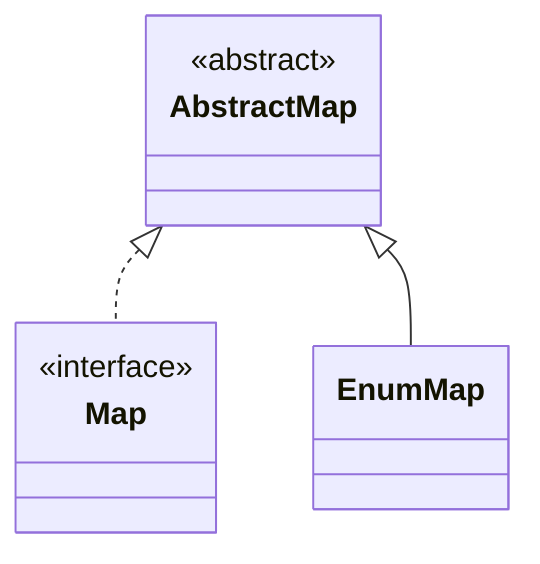

## Objective

Go beyond `enum` as a list of named constants: use constant-specific method bodies to give each constant its own behavior (the strategy-enum pattern), and reach for `EnumSet`/`EnumMap` — bit-vector- and array-backed collections built specifically for enum keys — instead of hand-rolled bit flags or `ordinal()`-indexed arrays.

## Use Cases

- Modeling a fixed set of operations (calculator functions, state-machine transitions, payroll day types) where each constant needs genuinely different logic, not just different data.
- Passing around a combination of flags/options (text styles, permissions, feature toggles) without resorting to bitwise `int` arithmetic.
- Grouping or tabulating values keyed by an enum (herbs by growth type, requests by status) where a plain array or `HashMap` would work but discards type safety and readability.
- Any place `Enum.ordinal()` is being used as an array or map index — a reliable sign an `EnumMap` (or `EnumSet`) should be used instead.

## Deep Dive

### Constant-specific method bodies: the strategy-enum pattern

A `switch` on `this` inside an enum method compiles, but nothing forces every constant to be covered — add a constant, forget the `case`, and it fails silently at runtime:

```java
// Fragile: compiler won't catch a missing case
public enum Operation {
    PLUS, MINUS, TIMES, DIVIDE;

    double apply(double x, double y) {
        return switch (this) {
            case PLUS   -> x + y;
            case MINUS  -> x - y;
            case TIMES  -> x * y;
            case DIVIDE -> x / y;
            // add a new constant above and forget a branch here -> MatchException at runtime
        };
    }
}
```

Declaring the method `abstract` and giving each constant its own body moves the check to compile time — the compiler refuses to compile an enum with a constant that doesn't override an abstract method:

```java
public enum Operation {
    PLUS("+")   { public double apply(double x, double y) { return x + y; } },
    MINUS("-")  { public double apply(double x, double y) { return x - y; } },
    TIMES("*")  { public double apply(double x, double y) { return x * y; } },
    DIVIDE("/") { public double apply(double x, double y) { return x / y; } };

    private final String symbol;
    Operation(String symbol) { this.symbol = symbol; }

    @Override public String toString() { return symbol; }
    public abstract double apply(double x, double y);
}

for (Operation op : Operation.values()) {
    System.out.printf("2 %s 4 = %f%n", op, op.apply(2, 4));
}
```

Each constant here is its own anonymous subclass of `Operation`, generated by the compiler — that's what lets it override `apply` independently while still being a plain `Operation` everywhere else (`values()`, `switch`, `EnumSet`, `EnumMap` all keep working unchanged).

The downside surfaces when constants need to *share* logic instead of diverging. Duplicating shared code in every constant body, or falling back to a `switch`, reintroduces the missing-case risk. The fix is to factor the varying part into a small nested strategy enum and delegate to it, rather than putting the varying logic directly in the outer enum:

```java
enum PayrollDay {
    MONDAY(WEEKDAY), TUESDAY(WEEKDAY), WEDNESDAY(WEEKDAY),
    THURSDAY(WEEKDAY), FRIDAY(WEEKDAY),
    SATURDAY(WEEKEND), SUNDAY(WEEKEND);

    private final PayType payType;
    PayrollDay(PayType payType) { this.payType = payType; }

    double pay(double hoursWorked, double payRate) {
        return payType.pay(hoursWorked, payRate);
    }

    private enum PayType {
        WEEKDAY {
            double overtimePay(double hours, double payRate) {
                return hours <= 8 ? 0 : (hours - 8) * payRate / 2;
            }
        },
        WEEKEND {
            double overtimePay(double hours, double payRate) {
                return hours * payRate / 2;
            }
        };

        abstract double overtimePay(double hours, double payRate);

        double pay(double hoursWorked, double payRate) {
            return hoursWorked * payRate + overtimePay(hoursWorked, payRate);
        }
    }
}
```

Adding `SATURDAY`/`SUNDAY` forces a choice of `PayType` at the call site — there's no default to silently fall into.

### EnumSet instead of bit fields

The old pattern packs each flag into a bit of an `int` and combines them with `|`:

```java
public class Text {
    public static final int STYLE_BOLD          = 1 << 0;
    public static final int STYLE_ITALIC        = 1 << 1;
    public static final int STYLE_UNDERLINE     = 1 << 2;
    public static final int STYLE_STRIKETHROUGH = 1 << 3;

    public void applyStyles(int styles) { /* ... */ }
}

text.applyStyles(STYLE_BOLD | STYLE_ITALIC); // prints as an opaque number, no iteration
```

`EnumSet` gives the same bitwise-fast combine/union/intersect, but as a real, type-safe `Set<E>`:

```java
public class Text {
    public enum Style { BOLD, ITALIC, UNDERLINE, STRIKETHROUGH }

    public void applyStyles(Set<Style> styles) { /* ... */ }
}

text.applyStyles(EnumSet.of(Style.BOLD, Style.ITALIC));
text.applyStyles(EnumSet.range(Style.BOLD, Style.UNDERLINE)); // BOLD, ITALIC, UNDERLINE
text.applyStyles(EnumSet.noneOf(Style.class));                 // empty set
```

`applyStyles` takes `Set<Style>`, not `EnumSet<Style>` — accept the interface, not the implementation, so a caller could pass any `Set` if they had a reason to. Internally `EnumSet` is a single `long` bit vector for enums with 64 or fewer constants (a `long[]` beyond that), so membership tests and bulk operations (`removeAll`, `retainAll`) run as bitwise arithmetic — comparable in speed to hand-rolled bit fields, without the unreadable printed output or the missing iteration support.

### EnumMap instead of ordinal indexing

Using `ordinal()` to index an array works until the enum changes — reordering constants silently reshuffles which bucket each one lands in, and nothing signals the break:

```java
enum Type { ANNUAL, PERENNIAL, BIENNIAL }

Set<Herb>[] herbsByType = (Set<Herb>[]) new Set[Type.values().length]; // unchecked cast
for (int i = 0; i < herbsByType.length; i++) herbsByType[i] = new HashSet<>();
for (Herb h : garden) herbsByType[h.type().ordinal()].add(h); // wrong index -> wrong bucket, no error
```

Reorder `Type` to `{ BIENNIAL, ANNUAL, PERENNIAL }` and this code still compiles and still runs — it just files every herb under the wrong type, silently. `EnumMap` removes `ordinal()` from the equation entirely:

```java
Map<Type, Set<Herb>> herbsByType = new EnumMap<>(Type.class);
for (Type t : Type.values()) herbsByType.put(t, new HashSet<>());
for (Herb h : garden) herbsByType.get(h.type()).add(h);
```

`EnumMap` is constructed with the key type's `Class` object (a bounded type token, needed because there's no `new K[...]` in Java) and is backed by an array indexed by ordinal *internally* — so it's comparable in speed to the manual version, but the mapping from key to slot is managed by the map, not by caller-visible arithmetic. Reordering `Type`'s constants no longer changes behavior at all. Iteration order is the enum's natural (declaration) order regardless of insertion order — a side benefit `HashMap` and `ordinal`-indexed arrays don't give you.



## Trade-offs

- **`EnumSet` has no immutable factory** — there is no `EnumSet.of(...)` equivalent that returns an unmodifiable set the way `Set.of(...)` does for general collections; wrap it with `Collections.unmodifiableSet(...)` if callers shouldn't mutate it, accepting the extra allocation.
- **`EnumMap` iterates in the key enum's declaration order, not insertion order** — usually the desired behavior for display, but a surprise if code was ported from a `LinkedHashMap` expecting insertion order:

  ```java
  Map<Type, String> m = new EnumMap<>(Type.class);
  m.put(Type.BIENNIAL, "b");
  m.put(Type.ANNUAL, "a");
  System.out.println(m); // {ANNUAL=a, BIENNIAL=b} — declaration order, not put order
  ```
- **Constant-specific method bodies make an enum's constants into distinct anonymous subclasses** — this is invisible in normal use but means each constant carries its own compiled class, and shared logic across constants has to be factored out (helper method, nested strategy enum) rather than simply written once in the abstract method.
- **Extensible enums (an interface implemented by two separate enum types) are the rare case, not the default** — reach for it only when an API genuinely needs external callers to supply their own enum constants (custom opcodes on top of a fixed set); it costs the ability to share an implementation between the two enum types, since each has to repeat any common logic (e.g. storing a symbol field) independently.

## Documentation Links

- [Enum — Java SE 25 API](https://docs.oracle.com/en/java/javase/25/docs/api/java.base/java/lang/Enum.html) — doc
- [EnumSet — Java SE 25 API](https://docs.oracle.com/en/java/javase/25/docs/api/java.base/java/util/EnumSet.html) — doc
- [EnumMap — Java SE 25 API](https://docs.oracle.com/en/java/javase/25/docs/api/java.base/java/util/EnumMap.html) — doc
- [Enum Types — The Java Tutorials](https://docs.oracle.com/javase/tutorial/java/javaOO/enum.html) — doc
