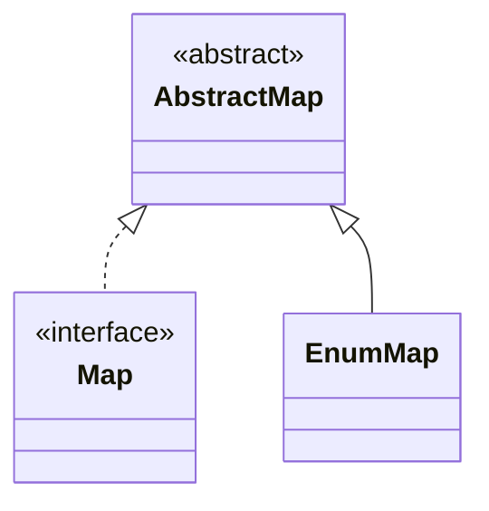

## Objective

Vá além de `enum` como uma lista de constantes nomeadas: use corpos de método específicos por constante para dar a cada constante seu próprio comportamento (o padrão strategy-enum), e prefira `EnumSet`/`EnumMap` — coleções baseadas em vetor de bits e em array, construídas especificamente para chaves enum — em vez de flags de bits feitas à mão ou arrays indexados por `ordinal()`.

## Use Cases

- Modelar um conjunto fixo de operações (funções de calculadora, transições de máquina de estados, tipos de dia de folha de pagamento) em que cada constante precisa de uma lógica genuinamente diferente, não apenas de dados diferentes.
- Passar adiante uma combinação de flags/opções (estilos de texto, permissões, feature toggles) sem recorrer a aritmética bitwise sobre `int`.
- Agrupar ou tabular valores indexados por um enum (ervas por tipo de crescimento, requisições por status) onde um array simples ou um `HashMap` funcionaria, mas descartaria segurança de tipos e legibilidade.
- Qualquer lugar em que `Enum.ordinal()` esteja sendo usado como índice de array ou map — um sinal confiável de que um `EnumMap` (ou `EnumSet`) deveria ser usado no lugar.

## Deep Dive

### Corpos de método específicos por constante: o padrão strategy-enum

Um `switch` sobre `this` dentro de um método de enum compila, mas nada obriga que todas as constantes sejam cobertas — adicione uma constante, esqueça o `case`, e ela falha silenciosamente em tempo de execução:

```java
// Fragile: compiler won't catch a missing case
public enum Operation {
    PLUS, MINUS, TIMES, DIVIDE;

    double apply(double x, double y) {
        return switch (this) {
            case PLUS   -> x + y;
            case MINUS  -> x - y;
            case TIMES  -> x * y;
            case DIVIDE -> x / y;
            // add a new constant above and forget a branch here -> MatchException at runtime
        };
    }
}
```

Declarar o método como `abstract` e dar a cada constante seu próprio corpo move essa checagem para o momento da compilação — o compilador se recusa a compilar um enum com uma constante que não sobrescreve um método abstrato:

```java
public enum Operation {
    PLUS("+")   { public double apply(double x, double y) { return x + y; } },
    MINUS("-")  { public double apply(double x, double y) { return x - y; } },
    TIMES("*")  { public double apply(double x, double y) { return x * y; } },
    DIVIDE("/") { public double apply(double x, double y) { return x / y; } };

    private final String symbol;
    Operation(String symbol) { this.symbol = symbol; }

    @Override public String toString() { return symbol; }
    public abstract double apply(double x, double y);
}

for (Operation op : Operation.values()) {
    System.out.printf("2 %s 4 = %f%n", op, op.apply(2, 4));
}
```

Cada constante aqui é sua própria subclasse anônima de `Operation`, gerada pelo compilador — é isso que permite que ela sobrescreva `apply` de forma independente, continuando a ser uma `Operation` comum em todo o resto (`values()`, `switch`, `EnumSet`, `EnumMap` continuam funcionando sem mudanças).

A desvantagem aparece quando constantes precisam *compartilhar* lógica em vez de divergir. Duplicar código compartilhado em cada corpo de constante, ou recorrer a um `switch`, reintroduz o risco do case ausente. A correção é extrair a parte variável para um pequeno enum strategy aninhado e delegar a ele, em vez de colocar a lógica variável diretamente no enum externo:

```java
enum PayrollDay {
    MONDAY(WEEKDAY), TUESDAY(WEEKDAY), WEDNESDAY(WEEKDAY),
    THURSDAY(WEEKDAY), FRIDAY(WEEKDAY),
    SATURDAY(WEEKEND), SUNDAY(WEEKEND);

    private final PayType payType;
    PayrollDay(PayType payType) { this.payType = payType; }

    double pay(double hoursWorked, double payRate) {
        return payType.pay(hoursWorked, payRate);
    }

    private enum PayType {
        WEEKDAY {
            double overtimePay(double hours, double payRate) {
                return hours <= 8 ? 0 : (hours - 8) * payRate / 2;
            }
        },
        WEEKEND {
            double overtimePay(double hours, double payRate) {
                return hours * payRate / 2;
            }
        };

        abstract double overtimePay(double hours, double payRate);

        double pay(double hoursWorked, double payRate) {
            return hoursWorked * payRate + overtimePay(hoursWorked, payRate);
        }
    }
}
```

Adicionar `SATURDAY`/`SUNDAY` obriga a escolher um `PayType` no local de chamada — não há um padrão para cair silenciosamente.

### EnumSet em vez de campos de bits

O padrão antigo empacota cada flag em um bit de um `int` e as combina com `|`:

```java
public class Text {
    public static final int STYLE_BOLD          = 1 << 0;
    public static final int STYLE_ITALIC        = 1 << 1;
    public static final int STYLE_UNDERLINE     = 1 << 2;
    public static final int STYLE_STRIKETHROUGH = 1 << 3;

    public void applyStyles(int styles) { /* ... */ }
}

text.applyStyles(STYLE_BOLD | STYLE_ITALIC); // prints as an opaque number, no iteration
```

`EnumSet` oferece a mesma combinação/união/interseção rápida via bitwise, mas como um `Set<E>` real e type-safe:

```java
public class Text {
    public enum Style { BOLD, ITALIC, UNDERLINE, STRIKETHROUGH }

    public void applyStyles(Set<Style> styles) { /* ... */ }
}

text.applyStyles(EnumSet.of(Style.BOLD, Style.ITALIC));
text.applyStyles(EnumSet.range(Style.BOLD, Style.UNDERLINE)); // BOLD, ITALIC, UNDERLINE
text.applyStyles(EnumSet.noneOf(Style.class));                 // empty set
```

`applyStyles` recebe `Set<Style>`, não `EnumSet<Style>` — aceite a interface, não a implementação, para que um chamador possa passar qualquer `Set` se tiver motivo para isso. Internamente, `EnumSet` é um único vetor de bits `long` para enums com 64 constantes ou menos (um `long[]` além disso), então testes de pertencimento e operações em lote (`removeAll`, `retainAll`) rodam como aritmética bitwise — comparável em velocidade a campos de bits feitos à mão, mas sem a saída impressa ilegível ou a falta de suporte a iteração.

### EnumMap em vez de indexação por ordinal

Usar `ordinal()` para indexar um array funciona até o enum mudar — reordenar constantes reembaralha silenciosamente em qual posição cada uma cai, e nada sinaliza a quebra:

```java
enum Type { ANNUAL, PERENNIAL, BIENNIAL }

Set<Herb>[] herbsByType = (Set<Herb>[]) new Set[Type.values().length]; // unchecked cast
for (int i = 0; i < herbsByType.length; i++) herbsByType[i] = new HashSet<>();
for (Herb h : garden) herbsByType[h.type().ordinal()].add(h); // wrong index -> wrong bucket, no error
```

Reordene `Type` para `{ BIENNIAL, ANNUAL, PERENNIAL }` e esse código ainda compila e ainda executa — só que arquiva cada erva sob o tipo errado, silenciosamente. `EnumMap` remove `ordinal()` da equação por completo:

```java
Map<Type, Set<Herb>> herbsByType = new EnumMap<>(Type.class);
for (Type t : Type.values()) herbsByType.put(t, new HashSet<>());
for (Herb h : garden) herbsByType.get(h.type()).add(h);
```

`EnumMap` é construído com o `Class` do tipo da chave (um type token limitado, necessário porque não existe `new K[...]` em Java) e é internamente sustentado por um array indexado por ordinal — comparável em velocidade à versão manual, mas o mapeamento de chave para posição é gerenciado pelo map, não por aritmética visível ao chamador. Reordenar as constantes de `Type` não muda mais o comportamento em nada. A ordem de iteração é a ordem natural (de declaração) do enum, independente da ordem de inserção — um benefício extra que `HashMap` e arrays indexados por `ordinal` não oferecem.



## Trade-offs

- **`EnumSet` não tem fábrica imutável** — não existe um equivalente a `EnumSet.of(...)` que retorne um set não modificável como `Set.of(...)` faz para coleções gerais; envolva-o com `Collections.unmodifiableSet(...)` se os chamadores não devem modificá-lo, aceitando a alocação extra.
- **`EnumMap` itera na ordem de declaração do enum chave, não na ordem de inserção** — geralmente é o comportamento desejado para exibição, mas é uma surpresa se o código foi portado de um `LinkedHashMap` que esperava ordem de inserção:

  ```java
  Map<Type, String> m = new EnumMap<>(Type.class);
  m.put(Type.BIENNIAL, "b");
  m.put(Type.ANNUAL, "a");
  System.out.println(m); // {ANNUAL=a, BIENNIAL=b} — declaration order, not put order
  ```
- **Corpos de método específicos por constante transformam as constantes de um enum em subclasses anônimas distintas** — isso é invisível em uso normal, mas significa que cada constante carrega sua própria classe compilada, e a lógica compartilhada entre constantes precisa ser extraída (método auxiliar, enum strategy aninhado) em vez de simplesmente escrita uma vez no método abstrato.
- **Enums extensíveis (uma interface implementada por dois tipos de enum separados) são o caso raro, não o padrão** — recorra a isso só quando uma API genuinamente precisa que chamadores externos forneçam suas próprias constantes de enum (opcodes personalizados sobre um conjunto fixo); isso custa a capacidade de compartilhar uma implementação entre os dois tipos de enum, já que cada um precisa repetir qualquer lógica comum (por exemplo, armazenar um campo de símbolo) de forma independente.

## Documentation Links

- [Enum — Java SE 25 API](https://docs.oracle.com/en/java/javase/25/docs/api/java.base/java/lang/Enum.html) — doc
- [EnumSet — Java SE 25 API](https://docs.oracle.com/en/java/javase/25/docs/api/java.base/java/util/EnumSet.html) — doc
- [EnumMap — Java SE 25 API](https://docs.oracle.com/en/java/javase/25/docs/api/java.base/java/util/EnumMap.html) — doc
- [Enum Types — The Java Tutorials](https://docs.oracle.com/javase/tutorial/java/javaOO/enum.html) — doc
