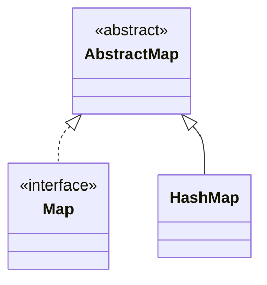

## Objective

Understand `HashMap`, the default `Map` implementation: key/value pairs are stored in a hash table, giving average constant-time `get`/`put`/`remove` at the cost of any guaranteed iteration order.

## Use Cases

- Fast key-based lookup — configuration, caches, or lookup tables where order genuinely doesn't matter.
- Counting or aggregating values by key (word frequency, grouping) without needing the keys back in any particular order.
- Pre-sizing the table via the capacity/fill-ratio constructor when the eventual entry count is roughly known, to avoid rehashing during a large batch of `put` calls.

## Deep Dive

### HashMap extends AbstractMap, implements Map

```java
class HashMap<K, V>
```

Four constructors:

```java
HashMap<String, Double> a = new HashMap<>();                       // default capacity 16, load factor 0.75
HashMap<String, Double> b = new HashMap<>(existingMap);            // initialized from another Map
HashMap<String, Double> c = new HashMap<>(64);                     // initial capacity 64
HashMap<String, Double> d = new HashMap<>(64, 0.5f);                // capacity 64, load factor 0.5
```

Capacity and load factor mean exactly what they mean for `HashSet` — in fact `HashSet` is implemented internally as a thin wrapper around a `HashMap`, so the two share the same table, collision, and treeification behavior.



### Reading entries via a set-view

```java
HashMap<String, Double> hm = new HashMap<>();
hm.put("John Doe", 3434.34);
hm.put("Tom Smith", 123.22);
hm.put("Jane Baker", 1378.00);
hm.put("Tod Hall", 99.22);
hm.put("Ralph Smith", -19.08);

Set<Map.Entry<String, Double>> set = hm.entrySet();
for (Map.Entry<String, Double> me : set) {
    System.out.print(me.getKey() + ": ");
    System.out.println(me.getValue());
}
// order is table-layout dependent, not insertion order — e.g.:
// Ralph Smith: -19.08
// Tom Smith: 123.22
// John Doe: 3434.34
// Tod Hall: 99.22
// Jane Baker: 1378.0
```

`entrySet()` returns a live view backed by the map itself, not a copy; `Map.Entry`'s `getKey()`/`getValue()` read each pair.

### put() replaces the value of an existing key

```java
double balance = hm.get("John Doe");
hm.put("John Doe", balance + 1000); // same key -> old value overwritten, map still has one "John Doe" entry
System.out.println("John Doe's new balance: " + hm.get("John Doe")); // 4434.34
```

`put(K key, V value)` returns the *previous* value associated with `key`, or `null` if the key was new — useful for detecting whether a `put` was actually an update.

### Watch it happen: put() spreading keys across buckets

Each `put(key, value)` computes `key.hashCode()`, spreads its bits, and masks it against `capacity - 1` to pick a bucket. Two keys landing in the same bucket don't overwrite each other — they chain, and `equals()` is what tells them apart on a later `get()`:

```viz
type: formula
capacity = nextPow2(count)
slot = (capacity - 1) & spread(hash(item))
---
Apple
Orange
Banana
Grape
Melon
Kiwi
Mango
Plum
```

## Trade-offs

- **No iteration-order guarantee, and it can change between runs or after a resize** — if a stable order matters, use `LinkedHashMap` (insertion order); if a sorted order matters, use `TreeMap`.
- **Mutating a field involved in a key's `hashCode()` after it's already in the map breaks lookups silently** — the entry sits in the bucket its *old* hash code pointed to, so `get()`/`containsKey()` with an equal-looking key can return `null`/`false` instead of finding it:

  ```java
  class Point { int x; /* hashCode() based on x */ }
  Point p = new Point(1);
  HashMap<Point, String> map = new HashMap<>();
  map.put(p, "origin");
  p.x = 2;              // mutated after insertion
  map.get(p);            // may return null — p is now in the wrong bucket
  ```
- **Average O(1) operations assume a reasonably distributed `hashCode()`** — a poor hash function that collides heavily degrades `get`/`put`/`remove` toward O(n) within a bucket (O(log n) since JDK 8, once a bucket treeifies past 8 entries), since every colliding key has to be checked with `equals()`.
- **`HashMap` is not synchronized and allows one `null` key** — for concurrent access, use `ConcurrentHashMap` instead (see the HTTP Sessions Under the Hood concept for it in a real server-side use).

## Documentation Links

- *Java: The Complete Reference*, 12th Edition (Herbert Schildt) — Chapter 20, pp. 612–614 — book
- [HashMap — Java SE 25 API](https://docs.oracle.com/en/java/javase/25/docs/api/java.base/java/util/HashMap.html) — doc
- [Map — Java SE 25 API](https://docs.oracle.com/en/java/javase/25/docs/api/java.base/java/util/Map.html) — doc
