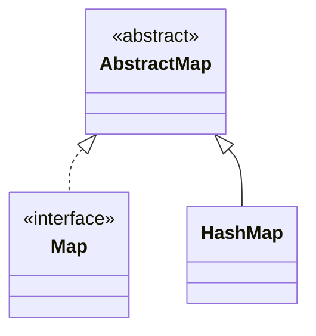

## Objective

Entender `HashMap`, a implementação padrão de `Map`: pares chave/valor são armazenados em uma tabela hash, o que dá `get`/`put`/`remove` em tempo médio constante ao custo de qualquer garantia de ordem de iteração.

## Use Cases

- Busca rápida por chave — configuração, caches ou tabelas de lookup onde a ordem genuinamente não importa.
- Contar ou agregar valores por chave (frequência de palavras, agrupamento) sem precisar das chaves de volta em nenhuma ordem específica.
- Pré-dimensionar a tabela via o construtor de capacidade/fator de carga quando a quantidade final de entradas é aproximadamente conhecida, para evitar rehashing durante um grande lote de chamadas `put`.

## Deep Dive

### HashMap estende AbstractMap, implementa Map

```java
class HashMap<K, V>
```

Quatro construtores:

```java
HashMap<String, Double> a = new HashMap<>();                       // default capacity 16, load factor 0.75
HashMap<String, Double> b = new HashMap<>(existingMap);            // initialized from another Map
HashMap<String, Double> c = new HashMap<>(64);                     // initial capacity 64
HashMap<String, Double> d = new HashMap<>(64, 0.5f);                // capacity 64, load factor 0.5
```

Capacidade e fator de carga significam exatamente o mesmo que significam para `HashSet` — na verdade `HashSet` é implementado internamente como um wrapper fino em torno de um `HashMap`, então os dois compartilham a mesma tabela e o mesmo comportamento de colisão e treeificação.



### Lendo entradas via uma view em forma de set

```java
HashMap<String, Double> hm = new HashMap<>();
hm.put("John Doe", 3434.34);
hm.put("Tom Smith", 123.22);
hm.put("Jane Baker", 1378.00);
hm.put("Tod Hall", 99.22);
hm.put("Ralph Smith", -19.08);

Set<Map.Entry<String, Double>> set = hm.entrySet();
for (Map.Entry<String, Double> me : set) {
    System.out.print(me.getKey() + ": ");
    System.out.println(me.getValue());
}
// order is table-layout dependent, not insertion order — e.g.:
// Ralph Smith: -19.08
// Tom Smith: 123.22
// John Doe: 3434.34
// Tod Hall: 99.22
// Jane Baker: 1378.0
```

`entrySet()` retorna uma view viva, apoiada no próprio map, não uma cópia; `getKey()`/`getValue()` de `Map.Entry` leem cada par.

### put() substitui o valor de uma chave já existente

```java
double balance = hm.get("John Doe");
hm.put("John Doe", balance + 1000); // same key -> old value overwritten, map still has one "John Doe" entry
System.out.println("John Doe's new balance: " + hm.get("John Doe")); // 4434.34
```

`put(K key, V value)` retorna o valor *anterior* associado a `key`, ou `null` se a chave era nova — útil para detectar se um `put` foi de fato uma atualização.

### Veja acontecendo: put() espalhando chaves pelos buckets

Cada `put(key, value)` calcula `key.hashCode()`, espalha seus bits e aplica uma máscara contra `capacity - 1` para escolher um bucket. Duas chaves que caem no mesmo bucket não se sobrescrevem — elas se encadeiam, e `equals()` é o que as distingue em um `get()` posterior:

```viz
type: formula
capacity = nextPow2(count)
slot = (capacity - 1) & spread(hash(item))
---
Apple
Orange
Banana
Grape
Melon
Kiwi
Mango
Plum
```

## Trade-offs

- **Sem garantia de ordem de iteração, e ela pode mudar entre execuções ou após um resize** — se uma ordem estável importa, use `LinkedHashMap` (ordem de inserção); se uma ordem ordenada importa, use `TreeMap`.
- **Mutar um campo envolvido no `hashCode()` de uma chave depois que ela já está no map quebra buscas silenciosamente** — a entrada continua no bucket para o qual seu hash *antigo* apontava, então `get()`/`containsKey()` com uma chave aparentemente igual pode retornar `null`/`false` em vez de encontrá-la:

  ```java
  class Point { int x; /* hashCode() based on x */ }
  Point p = new Point(1);
  HashMap<Point, String> map = new HashMap<>();
  map.put(p, "origin");
  p.x = 2;              // mutated after insertion
  map.get(p);            // may return null — p is now in the wrong bucket
  ```
- **Operações O(1) em média assumem um `hashCode()` razoavelmente bem distribuído** — uma função de hash ruim que colide muito degrada `get`/`put`/`remove` até O(n) dentro de um bucket (O(log n) desde o JDK 8, uma vez que um bucket treeifica após passar de 8 entradas), já que toda chave colidente precisa ser checada com `equals()`.
- **`HashMap` não é sincronizado e permite uma chave `null`** — para acesso concorrente, use `ConcurrentHashMap` (veja o conceito HTTP Sessions Under the Hood para um uso real dele no lado servidor).

## Documentation Links

- *Java: The Complete Reference*, 12th Edition (Herbert Schildt) — Chapter 20, pp. 612–614 — book
- [HashMap — Java SE 25 API](https://docs.oracle.com/en/java/javase/25/docs/api/java.base/java/util/HashMap.html) — doc
- [Map — Java SE 25 API](https://docs.oracle.com/en/java/javase/25/docs/api/java.base/java/util/Map.html) — doc
