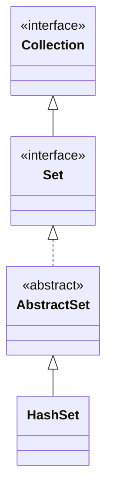

## Objective

Entender `HashSet`, a implementação padrão de `Set`: elementos são armazenados em uma tabela hash, o que dá `add`/`remove`/`contains` em tempo médio constante ao custo de qualquer garantia de ordem de iteração.

## Use Cases

- Teste rápido de pertencimento (`contains`) quando a ordem genuinamente não importa.
- Deduplicar uma coleção de valores rapidamente.
- Pré-dimensionar a tabela via o construtor de capacidade/fator de carga quando a quantidade final de elementos é aproximadamente conhecida, para evitar rehashing durante um grande lote de inserções.

## Deep Dive

### HashSet estende AbstractSet

```java
class HashSet<E>
```

`HashSet` implementa `Set<E>` e não define nenhum método adicional além do que `AbstractSet`/`Set`/`Collection` já fornecem — sua contribuição está inteiramente em *como* os elementos são armazenados, não em uma nova superfície de API. Quatro construtores:

```java
HashSet<String> a = new HashSet<>();                        // default capacity 16, load factor 0.75
HashSet<String> b = new HashSet<>(List.of("x", "y"));        // initialized from a collection
HashSet<String> c = new HashSet<>(64);                       // initial capacity 64
HashSet<String> d = new HashSet<>(64, 0.5f);                  // capacity 64, load factor 0.5
```

O {{fator de carga}}[^collisions] (também chamado de load factor) controla o quão cheia a tabela pode ficar, como fração da capacidade, antes de ser redimensionada para cima — 0.75 por padrão, o que significa que a tabela aproximadamente dobra assim que fica três quartos cheia.



### A busca depende de hashCode() e equals()

O hash code de um elemento determina em qual bucket ele cai; `equals()` então distingue elementos que compartilham um bucket. Ambos precisam estar corretos e consistentes entre si para que `add`/`contains`/`remove` se comportem corretamente — é o mesmo contrato de `Object` do qual toda estrutura baseada em hash no JDK depende.

[^collisions]: Uma colisão acontece quando dois elementos diferentes caem no *mesmo bucket* — seus hash codes não precisam ser iguais, só mapear para o mesmo índice depois que o Java espalha e reduz o hash pelo módulo da capacidade da tabela:

```java
HashSet<String> hs = new HashSet<>(16);
hs.add("Apple");   // hashCode spreads to bucket 2
hs.add("Orange");  // hashCode spreads to bucket 2 as well — collision
```

`HashSet` não descarta nenhum dos dois elementos — o bucket simplesmente guarda ambos, e `equals()` (visto acima) é o que os distingue em uma busca posterior:

```
bucket 2 -> [Apple, Orange]
```

Desde o Java 8, um bucket que continua crescendo não fica sendo uma simples lista encadeada para sempre: assim que passa de 8 elementos (`TREEIFY_THRESHOLD`), ele é convertido de uma lista encadeada para uma pequena árvore red-black, levando a busca no pior caso dentro daquele bucket de O(n) para O(log n) — e ele volta a virar lista se um resize posterior o encolher para menos de 6 elementos (`UNTREEIFY_THRESHOLD`). É isso também que o fator de carga acima está ajustando: redimensionar mais cedo mantém os buckets próximos de um elemento cada, ao custo de mais buckets alocados (a maioria vazios).

### Veja acontecendo: add() espalhando elementos pelos buckets

Cada `add(element)` calcula `element.hashCode()`, espalha seus bits e aplica uma máscara contra `capacity - 1` para escolher um bucket — o mesmo mecanismo que `HashMap` usa, já que `HashSet` é um wrapper fino em torno de um:

```viz
type: formula
capacity = nextPow2(count)
slot = (capacity - 1) & spread(hash(item))
---
Beta
Alpha
Eta
Gamma
Epsilon
Omega
```

### A ordem de iteração não é especificada

```java
HashSet<String> hs = new HashSet<>();
hs.add("Beta"); hs.add("Alpha"); hs.add("Eta");
hs.add("Gamma"); hs.add("Epsilon"); hs.add("Omega");
System.out.println(hs); // [Gamma, Eta, Alpha, Epsilon, Omega, Beta] — order is table-layout dependent, not insertion order
```

A ordem exata depende do hash code de cada elemento e da capacidade atual da tabela, não da ordem em que os elementos foram adicionados.

## Trade-offs

- **Sem garantia de ordem de iteração, e ela pode mudar entre execuções ou após um resize** — se uma ordem estável importa, use `LinkedHashSet` (ordem de inserção); se uma ordem ordenada importa, use `TreeSet`.
- **Mutar um campo envolvido no `hashCode()` de um elemento depois que ele já está no set quebra buscas silenciosamente** — o elemento continua no bucket para o qual seu hash *antigo* apontava, então `contains()`/`remove()` com um objeto aparentemente igual pode retornar `false`/não fazer nada em vez de encontrá-lo:

  ```java
  class Point { int x; /* hashCode() based on x */ }
  Point p = new Point(1);
  HashSet<Point> set = new HashSet<>();
  set.add(p);
  p.x = 2;              // mutated after insertion
  set.contains(p);      // may return false — p is now in the wrong bucket
  ```
- **Operações O(1) em média assumem um `hashCode()` razoavelmente bem distribuído** — uma função de hash ruim que colide muito degrada `add`/`contains`/`remove` até O(n), já que todo elemento colidente precisa ser checado com `equals()`.
- **`HashSet` não é sincronizado** — mesma ressalva de `ArrayList`/`LinkedList` para modificação estrutural concorrente ou dentro de um loop.

## Documentation Links

- *Java: The Complete Reference*, 12th Edition (Herbert Schildt) — Chapter 20, pp. 590–591 — book
- [HashSet — Java SE 25 API](https://docs.oracle.com/en/java/javase/25/docs/api/java.base/java/util/HashSet.html) — doc
- [Set — Java SE 25 API](https://docs.oracle.com/en/java/javase/25/docs/api/java.base/java/util/Set.html) — doc
