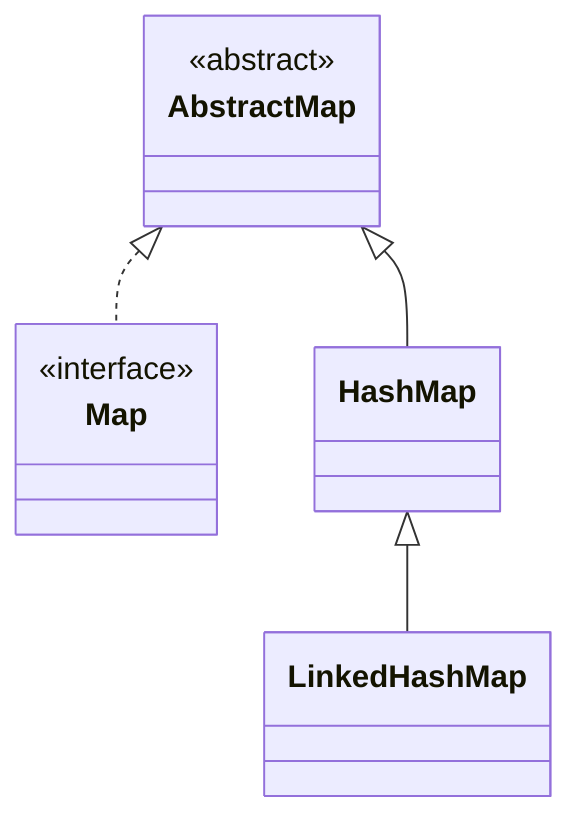

## Objective

Understand `LinkedHashMap`, a `HashMap` subclass that threads a linked list through the hash table's entries, so iteration visits entries in insertion order (or, optionally, last-access order) instead of hash-bucket order — and adds a single hook, `removeEldestEntry()`, that turns it into a bounded cache.

## Use Cases

- Needing `Map` lookup performance plus a predictable, reproducible iteration order — for stable serialization, logs, or UI lists.
- Building a fixed-size LRU cache by combining access-order mode with an overridden `removeEldestEntry()`.
- Wanting `HashMap`-level performance without giving up a meaningful iteration order, the same trade `LinkedHashSet` makes for sets.

## Deep Dive

### LinkedHashMap extends HashMap, adds one method

```java
class LinkedHashMap<K, V>
```

Its first four constructors parallel `HashMap`'s exactly; a fifth adds an ordering flag:

```java
LinkedHashMap<String, Double> a = new LinkedHashMap<>();                  // insertion order, capacity 16, load factor 0.75
LinkedHashMap<String, Double> b = new LinkedHashMap<>(existingMap);       // from a Map, insertion order
LinkedHashMap<String, Double> c = new LinkedHashMap<>(64);                // capacity 64
LinkedHashMap<String, Double> d = new LinkedHashMap<>(64, 0.5f);          // capacity 64, load factor 0.5
LinkedHashMap<String, Double> e = new LinkedHashMap<>(16, 0.75f, true);   // true = access order, false = insertion order (default)
```



### Insertion-order iteration by default

```java
LinkedHashMap<String, Double> lhm = new LinkedHashMap<>();
lhm.put("John Doe", 3434.34);
lhm.put("Tom Smith", 123.22);
lhm.put("Jane Baker", 1378.00);
System.out.println(lhm); // {John Doe=3434.34, Tom Smith=123.22, Jane Baker=1378.0} — insertion order, every time
```

Compare this to the same `put` calls on a plain `HashMap` — the entries are identical, but the printed order is not guaranteed to match insertion order there.

### Access-order mode + removeEldestEntry() builds an LRU cache

```java
class LRUCache<K, V> extends LinkedHashMap<K, V> {
    private final int maxSize;

    LRUCache(int maxSize) {
        super(16, 0.75f, true); // access order: get()/put() move an entry to the end
        this.maxSize = maxSize;
    }

    @Override
    protected boolean removeEldestEntry(Map.Entry<K, V> eldest) {
        return size() > maxSize; // true -> evict the least-recently-used entry
    }
}

LRUCache<String, Integer> cache = new LRUCache<>(3);
cache.put("a", 1); cache.put("b", 2); cache.put("c", 3);
cache.get("a");           // "a" moves to the end (most recently used)
cache.put("d", 4);        // over capacity -> removeEldestEntry() evicts "b", the least recently used
System.out.println(cache.keySet()); // [c, a, d]
```

`removeEldestEntry(Map.Entry<K,V> eldest)` is called by `put()`/`putAll()` after each insertion, with the oldest entry passed in `eldest`. It returns `false` by default (never evicts); overriding it to return `true` under some condition is the entire mechanism.

## Trade-offs

- **The linked-list bookkeeping costs a small amount of extra memory per entry** compared to a plain `HashMap`, in exchange for the ordering guarantee — pay it only when the order is actually used.
- **`removeEldestEntry()` defaults to `false`** — enabling access-order mode without overriding it just reorders entries on every access; nothing gets evicted, so it's easy to build a map that silently grows forever while believing it's an LRU cache:

  ```java
  LinkedHashMap<String, Integer> notACache = new LinkedHashMap<>(16, 0.75f, true);
  // access-order is on, but removeEldestEntry() was never overridden -> still unbounded
  ```
- **Still no sorted order** — `LinkedHashMap` preserves insertion or access order, not ascending key order; use `TreeMap` when the keys themselves need to dictate the order.
- **Not synchronized** — same caveat as `HashMap`; concurrent access needs external synchronization or a different structure.

## Documentation Links

- *Java: The Complete Reference*, 12th Edition (Herbert Schildt) — Chapter 20, pp. 615–616 — book
- [LinkedHashMap — Java SE 25 API](https://docs.oracle.com/en/java/javase/25/docs/api/java.base/java/util/LinkedHashMap.html) — doc
- [HashMap — Java SE 25 API](https://docs.oracle.com/en/java/javase/25/docs/api/java.base/java/util/HashMap.html) — doc
