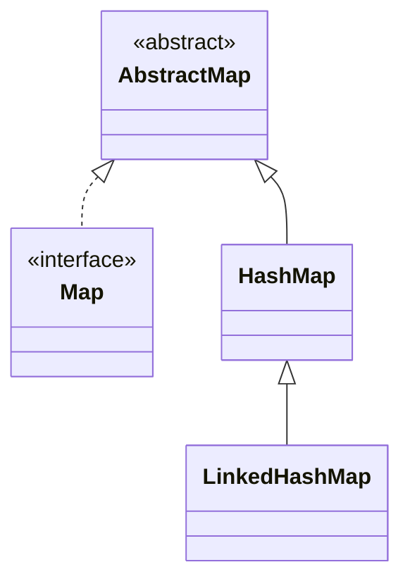

## Objective

Entender o `LinkedHashMap`, uma subclasse de `HashMap` que passa uma lista ligada por dentro das entradas da tabela hash, de modo que a iteração visita as entradas na ordem de inserção (ou, opcionalmente, na ordem do último acesso) em vez da ordem dos buckets de hash — e adiciona um único hook, `removeEldestEntry()`, que o transforma em um cache limitado.

## Use Cases

- Precisar da performance de busca de `Map` mais uma ordem de iteração previsível e reproduzível — para serialização estável, logs ou listas de UI.
- Construir um cache LRU de tamanho fixo combinando o modo de ordem de acesso com um `removeEldestEntry()` sobrescrito.
- Querer a performance de `HashMap` sem abrir mão de uma ordem de iteração significativa — a mesma troca que o `LinkedHashSet` faz para sets.

## Deep Dive

### LinkedHashMap estende HashMap e adiciona um método

```java
class LinkedHashMap<K, V>
```

Seus quatro primeiros construtores são paralelos aos do `HashMap`; um quinto adiciona uma flag de ordenação:

```java
LinkedHashMap<String, Double> a = new LinkedHashMap<>();                  // insertion order, capacity 16, load factor 0.75
LinkedHashMap<String, Double> b = new LinkedHashMap<>(existingMap);       // from a Map, insertion order
LinkedHashMap<String, Double> c = new LinkedHashMap<>(64);                // capacity 64
LinkedHashMap<String, Double> d = new LinkedHashMap<>(64, 0.5f);          // capacity 64, load factor 0.5
LinkedHashMap<String, Double> e = new LinkedHashMap<>(16, 0.75f, true);   // true = access order, false = insertion order (default)
```



### Iteração em ordem de inserção por padrão

```java
LinkedHashMap<String, Double> lhm = new LinkedHashMap<>();
lhm.put("John Doe", 3434.34);
lhm.put("Tom Smith", 123.22);
lhm.put("Jane Baker", 1378.00);
System.out.println(lhm); // {John Doe=3434.34, Tom Smith=123.22, Jane Baker=1378.0} — insertion order, every time
```

Compare isso com as mesmas chamadas de `put` em um `HashMap` puro — as entradas são idênticas, mas a ordem impressa não tem garantia de corresponder à ordem de inserção nesse caso.

### Veja acontecendo: mesmo layout de buckets do HashMap, slots em ordem de inserção para a iteração

Mesmas três chaves de antes — `put()` continua fazendo o hash de cada chave na tabela subjacente exatamente como o `HashMap`, mas a lista ligada passada por dentro dela faz a iteração devolvê-las na ordem de inserção, em vez de espalhadas pelo hash:

```viz
type: formula
capacity = count
slot = index
---
John Doe
Tom Smith
Jane Baker
```

### Modo de ordem de acesso + removeEldestEntry() constrói um cache LRU

```java
class LRUCache<K, V> extends LinkedHashMap<K, V> {
    private final int maxSize;

    LRUCache(int maxSize) {
        super(16, 0.75f, true); // access order: get()/put() move an entry to the end
        this.maxSize = maxSize;
    }

    @Override
    protected boolean removeEldestEntry(Map.Entry<K, V> eldest) {
        return size() > maxSize; // true -> evict the least-recently-used entry
    }
}

LRUCache<String, Integer> cache = new LRUCache<>(3);
cache.put("a", 1); cache.put("b", 2); cache.put("c", 3);
cache.get("a");           // "a" moves to the end (most recently used)
cache.put("d", 4);        // over capacity -> removeEldestEntry() evicts "b", the least recently used
System.out.println(cache.keySet()); // [c, a, d]
```

`removeEldestEntry(Map.Entry<K,V> eldest)` é chamado por `put()`/`putAll()` depois de cada inserção, recebendo a entrada mais antiga em `eldest`. Por padrão retorna `false` (nunca remove); sobrescrevê-lo para retornar `true` sob alguma condição é todo o mecanismo.

## Trade-offs

- **O controle da lista ligada custa um pouco de memória extra por entrada** comparado a um `HashMap` puro, em troca da garantia de ordenação — pague esse custo só quando a ordem realmente for usada.
- **`removeEldestEntry()` retorna `false` por padrão** — ativar o modo de ordem de acesso sem sobrescrevê-lo apenas reordena as entradas a cada acesso; nada é removido, então é fácil construir um map que cresce silenciosamente para sempre achando que é um cache LRU:

  ```java
  LinkedHashMap<String, Integer> notACache = new LinkedHashMap<>(16, 0.75f, true);
  // access-order is on, but removeEldestEntry() was never overridden -> still unbounded
  ```
- **Continua sem ordem ordenada** — o `LinkedHashMap` preserva a ordem de inserção ou de acesso, não a ordem crescente das chaves; use `TreeMap` quando as próprias chaves precisarem ditar a ordem.
- **Não é sincronizado** — mesma ressalva do `HashMap`; acesso concorrente exige sincronização externa ou uma estrutura diferente.

## Documentation Links

- *Java: The Complete Reference*, 12th Edition (Herbert Schildt) — Chapter 20, pp. 615–616 — book
- [LinkedHashMap — Java SE 25 API](https://docs.oracle.com/en/java/javase/25/docs/api/java.base/java/util/LinkedHashMap.html) — doc
- [HashMap — Java SE 25 API](https://docs.oracle.com/en/java/javase/25/docs/api/java.base/java/util/HashMap.html) — doc
