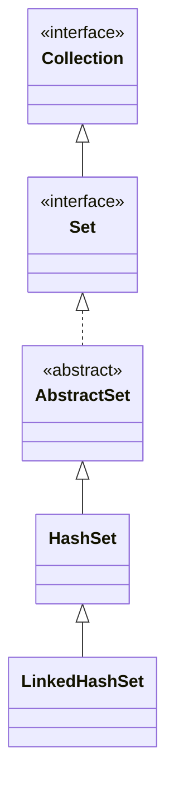

## Objective

Understand `LinkedHashSet`, a `HashSet` subclass that adds no new members of its own but threads a linked list through the hash table's entries, so iteration visits elements in the order they were inserted instead of hash-bucket order.

## Use Cases

- Needing `Set` uniqueness plus a predictable, reproducible iteration order — for stable test output, logs, or UI lists.
- Wanting `HashSet`-level lookup performance without giving up a meaningful iteration order.
- Building an ordered "seen values" cache where insertion order (not access order) is what matters.

## Deep Dive

### LinkedHashSet extends HashSet, adds nothing new

```java
class LinkedHashSet<E>
```

Its constructors parallel `HashSet`'s exactly (no-arg, from a `Collection`, with a capacity, with a capacity and load factor) — the type adds behavior, not API surface.



### Insertion-order iteration

```java
LinkedHashSet<String> lhs = new LinkedHashSet<>();
lhs.add("Beta"); lhs.add("Alpha"); lhs.add("Eta");
lhs.add("Gamma"); lhs.add("Epsilon"); lhs.add("Omega");
System.out.println(lhs); // [Beta, Alpha, Eta, Gamma, Epsilon, Omega] — insertion order, every time
```

Compare this to the same sequence of `add()` calls on a plain `HashSet` — the elements are identical, but the order printed is not. This is also the order `toString()` produces and the order an `Iterator` walks.

### Same hash-based lookup underneath

The extra linked list only changes *iteration* order — `add`/`contains`/`remove` still go through the same hash-table lookup `HashSet` uses, so their average-case cost is unaffected by the ordering bookkeeping.

## Trade-offs

- **Order reflects first insertion, not most-recent activity** — re-adding an element that's already present is a no-op (`Set` semantics: `add()` returns `false`), so it does not move to the end of the iteration order the way an LRU structure would:

  ```java
  LinkedHashSet<String> lhs = new LinkedHashSet<>(List.of("a", "b", "c"));
  lhs.add("a"); // no-op, already present
  System.out.println(lhs); // [a, b, c] — "a" did not move
  ```
- **The linked-list bookkeeping costs a small amount of extra memory per entry** compared to a plain `HashSet`, in exchange for the ordering guarantee — pay it only when the order is actually used.
- **Still no sorted order** — `LinkedHashSet` preserves insertion order, not ascending order; use `TreeSet` when the elements themselves need to dictate the order.

## Documentation Links

- *Java: The Complete Reference*, 12th Edition (Herbert Schildt) — Chapter 20, pp. 591–592 — book
- [LinkedHashSet — Java SE 25 API](https://docs.oracle.com/en/java/javase/25/docs/api/java.base/java/util/LinkedHashSet.html) — doc
- [HashSet — Java SE 25 API](https://docs.oracle.com/en/java/javase/25/docs/api/java.base/java/util/HashSet.html) — doc
