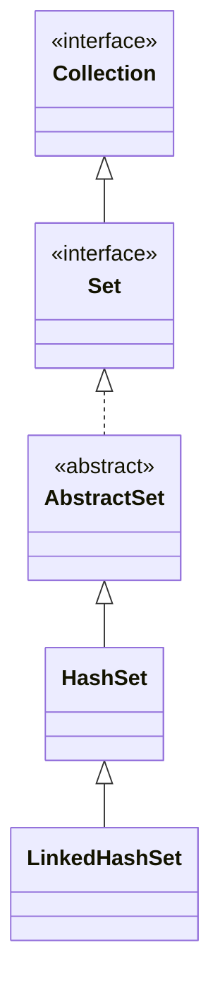

## Objective

Entender o `LinkedHashSet`, uma subclasse de `HashSet` que não adiciona nenhum membro novo próprio, mas passa uma lista ligada por dentro das entradas da tabela hash, de modo que a iteração visita os elementos na ordem em que foram inseridos, em vez da ordem dos buckets de hash.

## Use Cases

- Precisar da unicidade de `Set` mais uma ordem de iteração previsível e reproduzível — para saída de testes estável, logs ou listas de UI.
- Querer a performance de busca do `HashSet` sem abrir mão de uma ordem de iteração significativa.
- Construir um cache ordenado de "valores já vistos" onde a ordem de inserção (não a de acesso) é o que importa.

## Deep Dive

### LinkedHashSet estende HashSet e não adiciona nada de novo

```java
class LinkedHashSet<E>
```

Seus construtores são paralelos aos do `HashSet` (sem argumentos, a partir de uma `Collection`, com uma capacidade, com uma capacidade e fator de carga) — o tipo adiciona comportamento, não superfície de API.



### Iteração em ordem de inserção

```java
LinkedHashSet<String> lhs = new LinkedHashSet<>();
lhs.add("Beta"); lhs.add("Alpha"); lhs.add("Eta");
lhs.add("Gamma"); lhs.add("Epsilon"); lhs.add("Omega");
System.out.println(lhs); // [Beta, Alpha, Eta, Gamma, Epsilon, Omega] — insertion order, every time
```

Compare isso com a mesma sequência de chamadas `add()` em um `HashSet` puro — os elementos são idênticos, mas a ordem impressa não é. Essa também é a ordem que `toString()` produz e a ordem que um `Iterator` percorre.

### Veja acontecendo: mesmos elementos, slots em ordem de inserção em vez de um layout de buckets espalhado

Mesmos seis elementos da viz do `HashSet`, mesma ordem de chegada — mas aqui a lista ligada extra passada por dentro da tabela faz a iteração devolvê-los na ordem de chegada, não espalhados pelo hash:

```viz
type: formula
capacity = count
slot = index
---
Beta
Alpha
Eta
Gamma
Epsilon
Omega
```

A busca por baixo (`add`/`contains`/`remove`) continua passando pelo mesmo layout de buckets de hash que o `HashSet` usa — só a ordem de *iteração* mostrada aqui é diferente.

### Mesma busca baseada em hash por baixo

A lista ligada extra só muda a ordem de *iteração* — `add`/`contains`/`remove` continuam passando pela mesma busca em tabela hash que o `HashSet` usa, então o custo médio delas não é afetado pelo controle de ordenação.

## Trade-offs

- **A ordem reflete a primeira inserção, não a atividade mais recente** — readicionar um elemento que já está presente é um no-op (semântica de `Set`: `add()` retorna `false`), então ele não se move para o final da ordem de iteração como aconteceria numa estrutura LRU:

  ```java
  LinkedHashSet<String> lhs = new LinkedHashSet<>(List.of("a", "b", "c"));
  lhs.add("a"); // no-op, already present
  System.out.println(lhs); // [a, b, c] — "a" did not move
  ```
- **O controle da lista ligada custa um pouco de memória extra por entrada** comparado a um `HashSet` puro, em troca da garantia de ordenação — pague esse custo só quando a ordem realmente for usada.
- **Continua sem ordem ordenada** — o `LinkedHashSet` preserva a ordem de inserção, não a ordem crescente; use `TreeSet` quando os próprios elementos precisarem ditar a ordem.

## Documentation Links

- *Java: The Complete Reference*, 12th Edition (Herbert Schildt) — Chapter 20, pp. 591–592 — book
- [LinkedHashSet — Java SE 25 API](https://docs.oracle.com/en/java/javase/25/docs/api/java.base/java/util/LinkedHashSet.html) — doc
- [HashSet — Java SE 25 API](https://docs.oracle.com/en/java/javase/25/docs/api/java.base/java/util/HashSet.html) — doc
